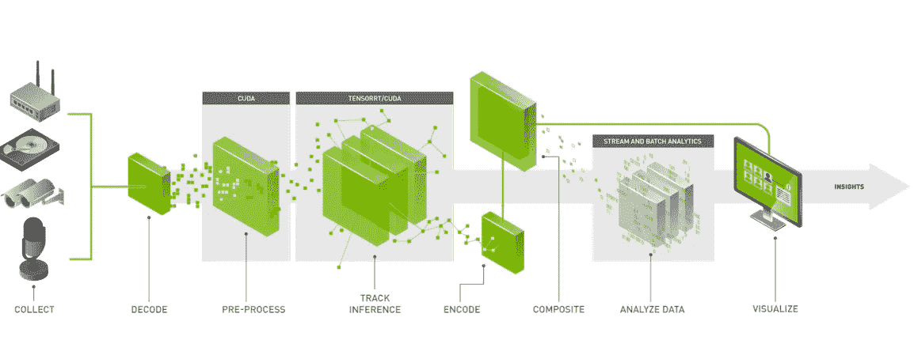
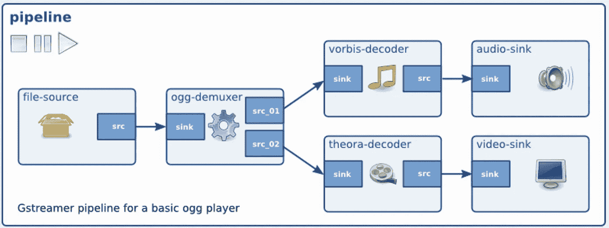
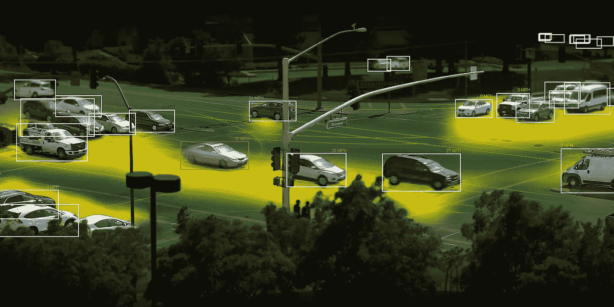
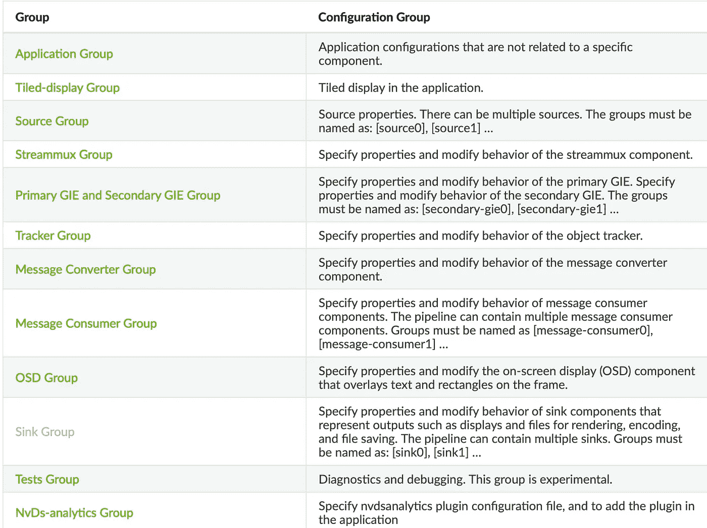
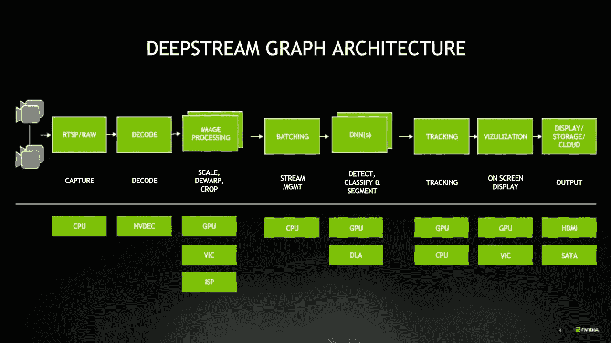

# 使用 Nvidia-DeepStream 的生产中的计算机视觉(AI)

> 原文：<https://medium.com/mlearning-ai/computer-vision-ai-in-production-using-nvida-deepstream-6c90d3daa8a5?source=collection_archive---------0----------------------->

不需要编码经验，这是一篇广泛的文章，涵盖了与 CV 和 Nvidia-DS 相关的大多数主题。在没有阅读和理解概念的情况下开始[这里](https://github.com/deep28vish/DeepStream)为了在 5 分钟内得到你的结果，所有的命令都是连续的并且容易理解。

自从机器(gpu 和 gpu 友好的生态系统)和无所不在的互联网出现以来，各种数据(AI 中的[数据)已经有了巨大的积累。图片数据——图片、视频可以很容易地以数十亿计获得，只需一次谷歌搜索。这让研究人员和开发人员受益匪浅，他们可以使用这样的集合，随心所欲地训练深度学习(DL)模型。这也导致了不同架构上的预训练模型的大规模库的可用性—](https://medium.datadriveninvestor.com/why-data-is-said-to-be-the-backbone-of-artificial-intelligence-bde4e1c209ac) [开放模型动物园](https://github.com/openvinotoolkit/open_model_zoo/blob/master/models/intel/index.md)，其中收集了对象检测、图像分割、机器翻译、文本到语音、人类姿势估计、凝视估计、属性分类以及更多处于绝对就绪状态的模型。


计算机视觉已经突破了所有领域，无论是医疗、制造监控、购物、驾驶，大胆猜测一下，将会有一些公司已经在构建基于智能 AI -CV 的替代品。建立一个计算机视觉模型是一部分，而部署它们则是另一回事。要了解如何迈出第一步，使用 Tensorflow 测试您的第一个计算机视觉模型，请点击[链接](/@deep12vish/tensorflow-object-detection-in-windows-under-30-lines-d6776586c4ab)。GPU 是训练你的模型(ssd-mobilenet，yolov3，resnet，inception 等)所必须的。)但是在部署方面，我们有相当多的选择，事实证明你根本不需要 GPU。英特尔一直致力于在其 CPU 内核中引入 CV 推理功能。

然而，本文将指导您在基于 NVIDIA-GPU 的系统(不需要编程)中部署您的第一个 CV 模型，需要 Ubuntu 18.04 LTS。接下来的概要:

*   码头工人
*   GStreamer
*   检测+分类+跟踪

先决条件 GPU 卡，20 GB 硬盘空间。

如果你不知道什么是 docker，GStreamer，也不用担心。这些只是对你的视频进行推理(检测+分类)的一些工具。如果你有 TF/pytorch/darknet 和运行推理的经验，你一定知道你最多可以并行运行 2-4 个视频。在这里，您将学习运行 30+视频，而无需编写任何 python 脚本。

让我们从故事时间开始:-)为了得到这个实验的结果，并尽量减少由于库问题而出错的机会，我们将使用 docker。

关于 Docker——当您需要跟踪上百个包/依赖项/文件时，Docker 简直就是一个奇迹，更不用说版本之间的兼容性了。Docker 为您提供了一个独立的空间，预先安装了运行指定应用程序/软件所需的一切。它不像虚拟机，但比虚拟机轻得多。点击阅读关于 docker [的内容。但是不，我们不会讨论 docker 是如何工作的，只是外围术语。Docker——Image——是组成 Docker——Container 的命令集，docker container 是您自己的沙箱，您可以在其中进行所有您想要的实验。我们将一边走一边编写所有的命令。](https://docker-curriculum.com/)

[NVIDIA-DEEPSTREAM](https://developer.nvidia.com/deepstream-sdk) -查看页面获得关于性能数字的所有统计数据，如果你有足够好的 GPU，你可以期待同样的结果。有多种方法可以让 deepstream(DS) sdk 工作，正如前面提到的，我们将使用其中最安全的方法:DOCKER-way。



你在上面看到的是从左到右的数据流，这些数据在不同的阶段被处理以产生最终结果。这里的数据指的是视频，在所有这些花哨的推理引擎、SDK 和应用程序之前，有一个真正的视频处理之王，叫做 GSTREAMER，自 2001 年 1 月以来一直在使用。要理解我们为什么要讨论 GSTREAMER 并且似乎跑题了，我们必须了解更多关于视频及其属性的知识。视频不过是以一定速度流动、以一定速度显示的帧的集合。有线电视通常每秒显示(更新)25-30 帧，也称为 FPS，youtube 可以选择 24，25，30，48，60 fps 上传视频。这些帧，分辨率为 720x1280 的图像也有固定的格式-它们有 8 位(0-255)颜色和 3 通道颜色(RGB)。跟着[这个](https://www.scantips.com/basics1d.html)了解更多。这也是非常基本的，只是为了让你明白，任何原始图像(帧)本身都很重(一幅图像可以有多种格式存储，也有多种分辨率)，在以任何形式使用之前都需要压缩。Mp4，mkv，avi 是一些非常著名的容器，它们有自己的压缩技术，可以在压缩比和质量之间取得平衡。理想的情况是在不影响图像质量的情况下获得高压缩比。但这也是理想状态。JPEG、MPEG、x264、x265 是用于形成这些容器以及使用 RTSP/UDP 协议实时地将数据(视频)从一个系统传输到另一个系统而不丢失或放错任何帧的一些编解码器。现在，所有上述术语都由真正的王者 GSTREAMER 完美地处理了。现在我们只需要知道这些术语的存在，我们将根据需要在这里和那里使用它们。



GST(GSTREAMER)基于管道的概念工作，这些管道是由插件构建的。上图中的蓝框是插件。现在我们来看看这条深海流是如何融入画面的。DEEPSTREAM SDK——Nvidia 已经建立了自己的插件集，可以在 GST 管道中使用。这些 DS 插件负责运行推理，在我们部署第一个模型时，我们将会看到许多其他的东西。在我们的 DEEPSTREAM DOCKER 映像中，我们将获得这些预安装的插件，我们的工作只是将它们像乐高积木一样按照正确的顺序排列起来，以获得推论。

现在我们从码头工人开始。这里的简称是。

*   按照[对接器安装](https://docs.docker.com/engine/install/ubuntu/)安装对接器。
*   让我们通过运行以下命令来检查您的 docker 是否安装正确:

```
sudo docker run hello-world
```

该命令下载一个测试映像，并在容器中运行它。当容器运行时，它打印一条信息性消息并退出。

*   Nvidia 有自己的层，它运行在普通 Docker 之上: [NVIDA-DOCKER](https://docs.nvidia.com/datacenter/cloud-native/container-toolkit/install-guide.html) 。

```
sudo apt-get update
sudo apt-get install -y nvidia-docker2
sudo systemctl restart docker
sudo docker run --rm --gpus all nvidia/cuda:11.0-base nvidia-smi
```

要确认每个库都在运行，请执行以下操作:

```
sudo docker run --rm --gpus all nvidia/cuda:11.0-base nvidia-smi
```

输出应该类似于:

```
+-----------------------------------------------------------------------------+
| NVIDIA-SMI 450.51.06    Driver Version: 450.51.06    CUDA Version: 11.0     |
|-------------------------------+----------------------+----------------------+
| GPU  Name        Persistence-M| Bus-Id        Disp.A | Volatile Uncorr. ECC |
| Fan  Temp  Perf  Pwr:Usage/Cap|         Memory-Usage | GPU-Util  Compute M. |
|                               |                      |               MIG M. |
|===============================+======================+======================|
|   0  Tesla T4            On   | 00000000:00:1E.0 Off |                    0 |
| N/A   34C    P8     9W /  70W |      0MiB / 15109MiB |      0%      Default |
|                               |                      |                  N/A |
+-------------------------------+----------------------+----------------------++-----------------------------------------------------------------------------+
| Processes:                                                                  |
|  GPU   GI   CI        PID   Type   Process name                  GPU Memory |
|        ID   ID                                                   Usage      |
|=============================================================================|
|  No running processes found                                                 |
+-----------------------------------------------------------------------------+
```

此输出显示了有关您的 GPU 和驱动程序版本的详细信息，在这里我们可以看到卡的名称、Nvidia 驱动程序版本和 CUDA 版本以及卡的温度和内存。

我们现在将从 github 下载相关文件，这将使我们运行和理解 DEEPSTREAM SDK 变得更加容易。记住所有的文件都可以在 DeepStream docker 中找到，但是当你一次有太多的信息时，理解起来会很混乱。



在你选择的任何位置下载 github 文件，我用的是 Documents 文件夹。

```
kuk:~$ cd Documents/kuk:~/Documents$ git clone [https://github.com/deep28vish/DeepStream.git](https://github.com/deep28vish/DeepStream.git)
```

上面的文件夹需要安装在 ds 的 docker 镜像中。我们还必须为我们的 DS 制作容器。这是你可以做到的。

```
xhost +sudo docker run --runtime=nvidia -it -d -e DISPLAY=$DISPLAY --name Thor -v $HOME/Documents/DS_computer_vision/:/home/ --net=host --gpus all nvcr.io/nvidia/deepstream:5.1-21.02-triton
```

“xhost +”允许 docker 访问我们主机的显示。因此，如果我们的容器需要显示任何输出，它不会停止。确保在运行容器时运行' xhost +'命令。

逐步分解命令:

*   sudo:管理权限
*   docker:调用我们之前安装的 docker
*   运行:请求 docker 运行我们将在前面描述的图像
*   — — runtime=nvidia:启动 nvidia-docker 层(安装较早)
*   -it:这将保持容器的交互性，允许我们在容器中编写/编辑命令。
*   -d:表示分离模式，这意味着它将打印容器 ID，容器将在后台运行，我们将在以后访问它。
*   -e DISPLAY=$DISPLAY:设置环境变量，意思是给 container 一个显示的路径，就像我们的 ubuntu 使用 DISPLAY 一样。
*   — — name=dst:这是你的容器的名字，我用了‘雷神’，你可以用任何你喜欢的名字，黑寡妇、卡尔德罗戈、夜王都是好名字。
*   -v＄HOME/Documents/DS _ computer _ vision/:/HOME/:This '-v '帮助我们从容器内的主机系统挂载目录，语法类似于主机 ADDR(Documents/DS _ computer _ vision):容器内的 ADDR(/HOME/)。因为我们知道容器是遵循 ubuntu 内核的，所以会有一个名为 home 的文件夹。因此，我们所有的文件都将安装在容器的主文件夹中，我觉得使用它非常舒服，因为没有像家一样的地方。
*   — — net=host:这允许容器在所有端口上通过 internet 进行通信，您可以使用-p publish 命令对其进行限制。但这不值得，所以不要尝试。
*   ——Gpu = all:帮助 NVIDIA-DOCKER 访问您机器上的所有 Gpu，由于在此之前您已经安装了 NVIDIA_DRIVERS 和 CUDA，这有助于我们的容器查看您机器上的 Gpu。
*   nvcr.io/nvidia/deepstream:5.1-21.02-triton:最后但并非最不重要的是主要的深流图像的名称，现在将被转换为容器名称——“dst”。

有许多标签可以在您喜欢的任何配置中运行/修改上面的容器——跟随这个[链接](https://docs.docker.com/engine/reference/commandline/run/)来探索所有的标签，但是在做任何事情之前，请确保您理解其含义。

当你按下回车键时，你会看到它会立刻开始下载很多东西，总下载量约为 5.5 Gb，让你可以高枕无忧。一旦完成，它将打印一个很长的 CONTAINER_ID，你将返回到你的终端窗口。这意味着我们的沙盒现在可以探索和利用了。要检查容器是否启动并运行:

```
sudo docker ps
```

这将列出所有活动的容器及其名称。你会在这里找到你的雷神。


探索容器。要进入容器内部，我们需要执行两个命令，第一个是:

```
xhost +x
```

第二个是:

```
sudo nvidia-docker exec -it dst bash
```

我们知道“sudo”和“nvidia-docker”，exec:在正在运行的容器中运行新命令，因为我们的“dst”容器正在运行，我们已经使用了 exec。-它为我们提供了与' Thor'('dst ')的交互能力，Thor 是我们容器的名称，而' bash '表示我们需要一个 bash shell 放在容器中。

按下回车键后，你将进入 docker shell。


我们自动深入深流目录。让我们移动到我们自己的文件夹，我们已经安装在/home/中。


通过在 home 中运行“ls ”,您将看到“DS_computer_vision”文件夹。

记住你现在在容器里，所以不再需要 sudo 了。您安装的任何库都将保留在这里，直到您手动删除 docker。如果你完成了一天的工作，想关闭/重启你的机器，只需输入“退出”。你将从你的容器中出来，但是你的容器仍然在运行。因此，要停止容器，请执行以下操作:

```
sudo docker stop dst
```

就是这样，它会停止容器和所有的程序，如果你有任何东西在里面运行。就像它会关掉炉子，关掉灯，直到你回家。喝完一杯咖啡并重启系统后，你可以回到你的容器，从你离开的地方开始:

```
sudo docker start dst
```

它将启动容器，现在你必须通过“sudo NVIDIA-docker exec-it Thor bash”进入容器


Thor 容器中的主文件夹将包含这些文件。

*   有初级检测器和次级分类器，它们包含标签和所需的权重，以优化的方式进行推理。
*   我们将使用名为“deep_stream_1_feed.txt”和类似名称的文件来运行模型并查看推论。
*   这些文件支持我们的主文件的配置。接下来是一些. mp4 格式的示例视频(仅支持 mp4 ),可以在上面看到输出。

```
root@kuk:/home# ls
Primary_Detector  README.md  config_infer_primary.txt  crowd3.mp4 ...
```

当您在个人文件夹中拥有以上所有文件时:

```
deepstream-app -c deep_stream_1_feed.txt --tiledtext
```

这将启动管道，需要几秒钟的时间，如果你误放了任何文件或重命名了任何文件夹，管道将相应地产生错误。如果一切如这里所述，管道将运行良好，您将在弹出的新窗口中看到输出。


总共有 4 个这样的文本文件来运行 4 种不同的变体:

*   对 1 个输入流的检测+跟踪。
*   对 1 个输入流的检测+跟踪+分类类型 1 +分类类型 2 +分类类型 3。
*   检测+跟踪 30 个输入流。
*   对 40 个输入流进行检测。

由于无法在 GitHub repo 中上传 30 个视频，我使用了 3 个 10 的倍数的视频来复制 30 个输入流。

```
deepstream-app -c deep_stream_1_feed_3_classification.txt --tiledtextdeepstream-app -c deep_stream_30_feed.txtdeepstream-app -c deep_stream_40_feed.txt
```


视频一显示，终端就开始显示当前的 fps，在那里你可以很容易地了解 NVIDIA 插件如何有效地使用你的 GPU，将计算机视觉模型实际应用到生产部署级别就是这么简单。

如前所述，这里的一切都发生在 Gstreamer 框架上，用于视频处理，这里是 GST 管道，您可以从相同的位置运行它来查看相同的结果(检测+跟踪):

```
gst-launch-1.0 filesrc location=traffic_cam_clear_edited_1.mp4 ! decodebin ! m.sink_0 nvstreammux name=m batch-size=1 width=1280 height=720 live-source=1 ! nvinfer config-file-path=$(pwd)/config_infer_primary.txt batch-size=1 unique-id=1 ! nvtracker ll-lib-file=$(pwd)/tracker_so/libnvds_mot_klt.so display-tracking-id=1 ! nvinfer config-file-path= $(pwd)/config_infer_secondary_carmake.txt batch-size=1 unique-id=2 infer-on-gie-id=1 infer-on-class-ids=0 ! nvvideoconvert ! nvdsosd ! nveglglessink sync=0
```

现在，如果您打开任何一个“deep_stream_1_feed.txt”文件并浏览其语法，您会发现它被划分为多个排序良好的片段，从:

*   [应用]
*   [平铺显示]
*   [源 0]
*   [sink0]
*   [osd]
*   [流多路复用器]
*   [主要信息]
*   [跟踪器]
*   [二级-gie1]
*   [测试]

这些各自的字段帮助 Deepstream 制作我们刚刚提到的相同的 GST-pipeline。但是我们不用处理一个有很多术语、没有错误范围、出错概率很高甚至不知道哪里出错的命令，而是使用。基于 txt 的方法来初始化。

你可以在这里找到所有关于源汇及其类别的信息[。](https://docs.nvidia.com/metropolis/deepstream/dev-guide/text/DS_ref_app_deepstream.html)



你可以在这里找到每个职业的所有细节，看看你能理解什么，这里用到了什么。尝试自己添加/修改某些元素，看看对输出结果有什么影响。探索 NVIDIA-DEEPSTREAM 应用程序的新维度完全取决于您和您的意愿。在`/opt/nvidia/deepstream/deepstream-5.1/samples/configs#`有一些样本文件

要运行它们:

```
root@kuk:/opt/nvidia/deepstream/deepstream-5.1/samples/configs/deepstream-app# deepstream-app -c source4_1080p_dec_infer-resnet_tracker_sgie_tiled_display_int8.txt
```



英伟达使得在现实世界中部署计算机视觉模型变得非常容易。您可以转换您的所有型号以用于这种特定的方式，无论是 yolov3，ssd-mobilenet，caffe，pytorch。所有著名的建筑都可以在这里转换使用。用非常简单的术语来说，这些是乐高积木，你是建筑师，你控制你想要的东西，按照你喜欢的方式添加它们，你会得到你想要的结果，或者你会知道两块积木怎么会不在一起。使用 Nvidia 平台有很多好处，包括但不限于:

*   使用 docker 使我们摆脱了任何关于支持库的麻烦。
*   如果 40 个流中的 1 个、2 个或 20 个突然停止流动，DS-app 不会崩溃。
*   有充分的支持使用这种模式在安全摄像机饲料，你只需要获得一个有效的 RTSP 地址，并取代. mp4 与您的 RTSP 现场摄像机饲料。(还需要调整 1 或 2 个值)，但这就是现在你有实时检测运行在自己的安全摄像头。
*   您可以使用 VLC 查看输出提要。txt 文件有一个接收器设置为端口:8554，即您可以打开 VLC 播放器，转到 networkstream 并添加地址为:“rtsp://localhost:8554/ds-test”，现在您已经在您的 VLC 播放器上有了所有的输出，您可以进一步划分并使用 40 个 VLC 播放器来获得您的 40 个摄像机馈送。
*   这种方法使我们能够充分利用硬件的潜力，很少有非常饥饿的进程，需要大量的马力来运行，但 Nvidia 已经为此提供了一个自定义插件，它基本上将所有基于 cpu 的进程引导到 GPU，CUDA 核心可以毫不费力地有效处理它们。
*   编码，解码，视频转换(GST 管道内部)，所有这些都可以直接到 GPU，跟踪算法也有许多选项，根据您的要求，您可以选择基于 cpu 的 MOT 跟踪器或基于 GPU 的 nvds 跟踪器，在现实世界中表现非常好。

开发人员社区已经将这个平台提升到了一个新的水平，因为这是 5.1 版，我们已经在 sdk 本身中内置了一些稳定的应用程序，可以随时使用，并且几乎与。我们用过的 txt 文件格式。支持论坛也非常活跃，任何问题都会在 24 小时内得到迅速回答。所以总的来说，你得到了 nvidia 和社区的支持。现在就看你如何利用它并从中获利了。

要开始您的计算机视觉之旅，并编写您的第一个代码来对图像和视频进行推理，请参见— [Tensorflow 在 windows 下的对象检测 30 行](/@deep12vish/tensorflow-object-detection-in-windows-under-30-lines-d6776586c4ab)。即使这看起来像是工作，那么看看如何开始设置你的计算机— [在裸 Windows 中设置 tensor flow 1.14](/@deep12vish/setting-up-tensorflow-1-14-in-bare-windows-adc429ab792c)。在这个[视频](https://www.youtube.com/watch?v=HNdR2RQJVSs&t=31s)中检验各种模型在 tensorflow 环境中的性能。以及 facebooks new detectron 2 在图像分割方面的表现如何令人印象深刻[这里](https://www.youtube.com/watch?v=jwfAAg5NRGA)。

下一篇文章将介绍面向计算机视觉部署的英特尔方法，您可以只在 CPU 上运行它，不需要 GPU。