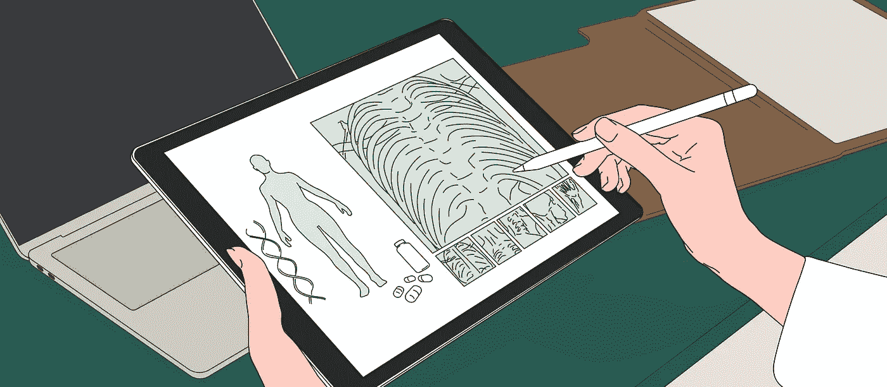
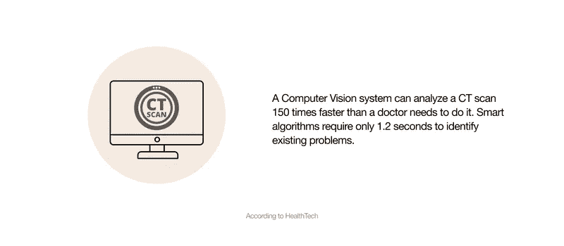
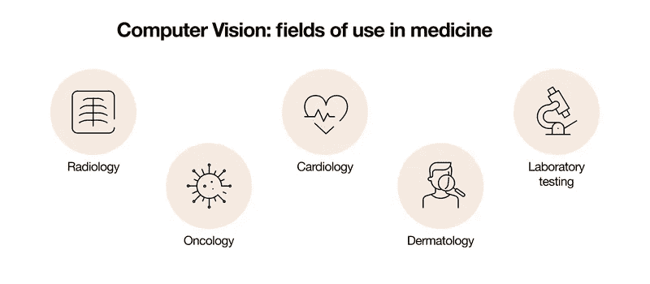

# 面向医疗保健的计算机视觉:获得可行见解的 5 种方法

> 原文：<https://medium.com/mlearning-ai/computer-vision-for-healthcare-5-ways-of-getting-actionable-insights-2caeb7229074?source=collection_archive---------1----------------------->

如今，医疗保健行业积极参与数字化转型和实施创新技术的过程。据[商业资讯](https://www.businesswire.com/news/home/20210329005618/en/Global-Digital-Health-Market-Report-2021-COVID-19-Growth-and-Change-to-2025-2030---ResearchAndMarkets.com#:~:text=The%20global%20digital%20health%20market%20is%20expected%20to%20grow%20from,(CAGR)%20of%209.79%25.&text=The%20market%20is%20expected%20to,at%20a%20CAGR%20of%2024.52%25.)报道，全球数字健康市场预计将以 9.79%的复合年增长率(CAGR)从 2020 年的 1833.0 亿美元增长到 2021 年的 2012.4 亿美元。

计算机视觉(CV)就是这样一种工具，它可以帮助医疗保健专业人员提供更好的医疗保健，并使药物更便宜，更容易被患者接受。

# 计算机视觉对医疗保健行业有什么影响？

计算机视觉是[人工智能](https://www.exposit.com/blog/ai-as-a-medical-service-what-healthcare-functions-can-be-made-with-machine-learning/)的一个领域，帮助理解和分析图像和视频。 [CV 解决方案](https://www.exposit.com/solutions/computer-vision/)基于智能计算机算法，可以训练机器看到视觉世界并提供有价值的见解。

研究人员估计，图像信息约占所有健康数据的 90%。这意味着在[医疗保健](https://www.exposit.com/solutions/healthcare/)行业中使用计算机视觉算法可以为提高医务人员的效率和改善患者护理带来许多机会。

基于图像识别的自动化过程还将减少执行日常任务所需的人工参与。这意味着这种方法将有助于消除与医生疲劳和注意力不集中相关的错误，并允许医务人员专注于更复杂的问题。

# 如何在医疗保健中使用计算机视觉？

如今，计算机视觉被广泛应用于各种医疗领域，并不断给医疗保健带来重大变化。CV 在医疗保健领域有哪些使用案例？

*   **发现器官损伤** 成像算法用于检测器官的异常或损伤。计算机视觉可以识别骨折、脱臼和软组织损伤，并允许医疗专业人员快速有效地减轻患者的痛苦。
    基于计算机视觉算法的解决方案扩展了放射科医生的能力，使医学图像的解读更便宜、更快速、更准确。顺便说一下，这种方法对病人来说更安全，因为它限制了辐射暴露。
*   **肿瘤学的识别** 用于分析医学图像的算法非常敏感，可以帮助医疗专业人员在最早阶段识别癌细胞和肿瘤。乳腺癌、肺癌、前列腺癌和其他恶性肿瘤可以通过计算机诊断来检测。这种虚拟活检以其准确性、成本效益、方便患者和获得结果的时间而著称。CV 算法的使用增加了存活率，并为患者提供了最好的康复机会。
*   **心脏病分析** 在心脏病学中，医学专家可以使用计算机视觉技术:
    1。执行磁共振成像(MRI)、正电子发射断层扫描(PET)、单光子发射计算机断层扫描(SPECT)和超声(US)扫描的自动分割；
    2。分析心脏图像；
    3。预测心脏病的发展。
    成像算法使您能够及时诊断心脏病理和异常检测，以及开发新的治疗方法。
    此外，计算机视觉系统在心脏病学教育中发挥着重要作用。在可视化工具的帮助下，解释与手术相关的程序的过程更容易理解。
    计算机视觉实施的一个例子是用于 ECG 数字化的心脏病学平台，以在心脏病学专家之间提供便利的信息和专业经验交流。
    该软件解决方案可以将图形扫描心电图数字化为数字数据存储 EDF 格式，而不会丢失任何诊断信息。
    因此，该平台有助于医生在需要同事推荐、额外的自动或手动数据分析时，轻松交流有关心脏检查的信息。
*   **皮肤病检查** 高精度的计算机诊断系统分析病人的皮肤状况，从而帮助医生做出更好的决定。
    计算机化皮肤图像分析用于确保个性化皮肤护理，包括推荐化妆品、面霜和啫喱。计算机视觉还能够检测皮肤病并提供治疗方案。
*   **实验室测试** 计算机视觉算法也用于血液分析、组织细胞评估和其他实验室测试。为了进行这种分析，医学专家使用一种特殊设计的相机拍摄照片，该相机连接到传统的显微镜上。
    基于计算机视觉技术，该系统检查生成的照片，并自动检测血液样本中的某些异常。
    这种自动图像分析使医生能够快速进行实验室测试，并更好地了解一个人的健康状况。

# 计算机视觉正在获得动力

今天，您可以在医学的各个领域使用 CV 图像分析，这无疑为患者和医学专家带来了优势。

计算机视觉提高了医学研究的准确性和质量，帮助医生更快地完成工作，并降低医院成本。此外，这些技术正在不断改进，这将为计算机视觉的使用带来新的机会，并因此带来更好的医疗保健。

[Exposit](https://www.exposit.com/) 团队开发定制[计算机视觉](https://www.exposit.com/solutions/computer-vision/)解决方案，从头开始创建用于高级图像和视频分析的智能算法。[联系我们](mailto:contact@exposit.com)将您的想法融入智能医疗保健解决方案，让您看到更多。