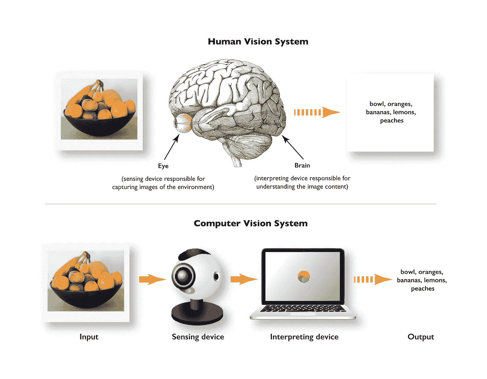

# 计算机视觉基础和 OpenCV 概述

> 原文：<https://medium.com/mlearning-ai/computer-vision-fundamentals-and-opencv-overview-9a30fe94f0ce?source=collection_archive---------3----------------------->

在这篇博文中，我将尝试解释计算机视觉和 OpenCV 库的工作原理。在整篇文章中，我将介绍:

*   什么是计算机视觉？
*   计算机视觉是如何工作的？
*   计算机视觉的应用
*   OpenCV 是什么？
*   OpenCV 简史
*   OpenCV 快速入门

让我们一步一步开始。继续工作！


Resource: [https://medium.com/analytics-vidhya/introduction-to-computer-vision-with-opencv-part-1-3dc948521deb](/analytics-vidhya/introduction-to-computer-vision-with-opencv-part-1-3dc948521deb)

# 什么是计算机视觉？

计算机视觉是一个工作场所，它允许我们以数字方式检测图像，并对这些图像执行操作。计算机视觉是一个人工智能工作空间，在这里我们可以通过访问数字媒体中图像的特征来收集信息和提取特征。在其他来源中，它被定义如下:

***百科:***

> 计算机视觉是一个跨学科的科学领域，研究计算机如何从数字图像或视频中获得高层次的理解。从工程的角度来看，它寻求理解和自动化人类视觉系统可以完成的任务。

**IBM:**

> 计算机视觉是人工智能(AI)的一个领域，它使计算机和系统能够从数字图像、视频和其他视觉输入中获取有意义的信息——并根据这些信息采取行动或提出建议。如果说 AI 使计算机能够思考，那么计算机视觉则使它们能够看到、观察和理解。

计算机视觉的主要目的是理解图像并为我们的目的解释它们。作为人类，我们可以很容易地用眼睛感知任何街道上的移动物体。计算机也使用许多不同的算法来理解这一点。然而，使用这些算法，计算机可能仍然不能给出非常高精度的结果。



Resource: [https://manningbooks.medium.com/how-does-computer-vision-work-bc35b0fb5df5](https://manningbooks.medium.com/how-does-computer-vision-work-bc35b0fb5df5)

# 计算机视觉是如何工作的？

计算机使用一些算法来检测数字媒体中的图像。数字媒体中的图像由像素组成。任何图像中的像素都有颜色和坐标。想象一下，每个像素都有自己的身份。在其 ID 上，它写入坐标和颜色信息。这就是计算机检测和识别图像的方式。

像素的坐标和颜色信息用数字表示。数字是根据 RGB 格式定义的。由于图像身份中的这些信息是用数字表示的，计算机可以理解这一点。每个图像可以包含数千个像素。这些像素也作为矩阵保留在图像上。所以如果我们要在视觉上操作，我们通过矩阵来做。

**计算机视觉分三个基本步骤工作:**

**1-获取图像**

> 可以通过视频、照片或 3D 技术实时获取图像，甚至是大型数据集，以便进行分析。

**2-处理图像**

> 深度学习模型自动完成了这一过程的大部分，但这些模型通常是通过首先被喂以数以千计的标记或预先识别的图像来训练的。

**3-理解图像**

> 最后一步是解释步骤，即识别或分类一个物体。


Resource: [https://www.weareworldquant.com/en/thought-leadership/understanding-images-computer-vision-in-flux/](https://www.weareworldquant.com/en/thought-leadership/understanding-images-computer-vision-in-flux/)

# 计算机视觉的应用

最受欢迎的计算机视觉应用示例:

*   癌症检测
*   新冠肺炎诊断
*   掩码检测
*   车辆分类
*   交通流分析
*   停车占用率检测
*   自动车牌识别
*   客户跟踪
*   人数统计
*   社交距离
*   球跟踪
*   目标线技术

# 什么是 OpenCV？

OpenCV，即开源计算机视觉库。可以理解，它是一个开源的计算机视觉库。如今，它在图像处理领域得到了非常广泛的应用。您可以使用 Java、C ++或 Python 语言来处理 OpenCV。

通过使用 OpenCV，人们可以处理图像和视频来识别物体、人脸，甚至是人类的笔迹。当它与各种库(如 Numpy)集成时，python 能够处理 OpenCV 数组结构进行分析。为了识别图像模式及其各种特征，我们使用向量空间并对这些特征执行数学运算。

# OpenCV 简史

> OpenCV 是由加里·布拉德斯基于 1999 年在英特尔创立的，第一次发布是在 2000 年。Vadim Pisarevsky 加入了 Gary Bradsky，管理英特尔的俄罗斯软件 OpenCV 团队。2005 年，OpenCV 在 Stanley 上使用，该车赢得了 2005 年 DARPA 大挑战。后来，在 Willow Garage 的支持下，该项目继续积极发展，由 Gary Bradsky 和 Vadim Pisarevsky 领导。OpenCV 现在支持大量与计算机视觉和机器学习相关的算法，并且正在一天天扩展。
> 
> OpenCV 支持多种编程语言，如 C++、Python、Java 等。，可在不同平台上使用，包括 Windows、Linux、OS X、Android 和 iOS。基于 CUDA 和 OpenCL 的高速 GPU 操作接口也正在积极开发中。
> 
> OpenCV-Python 是 OpenCV 的 Python API，结合了 OpenCV C++ API 和 Python 语言的优点。

# 使用 OpenCV 快速启动

在谈了这么多关于计算机视觉和 OpenCV 的内容后，我想向大家展示一下我们可以用几个简单的应用程序做什么。这样，你既可以练习得更好，也可以进入学习过程。

## **读图**

首先，我们将使用 OpenCV 读取图像并在屏幕上显示。如果 OpenCV 没有安装在您使用 Python 的 IDE 中，您必须首先安装它。

```
pip install opencv-python
```

安装后，首先，您必须导入库。您可以将 OpenCV 库称为 cv2。

您需要保存要读入对象的图像。

您可以使用`cv2.imread( )`功能读取图像。这个函数将获取图像的文件的路径作为参数。因为我的 python 工作文件与图像在同一个文件夹中，所以我直接输入了图像的名称。这里要注意的一点是编写可视化的扩展。不要忘记这一点。

当我们运行代码时，我们给这个窗口命名，因为它将在一个可视窗口中打开。我们用`cv2.namedWindow( ).`来实现这个功能，这个函数将窗口的名称作为它的第一个参数。其实这样就够了。但是因为我希望能够改变打开的窗口的大小，所以我添加了参数`cv2.WINDOW_NORMAL.`

当代码运行时，函数`cv2.imshow( )`用于在屏幕上显示当前图像。这需要两个参数。第一个是我们将要显示的可视化的名称，第二个是它注册的对象。在这里，我将图像保存为 img。所以我把 img 给第二个论点。

最后，我写了函数`cv2.waitKey(0)`,因为我想在打开的可视屏幕上随时关闭它。该函数以毫秒为单位获取数值。当我们在这里写 0 时，意味着我们可以随时关闭窗口。

另外，我们增加了`cv2.destroyAllWindows().`功能，这个功能成为习惯就好了。当我们做高级项目时，我们会忘记关闭屏幕上打开的许多窗口。这个函数避免了这种情况。

你可以在下面找到所有的代码。

## **从网络摄像头读取视频**

现在让我们来看看如何从电脑摄像头读取视频。

首先，我们导入 OpenCV 库。

然后，我们将从电脑摄像头拍摄的图像写在一个物体上。我将这个对象设置为 capture。我们使用`cv2.VideoCapture(0)`功能从电脑摄像头捕捉视频。此处的值 0 用于访问连接到计算机的摄像机。如果有相机，可以当 0 用。如果你有更多的相机，你可以尝试 1，2..以访问相应的摄像机。

如你所知，视频由帧组成。为了看到我们在视频中捕获的图像，我们必须在屏幕上循环打印它们。因此，我们定义读取捕获的图像，然后将图像返回给我们。

`ret, frame = capture.read()`

然后我们调整。为了看到捕捉到的图像，就像我们在镜子中看到自己一样，我们需要将它们反转到 y 轴。这就是为什么我们在这里写代码`frame = cv2.flip(frame, 1).`的原因，当我们在 frame 之后输入参数 1 时，它给出了 y 轴的图像的反转。

然后我们编写代码`cv2.imshow("Webcam", frame)`来显示从相机中获取的帧。

然后，我们确定捕获的图像将在屏幕上保留多少毫秒。除此之外，当我们按下键盘上的 q 键时，我们编写以下代码来停止接收图像。

```
cv2.imshow("Webcam", frame)
if cv2.waitKey(30) & 0xFF == ord("q"):
    break
```

这里的等价`0xFF == ord("q")`是指按下键盘上的 q 键。

最后，在处理完视频之后，当我们完成时，我们需要编写一些代码来发布图像。内容如下。

```
capture.release()
```

你可以在下面找到所有的代码。

## **纵横比应用**

现在我要给你看一个长宽比的 app。在某些情况下，我们可能不知道图像的尺寸。在这种情况下，这种应用程序可以通过避免手动计算来实现自动化。

我们定义了一个名为 resizewithAspectRatio 的函数。我们为这个函数设置了 4 个参数。这些是；

*   为其保存图像的变量的名称。
*   宽度
*   高度
*   以及在调整尺寸时避免插值的功能。

让我们继续进行要应用的步骤。

首先，我们定义一个预定义为空的维度变量。然后，我们将原始维度中图像的前两个维度，即高度和宽度，保存到一个元组中。

如果宽度和高度没有给定，我们希望图像返回到原始状态。

如果宽度未给定，我们希望完成以下操作。

```
r = height / float(h)
dimension = (int(w*r),height)
```

让我告诉你这意味着什么。我们计算给定的高度与原始图像中尺寸的比率。然后我们把这个比例乘以原来的宽度，得到新的维度。因此，没有视觉上的尺寸失真。

否则，如果没有给出高度，我们再次应用类似的过程。

因此，我们希望根据我们用下面的代码编写的函数输出调整后的视图。

```
return cv2.resize(img, dimension, interpolation= inter)
```

然后我们根据我们写的函数读取原始图像和调整后的图像。

```
img = cv2.imread("klon.jpg")
img1 = resizewithAspectRatio(img, 
                             width = None,
                             height = 600, 
                             inter = cv2.INTER_AREA)
```

最后，我们通过编写一些我们知道的代码来完成应用程序。

```
cv2.imshow("Original",img)
cv2.imshow("Resized",img1)

cv2.waitKey(0)
cv2.destroyAllWindows()
```

你可以在下面找到所有的代码。

在做这些应用的时候，我受到了下面链接中的课程的启发。

[计算机视觉课程](https://www.udemy.com/course/opencv-a-ztm-uygulamalarla-goruntu-isleme-2019-18-saat/)

# 资源

1.  [https://docs . opencv . org/master/d0/DE3/tutorial _ py _ intro . html](https://docs.opencv.org/master/d0/de3/tutorial_py_intro.html)
2.  [https://www.geeksforgeeks.org/opencv-python-tutorial/](https://www.geeksforgeeks.org/opencv-python-tutorial/)
3.  [https://www.geeksforgeeks.org/opencv-overview/](https://www.geeksforgeeks.org/opencv-overview/)
4.  [https://www.geeksforgeeks.org/introduction-to-opencv/](https://www.geeksforgeeks.org/introduction-to-opencv/)
5.  [https://www . mygreatlearning . com/blog/what-is-computer-vision-the-basics/](https://www.mygreatlearning.com/blog/what-is-computer-vision-the-basics/)
6.  https://www.ibm.com/topics/computer-vision
7.  【https://en.wikipedia.org/wiki/Computer_vision 
8.  [https://www . SAS . com/en _ us/insights/analytics/computer-vision . html](https://www.sas.com/en_us/insights/analytics/computer-vision.html)