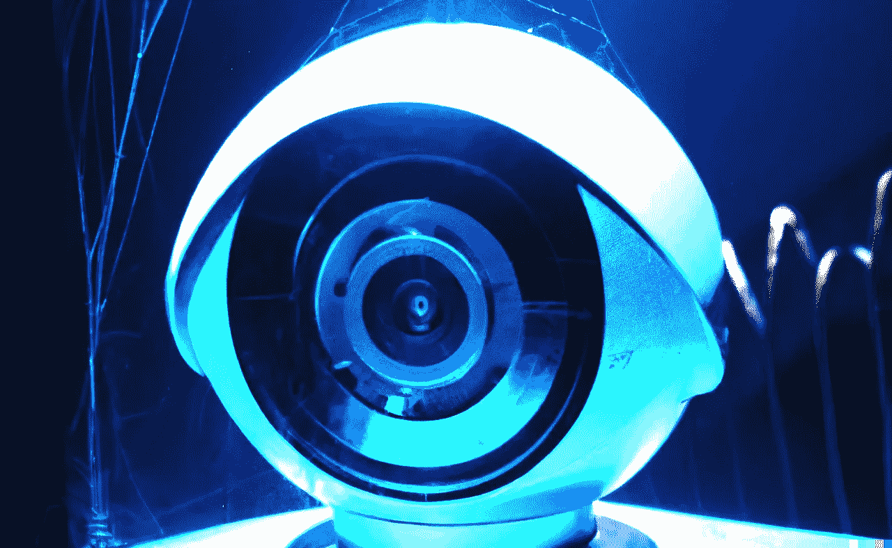

# 计算机视觉、隐私和安全

> 原文：<https://medium.com/mlearning-ai/computer-vision-privacy-and-security-29e37388135e?source=collection_archive---------5----------------------->

## [创意经济的人工智能工具](https://mlearning.substack.com/p/8-verified-ai-tools-for-creative?r=z7zu8&utm_campaign=post&utm_medium=web)

## 具有强大隐私的大型深度学习模型

How AI is affecting the private life of humans?

**首先，让我们定义一下隐私人工智能。**
消费者数据驱动的 ML 模型通常与数据隐私问题一起讨论。用户对收集和利用他们的数据(包括个人信息)的自动化系统的怀疑是…