# 排队汽车的计算机视觉和强化学习

> 原文：<https://medium.com/mlearning-ai/computer-vision-reinforcement-learning-for-platooning-cars-4d81d6cc4b9c?source=collection_archive---------4----------------------->

这篇文章解释了我的硕士论文，其中的目标是创造一个代理人能够跟随另一辆车只使用单目摄像机检索的信息。除此之外，我试图用 SHAP 价值观来解释代理人采取的行动。

开发是在卡拉([https://carla.readthedocs.io/en/stable/](https://carla.readthedocs.io/en/stable/))完成的，这是一个由英特尔、丰田和巴塞罗那计算机视觉中心开发的用于自动驾驶研究的开源模拟器。

该项目有 4 个主要方面:

1.  卡拉有分段摄像机
2.  转向代理
3.  节流/制动代理(以及使用异常架构的迁移学习)
4.  SHAP 重视解释决策。

# 分段摄像机

由模拟器提供的分段照相机用于检索创建供给 RL 代理的环境状态所需的主要信息。

分割相机使用不同的标签对 RGB 图像中的每个对象进行分类，这允许将标签映射到通过 CARLA 的文档识别的对象([https://CARLA . readthe docs . io/en/latest/ref _ sensors/# semantic-segmentation-camera](https://carla.readthedocs.io/en/latest/ref_sensors/#semantic-segmentation-camera))。当模拟开始时，环境中的每个对象都创建有一个标签。当该相机检索图像时，标签信息被编码在红色通道中，这意味着具有红色值*‘10’*的像素属于具有*标签‘10’*的对象。*标签‘10’*将是我们用例中最重要的，因为它标识了领导者。

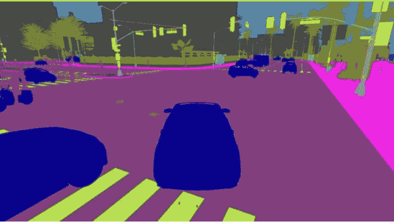

Segmented image from CARLA segmentation camera

然后，仅用一行代码对分割图像进行操作，以将分割图像转换成仅具有前导的图像，如下所示:

```
leader = (sem_camera==10)*1
```

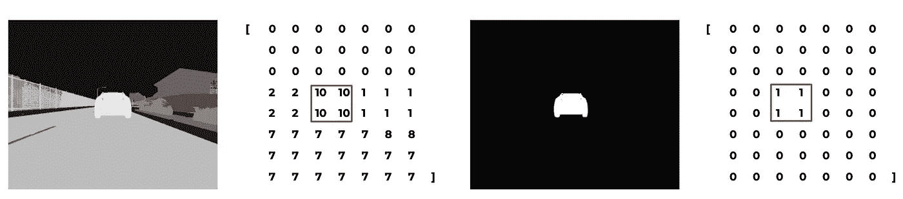

Matrix manipulation to get the image used to create the state for both agents

有了这个最终的图像，它现在是一个二进制矩阵，其中 1 标识领导者，我们可以为我们的代理创建状态！

# 转向代理

**状态**

该代理的状态包含两个二元特征，称为*‘左’*和*‘右’。*当*‘left’*为 1 时，则*‘right’*为 0，这意味着代理与领导者不对齐，领导者在代理的左侧。当*‘右’*为 1 时，则*‘左’*为 0，这意味着代理与领导者不对齐，领导者在代理的右侧。当*‘左’*和*‘右’*都为 0 时，表示代理人与领导者对齐。

通过对滤波后的图像进行矩阵操作，我们可以很容易地提取以下信息，以确定*‘左’*是 1 还是 0，以及【T30’‘右’是 1 还是 0，方法如下:

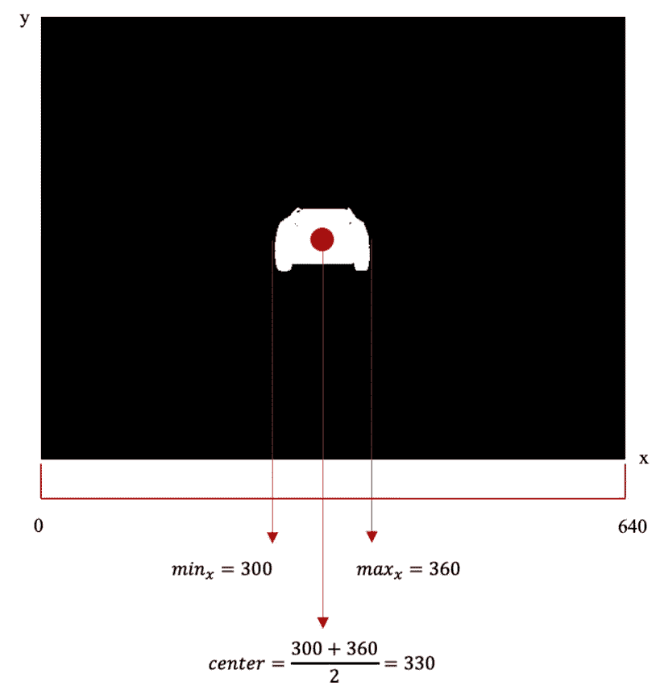

```
center_leader = int((min(np.where(leader)[1])+max(np.where(leader)[1]))/2)
```

1.  如果引线的中心在 x 坐标低于 300 的像素上，那么*‘左’*为 1，*‘右’*为 0；

```
leader_left = (300 > pixel_leader)*1
```

2.如果引线的中心在 x 坐标高于 340 的像素上，则“左”是 0，“右”是 1；

```
leader_right = (340 < pixel_leader)*1
```

3.最后，如果引线的中心在 x 坐标在 300 和 340 之间的像素上，那么“左”是 0,“右”是 0。

```
aligned_with_leader = (300 <= pixel_leader) & (340 >= pixel_leader)*1
```

**动作**

然后，我们将状态输入 PPO 算法，该算法需要执行以下操作之一:

1.  直走
2.  向左转
3.  向右转

将根据使用 softmax 激活函数的输出图层计算出的最大概率来确定决策。

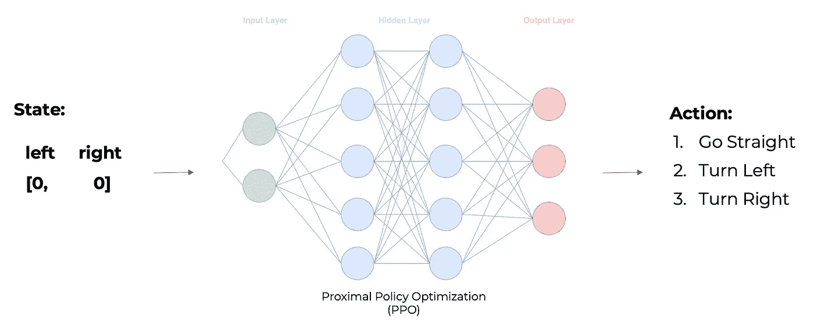

Network Architecture

**奖励功能**

奖励函数由 4 个部分组成:

1.  如果发生碰撞，奖励-10

```
if len(self.collision_hist) != 0:
 reward_steer += -10
```

2.如果分割图像没有*标签 10* ，则奖励-10

```
elif sum(state[:3]) == 0: 
  reward_steer += -10
```

3.如果*【左】*和*【右】*等于 0，则奖励+5，否则-5

```
if state[0] == 1:
  reward_steer += 5 
else: 
  reward_steer -= 5
```

4.指导性决策:

如果 *'left'* 等于 1，动作是直行还是右转，则奖励-5，否则+5

如果*‘右’*等于 1，动作是直行还是左转，则奖励-5，否则+5

如果*‘右’*和*‘左’*等于 0，且动作不直，则奖励-5，否则+5

```
if (state[1] == 1) & (action_steer > 0):
  reward_steer -= 5
elif (state[2] == 1) & (action_steer < 0):
  reward_steer -= 5
elif (state[1] == 1) & (action_steer < 0):
  reward_steer += 5 
elif (state[2] == 1) & (action_steer > 0):
  reward_steer += 5 
elif (state[0] == 1) & (action_steer != 0.0):
  reward_steer -= 5
elif (state[0] == 1) & (action_steer == 0.0):
  reward_steer += 5
```

从这最后一个部分，我们可以看到，一个简单的启发式算法将解决这个问题，因为如果我们知道领导者在哪里，就很容易定义动作，并且对于相同的状态表示也是一样的。

然而，很高兴看到 PPO 能够学习启发式！

**终端状态**

1.  剧集播放时间超过 60 秒。
2.  代理冲突。
3.  代理丢失了领导(分段图像中没有标签*‘10’*)。

**训练结果:**

在第 **500** 集左右，该集获得的奖励发生正漂移，这意味着代理开始**学习**预期的内容。

从第 **650 集**开始，累积奖励已经稳定，因此模型已经**收敛**。

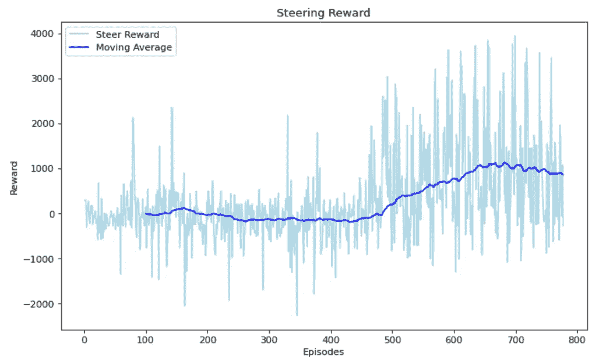

# 节流/制动剂

**状态**

该代理的状态包括三个特征，称为*‘距离’，【先前距离】，*和*‘速度’。*

*【距离】*是来自例外的预测，以及*【先前距离】*是来自先前状态的预测。'*速度'*是智能体在该时刻驾驶的速度。

除了每辆车都有的传感器“T0”速度“T1”之外，为了提取状态的其余特征，我们将使用在“T2”驾驶代理中使用的相同分割图像来提供预测距离的例外，以创建状态。

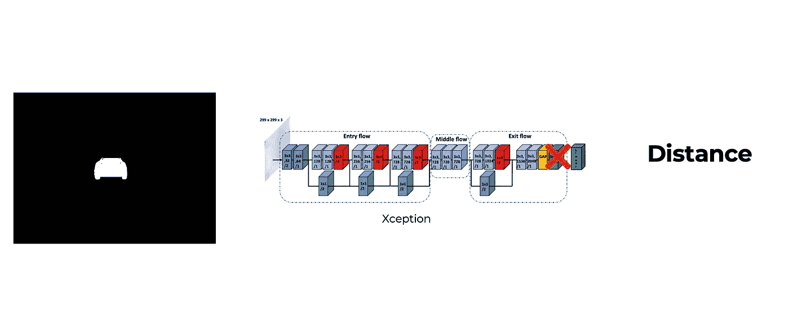

Process to predict distance

为了能够将迁移学习与 Xception 一起使用，我们需要对架构进行微小的更改。

由于异常是在 Imagenet 数据集中训练的，目标是基于 1000 个可用类对图像进行分类，因此我们将输出图层从具有 softmax 激活函数的 1000 个节点更改为具有线性激活函数的 1 个节点。

```
base_model **=** Xception(
    weights**=**'imagenet',  *# Load weights pre-trained on ImageNet.*
    input_shape**=**(255, 255, 3),
    include_top**=False**) 

x **=** base_model**.**output
x **=** GlobalAveragePooling2D()(x)

predictions **=** Dense(1, activation**=**"linear")(x)
model **=** Model(inputs**=**base_model**.**input, outputs**=**predictions)
model**.**compile(loss**=**"mae", optimizer**=**'adam', metrics**=**[tf**.**keras**.**metrics**.**MeanAbsoluteError()])
```

借助新的架构，我们现在可以使用大约 25k 的图像在数据集上训练异常，如下所示:

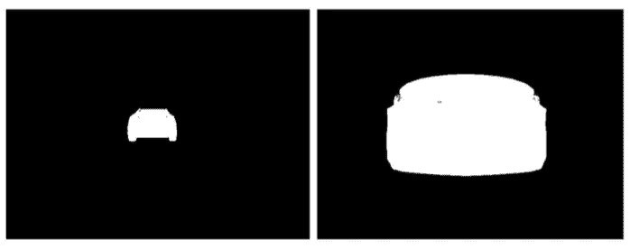

Example of images in our dataset.

最后，经过训练，我们现在可以使用 Xception 来预测距离，并完成节流/制动代理所需的状态！！

状态中的值通过将距离值除以 25(这是训练期间允许的最大值，否则情节将结束)并将速度除以 100(这将使速度特征的范围在 0 和 1.2 之间，因为允许的最大速度是 120 km/h)来归一化。

这个状态被输入到我们的第二个 PPO 算法中，这个算法有一个连续的动作空间(在图像中，这个状态没有被归一化以便于解释):

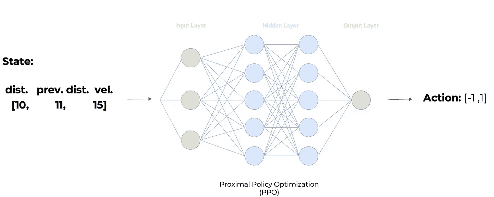

Throttle/Break Architecture

该网络具有不同的输出层，其中只有一个节点具有双曲正切激活函数，该函数将确定代理是否会中断(预测< 0) or accelerate (prediction > 0)。

**奖励功能**

奖励函数由 5 部分组成:

1.如果发生碰撞，奖励-10

```
if len(self.collision_hist) != 0:
  reward_throttle += -10
```

2.如果领导者的距离超过 25，那么奖励-10

```
if distance > 25: 
  reward_throttle += -10
```

3.如果领导者在 8 到 10 之间的距离，那么奖励+5，否则-5

```
if (distance >= 8) & (distance <= 10): 
  reward_throttle += 5
else:
  reward_throttle -= 5
```

4 .如果代理在距离高于 10 时减少距离，或者在距离低于 8 时增加距离，则奖励+5，否则-5

```
if (distance < previous_distance) & (distance > 10):
  reward_throttle += 5
elif (distance >= previous_distance) & (distance < 8):
  reward_throttle += 5
```

5.如果速度是 0 公里/小时&领头人离我们至少有 13 度的距离&选择的动作小于或等于 0(休息)，那么奖励-5

```
if (int(kmh) == 0) & (float(action_throttle) <= 0.0) & (distance >= 13):
  reward_throttle -= 5
```

**终端状态**

1.  剧集播放时间超过 60 秒。
2.  代理冲突。
3.  到领导者的距离大于 25。

**训练结果**

在第 **430** 集前后，该集获得的奖励发生正漂移，这意味着代理开始**学习**预期的内容。

从第 **650 集**开始，累积奖励已经稳定，因此模型已经**收敛**。

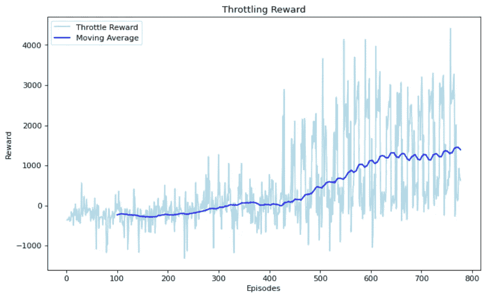

# **SHAP 值**

一旦我们有了一个具有可解释特征的数组，我们就可以用它来理解我们的代理所做的决定:

**操舵代理:**

*   向左转的动作由等于 1 的*‘左’*和等于 0 的*‘右’*构成的状态触发，因为红点意味着高特征值，在二进制特征中是 1。在图表中，还可以在 x 轴上验证对模型输出的影响，在这种情况下，红点表示影响超过 0.8。


*   直行动作由不包含任何 1 值的*‘左’*或【T6’‘右’的状态触发，因为对模型输出的影响小于-0.8，这将减少采取该动作的机会。这意味着，由等于 0 的*‘左’*和等于 0 的*‘右’*定义的状态将增加采取该动作的机会，因为蓝点意味着低特征值，在二进制特征中为 0。事实上，从图表中很容易理解，在*‘左’*或*‘右’*中的 1 值降低了直行的概率。

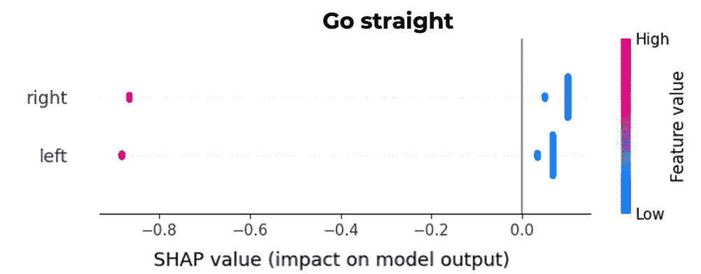

*   右转动作由*‘左’*等于 0 和*‘右’*等于 1 构成的状态触发。在图表中，还可以在 x 轴上验证对模型输出的影响，在这种情况下，红点表示影响超过 0.8。


**节流/制动代理:**

*   当*‘速度’*特征的值高和/或*‘距离’*的值低时，代理通常使用中断。也可以看出*“先前距离”*对制动动作的重要性不如对油门的重要性。但是，该特性的低值也会触发中断。
    这些值是所期望的，因为短的*“距离”*将需要中断以跟上期望的距离，并且当*“速度”*很高时，从而可以保持允许在撞上领先车之前中断的安全距离。
*   油门主要在*【速度】*低和/或*【距离】*和/或*【先前距离】*高时触发。这样的事实是有道理的，因为代理应该与领导者保持 8 到 10 之间的距离，因此如果距离大于 10，它必须踩油门。

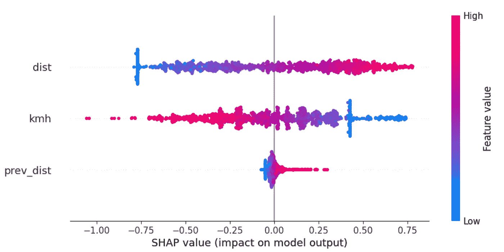

这是文章的结尾，你可以在这里查看代码:

[](https://github.com/rjguedes8/platooning_vehicle) [## GitHub-rjguedes 8/车队 _ 车辆

### 这个库是我的硕士论文的一部分，目标是创建一个能够跟随另一辆车的智能体，只使用…

github.com](https://github.com/rjguedes8/platooning_vehicle) 

在测试环境中观看一集视频:

[](/mlearning-ai/mlearning-ai-submission-suggestions-b51e2b130bfb) [## Mlearning.ai 提交建议

### 如何成为 Mlearning.ai 上的作家

medium.com](/mlearning-ai/mlearning-ai-submission-suggestions-b51e2b130bfb)