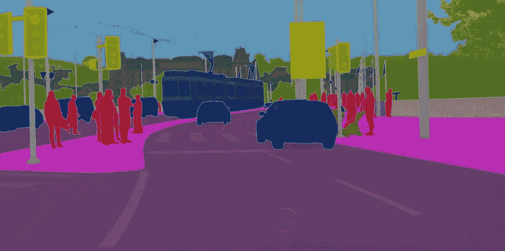
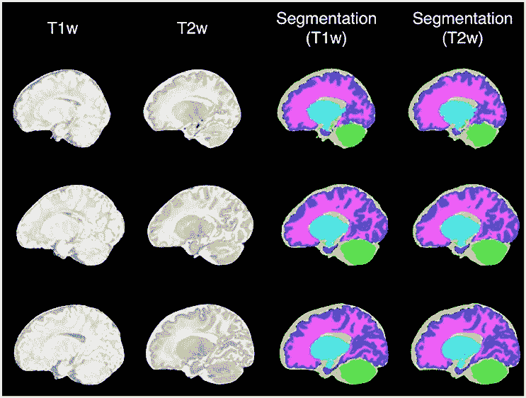
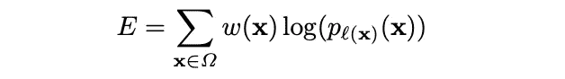
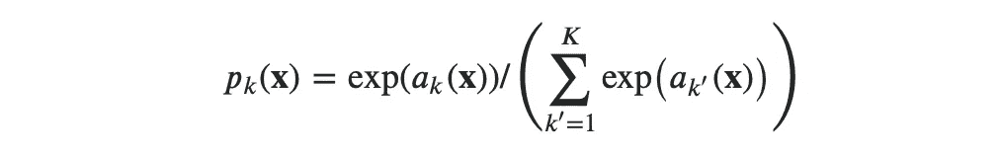
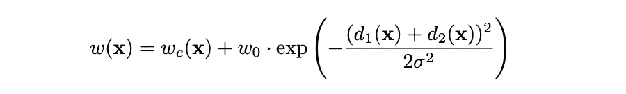
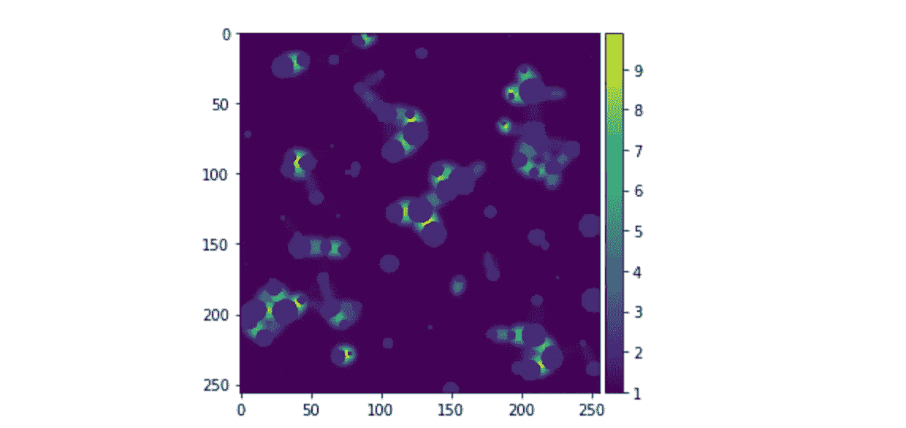

# 计算机视觉— Unet

> 原文：<https://medium.com/mlearning-ai/computer-vision-unet-30d07500254c?source=collection_archive---------5----------------------->

今天，我们来谈谈著名的卷积网络架构 Unet。它的名字是基于它的形状，我们将在后面看到。这篇文章将主要由原文引导，原文可以在这里找到。

## 语义分割

使用卷积层的动机是对局部平移的不变性，当我们更关心特征的存在，而不是它的确切位置时。

当你第一次开始学习卷积神经网络时，卷积可能会用在用来对图片进行分类的模型中。例如，您希望预测图片中是否包含某种特定的动物、对象甚至人。

然而，我们经常希望定位每个像素。期望的输出是分割成不同区域的图像，从而降低机器理解图像的复杂性。这在生物医学图像处理和自动驾驶汽车方面非常有用。

让我们看一些语义分段的实际例子:

semantic segmentation used for self-driving cars

semantic segmentation of MRI scans

**改版:**

如果你不太熟悉卷积以及它们是如何应用的，强烈建议你在这里看看 briliant blogpost:

 [## 用于视觉识别的 CS231n 卷积神经网络

### 目录:卷积神经网络非常类似于以前的普通神经网络…

cs231n.github.io](https://cs231n.github.io/convolutional-networks/#conv) 

## 建筑

现在，我们了解了什么是语义分割，是时候看看模型的构建块了，它非常擅长制作这些模板。

Unet 具有下采样—编码器和下采样—解码器部分。关于 Unet 的一个关键点是，它还具有将信息传播到更高分辨率层的跳过连接或特征通道。

Unet architecture

*编码器*

编码器由重复的 **3x3** 卷积组成，ReLU 作为线性激活函数将非线性引入模型，然后是 maxpooling 运算。在每个下采样步骤中，通道的数量加倍。

*解码器*

解码器通过上采样层组合空间信息和特征信息，然后与来自编码器的更高分辨率特征连接。在每个上采样步骤，通道的数量减半。最后一步是 **1x1** 卷积，将 64 分量特征映射到 **23** 卷积层。

*跳过* *连接*

跳过连接有助于通过在编码器部分学习的细节从解码器构建图像。

在论文中还提到，选择输入大小很重要，这样最大池操作就可以应用于均匀的 *x，y* 大小。

**训练和损失功能**

在最初的论文中，他们将 soft-max 与交叉熵损失函数相结合。我想详细说明论文中给出的公式，因为乍一看可能不清楚。

*表示位置 ***x*** 处像素的真实标签。例如，如果像素是第一类的一部分，则 ***l(x)= 1*** 。现在我们将 ***p_k*** 计算为:*

**

*其中 ***a_k*** 为特征通道 ***k*** 中位置***x******k***为类数。因此如果 ***l(x) = 1*** ，我们就会有 ***p1(x)*** 。*

*为了迫使网络学会准确预测同一类对象之间的边界，他们引入了加权损失:*

**

*其中 ***wc(x)*** 为加权类映射。计算它的步骤是:*

*   *对于每个类，计算地面真实中有多少像素属于该类*
*   *对于形状为一个输入图像的 wc(x)中的每个像素，将概率指定为 1/(上面计算的数)*
*   *将地图中的所有值除以地图的最大值，使背景的权重为 1*

****【w0(x)***是在原纸中分别设置为 10 和 5 的常数。***【D1(x)***和 ***d2(x)*** 是如文中所说的到前两个最近单元格的距离。*

*这是可视化，你可以看到更多的重量在物体之间的边界上。*

**

****应用****

*语义分割在向计算机提供感知方面非常有用。例如，自主车需要理解环境，语义符号可以帮助它识别道路和与道路相交的物体。在图像诊断中，它可以帮助医生管理 x 射线的方向，以便其他健康的器官受到最小的辐射。*

*有趣的 kaggle 数据集可以为您提供实践服务:*

*   *[https://www . ka ggle . com/competitions/uw-Madison-gi-tract-image-segmentation/data](https://www.kaggle.com/competitions/uw-madison-gi-tract-image-segmentation/data)*
*   *[https://www . ka ggle . com/datasets/mateuszbuda/LGG-MRI-segmentation](https://www.kaggle.com/datasets/mateuszbuda/lgg-mri-segmentation)*
*   *[https://www . ka ggle . com/datasets/kumaresanmanickavelu/lyft-uda city-challenge](https://www.kaggle.com/datasets/kumaresanmanickavelu/lyft-udacity-challenge)*

****参考文献*** :*

*   *[http://cs231n.github.io/convolutional-networks/](http://cs231n.github.io/convolutional-networks/)*
*   *[https://towards data science . com/understanding-semantic-segmentation-with-unet-6 be 4f 42 D4 b 47](https://towardsdatascience.com/understanding-semantic-segmentation-with-unet-6be4f42d4b47)*
*   *[https://doi.org/10.48550/arXiv.1505.04597](https://doi.org/10.48550/arXiv.1505.04597)*

* [## Mlearning.ai 提交建议

### 如何成为 Mlearning.ai 上的作家

medium.com](/mlearning-ai/mlearning-ai-submission-suggestions-b51e2b130bfb)*