# 使用虚幻引擎的计算机视觉:生成丰富的对象检测数据

> 原文：<https://medium.com/mlearning-ai/computer-vision-with-unreal-engine-generate-rich-object-detection-data-64c613e0121f?source=collection_archive---------2----------------------->

## 无需编写任何代码，即可在虚幻引擎中创建丰富、高度可定制的数据！

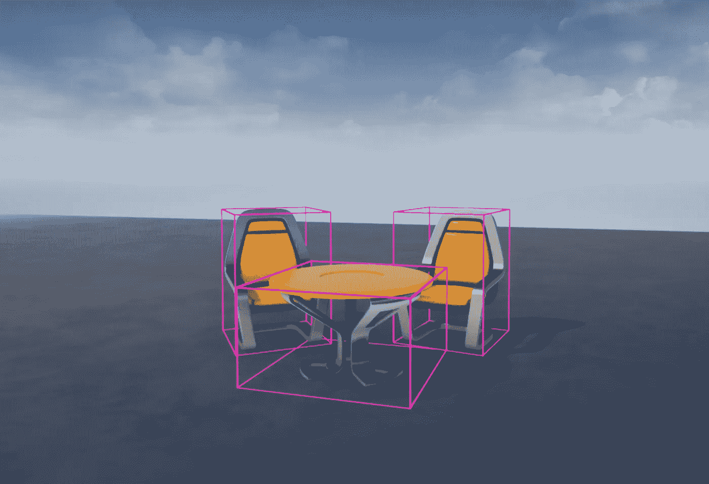

What we’ll be building by the end of this article

虚幻引擎是一个绝对的发电站。虽然它将彻底改变游戏，但它也将推进计算机视觉。你看，为机器学习项目创建数据是很难的，特别是在计算机视觉领域，你必须考虑照明、天气、相机参数和其他一切。然而，使用虚幻引擎，您可以在计算机前通过几个步骤创建真实的数据。我会告诉你怎么做。

在本教程中，我们将从头开始生成高质量的对象检测数据。

在继续之前，我假设你已经设置了虚幻引擎，如果没有，你可以从[这里](https://www.unrealengine.com/en-US)得到它。我这里用的是 4.27 版本，但是任何更新的版本都可以。

本文中使用的蓝图可以在[这里](https://neeraj-public-bucket-for-files.s3.ap-south-1.amazonaws.com/object-detection-ue4/BP_OD.uasset)找到。

好吧，我们开始吧。

# 创建项目

启动引擎并创建一个空白项目。

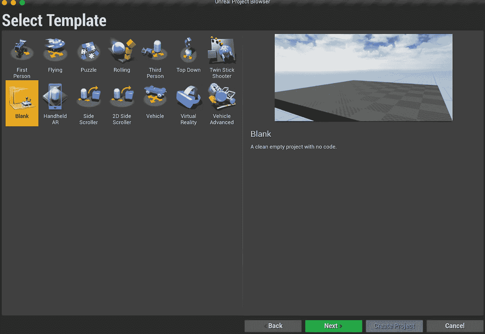

在项目设置中选择 Blueprint，并选择包含 starter 内容。可以将项目命名为`ObjectDetection`。

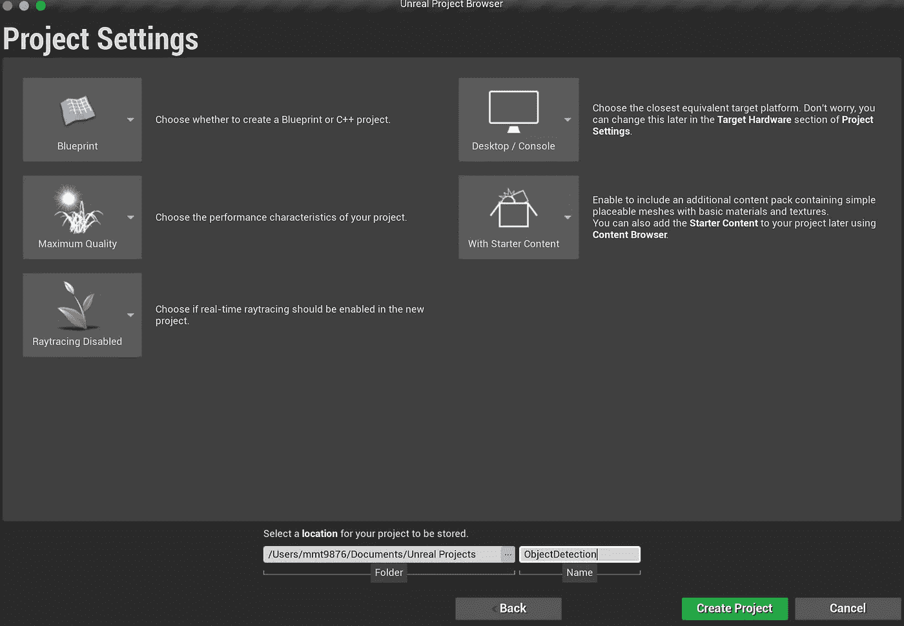

窗口加载后，删除当前的起始网格，这样我们就可以从头开始了。

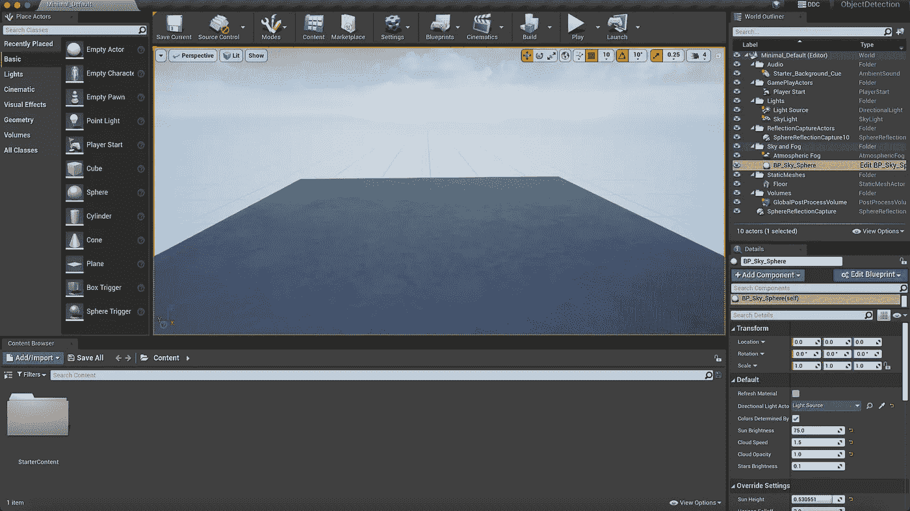

The main editor

# 创建演员

虚幻引擎中的演员是可以放在关卡中的对象。我们可以给一个演员附加不同的组件，并定制它的行为。在本文中，我们将使用 blue prints——unreal 的可视化脚本系统来为演员添加行为。

打开内容浏览器并创建一个名为`Blueprints`的新文件夹。如果你没有在你的工作区看到它，去`Window -> Content Browser`。在`Blueprints`文件夹中，右键单击并创建一个 Actor 类型的新蓝图类。你可以把它命名为`BP_OD`。

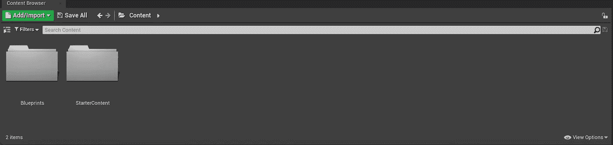

Content Browser

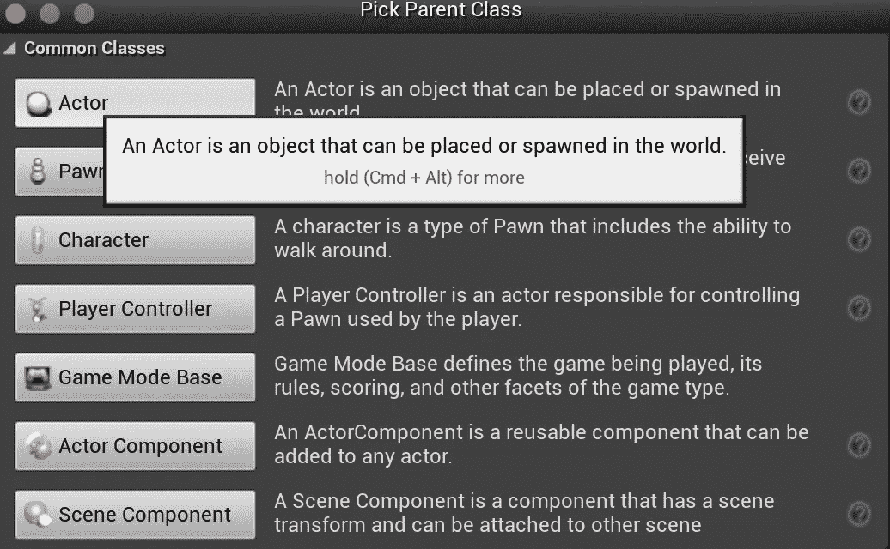

Create Blueprint class of type Actor

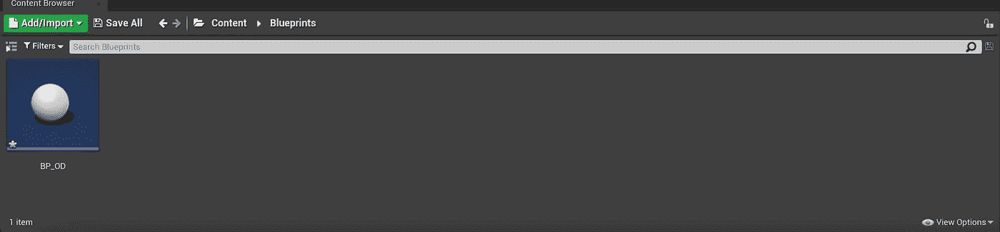

双击这个蓝图打开编辑器。

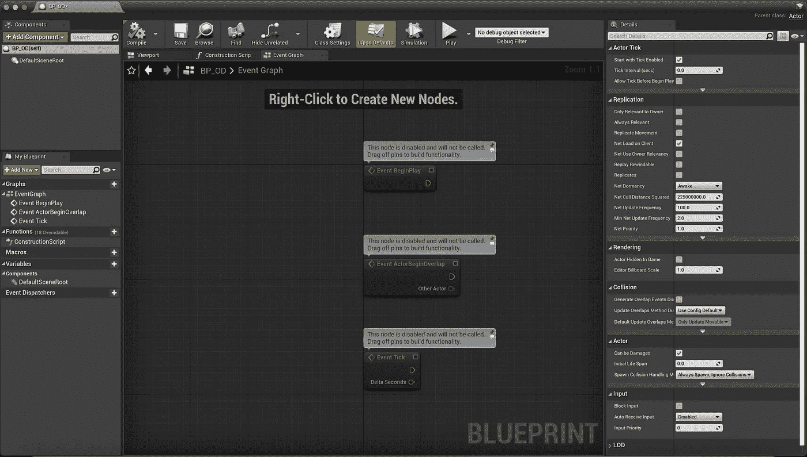

Blueprint Editor

# 添加静态网格组件

在左边的组件部分，点击`Add Component`并选择`Static Mesh`。

这个想法是`BP_OD`的每个实例将有一个相关的静态网格，我们将在其上生成边界框。现在，我们希望能够为不同的实例选择不同的网格。因此，我们将创建一个变量来存储静态网格。

在左侧的`My Blueprint`部分，点击`Add New`并选择`Variable`。这将创建一个变量，它的范围仅限于蓝图。它的属性可以在右边的`Details`部分。将变量重命名为`SM_Mesh`。

Blueprint 是一种高度类型化的语言，所以我们需要显式地将变量类型设置为`Static Mesh`。勾选下面的`Instance Editable`框；这将确保我们可以在主编辑器中编辑变量。另外，将类别重命名为`Object Detection`。接下来点击顶部的编译按钮，你应该会看到`Default Value`部分被激活。将默认值设置为任意静态网格，比如`SM_Chair`，如下所示:

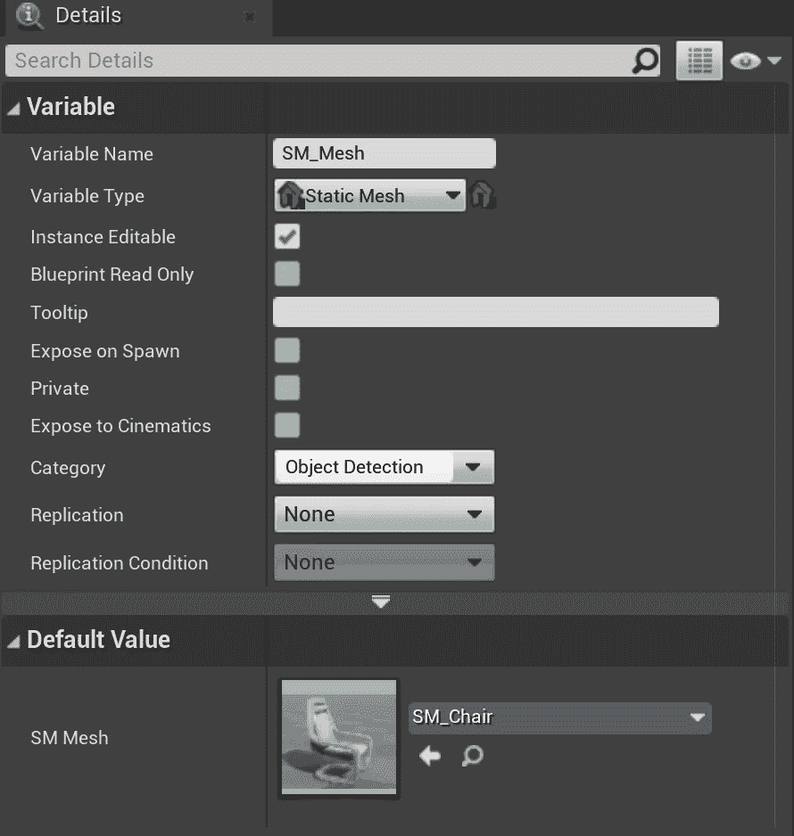

接下来是选项栏下面事件图标签旁边的`Construction Script`标签。

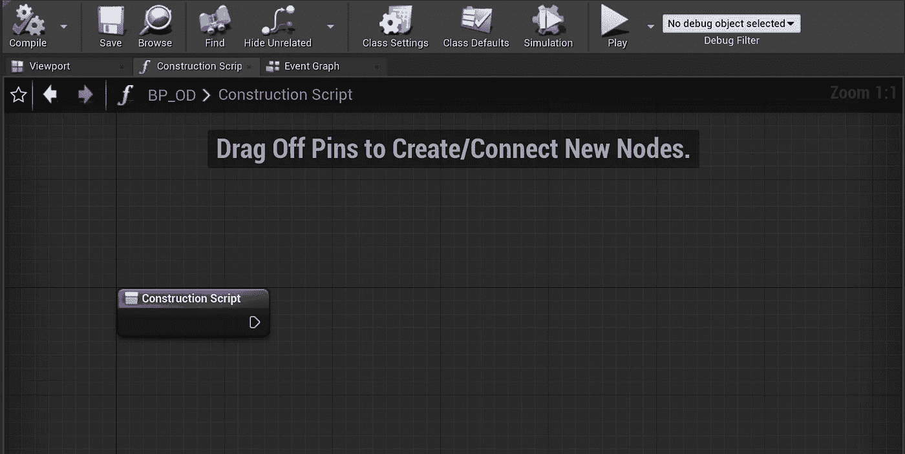

Construction Script Editor

每当蓝图被实例化时，构造脚本就运行。在编辑器中，右键单击并在`Static Mesh`部分下创建`Set Static Mesh`节点。将`SM_Mesh`变量和`Static Mesh`组件拖到编辑器中，并将其分配给如下所示的节点，然后点击编译按钮。

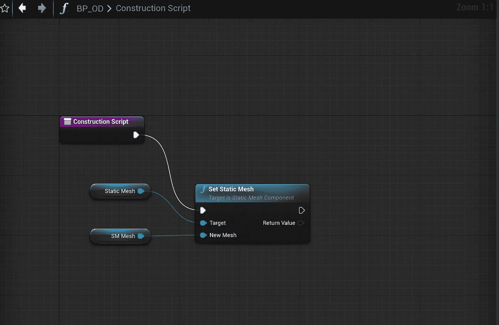

Assign the static mesh stored in SM_Mesh variable to the static mesh component

这个想法是，一旦构造脚本执行，包含在`SM_Mesh`变量中的网格就被分配给角色的静态网格组件。

为了测试这一点，回到主编辑器，将`BP_OD`类从内容浏览器拖到关卡，你会看到一把椅子。

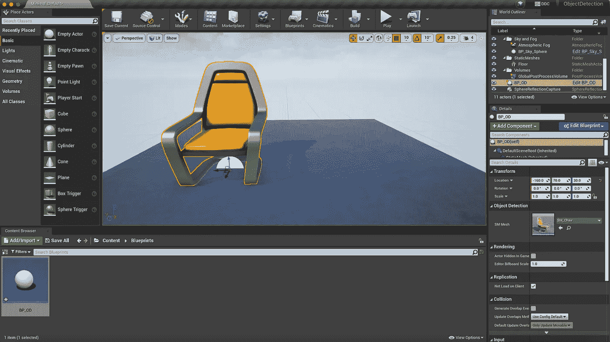

此外，我们可以在右侧细节面板下的*对象检测*部分的编辑器中更改网格。

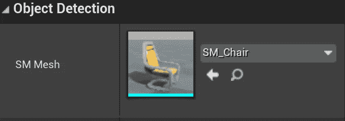

Changing the mesh in the editor

好了，我们已经摆好了物品。接下来让我们制作边界框。

注意:确保你偶尔点击一下保存按钮，以避免在进程中丢失。

# 制作边界框

我们将创建一个向静态网格组件添加边界框的函数。双击`BP_OD`并返回蓝图编辑器。在这里，点击`My Blueprint`部分的`Add New`并选择功能。将该功能重命名为`Get Bounding Points`。在`Details`部分的右侧可以看到功能细节。在这里，将类别设置为`Object Detection`并勾选`Pure`复选框。

该函数应该将静态网格组件作为输入，并输出其在世界空间中的边界框坐标。在`Inputs`部分，点击`+New Parameter`，选择变量类型为`Static Mesh Component`，重命名为`Static Mesh Comp`。在其下方的`Outputs`部分，点击`+ New Parameter`，将其重命名为`Bounding Points`，选择变量类型为`Vector`，并选择其旁边的框，使其成为容器类型。这也将在编辑器中创建一个返回节点，如下所示:

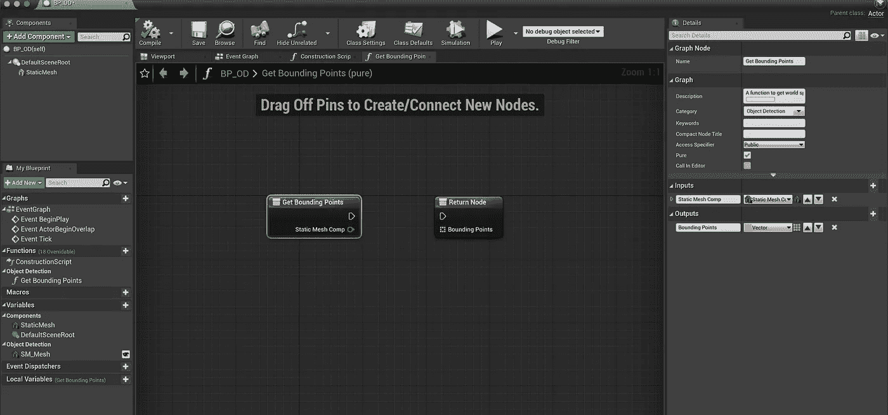

The function node editor

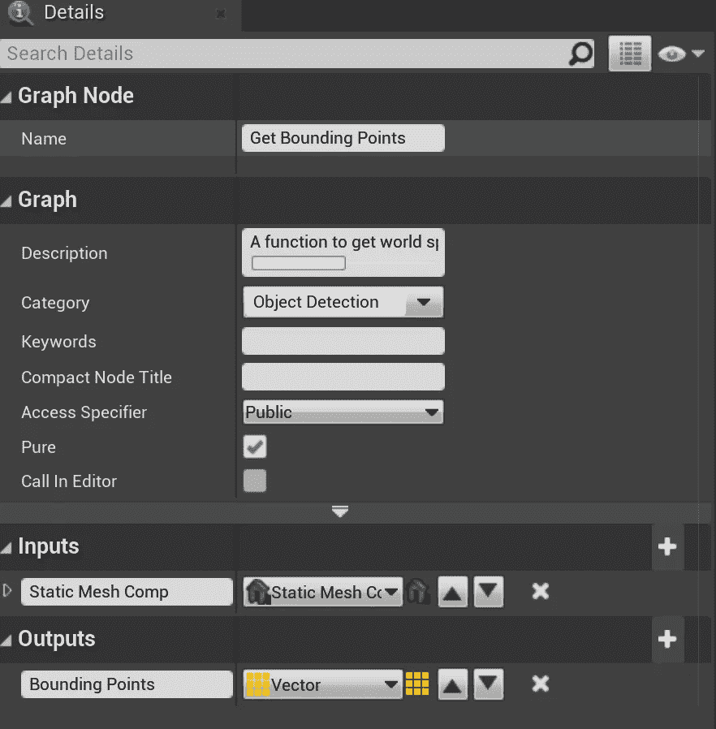

Function details

让我们给函数添加逻辑。你看，虚幻引擎有许多内置功能，足以满足我们的大部分需求。一个这样的函数叫做`Get Local Bounds`，它返回静态网格组件的最小*和最大*边界。然而，这些坐标是相对于网格本身的，而我们希望它们在世界框架中表示。因此，我们的想法是获取网格组件在世界中的位置和方向，并使用它们将局部边界转换为世界边界。

功能逻辑如下图所示，在此呈现[。你可以直接从网站上复制粘贴到你的编辑器里。](https://blueprintue.com/blueprint/x_fruq-0/)

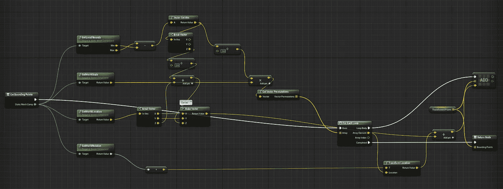

logic for the function Get Bounding Points

蓝图的伟大之处在于你可以跟踪节点并理解逻辑。

注意这里我们使用一个名为`Transformed Points`的局部变量来存储最终的边界点。局部变量的范围受限于它的函数。除了必须在`My Blueprints`菜单底部的`Local Variable`部分创建之外，可以像普通变量一样创建局部变量。如果您已经复制了函数并得到了一个编译错误，创建一个新的局部变量并用现有的`Transformed Points`变量替换它。

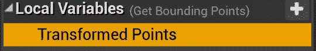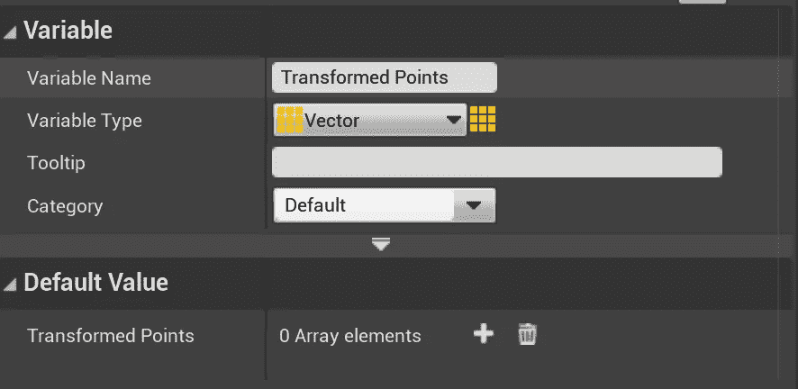

还要注意我们在这里使用了另一个函数`Get Vector Permutations`。这是一个简单的函数，它将一个向量作为参数，并按照顺序返回它的排列`[(x, y, z), (x, y, -z), (x, -y, z), (x, -y, -z), (-x, -y, z), (-x, -y, -z), (-x, y, z), (-x, y, -z)]`。你可以从[这里](https://blueprintue.com/blueprint/0_g8-7mu/)复制过来。该函数还使用一个名为`Permutations Array`的局部变量来存储排列。

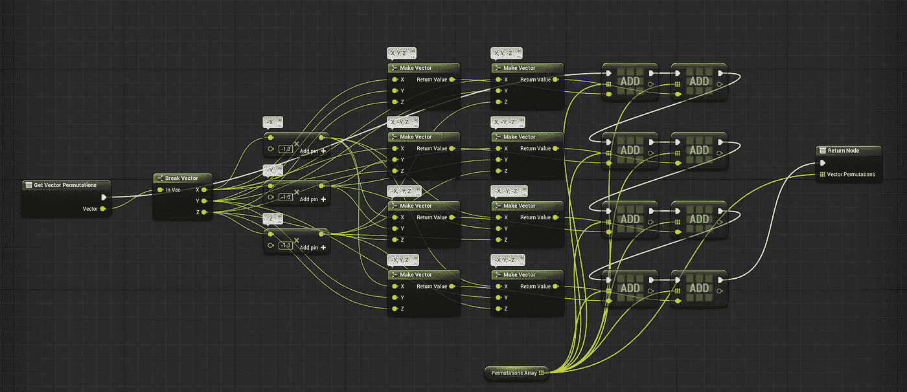

Get Vector Permutations

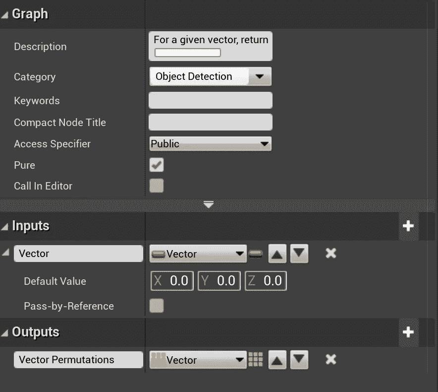

就是这样。我们现在已经创建了一个函数，它接受一个静态网格组件，并返回它在世界空间中的边界框坐标。

让我们想象一下边界框。虚幻引擎有一个我们可以使用的`Draw Debug Box`节点。它获取对象的位置、方向和比例，并在其周围绘制一个 3D 框。我创建了一个名为`Draw BBox`的函数，它使用这个节点来可视化盒子。你可以从[这里](https://blueprintue.com/blueprint/-7lc337_/)复制。

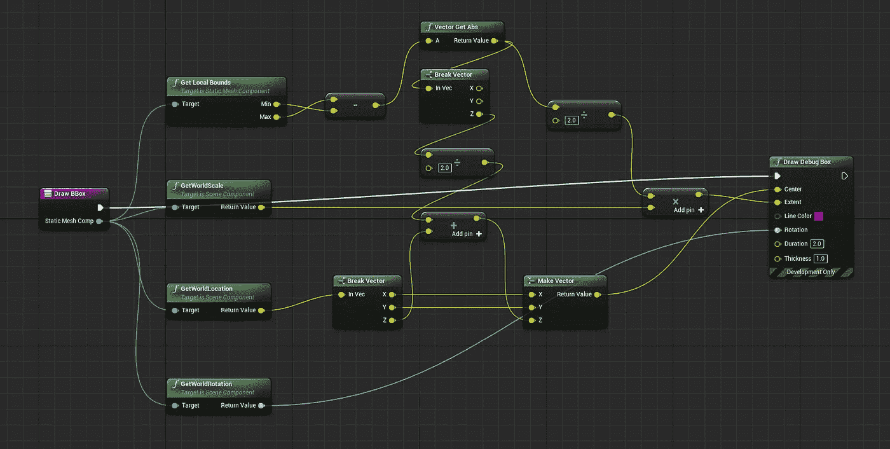

Draw box around a static mesh

返回到事件图并设置节点，如下所示:

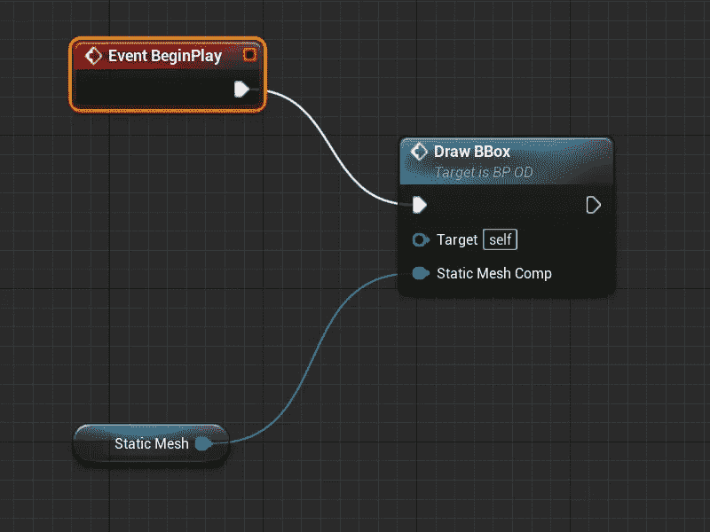

编译并点击 play，你应该会看到边界框。

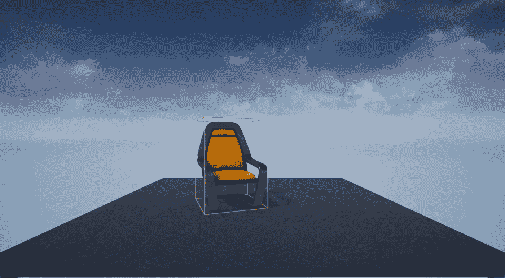

Bounding box on a static mesh object

我们还没完呢。在计算机视觉中，我们关心图像，所以我们需要捕捉图像并将边界框坐标投影到图像上。让我们先研究后者。

# 投影边界框坐标

函数`Get Bounding Points`返回世界空间中的边界框坐标，但是我们需要它们在图像或屏幕空间中。

虚幻引擎有一个名为`Project World to Screen`的节点，它接受玩家控制器和一个点作为输入，并将该点投射到玩家视野的屏幕上。在屏幕空间中，左上角是原点。

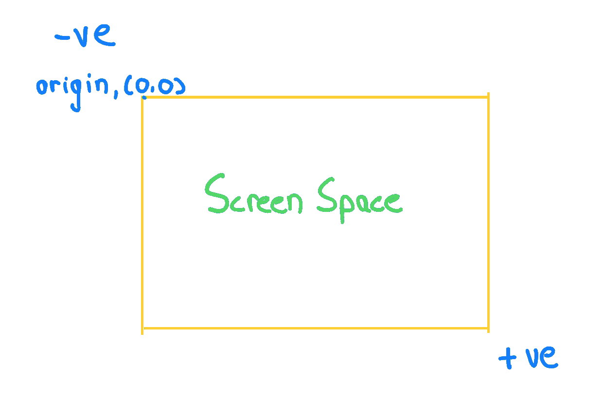

The screen space

在下面显示的事件图中，我们从函数`Get Bounding Points`中获得世界空间中的边界框坐标，然后使用`for loop`将每个点投影到屏幕空间，并将其附加到一个名为`Combined Points`的字符串数组中，您可以在`Variables`部分创建该数组。接下来，我们使用函数`Join String Array`将数组中的所有点合并成一个字符串。

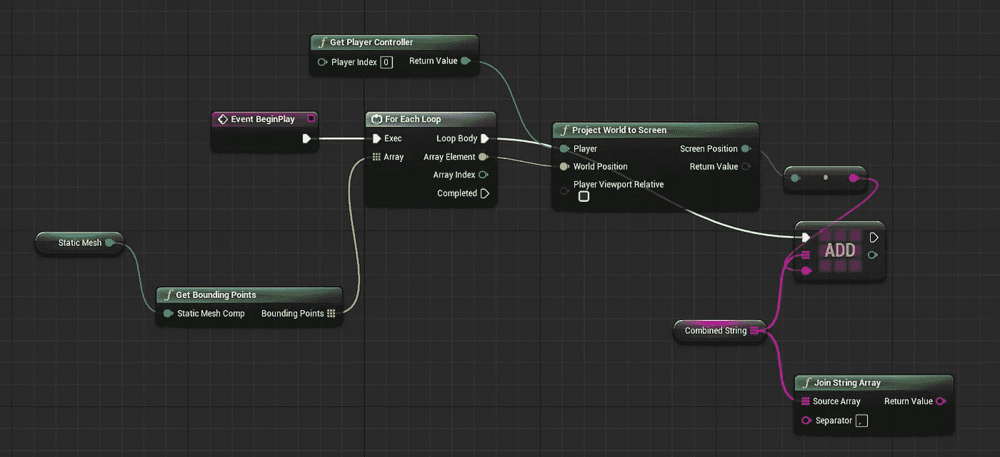

Project bounding box coordinates to screen space

## 写入文件

接下来，我们需要将这些坐标写入一个文件。幸运的是，有一个很棒的插件叫做`Blueprint FileSDK`，你可以在虚幻市场[这里](https://www.unrealengine.com/marketplace/en-US/product/blueprint-file-sdk?sessionInvalidated=true)免费获得。将插件安装到引擎，然后转到`Edit -> Plugins`并启用该插件。重新启动编辑器以使更改生效。

回到事件图，您现在应该在`File SDK`部分看到一个名为`Write String to File`的节点。该节点将要写入的字符串和文件路径作为参数。您可以创建一个变量来存储文件路径，也可以直接在节点中输入。小心，如果指定的路径不存在，编辑器会崩溃。然后对于`Content`参数，我们使用来自`Join String Array`节点的输出，如下所示:

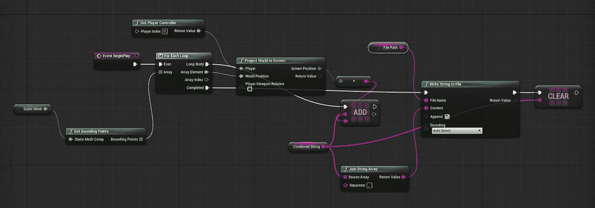

save the coordinates to a file

记得在节点中检查`Append`。你可以从[这里](https://blueprintue.com/blueprint/fe030y6c/)复制代码。还要注意，我们在写入后清除数组，以避免内存泄漏。

如果您点击 compile 然后 play，您应该会看到填充了屏幕坐标的文本文件，如下所示:

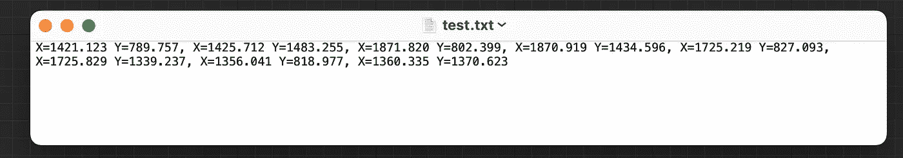

# 拍摄高分辨率截图

接下来我们需要从玩家视角截图。现在，如果场景中有多个对象，就没有必要对每个对象进行截图。所以我们不会在 Actor 蓝图中编写截图逻辑，而是使用关卡蓝图。一个关卡蓝图对每个关卡都是独一无二的。

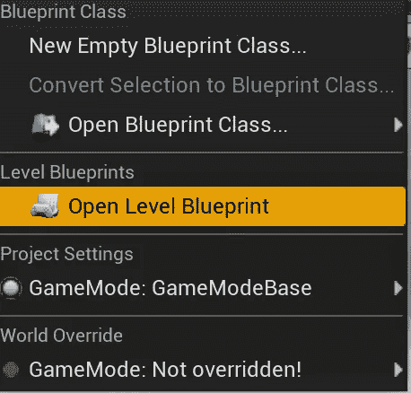

Level Blueprint

为了截屏，我们使用语法为`HighResShot Path resolution (X x Y)`的`[HighResShot](https://docs.unrealengine.com/4.27/en-US/WorkingWithMedia/CapturingMedia/TakingScreenshots/)`命令，并在控制台中执行它。好在虚幻引擎有一个叫`Execute Console Command`的蓝图节点，可以直接在控制台执行命令。

打开关卡蓝图，进入事件图编辑器。在那里，创建如下所示的节点。

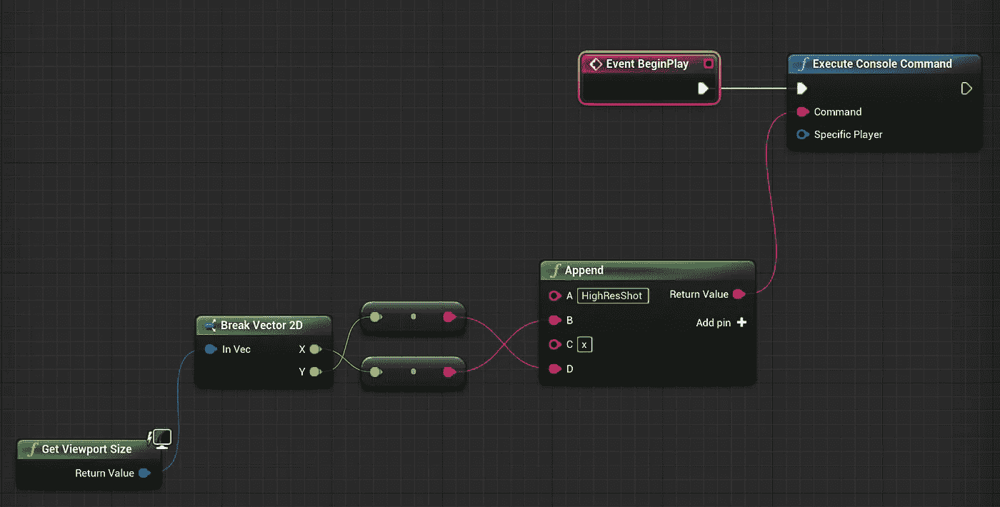

capture screenshot

游戏一开始，我们就通过`Execute Console Command`节点执行`HighResShot`命令，分辨率等于视口大小。

如果你编译并点击 play，你会在指定的路径中看到一个截图，并且边框坐标对应于文本文件中的坐标。

# 创建事件触发器

现在，当游戏开始时，`Begin Play`节点被触发，数据被捕获。这并没有给我们太多的控制。我们需要能够随时捕获数据，因此我们需要创建一个自定义触发器来执行代码。这里我们将创建一个`Key Pressed`触发器。

进入`BP_OD`类，在`Details`菜单下的`Input`部分，将`Auto Receive Input`从`Disabled`改为`Player 0`。

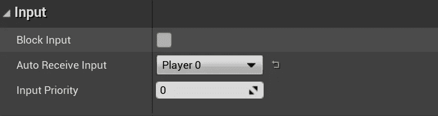

Input section of the BP_OD class

现在在`Keyboard Events`部分下创建一个按键节点，并用`Begin Play`节点替换它。在关卡蓝图中做同样的操作。

现在，每当我们按下指定的键，屏幕截图和框坐标将被捕获和存储。

# 结论

你甚至可以添加多个`BP_OD`actor 到这个级别，并且在不改变任何东西(除了文件路径)的情况下捕获他们的数据。

Multiple Actors

就是这样。只需几步，我们就在虚幻引擎中构建了一个可扩展、可定制的数据生成管道。然而，我们还可以做更多的事情！请继续关注深度学习和虚幻引擎中更酷的东西。

我们来连线。你也可以通过 [LinkedIn](https://www.linkedin.com/in/neerajkrishnadev/) 和 [Twitter](https://twitter.com/WingedRasengan) 联系我。如果你有任何疑问或建议，请告诉我。

## 图像制作者名单

本文展示的图片均为作者。

 [## Mlearning.ai 提交建议

### 如何成为 Mlearning.ai 上的作家

medium.com](/mlearning-ai/mlearning-ai-submission-suggestions-b51e2b130bfb)