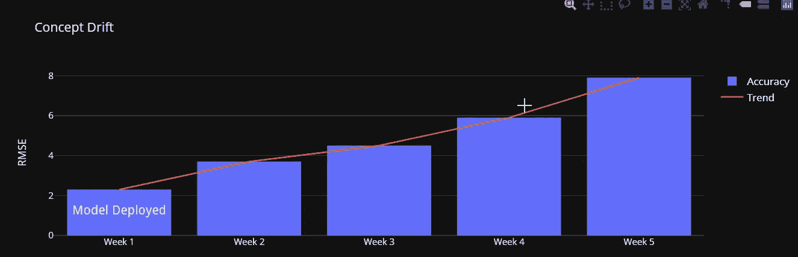
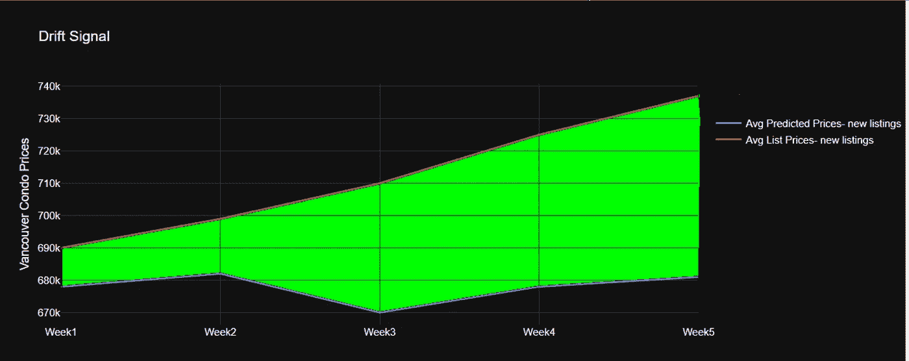
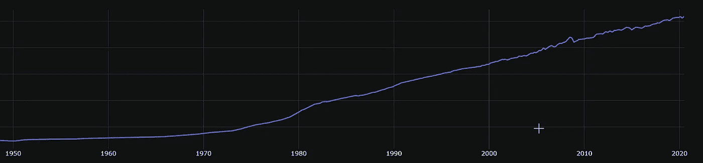
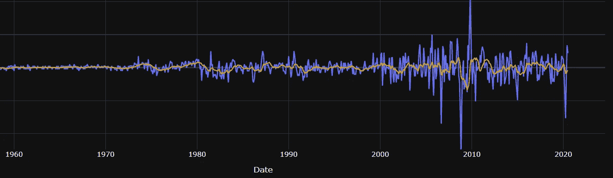

# 模型漂移

> 原文：<https://medium.com/mlearning-ai/concept-drift-52626ec4e013?source=collection_archive---------4----------------------->

**Concept Drift**

在这篇博客中，我提出了关于概念漂移的想法，以及它是如何在回归模型的真实生产环境中表现出来的。

## 模型漂移的定义:

机器学习模型在服从连续体时的准确度损失被定义为模型漂移。*每次我们将经验证的模型部署到生产中时，对指标的评估就是一个时间点数据*。有相当多的理由不要太长时间坚持这种评估

# **什么导致了漂移？**

**#1 大决战(失控事件):**

假设我们部署了一个房屋/汽车估价模型，在部署后不久，发生了以下事件之一:

1)covid 锁定令人窒息的需求。木材短缺盯着被压抑的住房需求。芯片短缺导致汽车制造商关闭工厂。海啸导致制造商关闭工厂。

这可能导致在部署后检测窗口中测量的误差(RMSE/平均误差)开始趋向。ML Ops 战略必须有一个全面的计划来预测和减轻影响我们模型准确性的上述事件。在某些情况下，可能很难明确说明可能代表上述事件之一的影响的特征。值得注意的是，上述事件从季节性事件中脱颖而出，如通常由序列模型捕捉的周日购物趋势。

**#2 时态特征:**其可能我们说明了时态特征但未能衡量它们的影响。一个原因可能很简单，因为在训练数据中对时间敏感的群组(夏季的假期租赁或夏季的敞篷车)具有较少的代表性。

**#3 自动化程度差的培训工作流程:**在撰写这篇博客时，许多公司的培训和评分管道中仍然存在自动化程度差的工作流程。这可能会导致部署模型的交付时间增加，并降低部署频率。虽然听起来很混乱，但它可能发生在自动化有几个障碍的场景中。

## 一个数据科学家为什么要关心模型漂移？

随波逐流的无知可能代价很高。如果忽略漂移因素，一个经过充分验证的模型在部署后不久就会开始表现不佳。如果你的产品是面向消费者的，预测的不准确性很容易被证明，并且会损失
企业的声誉/收入。

# 解决漂移的方法:

让我们讨论几个保证处理漂移的对比方法的场景。

1) **一个实时推荐系统:**你会希望模型尽可能快地进化，用历史数据充分加权最近的用户行为数据
，并显示转化客户的推荐。在这里，完整的自动化部署、顺序模型和边缘学习模型都可以被公式化为解决漂移的方法。

2) **一个房产/电商的估值模型:**

> 如果部署一个新模型会给你的企业带来货币风险，我们需要一个自动化和控制的谨慎组合。(即)不要进行全面的自动化模型更新。

以下是您不应该进行全自动更新的几个原因:

1.  企业利益相关者需要理解影响、指标和签准——这里没有真正的时间。
2.  吸收你的模型影响的潜伏期:会有企业吸收你的估价，并可能根据你的预测开展活动。对于估价模型，房地产经纪人、经销商等可能会根据你的模型得分调整价格。这需要时间，ML 工程师应该允许&明确地控制一个稳定性窗口，在此期间你的得分是静态的。

# 如何检测漂移？

**步骤 1:** 为看不见的数据制定一个漂移信号的定义，以解决您的具体问题

Shaded region represents drift trend

对于上述测量预测价格漂移的问题，我们可以评估平均标价与每周新上市的大量预测价格的差异。加宽阴影区域的面积表示部署后漂移随时间的变化

**步骤 2:** 取上一步定义的漂移信号，定义确认/拒绝漂移存在的模式

**1)检查异常:**输入信号可能具有异常，并且可能需要检查不同群组中异常的持续发生率。从布林线到应用置信区间检查和聚类方法(DBSCAN ),有几种方法可以检测时间信号中的异常，我们在此不再详述

**2)检查平稳性:**这里是平稳性的非正式定义。如果你的信号没有周期性地回到均值，你的漂移信号有一个趋势(向上)，你肯定有理由担心精度的损失。可以对输入漂移信号进行统计测试，以检测平稳性的存在，并保证发出警报和采取行动。

让我们继续深入一步来加强平稳性的概念。下面两幅图像讲述了下面的故事:一个输入的“非平稳信号”已被平稳化(去趋势化),剩余信号是一个“平稳信号”

Non-Stationary Signal

Stationarized Signal

上面的图片试图建立一个关于平稳性的部分直觉

# 对漂移采取措施:

1.  **重新部署您的模型**:拥有一个 CI/CD 评分管道，最大限度地自动化您的部署，并减少部署您的模型的时间。
2.  **确定性噪声:**如果您的模型的输出有很多消费者，那么部署模型有时可能为时已晚。我们可以注入确定性噪声，并平滑模型对漂移显著的特定群组的预测

以上是生产 ML 模型时监控和管理漂移的一些关键考虑因素