# 概念漂移检测:综述

> 原文：<https://medium.com/mlearning-ai/concept-drift-detection-an-overview-d087feea9676?source=collection_archive---------3----------------------->

漂移/衰减是由于数据的演变而导致的模型预测的退化。在机器学习中，这种现象主要以三种方式出现:*概念漂移、数据漂移*和*数据变化*。本文的重点将是概念漂移。

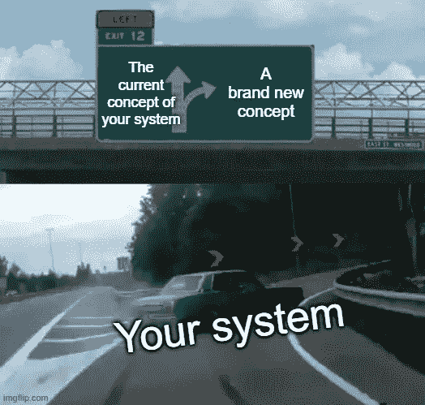

Meme by author (edited with [https://imgflip.com/memegenerator](https://imgflip.com/memegenerator))

概念漂移是我一直知道存在的一个话题，但我从未真正深入研究过。以下是我收集的资料，总结了菲拉斯·巴伊兰、贝斯通·s·艾哈迈德和安德烈亚斯·卡斯勒撰写的论文 ***从概念漂移到模型退化:性能感知漂移探测器综述***(2022 年 3 月)。这篇论文发表在*基于知识的系统*期刊上，其影响因子得分约为 8。

# 漂移检测简介

漂移检测或变化检测是指当目标对象的属性发生变化时，帮助确定和识别时刻或时间间隔的方法。我们可以列出两种主要的概念漂移适应策略:

*   概念漂移检测对数据流的变化做出反应。系统更新先验知识并调整学习模型以适当地对变化做出反应。它被称为*知情/主动适应*。
*   当接收到没有检测到任何特定漂移的新数据时，该模型不断更新。它被称为*盲/被动适应*。

F.巴伊兰、B.S .艾哈迈德和 a .卡斯勒将现有的关于概念漂移的研究分为不同的类别:基于数据分布的方法、基于绩效的方法、基于错误率的方法、混合方法和基于情境的方法。

基于数据分布的检测器测量来自两个不同时间窗口的数据之间的统计距离。如果两个样本相距很远，则检测到概念漂移。这种方法适用于有标签和无标签的数据集。

基于性能的检测器基于 PAC 学习模型(*概率近似正确*学习模型)。在平稳分布的情况下，错误率应该随着学习者看到更多的例子而降低。因此，如果误差停止减小，学习到的关系被认为是过时的，导致概念漂移。

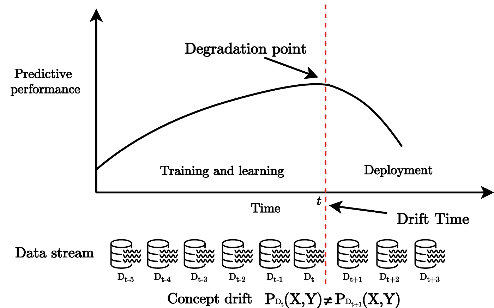

Performance-based approach mechanism from [https://www.sciencedirect.com/science/article/pii/S0950705122002854](https://www.sciencedirect.com/science/article/pii/S0950705122002854) (fig. 3.)

混合方法或多个基于假设的检测器应用多种检测方法，并并行或分层地聚合它们。

基于上下文的检测器从系统提供的上下文信息中推断出偏差。

以下是不同概念漂移检测方法的概述:

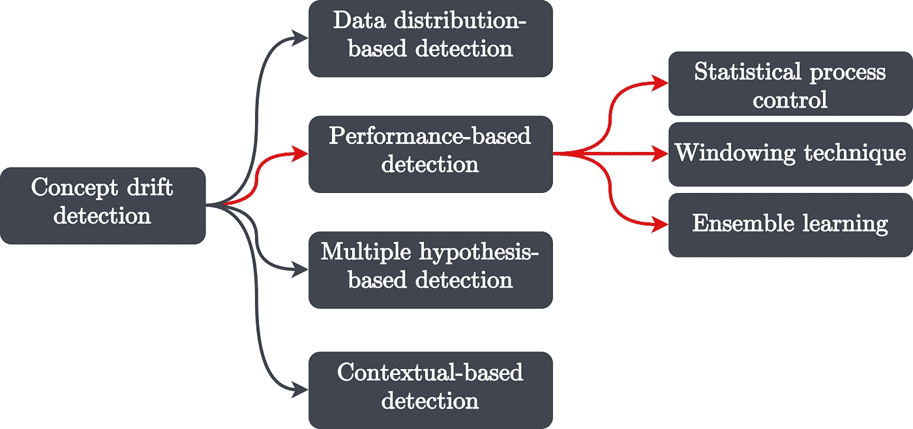

Concept drift detection methods overview from [https://www.sciencedirect.com/science/article/pii/S0950705122002854](https://www.sciencedirect.com/science/article/pii/S0950705122002854) (fig. 2.)

# 术语和定义

概念漂移正式定义为 *t* 和 *t+w* (两者都是时间戳)之间分布的变化。漂移发生在以下情况

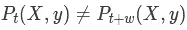

不幸的是，这个定义错误地将不需要解决的潜在暂时漂移归类为概念漂移。

通过我不掌握的奥秘和对 *w* 的新定义，如下:

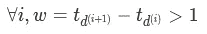

然后，我们可以将最初的定义改写为:

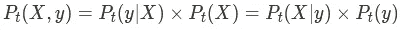

在哪里

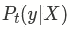

是目标标签的后验概率分布，

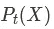

是输入数据的概率分布，

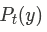

是目标标签的先验概率分布，

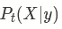

是类别条件概率密度分布

要更好地解释这一部分，请参见下面链接的论文的第 4.1 节。作者在第 4.2.1 节中更深入地研究了与这个主题相关的数学。有兴趣的话我直接让你看，因为我自己也不确定自己什么都懂。

他们建议根据概念漂移在系统中的演变方式对其进行分类:

*   突然漂移是指概念的变化突然发生；
*   渐进漂移是指概念的变化是渐进发生的；
*   循环漂移是指概念的变化是旧概念的重新出现；
*   增量漂移是指概念的变化缓慢而持续地发生；

Concept drift categorization from [https://www.sciencedirect.com/science/article/pii/S0950705122002854](https://www.sciencedirect.com/science/article/pii/S0950705122002854) (fig. 8.)

# 基于性能的概念漂移检测器

本文研究的基于性能的概念漂移检测方法分为三类:统计过程控制、窗口技术和集成学习。

**统计过程控制**

在这组方法中，当概念漂移超过显著性检验水平时，模型的性能退化允许检测概念漂移。

漂移检测方法(DDM)将误差视为具有二项分布的随机伯努利变量。它将错误分类的概率 *p* +在时间 *t* 的标准偏差 *s* 与它们的 *min* 值进行比较。如果

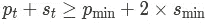

触发警告状态，并且如果

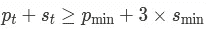

检测到漂移。

DDM 随后以几种不同的方式得到扩充。我们可以举早期 DDM (EDDM)或反应式 DDM (RDDM)为例，前者在检测逐渐漂移方面比 DDM 性能更好，后者与 DDM 精度相当，但在大多数情况下可以更早地检测到漂移。

本文涵盖了更多的方法。更多详情请参见第 9-11 页。否则，您可以在下表中找到所提供方法的摘要。

基于绩效的方法总结:

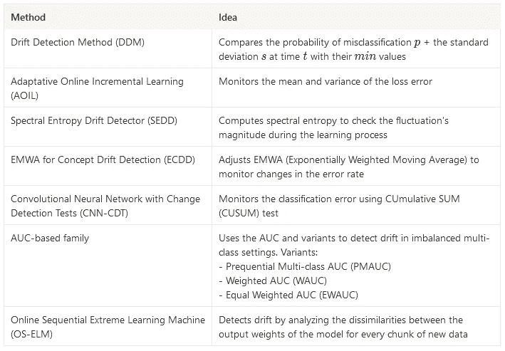

派生方法摘要:

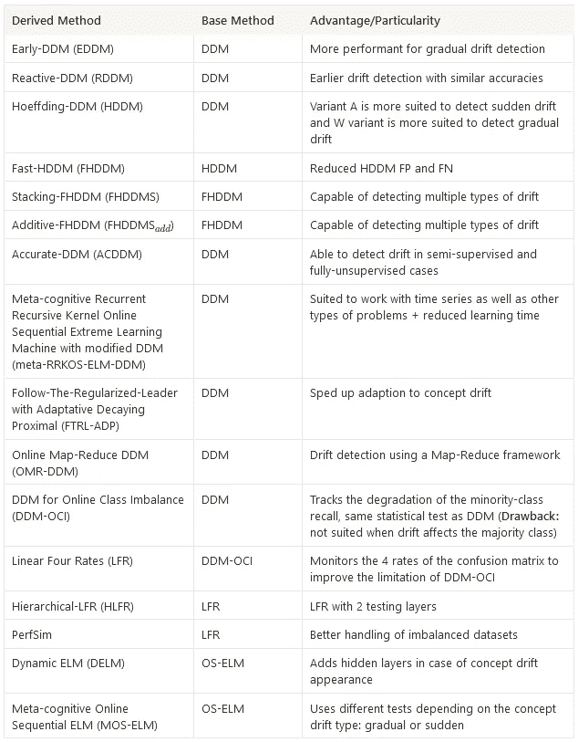

**开窗技术**

窗口技术根据数据的大小或时间间隔将数据流分成滑动窗口。他们监控系统中引入的最新窗口的性能，并将其与参考(旧窗口)进行比较。请参阅第 11–12 页了解更多详细信息，或参阅下表进行总结。

开窗技术总结:

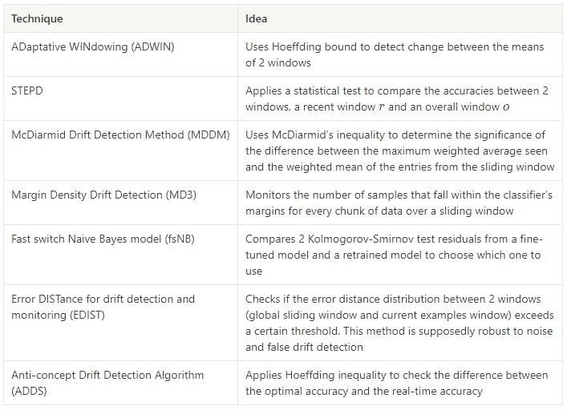

衍生技术总结:

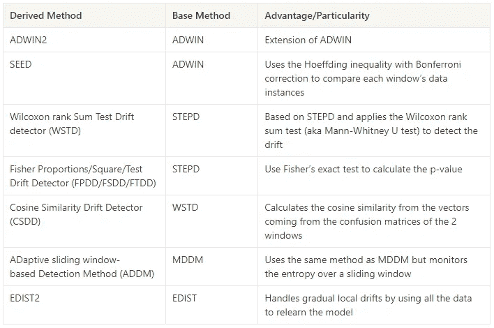

**集成学习**

集成学习是一套技术，它结合了几种被称为弱学习器的机器学习模型。当两者结合时，他们会成为强有力的学习者。通过不同的方法(简单的方法，如最大投票、平均，或更复杂的方法，如 Bagging 或 Boosting)结合每个学习者的预测来计算预测。

当学习者的表现下降显著时，基于集合的检测器发出概念漂移的信号。这些方法大多基于加权多数算法(WMA)，该算法根据每个学习者的表现给他们一个权重。流集成算法是最古老的方法之一。

基于系综的探测器概述:

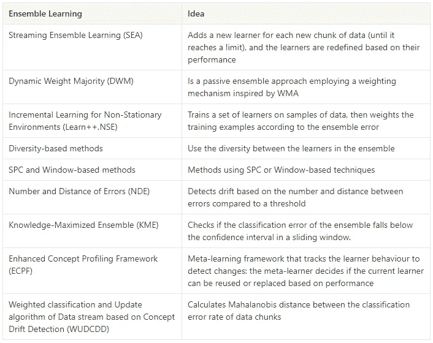

衍生的基于系综的探测器概述:

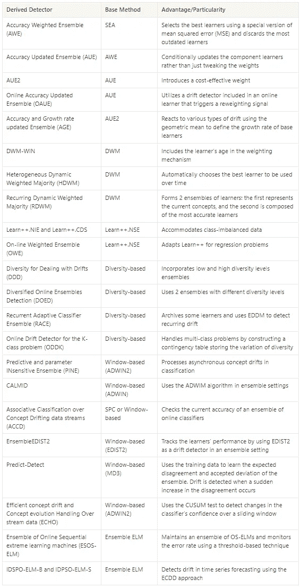

您可以在本文中找到每种方法的更多详细信息，以及与每种方法相对应的参考文献的链接。

# 分析和讨论

作者发现，大多数关于概念漂移的文献都集中在分类问题上，而不是回归问题上，这主要是因为缺乏可用的和相关的回归数据集。此外，相当多的研究是基于班级失衡问题，因为班级失衡问题和概念漂移是相互联系和相互依赖的。在半监督和无监督的情况下，基于性能的检测器是一个热门话题，因为没有提供基本事实标签。

提议的方法大部分集中在解决一个特定的问题，证实了找到解决任何问题的通用方法是困难的，甚至是不可能的。

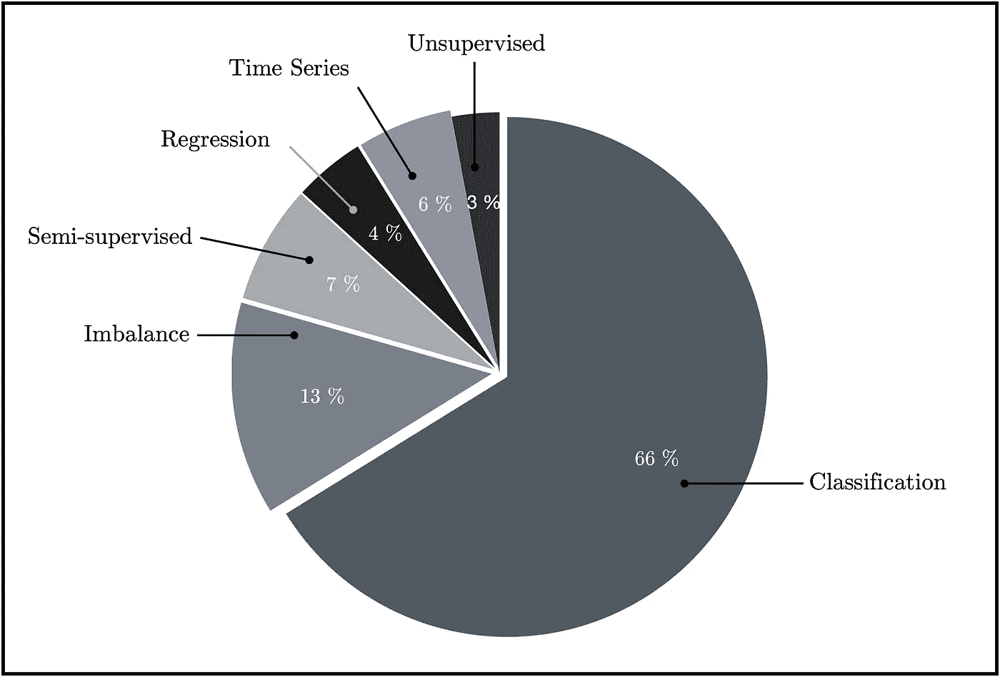

Machine learning problem scope of the methods from [https://www.sciencedirect.com/science/article/pii/S0950705122002854](https://www.sciencedirect.com/science/article/pii/S0950705122002854) (fig. 10.)

绝大多数被调查的方法使用准确性来检测预测性能的下降，这可能是由于这些方法中的大多数是关于分类问题的事实。精度并不总是性能损失的指标，漂移检测器会产生大量错误警报。因此，一些作者一直在使用其他指标，如混淆矩阵或 AUC。

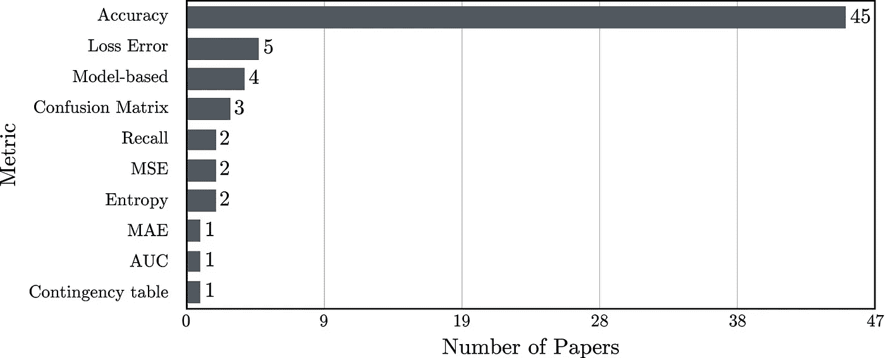

Performance metrics monitored in the methods from [https://www.sciencedirect.com/science/article/pii/S0950705122002854](https://www.sciencedirect.com/science/article/pii/S0950705122002854) (fig. 11.)

赫夫丁树(HT)和朴素贝叶斯(NB)是最受欢迎的基础学习器，因为它们能够支持增量学习和动态适应。此外，它们有能力处理巨大的数据流。

最近，神经网络已经在一些工作中被采用，尽管它们在动态适应上更复杂。神经网络也缺乏其他模型的透明性和可解释性。

在下图中，“模型不可知”论文指的是表明任何预测模型都支持检测方法集成的研究。

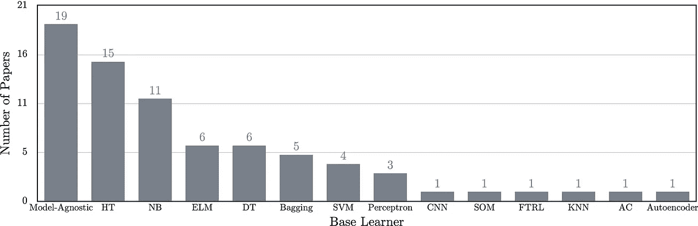

Base learners adopted in the methods from [https://www.sciencedirect.com/science/article/pii/S0950705122002854](https://www.sciencedirect.com/science/article/pii/S0950705122002854) (fig.12.)

突然的和逐渐的漂移是最常被讨论的。增量漂移更难解决，因为它并不总是很容易区分系统的连续变化和自然进化。最后，反复出现的漂移需要一个系统提供一个存储旧行为的缓冲器，一旦它再次出现，就可以重新使用，进行处理。

# 结论

本文的研究结果可总结如下:

*   在文献中发现多个术语来定义相同的概念漂移类型，反之亦然；
*   大多数工作都集中在分类问题上，很少有研究涉及其他类型的系统；
*   许多现有的基于性能的检测器使用误差率(或精度)来识别漂移。最近的工作倾向于使用其他指标；
*   通过引入诸如*伪误差*的度量，基于性能的检测器已经被用于无监督和半监督环境中；
*   大多数解决方案使用 Hoeffding 树或朴素贝叶斯作为基础学习器，尽管神经网络已经开始出现；
*   在具体案例中使用的方法上没有一致意见，普遍的解决办法还不存在；

从更个人的角度来总结，我会说概念漂移和一般的漂移是一个我本能地意识到的问题，但在发现这篇论文之前我没有研究这个问题。我相信这项研究是有趣的，因为它给出了大量的方法。尽管单独研究每一个(即使有论文链接)会花费很多时间，但它提供了一个很好的概述，是一个很好的切入点。

# 来源:

***从概念漂移到模型退化:关于性能感知漂移检测器*** 的综述，2022 年 3 月，由菲拉斯·巴伊兰、贝斯通·s·艾哈迈德和安德烈亚斯·卡斯勒撰写，并在 2022 年 6 月版的**基于知识的系统**中发表:[https://www . science direct . com/science/article/pii/s 0950705122002854](https://www.sciencedirect.com/science/article/pii/S0950705122002854)

 [## Mlearning.ai 提交建议

### 如何成为 Mlearning.ai 上的作家

medium.com](/mlearning-ai/mlearning-ai-submission-suggestions-b51e2b130bfb)