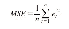
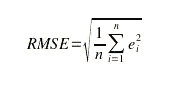
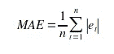
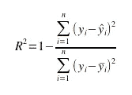
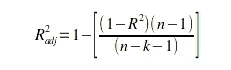

# 机器学习的概念|度量|假设性能

> 原文：<https://medium.com/mlearning-ai/concept-of-machine-learning-metric-assuming-performance-d00f15ef329c?source=collection_archive---------5----------------------->

> 如何计算回归模型的精确度？

这是初学者在做回归预测建模项目时经常遇到的问题。但事实是，准确性是分类的衡量标准，而不是回归。**我们无法计算回归模型的精确度**。回归模型的性能通过预测误差来衡量。

例如，如果您正在预测房子的价值，您不想知道模型是否预测了准确的价值。现在你怎么知道预测值和期望值有多接近。

有三种常用于评估回归模型性能的误差度量，它们是

1.  平均绝对误差
2.  均方误差
3.  均方根误差(RMSE)
4.  R 平方(R)和调整后的 R 平方

## 均方差(MSE):

目标值和回归模型预测值之间的平方差的平均值。

**Mean Squared Error (MSE)**

*   由于它采用预测值和期望值之差的平方，当 MSE 用作损失函数时，它会生成比实际值更大的值。
*   并且 MSE 的单位与预测的目标值的单位不同。

例如，如果您的目标变量的单位是“*美元*，那么 MSE 误差分数的单位将是“*美元的平方*

## 均方根误差(RMSE):

MSE 的平方根。

Root Mean Squared Error (RMSE)

*   计算误差的平方根，因此 RMSE 的单位与预测的目标值的原始单位相同。
*   但是当 RMSE 被用作损失函数时，它仍然产生比实际值更大的值。

在这种情况下，如果您的目标变量具有单位“*美元*”，那么 RMSE 误差分数也将具有单位“*美元*”。

## 平均绝对误差(MAE):

MAE 是预测值和观察值之间的绝对差值的平均值

**Mean Absolute Error (MSE)**

MAE 不会给出更多或更少的误差值，分数随着误差的增加而线性增加。但是问题是它在 et=0 的某些点上是不可微的。

## R 平方(R)和调整后的 R 平方:

R 平方&调整的 R 平方解释了你选择的自变量解释因变量的程度。

**R 的平方(R ) :**

**R Squared (R²)**

R 的值总是小于或等于 1。**R 值在 0.3 和 0.5 之间表示弱 R，0.5 和 0.7 表示中等 R，大于 0.7 表示强 R，小于 0 表示最差 R**

## 调整后的 R:

调整后的 R 还显示了项与曲线或直线的拟合程度，但会根据模型中的项数进行调整。

**Adjusted R²**

其中 n 是观察值的总数，k 是预测值的数量。调整后的 R 将始终小于或等于 R。

## **为什么要选择调整后的 R 而不是 R？**

如果增加更多有用的项，调整后的 R 将增加，如果增加较少有用的预测项，调整后的 R 将减少。然而，R 随着项数的增加而增加，即使模型实际上并没有改善。

## 全文系列:

 [## 机器学习的概念文章系列| Ujjwal Kar

### 回归入门|使用梯度下降的简单线性回归优化…

ujjwalkar.netlify.app](https://ujjwalkar.netlify.app/post/concept-of-machine-learning-tutorial-series/)