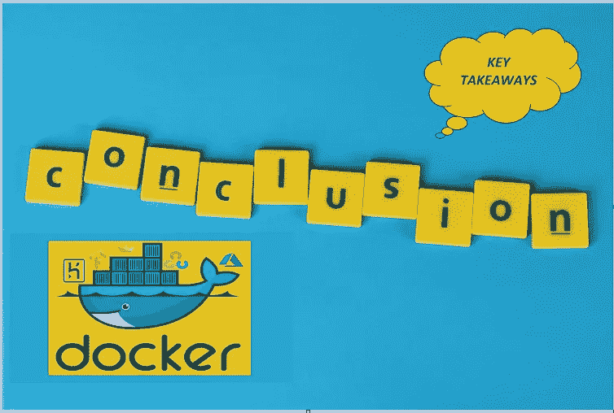

# 结论:在云平台上免费部署大型网络应用

> 原文：<https://medium.com/mlearning-ai/conclusion-deploying-large-web-apps-for-free-on-cloud-platforms-553d8654c7d2?source=collection_archive---------8----------------------->

## 数据科学/部署

## 5 从部署系列中扣分

作为我在 Heroku 上为我们的 ML/DL 模型免费部署容器的系列的结论，我现在将部署一个具有 6 个深度学习模型的 web 应用程序。将被容器化和部署的网络应用是检测博士。
后半部分，我会讨论一些与我的经历相关的外卖点。

> 检测 Github 链接:
> https://github.com/MSufiyanAG/dr_detect[博士](https://github.com/MSufiyanAG/dr_detect)

部署 web 应用程序的过程与上一篇文章中讨论的相同。Dockerfile 和 Requirements.txt 文件也没有区别。

> 链接往期文章:
> [https://medium . com/@ MSufiyanGhori/step-by-step-guide-to-build-and-deploy-container-for-your-dl-model-for-free-use-heroku-68fd 74 de 8 ff 4](/@MSufiyanGhori/step-by-step-guide-to-build-and-deploy-container-for-your-dl-model-for-free-using-heroku-68fd74de8ff4)

由于步骤是相同的，我不会再讨论它们。

Steps to deploy Web App on Heroku using Docker

# 我作为学习者的个人经历

在这个系列中，我为我们的 ML/DL 模型部署了容器。
我在 12 天内完成了这些文章的模型部署。但这是我和 Docker 和 Heroku 相处愉快后的场景。

我开始使用 Docker 已经 7-8 个月了。我花了 18-20 天部署了我的第一个 ML Web 应用程序。最初，我部署了一些 ML 模型，然后转向 DL 模型。

我使用 Docker 的原因:-

1.  使网络应用基础设施独立
2.  作为学生，在免费层部署大型 web 应用程序

我遇到的问题通常与不同 python 库中的弃用及其对相关库或项目代码的影响有关。

示例:不赞成在 Streamlit 中支持 CSS 文件。

我们无法运行为在 Heroku 上本地部署而构建的 docker 映像，因为我们无法运行 setup.sh，所以在部署之前测试 docker 映像就成了一个问题。
它的解决方案是在没有. sh 文件的情况下构建和运行映像，一旦运行良好，就通过包含. sh 文件来构建和部署它。

使用的代码可以在我的 Github 个人资料中找到。

# 拿走

1.  良好的谷歌搜索技能将帮助你摆脱任何情况。
2.  官方文档必须是获得详细信息的第一个地方。
3.  一致性对任何领域的成功都至关重要；很少的失败不能成为你停止尝试的理由(我在第一次成功部署之前就花了(浪费了)100+GB 的互联网数据)。
4.  如果你专注于完美，那么你就陷入了一个要么全有要么全无的陷阱(我也犯过这个错误)。
5.  对于每个新的基于 Python 的项目，有一个新的虚拟环境通常是好的。

# 前方道路

一旦我们获得了在 Heroku 上部署容器的实践经验，我们就可以转向其他云平台，比如 Azure。Azure 向学生提供 100 美元的学分。

> **如何使用 Azure 免费部署你的 web app？**

这可以成为我下一篇文章的标题。

**敬请期待**

**快乐学习**

> 可以在 LinkedIn 联系我:
> [https://www.linkedin.com/in/sufiyan-abdullah-ghori/](https://www.linkedin.com/in/sufiyan-abdullah-ghori/)

 [## Mlearning.ai 提交建议

### 如何成为 Mlearning.ai 上的作家

medium.com](/mlearning-ai/mlearning-ai-submission-suggestions-b51e2b130bfb)