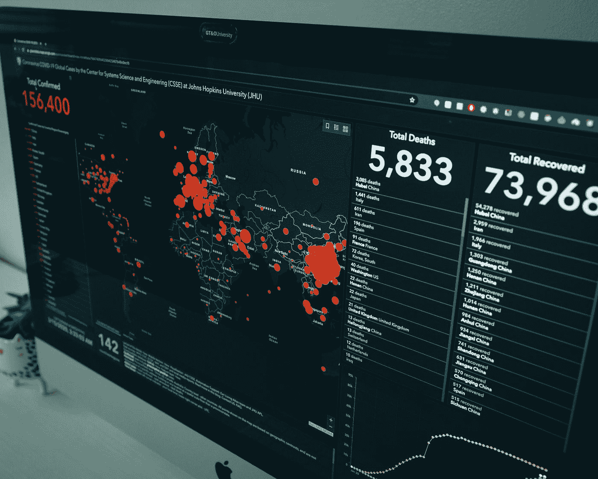

# 置信区间是数据科学的一部分

> 原文：<https://medium.com/mlearning-ai/confidence-intervals-are-a-part-of-data-science-a54f45f6d8c6?source=collection_archive---------3----------------------->

## 关于置信区间重要性的博客

Photo by [Clay Banks](https://unsplash.com/@claybanks?utm_source=medium&utm_medium=referral) on [Unsplash](https://unsplash.com?utm_source=medium&utm_medium=referral)

# 什么是置信区间？

置信区间是数据科学的一部分，基本上，它们向我们展示了事件发生的概率。置信区间通常用在统计学中，给出一个我们确信参数所在的值的范围。置信区间是数据科学的一部分。置信区间有助于我们理解特定数据集的行为。置信区间是参数预期落入的值的范围。例如，IQR 是数据科学中常用的一种置信区间。

置信区间或 CI 是数据科学的重要组成部分。置信区间用于确定一个区间，在该区间内我们确信真实总体参数落在该区间内。置信区间用于估计未知总体参数，通常使用样本均值和样本标准差来计算。

# 数据科学中如何使用置信区间？

置信区间用于表示统计数据的不确定性。置信区间给出了您确信总体参数的真实值所在的值的范围。置信区间通常基于样本统计，但也可以为总体参数构建置信区间。置信区间是我们确信包含真实总体参数的值的范围。置信水平是指区间的置信水平。如果构建了 95%的置信区间，那么我们确信总体参数落在 95%水平的区间内。

许多人认为，当数据科学家说一些事情时，他们对自己的发现有 100%的把握。通常，这是真的。然而，这种确定性并不是因为数据科学家对他们的数据的信任，而是因为分析数据的方式。数据科学家使用一种叫做置信区间的东西来选择哪些发现更有可能是准确的。置信区间是统计值可能介于其间的值的范围。置信区间由统计值高于和低于平均值的标准误差数表示。标准误差是统计数据的标准偏差，除以样本大小的平方根。这是一个很长的说法，标准误差是你的统计标准偏差。置信区间因与哪个数据科学家交谈而异，但一般来说，95%的置信区间意味着您 95%确定统计数据在该范围内。

人们经常问:我如何知道测试是否有意义？我如何知道结果是否重要？我如何知道结果是否有统计学意义？使用置信区间和假设检验来回答这些问题。人们认为置信区间只有在假设检验和统计显著性检验的情况下才是重要的。但事实是，置信区间在描述性统计和预测性分析中也是相关的。置信区间通常是解释数据分析结果的最佳方式。它们可以帮助你理解分析结果的不确定性。

# 置信区间是什么意思，它们告诉我们什么？

换句话说，如果我们取了几百个样本，我们有理由相信真实值会落在给定的置信区间内。有两种类型的置信区间:单尾和双尾。当研究者对结果的方向有预测时，通常使用单尾置信区间。换句话说，如果研究人员认为该值更高或更低，则使用单尾置信区间。当研究者没有关于结果的方向性预测时，使用双尾置信区间。计算置信区间的公式如下。该公式是针对单尾置信区间给出的，但同样的公式也可用于双尾置信区间。

它们用于提供可能包含感兴趣的总体参数的一系列值。置信区间基于样本统计数据(平均值、标准偏差等)。)并且它们通常用于对从中抽取样本的总体进行推断。置信区间广泛应用于许多科学领域，在决策和数据分析中非常有用。置信区间是统计数据分析的一个非常重要的部分。置信区间用于确定样本均值或比例是否与总体的真实均值或比例有显著差异。置信区间也用于确定两个样本是否来自同一人群。置信区间也用于确定样本均值或比例是否与假设值的均值或比例显著不同。

# 如何计算和解释置信区间？

置信区间是统计分析的重要组成部分。它们用于估计总体参数可能下降的范围。当总体呈正态分布时，置信区间是总体均值的区间估计，使用样本均值和样本的标准差来计算。假设您是一名数据科学家，在一家大公司工作，该公司生产一种流行产品。公司决定重新设计产品，对产品做一些改动，但是新设计有很多不确定性。其中一个决定是关于产品的尺寸，公司希望确保新尺寸比旧尺寸更好。你必须进行实验来找出答案。但是首先，您需要计算新产品和旧产品尺寸差异的置信区间。

置信区间是数据科学的一部分，数据科学是将统计学应用于实践并应用工具解决商业问题的领域。置信区间是最近被数据科学的各个领域采用的统计方法和技术的一部分。设置置信区间是为了定义一个范围，在该范围内，某个统计参数(如总体平均值)预计会落在指定的置信水平上。一个常见的误解是置信区间与误差幅度相同。事实上，这两个术语指的是不同的概念。置信区间是可能包含真实总体参数(如平均值)的一系列值。假设有一定的置信度，误差范围是可能包含总体参数的值的范围。置信区间也可用于确定统计参数落在某一范围内的时间百分比，如两个总体均值之间的差异，或总体均值与治疗效果之间的差异。

# 置信区间用在商业的什么地方？

置信区间是数据科学的一部分。统计学家使用置信区间来帮助我们解释研究结果。他们让我们知道研究中有多少误差。置信区间是数据科学的一部分。在进行实验时，使用置信区间来解释从实验中得到的数据是很有帮助的。置信区间是一种解释工具。在实验中，结果被用来预测如果你一次又一次地重复同样的实验会发生什么。置信区间有助于解释研究结果。置信区间是实验预期在重复试验中产生的数值范围。例如，在一项关于新药有效性的研究中，90%的置信区间可能是从 0.05 到 0.20。这意味着，在重复试验中，制药公司预计该药物在 90%的时间内将有 5%至 20%的有效性。

Photo by [Alexas_Fotos](https://unsplash.com/@alexas_fotos?utm_source=medium&utm_medium=referral) on [Unsplash](https://unsplash.com?utm_source=medium&utm_medium=referral)

> **结论**

置信区间是数据科学的重要组成部分。潜在的主题是无止境的，你可以写理论方面，不同类型的置信区间，在现实生活中的应用，等等。向读者提供所有需要的细节，让他们容易理解。

 [## Mlearning.ai 提交建议

### 如何成为 Mlearning.ai 上的作家

medium.com](/mlearning-ai/mlearning-ai-submission-suggestions-b51e2b130bfb)