# 置信区间与预测区间

> 原文：<https://medium.com/mlearning-ai/confidence-vs-prediction-intervals-576d3047f4c?source=collection_archive---------4----------------------->

## 选择如何影响结果:疫苗接种后的死产案例

不久前,《自然通讯》发表了一篇由 Prasad 等人进行的系统性综述和荟萃分析，涉及新冠肺炎疫苗接种和几个重要结果。其中之一是死产。简而言之，综述显示疫苗接种保护孕妇免于死产。他们为自己辩护说，这种关系不是因果关系，但我们都知道，一旦提供了显著的 p 值(或等价的[置信限](/mlearning-ai/inference-estimates-p-values-and-confidence-limits-a-frequentist-approach-acdd45d94bd5))，进一步的问题就停止了。他们用来展示结果的确切森林地块如下:

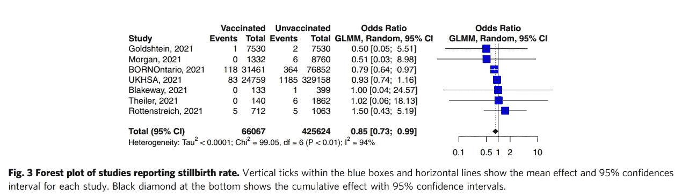

The forest plot clearly shows a beneficial odds ratio of 0.85\. Although the confidence limits are narrow, they do tough the 0.99 boundary. This should get any clinician looking at these results wary, since it means that a different choice in statistics will most likely abolish these findings.

在我看来，系统综述不能支持疫苗接种降低死胎风险的说法。虽然这篇论文的搜索标准和方法学考虑看起来很合理，但我很难使用相同的软件、相同的统计包和与从出版物中扣除的相同的选择来复制结果。为此，我向论文的最后一位作者 Asma Khalil 博士提交了我的关注点和代码，他非常友好地回复并向我展示了所使用的确切代码(*代码可以在最后*找到)。这些数据已经可以通过网站获得，这很好。你不经常得到原始数据。最后，复制过程非常简单。

在运行代码和应用作者交流的六种方法后，我获得了六倍的合并优势比(OR ),置信区间小于 1。使用的方法有:固定学习效应的广义线性混合模型(GLMM)(OR:0.85[0.71；0.99])，带条件二项-正态的 GLMM(OR:0.85[0.73；0.99]，具有条件超几何正常的 GLMM(OR:0.85[0.73；0.99])，一个曼特尔-海恩斯泽尔(OR:0.86[0.74；0.99])，一个逆(OR:0.86[0.74；0.99])，和一个 Peto 模型(OR:0.86[0.74；0.99]).除了第一个 GLMM，所有模型都提供随机效应估计。论文中报道的模型是 GLMM，其 OR 估计值为 0.85[0.73；0.99].

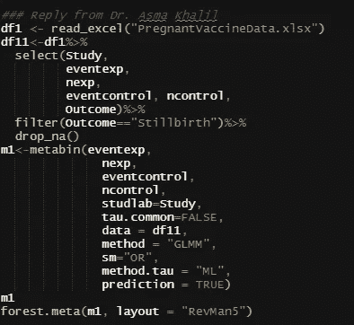

The first of six codes sent by the last author.

Results of the meta-analysis.

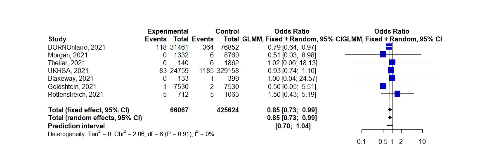

Forest plot of the model.

现在，应该立即变得清楚的是，尽管置信水平在界限内(或<1), the prediction interval is not. That is not surprising, since predictions have additional variance components that are not included in the confidence interval. The confidence interval tells you something about the uncertainty regarding the estimate of the coefficients of interest. The prediction interval, however, shows you how certain you can be about any new case coming up. Hence, the results show that it is really not that clear if a new pregnant women will have any benefit from being vaccinated with regards to stillbirth. This alone should make you very humble about the results.

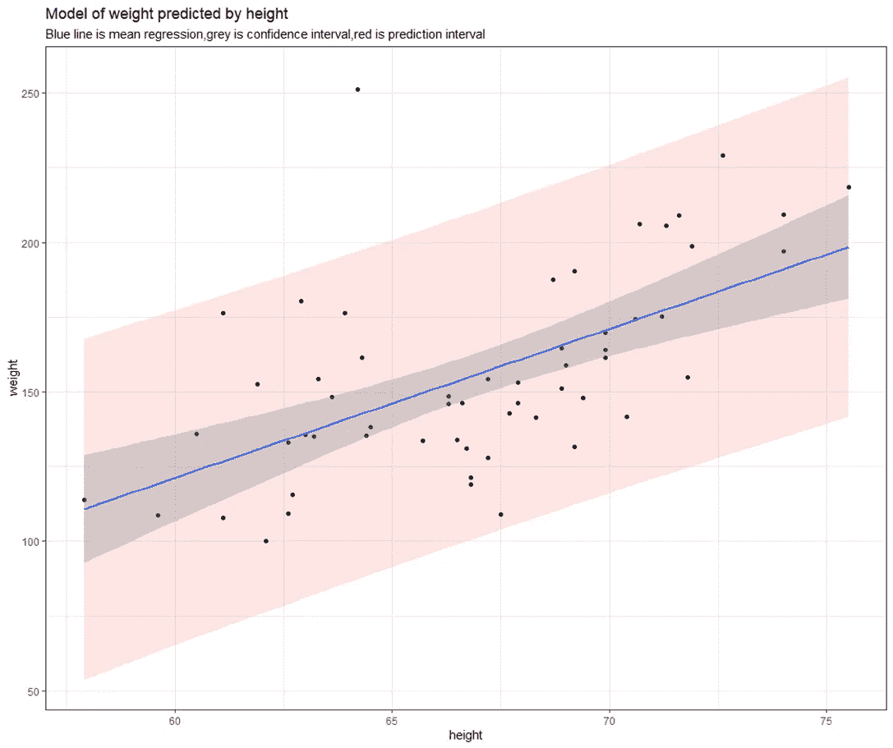

An example using a simulated dataset showing the relationship between height and weight. The points are the observed data, the blue line if the mean regression line and the grey shaded error is the **confidence interval** regarding the coefficient of height on weight. The red line, however, is the **prediction interval**. Although you may be pretty confident on your coefficient, your predictions have the added burden of other variance components (here the residual).

Now, when you reach results that are so near the boundary of significance, it is important to start looking for more because any choice made could influence the results and you have no idea what choices the authors made. Even after receiving the codes, I have no idea why they chose one of the six models.

In the beginning, I obtained completely different results, because I used a different model. The analysis method I used was a Logistic Regression model with fixed study effects and the Hartung-Knapp (HK) adjustment which yielded an OR of 0.85 [0.70; 1.03].

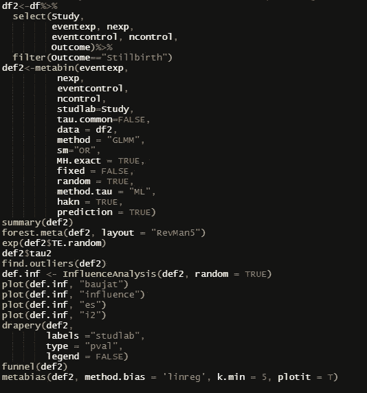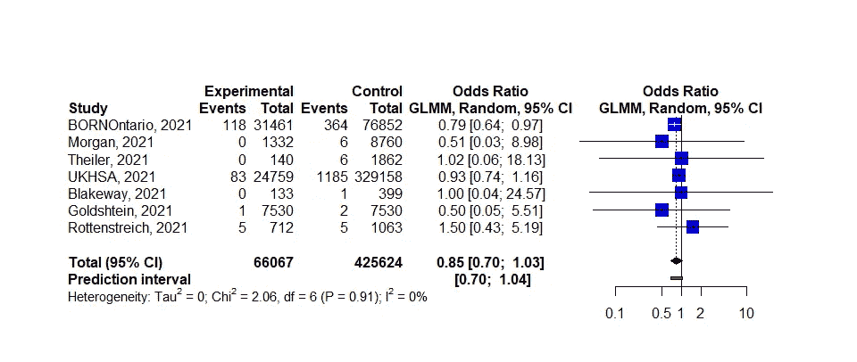

My model before correspondence.

The [), HK 调整](https://doi.org/10.1186/1471-2288-14-25)是荟萃分析中一种众所周知的调整方法，并已在强调优势比分析良好实践的[论文中采用](http://10.1097/MLR.0000000000000696)，尽管它也不是没有自己的[缺点](https://doi.org/10.1002/14651858.CD201901)。尽管如此，考虑到疫苗保护死产的说法处于可接受的确定性的边缘，我从一开始就包括了修正。

将其应用于作者使用的所有方法表明，只有 Mantel-Haenszel(OR:0.86[0.77；0.96])，反(或:0.86[0.77；0.96])，以及 Peto 模型(OR:0.86[0.75；0.98])保留了不包括 1 的 95%置信区间。因此，HK 调整会抵消研究中报告的 GLMM 模型的统计显著性(OR:0.85[0.70；1.03])(图 1)。

即使我同意作者的观点，即 HK 调整是不必要的，因为它在异质性高且研究样本量相似的情况下表现最佳，但我不能忽视所用的六个模型中的每一个都有超过 1 的预测区间。有或没有港币调整。这意味着预测一个新队列中死胎接种疫苗的有效性将超过优势比的阈值。因此，这些发现太不确定，无法传达给未来的患者。

然后，还有研究设计的问题。队列研究和病例对照研究都有自己的局限性(甚至每个研究都可能不同)，在循证金字塔的阶梯上，它们位于不同的梯级。当我应用具有固定效应的逻辑回归模型，并使用研究设计应用亚组分析时，疫苗接种对死产的积极效应在每个设计中完全消失。

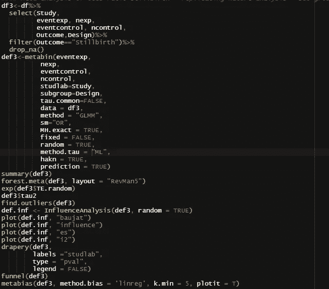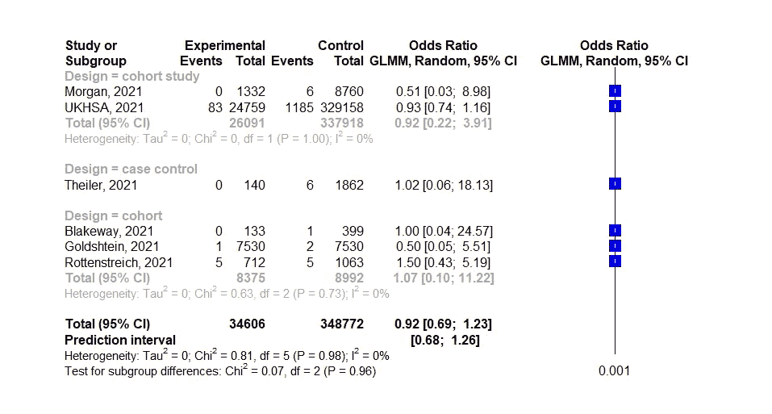

Logistic regression model I used before correspondence: subgroup-analysis by Study Design.

我们将这些发现通知了作者，收到的回复是研究设计分层分析不完全准确，部分原因是数据集中的标签不一致。此外，蒂勒等人的研究自我标榜为病例对照研究，但根据综述作者的说法，并没有遵循这一标签。虽然我承认有时很难从出版物中提取所有相关信息，并且不同意所包含论文的作者，但我确实希望综述中的信息可用于亚组分析。研究设计是一种可行的亚组分析形式。然而，我想使用作者的 GLMM 模型重做我的最初分析，看看我最初的非统计发现是否仍然存在(OR:0.92[0.69；1.23]).原来这样的模型是无法拟合的。这很可能是由于样本量太小，无法估计随机成分(2x 队列、2x 队列研究和 1x 病例对照研究)。

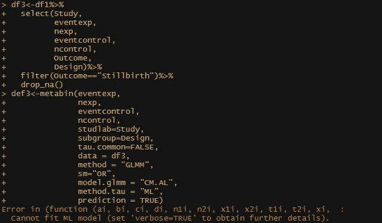

Could not perform sub-group analysis using the model of the authors.

最后，作者声称，首先是英国、以色列和加拿大的国家级数据使得疫苗接种和死产之间的联系具有统计学意义。为了验证这些发现，我应用了作者的 GLMM 模型，有或没有 HK 调整，以及预测区间。事实上，如果没有 HK 校正，这三项研究将得出 0.85[0.73；0.99]而不是 0.85[0.61；1.19].然而，这两项研究得出的预测区间为[0.32；2.29]这对于通信目的是完全不可接受的。

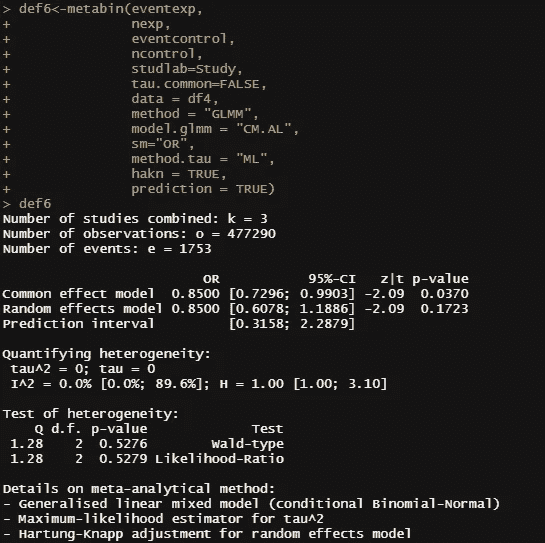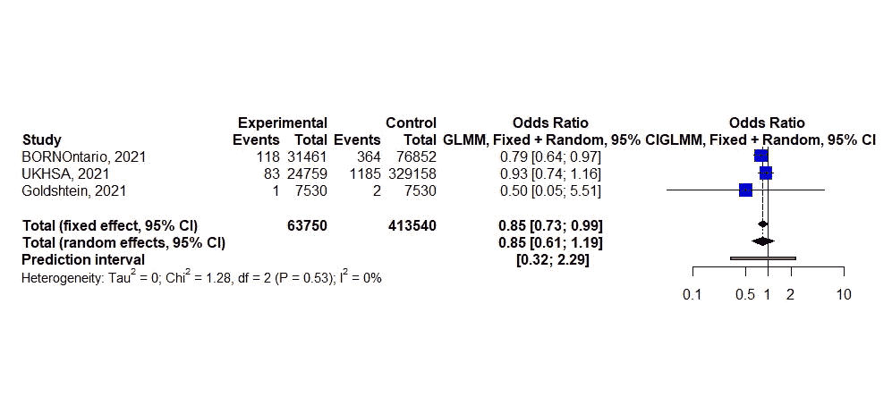

总之，根据作者使用的分析方法，疫苗保护死胎的说法处于可接受的确定性的边缘，但当应用调整时就消失了。此外，使用作者的方法进行亚组分析是不可行的，并且使用的所有可能模型的预测区间总是超过 1。这意味着所做的选择会影响信心，但不会影响预测区间，而且新的研究是否会加强目前不稳定的证据基础还有待观察。

当边界发现容易受到所做选择的影响，并且无法通知下一个患者时，最好是故意降低这些发现的等级，以禁止对疫苗接种的保护作用做出任何重大声明。事实上，它给出了虚假的希望，这不是循证医学应该做的。

 [## Mlearning.ai 提交建议

### 如何成为 Mlearning.ai 上的作家

medium.com](/mlearning-ai/mlearning-ai-submission-suggestions-b51e2b130bfb)