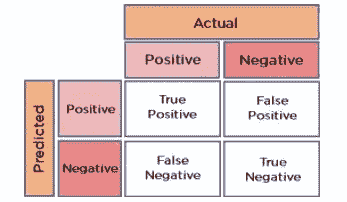
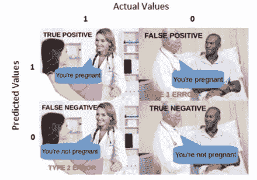
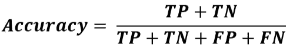
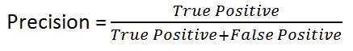
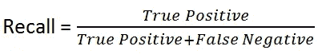
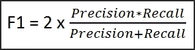
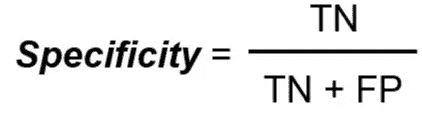
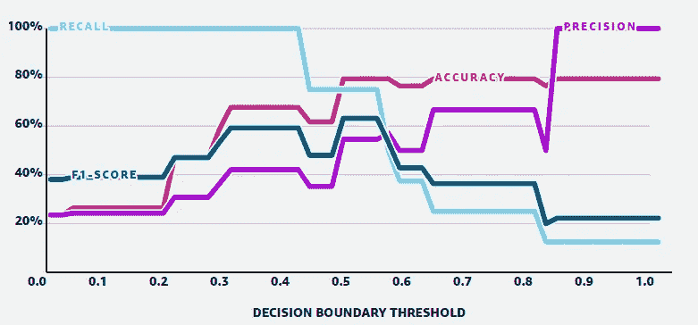

# 混淆矩阵及其度量解释！！

> 原文：<https://medium.com/mlearning-ai/confusion-matrix-and-their-metrics-explained-97a9b408e7e0?source=collection_archive---------6----------------------->

> 一个详细的指南，举例说明混淆矩阵和度量标准，以及它们之间的权衡。

Photo by [Afif Kusuma](https://unsplash.com/@javaistan?utm_source=medium&utm_medium=referral) on [Unsplash](https://unsplash.com?utm_source=medium&utm_medium=referral)

## 机器学习中的分类:

如果我们提供输入，预测一个离散的类别在机器学习中被称为“分类”。

## 示例:

1.  预测一个城市今天会不会下雨的天气(两类，所以二进制分类)。
2.  根据食物、衣服、语言等预测人们的文化。变成了美洲、非洲、亚洲等等。(两类以上，故多类分类)。

## 准确性问题:

在建模期间评估度量分类器起着重要的作用，因为准确性并不总是好的度量。例如，目标要素包含 90%的第一类值和 10%的第二类值的数据集将产生 90%的准确性，即使每次我们经过新的查询点时它只预测第一类值。

## 替代指标:

因此，有其他指标来避免某些情况是很重要的。因此*混淆矩阵*——一个帮助我们评估分类模型性能的简单指标。由此，我们将衍生出另外三个常用的评估指标:*精度、*召回率和*F1-得分*。

## 举例说明

考虑一个数据集的例子，该数据集包含关于一个人的身高、体重、血压、胆固醇百分比等的一些特征。我们需要区分这个人是不是心脏病患者。这是一个有没有心脏病的二元分类问题。

如果我们使用机器学习模型进行训练和预测，那么

通过下面的模型，我们有 4 种预测的可能性:

1.  此人有心脏病，模型预测此人有心脏病— ***真阳性*** *(你预测了一个正值，而且是正确的)。*
2.  此人有心脏病，模型预测此人没有心脏病— ***假阴性*** *(你预测了一个负值，实际上是正的)。*
3.  这个人没有心脏病，模型预测这个人有心脏病— ***假阳性*** *(你预测了一个负值，实际上是正的)。*
4.  此人没有心脏病，模型预测此人没有心脏病— ***真阴性*** *(你预测了一个负值，实际上是负值)*。

这四种不同的预测结果之间的区别往往是相应的，所以对它们有一个坚实的理解是非常重要的！

## **问题:**

所以我们对第二点和第三点有问题，因为

> 第二个影响是心脏病或死亡的风险，这是一个必须解决的严重问题
> 
> 第三个影响是在测试上浪费金钱的风险，虽然没有那么严重，但必须加以监控。

所以我们需要优化以减少这些错误的预测。在这里，准确性不是一个好的衡量标准，因为它忽略了错误预测的影响。

## 解决方案是:

所以为了量化和改进上面的例子，我们使用混淆矩阵。混淆矩阵将预测分解为几个感兴趣的类别和度量，如精度和召回，用于通过根据要求调整模型来获得最佳值。

# **混淆矩阵:**

混淆矩阵表示分类问题的预测和实际结果的不同结果，并有助于快速可视化其结果。

**2X2 Confusion Matrix**

[**Funny intuition source- Twitter**](https://twitter.com/naif5110_/status/1530928759926398977?s=20&t=BYJjvDVqexhGA5rm2p3DVQ)

*   **准确性**:准确性度量帮助我们找到正确分类值的部分。它告诉我们分类器正确的频率。它是所有真值的总和除以总值。

*   **精度**:精度指标告诉我们，或者说*精确*，我们的模型的正面预测有多准确。它是真阳性除以预测阳性值的总数。

> 当**假阳性**比**假阴性**更重要时，精确度是一个重要的指标(例如信用卡欺诈检测)。

*   **召回**:召回指标告诉我们能够正确预测的实际阳性实例的数量。它是真阳性除以实际阳性值的总数。

> 当我们认为**假阴性**比**假阳性**更重要时，回忆是重要的(例如，我们上面的心脏病问题)。

## 组合指标:

在精确度和召回率之间有一个折衷，因此有一个同时考虑精确度和召回率的单一性能度量将是非常方便的。

*   **F1 值:**F1 值(有时也称为 *F 值*)是*召回*和*精度*的调和平均值。当你需要把两者都考虑进去时，这是很有用的。

> 当在具有不同精度和召回率的不同模型之间进行选择时， **F1-Score** 有助于比较多个分类器的性能，并对它们进行排序，以确定最佳结果。

所以，如果真的否定很重要，考虑一个不同的度量标准，比如特异性。

**特异性**:特异性指标告诉我们能够正确预测多少实际的阴性实例。它是真负值除以实际负值的总数。

> 当我们认为**真阴性**比**假阴性**更重要时*特异性*就很重要(例如，在兴奋剂检测中，我们不希望任何一名未服用兴奋剂的运动员被错误归类并被禁赛)。

## **F1 分数的问题:**

也就是说，F1 分数并不完美，也不适合所有的分类问题。

1.  它在计算中完全忽略了真正的负数，所以它对不平衡的类有误导性。
2.  F1 分数同等重视精确度和召回率。这有时是有问题的，因为不同类型的错误分类会导致不同的成本，并且与模型的性能密切相关。

## **权衡:**

实际上，在精确度和召回率之间经常有一个折衷。

为了用图表清楚地理解它，让我们再次以心脏病数据集为例，这一次是从我们已经讨论过的四个不同评估指标之间的权衡的角度:准确性、精确度、回忆和 f1 分数。

mlu-explain.github.io/precisin-recall

## 从以上情节中可以推断出:

1.  在某个点之后，准确性停滞不前，这不是一个好的度量，因为召回分数随着决策边界(基于边界对点进行分类)的增加而降低。
2.  查准率和查全率是负相关的，所以根据应用和需求，我们需要用它们来对模型进行排序。

感谢阅读！

关注我了解更多关于 DS 和 ML 的内容。

 [## Mlearning.ai 提交建议

### 如何成为 Mlearning.ai 上的作家

medium.com](/mlearning-ai/mlearning-ai-submission-suggestions-b51e2b130bfb)