# 困惑矩阵:让我们用例子来学习

> 原文：<https://medium.com/mlearning-ai/confusion-matrix-lets-learn-with-example-1e2de1ccdb1c?source=collection_archive---------13----------------------->

关于混乱矩阵的一切


根据定义，混淆矩阵是总结分类算法性能的表格。我们用一个例子来试着理解这种说法。

让我们以我们最喜欢的游戏 C *里基*为例。有一个板球委员会(ABC)组成球队，组织和安排锦标赛的比赛。这次董事会成员做出了一个疯狂的决定。他们宣布**查克——一个随机的家伙**将成为这场比赛的新裁判。然后他们补充说，查克作为裁判只有一项工作要做——*决定击球手是“出局”还是“不出局”(*简而言之，他必须在两个等级之间进行分类——“不出局”还是“出局”)。

包括查克在内的所有队员都很惊讶。恰克对这个游戏一无所知。每个人都开始担心，然后开始质疑董事会的决定。然后委员会解释说，查克必须接受训练，他应该观看以前的比赛，并自己学习击球手被宣布“出局”或“不出局”的模式。查克现在有了一点希望，并同意观看所有比赛。他敏锐地观察所有的模式，并试图理解何时决定一名球员是“**出局**还是“**未出局**”。在学习了这种模式之后，他觉得自己已经为这份工作做好了准备。

锦标赛开始了，Chuck 根据他观察和学习到的模式做出决定。

现在，董事会成员想看看 Chuck 如何运用他在培训中学到的知识。他们将查克的决定与一个有经验的裁判会做出的决定进行比较。他们得出了下表中的数据。表中，**未出**为正场景，用 **1** 表示，**出**为负场景，用 **0 表示。**

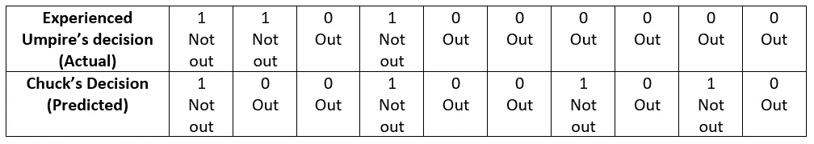

Experienced Umpire Vs Chuck’s decision

Chuck 做出的 10 个决策中，有 3 个是错误的，用红色突出显示。虽然第一次还不错！！！

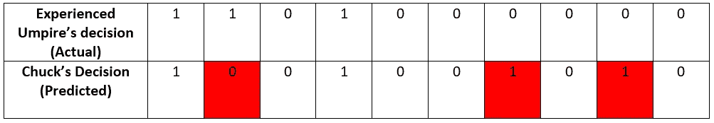

Wrong Decisions By Chuck (Highlighted in Red)

让我们检查他的表现，并通过计算“实际和预测”值来分析其含义。

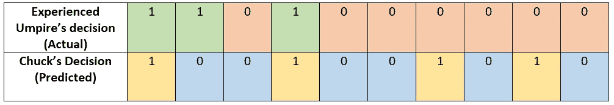

Experienced Umpire and Chuck’s decisions highlighted with different colors

> *实际“不出”——数绿色细胞数——3。*
> 
> *实际“出”——计算橙色细胞的数量——7*
> 
> *查克预测的“未出局”——数黄色细胞的数量——4*
> 
> *查克预测的“出局”——计算蓝色细胞的数量——6*

现在我们可以开始用矩阵形式替换数字。


The initial version of Confusion Matrix

让我们看看查克正确预测了多少“出局”和“不出局”。我们知道他做了三个错误的决定。这意味着他做了 7 个正确的决定。

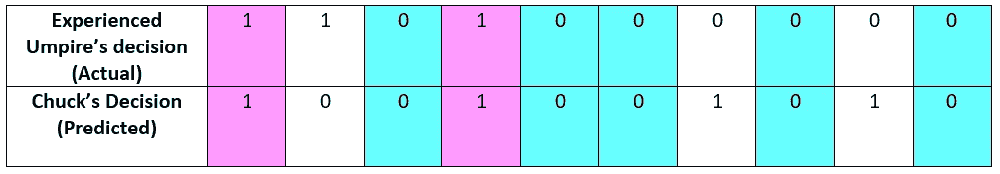

Correct Decisions by Chuck

> *正确预测“未出局”——数粉色细胞数——2。*
> 
> *正确预测“Out”——计算水绿色细胞的数量——5。*

代入我们的矩阵后，我们得到:


The Confusion Matrix with all correctly predicted “Outs” and “Not-Outs”

现在我们已经准备好理解什么是**真正的积极和真正的消极。**

**真阳性(TP)** :正确预测的正值——在我们的例子中，Chuck 正确判定为“不出”(粉色单元格)的数量

**真负值(TN)** :正确预测的负值——在我们的例子中，Chuck 的正确决策数为“Out”(浅绿色单元格)

让我们带着错误的预测前进。


Wrong Decisions By Chuck

> *将“出”误预测为“未出”——数红细胞数——2。*
> 
> *误将“不出”预测为“出”——数蓝色细胞数——1。*

这就完成了我们的矩阵:

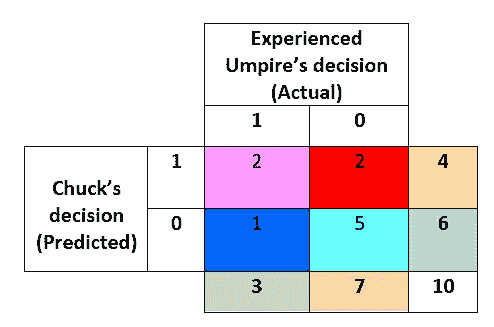

The complete confusion matrix of Chuck’s decision

这里我们将试着理解**假阳性和假阴性**

**假阳性(FP)** :错误地预测为正值——在我们的例子中，是查克做出的错误决定的数量，其中球员实际上“出局”，但查克决定他“不出局”(红色单元格)。

**假阴性(FN)** :被错误地预测为负值——在我们的例子中，在我们的例子中，查克做出的错误决定的数量，其中球员实际上“没有出局”，但查克决定他“出局”(蓝色单元格)。

很明显，当我们做错事时，我们称之为错误:

**1 类错误**:误报被称为 1 类错误

第二类错误:假阴性被称为第二类错误

下图左侧显示了表示**卡盘决策**的混淆矩阵，右侧显示了**通用混淆矩阵表示**:

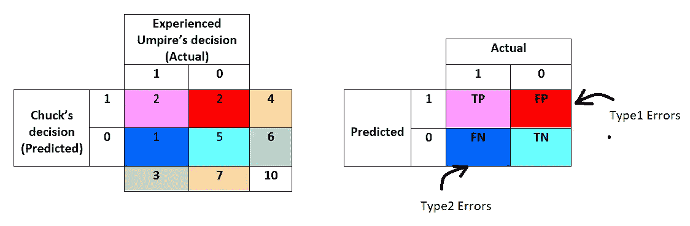

The Generic Confusion Matrix

现在我们有了困惑矩阵，我们可以通过回答以下问题来计算 Chuck 的绩效得分。

查克在判定一名球员“不出界”或“出界”时有多准确？

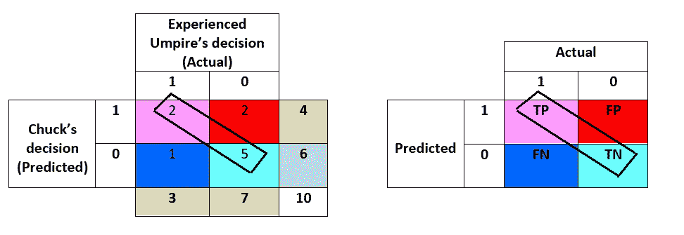

Accuracy

他 10 次中有 7 次是准确的。于是他的 ***准确率*** *得分是 7/10= 0.7 或 70%*

**准确度= (TP+TN) /总计**

查克在判定一名球员“未出局”或“出局”时有多不准确？

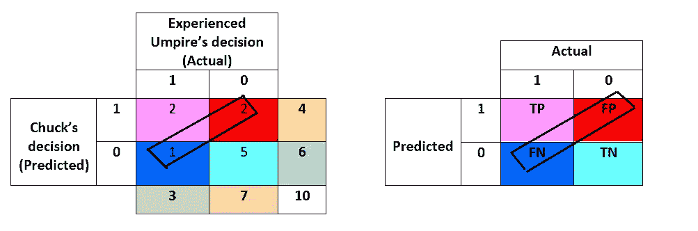

Misclassification

他十次中有三次是不准确的。于是他的 ***误分*** *得分是 3/10= 0.3 或 30%*

**错误分类= (FP+FN) /总计**

查克从他宣称的所有“不出局”中有多少次正确地判定一名球员“不出局”。

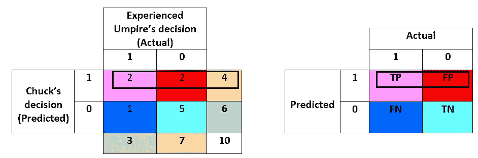

Precision

查克总共 4 次判定一名球员“不出局”，其中有 2 次是正确的。因此他的**精度**分数是 2/4 =0.5 或者 50 **%**

**精度= TP / (TP+FP)**

4) *在所有的“未出局”中，查克有多少次正确地判定一名球员“未出局”？*

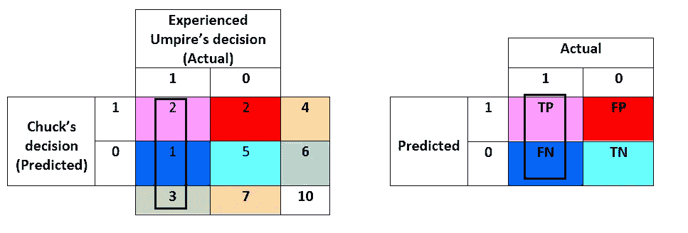

Recall

在一名球员实际上“没有出局”的 3 次中，查克有 2 次是正确的。因此他的**敏感度/回忆度**分数是 2/3 =0.6 或 60 **%**

**召回= TP / (TP+FN)**

5) *在所有实际“出局”中，查克有多少次正确判定一名球员“出局”？*

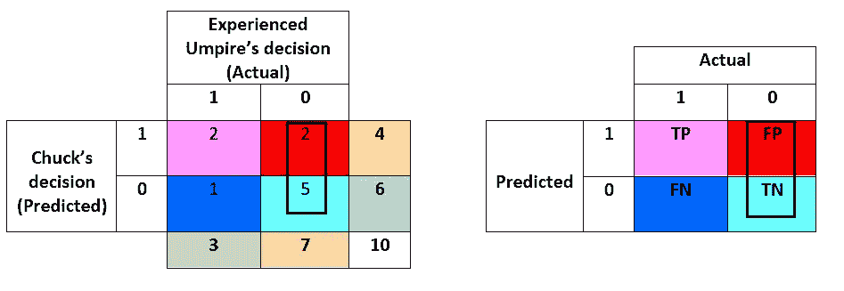

Specificity

在总共 7 次比赛中，查克正确地判定了 5 次球员实际上“出局”。因此他的特异性得分是 5/7 =0.7 或 70 **%**

**特异性= TN / (FP+TN)**

让我们使用 Python [scikit-learn](https://scikit-learn.org/stable/index.html) 生成一个“混淆矩阵”并计算性能分数:

```
#Code snippet used for this example :from sklearn.metrics import accuracy_score ,confusion_matrix ,precision_score , recall_score , ConfusionMatrixDisplay
import matplotlib.pyplot as plt#Data collected by the board
Experienced_umpire = [1, 1, 0, 1, 0, 0, 0, 0, 0, 0]
Chuck = [1, 0, 0, 1, 0, 0, 1, 0, 1, 0]#Plotting Confusion Matrix
fig, ax = plt.subplots(1,1,figsize=(7,4))
results = confusion_matrix(Chuck, Experienced_umpire , labels=[1,0])
cm_display = ConfusionMatrixDisplay(results, display_labels=['Not-out','Out']).plot(values_format=".0f",ax=ax)
ax.set_xlabel("Experienced Umpire's Decision")
ax.set_ylabel("Chuck's Decision")
plt.show()#Printing Performance Metrix
print("Accuracy Score  : ", accuracy_score(Experienced_umpire, Chuck))
print("Precision Score : ", precision_score(Experienced_umpire, Chuck))
print("Recall Score    : ", recall_score(Experienced_umpire, Chuck))
```

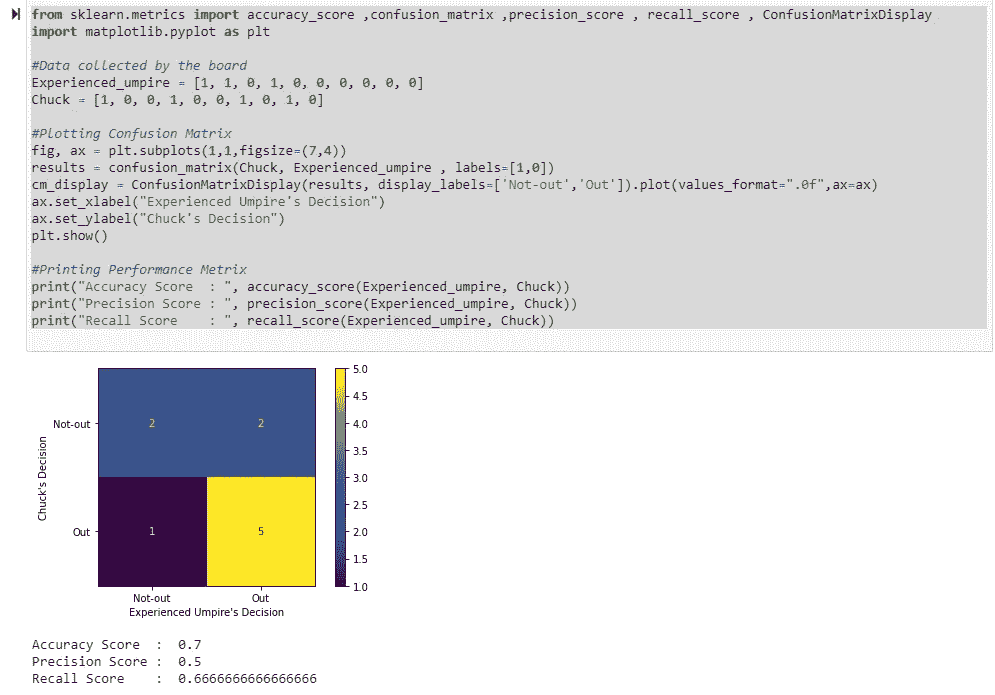

Chuck’s decision confusion matrix in Python

分数已经算出来了。查克现在该怎么办？他应该努力提高自己的表现。他做出的 3 个错误的预测将会对团队产生非常严重的影响。他应该设法**提高**的**精确度**。通过**增加**和**真阳性或真阴性，准确度将增加。**这意味着**假阳性或假阴性**应**减少。**

*减少假阳性会增加精度，减少假阴性会增加召回* ***。*** *因此，Chuck 需要专注于提高召回率或准确率。*

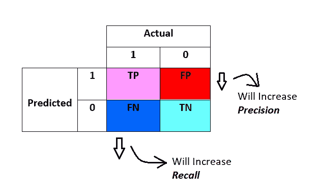

在理想情况下，减少误报和漏报是不可能的。在这些情况下，我们需要分析是减少假阳性更重要还是必须减少假阴性

*将“未退出”声明为“退出”的卡盘应减少，反之亦然*

在我们的场景中，减少这两者可能很重要。但是，查克将“不退出”宣布为“退出”可能会产生更大的影响。*因此，Chuck 应该更加关注减少假阴性，即提高他的回忆分数。*

***行话一瞥:***

**真阳性(TP)** :正确预测的正值。

**真负值(TN)** :正确预测的负值。

**假阳性(TP)** :错误预测的阳性值。

**假阴性(TN)** :错误预测的负值。

**准确度= (TP+TN) /总量**

**错误分类= (FP+FN) /总计**

**精度= TP / (TP+FP)**

**敏感度/召回率= TP / (TP+FN)**

**特异性= TN / (FP+TN)**

我们开始吧…这是对声明的解释-

*“混淆矩阵是总结分类算法性能的表格”。*

快乐学习！！！！！

[](/mlearning-ai/mlearning-ai-submission-suggestions-b51e2b130bfb) [## Mlearning.ai 提交建议

### 如何成为 Mlearning.ai 上的作家

medium.com](/mlearning-ai/mlearning-ai-submission-suggestions-b51e2b130bfb)