# 混乱矩阵:不再混乱

> 原文：<https://medium.com/mlearning-ai/confusion-matrix-no-more-confusion-7f64dcd9e804?source=collection_archive---------1----------------------->

Photo by [ALAN DE LA CRUZ](https://unsplash.com/@alandelacruz4?utm_source=medium&utm_medium=referral) on [Unsplash](https://unsplash.com?utm_source=medium&utm_medium=referral)

## 混淆矩阵和其他分类指标

很难避免混淆矩阵的混淆陷阱；但是，不管一个概念看起来有多难，如果你试图把它和现实生活中的例子联系起来，很有可能会记住很长一段时间。困惑矩阵也不例外。

我将这篇文章分为两个主要部分:

1.  **混淆矩阵**
2.  **准确度、精密度、召回&特异性**

最后，我会把这些概念和一个有趣的类比联系起来。

# 混淆矩阵

混淆矩阵基本上是一种*技术，用来* *总结我们机器学习模型的性能*。借助混淆矩阵，我们可以确定一些重要的预测分析，如**准确度、精密度、召回率(灵敏度)、特异性、**等。

它被称为**混淆矩阵**，因为它使我们更容易理解、可视化和检查我们的 ML 模型是否在预测输出类时*混淆*。

假设我们的模型被训练来预测二元类:是或否；一旦模型被训练并准备好进行预测，就可以如下创建模型预测的混淆矩阵:

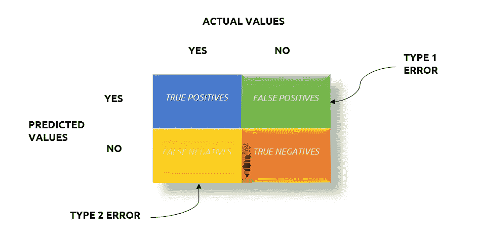

Fig 1: Confusion Matrix

(顺便说一下，可以为*列车数据*以及*测试数据*创建混淆矩阵。我们只需要*实际值*和*预测值*

1.  **真阳性(TP) : [ +ve = +ve ]**

实际上是 **+ve** *和*的类也预测了 **+ve** 。

**2。真否定(TN) : [ -ve = -ve ]**

实际上是 **-ve** *和*的类也预测了 **-ve** 。

**3。误报(FP) : [ -ve = +ve ]**

实际上是 **-ve** *但是错误地*预测为 **+ve** 的类。

**4。假阴性(FN) : [ +ve = -ve ]**

实际上是 **+ve** *但错误地*预测为 **-ve** 的类。

真实值(TP & TN)是我们的模型对+ve 和-ve 类做出的*正确预测*。

假值(FP & FN)是我们的模型对+ve 和-ve 类做出的*错误预测*。因此，存在与这些预测相关的*误差*。

这些错误是:

**1。类型 1 错误:[假阳性率(FPR) ]**

因为我们的模型*错误地预测了* **+ve** 输出的值，而这些值实际上是***-ve**。*

***2。类型 2 错误:[假阴性率(FNR) ]***

*由于我们的模型*错误地预测了* **-ve** 输出的值，而这些值实际上是***+ve**。**

# **准确度、精确度、召回率和特异性**

**假设我们有一个不平衡的二进制分类数据集，其中+ve 类和-ve 类分别为 30–70 分布，如下所示:**

**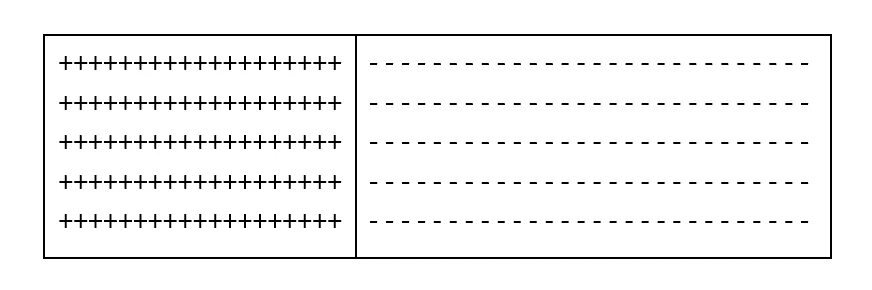**

**Fig 2: A 30–70 distributed dataset**

**一旦模型在这个数据集上被训练并准备好进行预测，我们就可以使用混淆矩阵来确定重要的分类度量。**

**通过问答的方式，我们可以很容易地记住这些指标。**

## **准确(性)**

**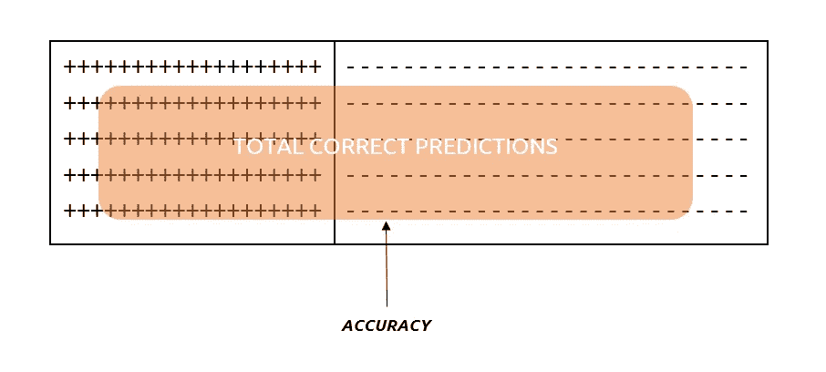**

**Fig 3: Accuracy**

**问题:**

**在*所有对***+ve**以及 **-ve** 职业的*预测中，我们实际上*正确预测了多少*？***

> **准确度是正确预测值(真值)与总预测值(真值+假值)的比率**

**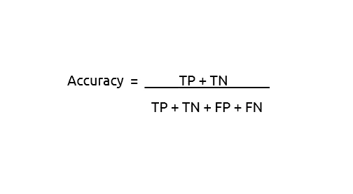**

## **精确**

**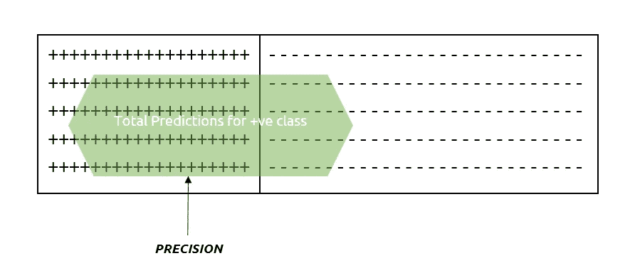**

**问题:**

**在我们为**+ve**职业做出的所有*预测*中，我们*真正预测*为 **+ve** 的有多少？**

> **精度是正确预测的 **+ve** 值与对 **+ve** 类做出的总预测的比率**

**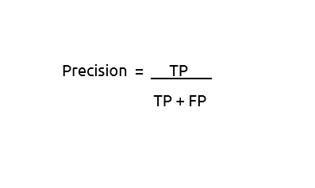**

## **回忆和特异性**

**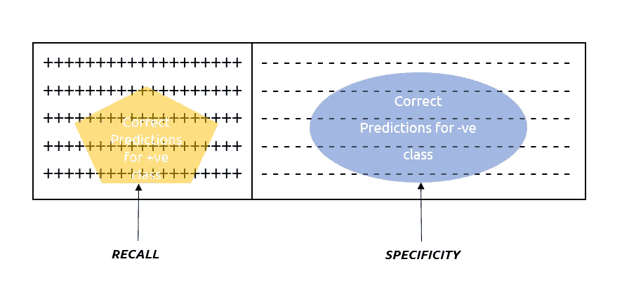**

**Fig 4: Recall & Specificity**

****回忆****

**问题:**

**在所有属于 **+ve** 类的*值中，我们*正确预测*为 **+ve** 的有多少？***

> *召回率是正确预测的 **+ve** 值与实际总 **+ve** 值之比*

*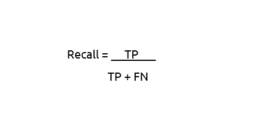*

***特异性***

*问题:*

*在属于 **-ve** 类的所有*值中，我们*正确预测*为 **-ve** 的有多少？**

> *特异性是正确预测的 **-ve** 值与总的实际 **-ve** 值之比*

*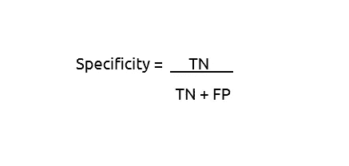*

**回忆&特异性彼此完全相反**

# *有趣的类比*

*假设在某个特殊的日子里，你家里有糖果，你看到一桶装满了 Gulab Jamuns (+ve 类)，另一桶装满了 Rasgullas (-ve 类)。当大家都在忙自己的工作，没人看你的时候，就是你品尝这些美食的时候了。你偷偷走近这些装着糖果的桶:*

*如果你用左手尽可能多地抓住 *Gulab Jamuns (+ve class)* ，用右手尽可能多地抓住 *Rasgullas (-ve class)* ，那么*

*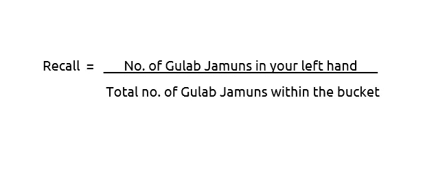**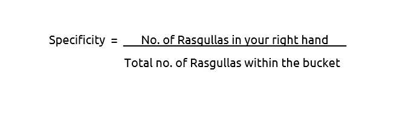*

*现在，假设所有的 *Gulab Jamuns* 和 *Rasgullas* 被*混合在一起*并保存在*单个桶*中，如果你试图用双手抓住它们，*

*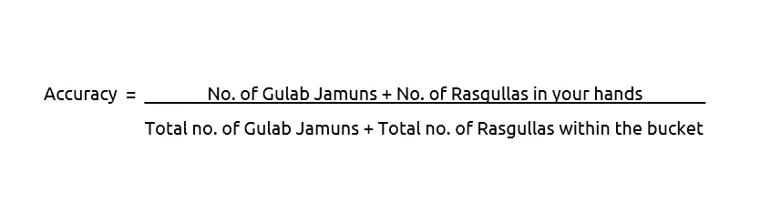*

*现在，当 Gulab Jamuns 和 Rasgullas 仍然混在一起，放在同一个桶里，而像我这样喜欢 Gulab Jamuns 胜过 Rasgullas 的人，试图尽可能多地抓取 Gulab Jamuns，那么*

*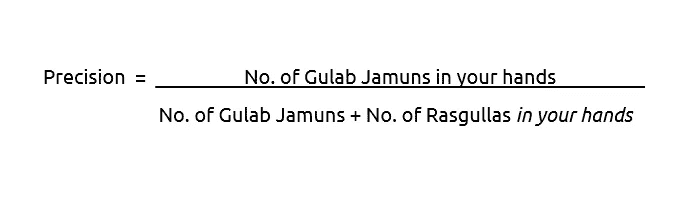*

*我希望这个解释有助于理解这些令人困惑的概念。快乐学习！*

*您可以通过以下方式联系我:*

*电子邮件:gauravkamble9@gmail.com*

*领英:[https://www.linkedin.com/in/gaurav-kamble-data-science-101/](https://www.linkedin.com/in/gaurav-kamble-data-science-101/)*

*GitHub:[https://github.com/GauravK1997](https://github.com/GauravK1997)*