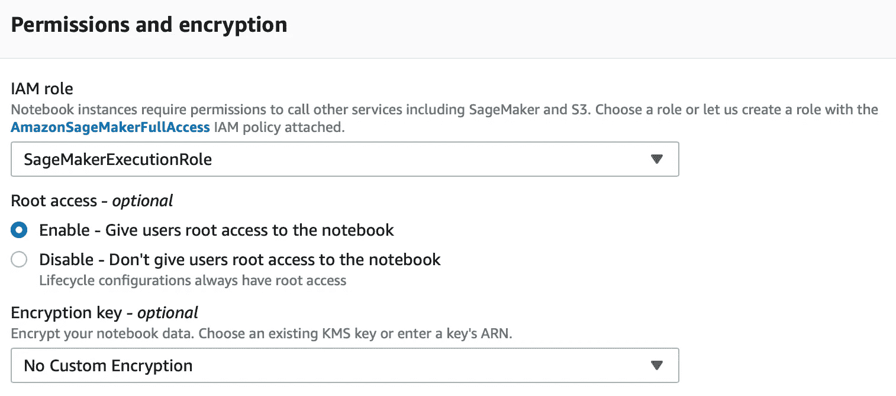
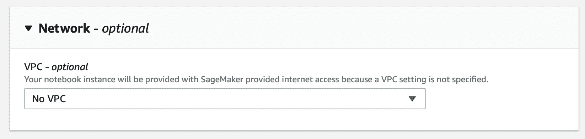
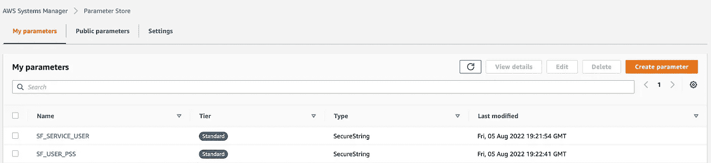
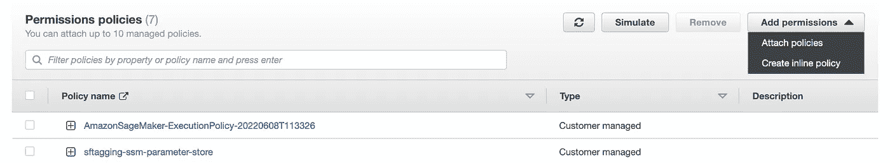

# 将 AWS SageMaker 连接到雪花

> 原文：<https://medium.com/mlearning-ai/connecting-aws-sagemaker-to-snowflake-5b377ffa5fc5?source=collection_archive---------2----------------------->

## 为机器学习摄取数据


Image: Aaron Burden from unsplash

机器学习模型部署中的一个重要任务是让数据从一个平台无缝地流向另一个平台。我们可以使用 AWS SageMaker 对数据进行预处理，训练模型并进行推理。通常，我们的数据集可能托管在不同的平台上。在本教程中，我将向您展示如何将 AWS SageMaker 与雪花环境连接起来的一步一步的方法。通过这样做，我们将能够在任何机器学习任务之前摄取存储在雪花环境中的数据。

在本教程中，我还想提供一个循序渐进的教程，介绍我们如何在 AWS 参数存储中存储用户名和密码，从而提供一种更安全的方式来连接到雪花。

**步骤 1:** 创建 SageMaker 笔记本实例

*   从 *SageMaker 控制台*选择*笔记本实例*->-*创建笔记本实例*
*   附加适当的 *IAM 角色*:例如 SageMakerExecutionRole(稍后，我们还需要为该角色附加一些附加策略)



创建笔记本实例时，还需要设置*网络*设置(通常对于 SageMaker 特定的笔记本，我们倾向于忽略此选项)。此外，如果您有一台现有的笔记本电脑，可能无法更新*网络*设置，您必须从新的笔记本电脑开始。



请联系您的管理员填写以下字段:

```
VPC: <*********>Subnet: <******>Security Group: <*******>Direct Internet Access: Disable
```

**步骤 2:** 将雪花服务帐户用户和密码存储到 AWS 参数存储中

在创建雪花连接器时，您可以在 SageMaker 笔记本中对用户/密码进行硬编码。但是最好有一个服务帐户，我们可以将它存储在 AWS 的密钥或参数存储中。在这个例子中，我将向您展示如何在 AWS 参数存储中存储和使用用户/密码，并避免使用硬代码模式。

转到 *AWS 系统管理器* - >转到*参数存储* - > *创建参数*

```
1\. Give a meaningful name for the user — e.g ‘****-user’2\. Choose 'SecureString' Type3\. Enter the User Name in the ‘Value’ section. (The User is the Snowflake Service Account Name)4\. Choose Create Parameter5\. Repeat step 1 to 4 for storing password also. (In the step 3, now enter the password in the ‘Value’ section)
```

然后，我们必须在将要创建的策略中提供用户名和密码参数的名称。

**步骤 3:** 创建一个凭证策略，并附加到现有的或新的角色。

在我们的例子中，我们将创建一个凭证策略并将其附加到现有的 SageMaker 执行角色

转到*策略*->-*创建策略* - >选择 *JSON* - >复制粘贴以下代码

```
{
    "Version": "2012-10-17",
    "Statement": [
        {
            "Sid": "VisualEditor0",
            "Effect": "Allow",
            "Action": [
                "ssm:PutParameter",
                "ssm:DeleteParameter",
                "kms:Decrypt",
                "ssm:GetParameterHistory",
                "ssm:GetParametersByPath",
                "ssm:GetParameters",
                "ssm:GetParameter",
                "ssm:DeleteParameters"
            ],
            "Resource": [
                "arn:aws:ssm:<region>:<accountid>:parameter/<user>", 
                "arn:aws:ssm:<region>:<accountid>:parameter/<pw>"
            ]
        },
        {
            "Sid": "VisualEditor1",
            "Effect": "Allow",
            "Action": [
                "ssm:DescribeParameters",
                "kms:ListAliases"
            ],
            "Resource": "*"
        }
    ]
}
```

转到 *AWS 系统管理器*->-*参数存储器*，找到用户名和密码参数(不是实际的用户/密码)。



*   用用户名替换<user>，例如 SF_SERVICE_USER</user>
*   用密码替换<pw>，例如 SF_USER_PSS</pw>
*   给策略起一个有意义的名字:例如“* * * *-参数-存储”

将策略附加到与笔记本实例相关联的 SageMaker 执行角色。

转到 *IAM* - > *选择角色* - >选择*亚马逊管理决策者-执行策略*(或您拥有的任何策略)

*添加权限*->-*附加策略* - >在搜索栏中键入上面创建的策略的名称，并附加该策略



**步骤 4:** 将 SageMaker 笔记本连接到雪花

打开您在步骤 1 中创建的笔记本。在笔记本中，复制以下代码，编辑*区域*并执行。

```
!pip install snowflake-connector-pythonimport sys
import boto3
import snowflake.connector
region = 'us-west-2'# you need to know which region your Snowflake account is created from your admin
```

我们将使用 Python boto3 库来提取雪花连接的用户/密码。下面是一个从 AWS 参数存储中提取用户和密码的简单函数。

```
# Create a list of user/password from the parameter store, remember this is not the actual user/passwordparams = [‘****-user’, ‘****-pw’] def get_credentials(params):
    ssm = boto3.client('ssm',region)
    response = ssm.get_parameters(
       Names=params,
       WithDecryption=True
    )
    #Build dict of credentials
    param_values={k['Name']:k['Value'] for k in  response['Parameters']}
    return param_valuesparam_values=get_credentials(params)
```

浏览将在雪花连接器模块中使用的 *param_values* 字典。

```
con = snowflake.connector.connect(
    user = param_values['****-user'],
    account="********",
    password=param_values['****-pw'],
    database = "<database>",
    schema = "<schema>"
)! Note: the 'account' is different from the Service Account you used earlier to store the user/pw
```

下一步是检查连接是否正常。运行下面的代码片段:

```
# Check the connection works
cur = con.cursor()
print(sys.executable)
print(sys.version)
print(sys.version_info)
try:
    cur.execute("select current_date")
    one_row=cur.fetchone()
    print("Current_Date:",one_row[0])
    cur.execute("SELECT current_version()")
    one_row = cur.fetchone()
    print("Snowflake_Version:",one_row[0])
finally:
    cur.close()
cur.close()
```

成功连接后，上述代码的输出应该类似于:

```
/home/ec2-user/anaconda3/envs/python3/bin/python
3.8.12 | packaged by conda-forge | (default, Oct 12 2021, 21:59:51) 
[GCC 9.4.0]
sys.version_info(major=3, minor=8, micro=12, releaselevel='final', serial=0)
Current_Date: 2022-08-08
Snowflake_Version: 6.26.1False
```

**第五步:**执行查询并保存到亚马逊 S3 桶

```
cur = con.cursor()
cur.execute("SELECT TOP 10 * FROM <some_db>")
result = cur.fetchall()# Save the results into a dataframe
result_df = pd.DataFrame(result)
```

一旦您对查询感到满意，您就可以将我们的数据帧写入 S3 桶，以进行进一步的预处理、模型训练和推理。将文件写入 S3 存储桶的示例片段如下:

```
import sagemaker 
sess = sagemaker.Session()result_df.to_csv('result.csv')
data = sess.upload_data('result.csv', 
                        bucket='<your s3 bucket>',
                        key_prefix='<folder inside your bucket>')Note: Make sure you have a policy attached to the SageMaker Execution Role to access the S3 bucket.
```

Tada！恭喜你把 SageMaker 和雪花联系起来。如果你有任何建议/意见，请随意写。

## [**成为 MLearning.ai 作家**](https://mlearning.substack.com/about)

[](/mlearning-ai/mlearning-ai-submission-suggestions-b51e2b130bfb) [## Mlearning.ai 提交建议

### 如何成为 Mlearning.ai 上的作家

medium.com](/mlearning-ai/mlearning-ai-submission-suggestions-b51e2b130bfb)