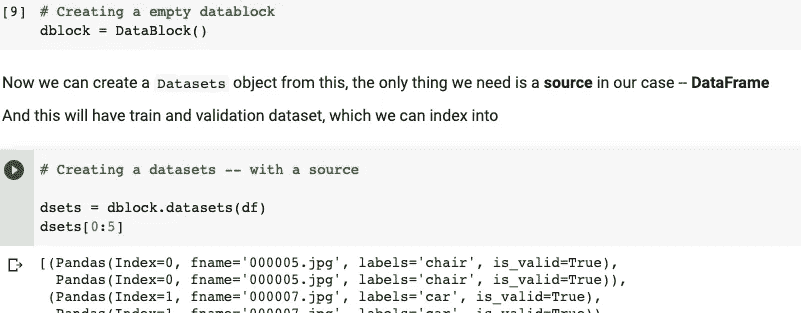
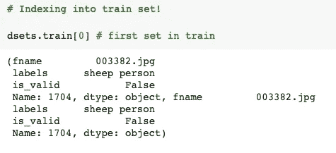
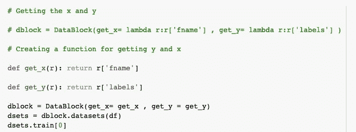
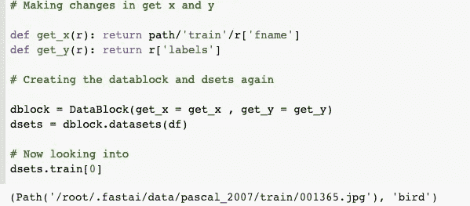
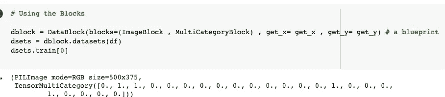
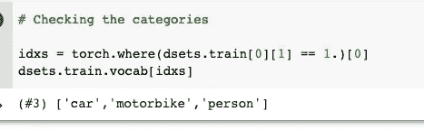
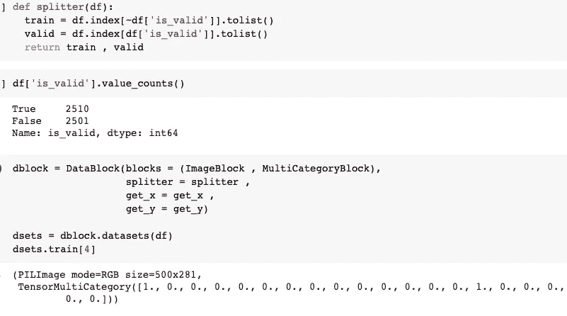

# 使用 Fastai 构建数据块

> 原文：<https://medium.com/mlearning-ai/constructing-a-datablock-using-fastai-7703752ae17a?source=collection_archive---------2----------------------->


Photo by [Iker Urteaga](https://unsplash.com/@iurte?utm_source=unsplash&utm_medium=referral&utm_content=creditCopyText) on [Unsplash](https://unsplash.com/s/photos/block?utm_source=unsplash&utm_medium=referral&utm_content=creditCopyText)

这些是我在阅读《程序员的深度学习》一书和参加 fastai 课程时做的笔记，下面的笔记将是书本内容和我对事情如何工作的理解的结合。这是来自第六章:其他计算机视觉问题。

我们有一个 DataFrame 对象，如何将它转换成 DataLoaders 对象？我们通常构建一个数据块，然后用它创建一个 DataLoaders 对象。在本教程中，我们将一步一步地为多标签分类问题构建一个数据块。

在开始构建数据块之前，我们应该确保理解下面的 4 个术语。

## 资料组

返回单个项目的自变量和因变量元组的集合。

## 数据加载器

一个迭代器，提供一个小批量流，其中每个小批量是一对自变量和因变量

在这些之上，fastai 引入了两个类，用于将训练集和验证集结合在一起。它们被称为数据集和数据加载器。

## 数据集

包含训练数据集和验证数据集的迭代器→训练集和有效集的自变量和因变量的元组。

## 数据加载器

包含定型数据加载器和验证数据加载器的对象。

因为**数据加载器**建立在**数据集**的基础上，并为其添加了额外的功能，(将多个项目整理成一个小批量)。通常从创建和测试`**Datasets**`开始更容易，然后在知道`**Datasets**`工作后再看`**DataLoaders**`。

让我们从零开始创造吧！！！

首先，我们创建一个空的`DataBlock`对象，为了创建一个`Datasets` 对象，我们需要一个源，它可以是一个图像，数据帧，或者任何你想放进去的数据。



这里有点混乱为什么要打印两次？默认情况下，数据块假设我们有两样东西:



*   投入
*   目标

但是我们不需要所有这些东西，所以我们将从数据帧中获取适当的字段，我们可以绕过`get_x`和`get_y`函数。



但是自变量(x)将需要被转换成一个完整的路径，以便我们可以将其作为一个图像打开，而因变量应该在空格字符上拆分。因为它们联系在一起，但实际上，它们是两个不同的对象。



好吧。我们现在得到了路径，但是我们如何打开图像并在张量上进行转换呢？

为此，我们需要使用一组变换，块类型将为我们提供这些变换。到目前为止，我们看到的块是`ImageBlock`和`CategoryBlock`当然，我们可以使用相同的块，但有一个例外。在这个问题中我们不能使用它们`CategoryBlock`,它只需要一个整数，但是在我们的例子中，我们需要为每一项设置多个标签。

为了解决这个问题，我们使用`MultiCategoryBlock`可以得到一个字符串列表，就像在这个例子中一样。



如果我们看一下，类别列表的编码方式与常规的`CategoryBlock`不同，在这种情况下，我们用一个整数来表示出现的类别。

例如，它是一只猫吗？(或者)这是阿比西尼亚猫吗？

在这种情况下，我们有一个在该类别出现的任何位置带有一个`1s`的`0s`列表。

在这里，如果在第二个和第四个位置有一个`1`，这意味着`vocab`项目 2 和项目 4 出现在该图像中。这就是所谓的一键编码。

我们不能简单地使用类别索引列表的原因是每个列表都有不同的长度，Pytorch 需要 tensors，其中所有内容的长度都必须相同。

有了 Numpy 数组和 Pytorch 张量以及 fastai 的 L 类，我们可以直接使用列表或向量进行索引。



到目前为止，我们已经忽略了列`is_valid`，这意味着 DataBlock 在默认情况下一直使用随机分割。为了选择验证集的元素，我们需要编写一个函数，并将其传递给拆分器。

它将接受条目(在这里是我们的整个数据帧),并且必须返回两个(或更多)整数列表。



正如我们所讨论的,`DataLoader`将数据集中的项目整理成一个小批量。这是一个张量元组，其中每个张量简单地堆叠数据集项目中该位置的项目。

现在我们要确保每个项目在放入`DataLoaders`之前都是相同的大小，我们使用`RandomResizedCrop`。

```
dblock = DataBlock(blocks=(ImageBlock , MultiCategoryBlock) , 
                   splitter = splitter , 
                   get_x = get_x , 
                   get_y = get_y , 
                   item_tfms = RandomResizedCrop(128 , min_scale=0.353))# Putting into a Dataloader
dls = dblock.dataloaders(df)# Displaying a sample of our data
dls.show_batch()
```


没有太大的变化，相反我们从头开始构建了`DataBlock`，并使用了`MultiCategoryBlock`而不是`CategoryBlock`。正如我们所知，数据加载器将数据集中的项目整理成一个小批量。

我们的数据现在已经为模型做好了准备，即使使用它们也不会有任何变化`Learner`，但是这次我们将使用一个新的损失函数，它被称为**二元交叉熵**。