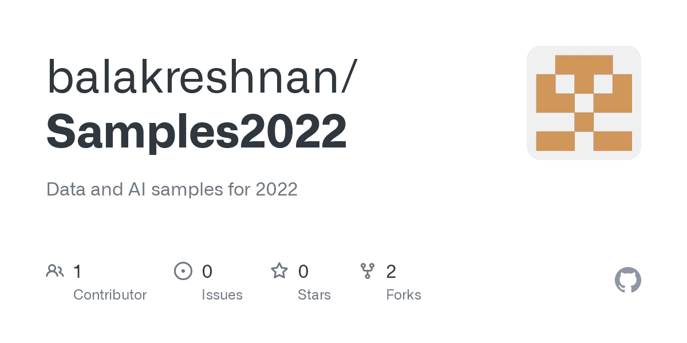

# 使用 AML SDK 消费拥抱脸模型

> 原文：<https://medium.com/mlearning-ai/consuming-hugging-face-models-using-aml-sdk-e0704de5ef55?source=collection_archive---------5----------------------->



# 如何在 python Azure 机器学习 SDK 中消费拥抱人脸模型

# 细节

*   本教程旨在展示在 AML workspace 中如何轻松地调用拥抱脸模型并进行消费
*   还可以看到从拥抱脸下载预训练模型是多么容易
*   下载后，我们可以用 python 代码进行消费
*   展示如何创建管道来使用模型

# 步伐

*   首先用这个版本更新 transformer 包

```
%pip install transformers==4.17.0
```

*   否则，生成器代码无法找到配置 json 文件
*   现在进口

```
from transformers import GPT2Config, GPT2Tokenizer, GPT2LMHeadModel, pipeline
```

*   让我们下载拥抱脸模型

```
tokenizer = GPT2Tokenizer.from_pretrained("gpt2")
tokenizer.save_pretrained("./model/tokenizer")
model = GPT2LMHeadModel.from_pretrained("gpt2")
model.save_pretrained("./model/weights")
config = GPT2Config.from_pretrained("gpt2")
config.save_pretrained("./model/config")
```

*   创建管道

```
generator = pipeline(
    "text-generation",
    model="./model/weights",
    tokenizer="./model/tokenizer",
    config="./model/config",
)
```

*   打包一些要发送的文本
*   提示是要发送的文本
*   最大长度是生成文本的最大长度
*   num_return_sequences 是生成并发回的句子数

```
prompt = "what is the best place in world"
max_length = 50
num_return_sequences = 3
```

*   调用模型推理

```
generator(prompt, max_length=max_length, num_return_sequences=num_return_sequences)
```

*   输出

```
[{'generated_text': 'what is the best place in world to learn and be educated about the best fields of life?" he asks. "I believe that what is considered what is considered to be more dangerous is not what the best would do." The question of whether or not'},
 {'generated_text': 'what is the best place in world to buy a book so you can make your own? How is it different if the author is not interested in doing a single book or reading a couple of books in advance because they are not sure what a novel is'},
 {'generated_text': 'what is the best place in world for young scientists (myself included) to study the environment and to think about our planet and the future in the interest of other people?\n\nIn a world with a lot of different weather events and much more'}]
```

*   完成的

# *最初发表于*[*【https://github.com】*](https://github.com/balakreshnan/Samples2022/blob/main/AzureML/hugginfacesdk.md)*。*

[](/mlearning-ai/mlearning-ai-submission-suggestions-b51e2b130bfb) [## Mlearning.ai 提交建议

### 如何成为 Mlearning.ai 上的作家

medium.com](/mlearning-ai/mlearning-ai-submission-suggestions-b51e2b130bfb)