# 基于内容的自然语言处理推荐系统

> 原文：<https://medium.com/mlearning-ai/content-based-recommender-system-using-nlp-445ebb777c7a?source=collection_archive---------1----------------------->

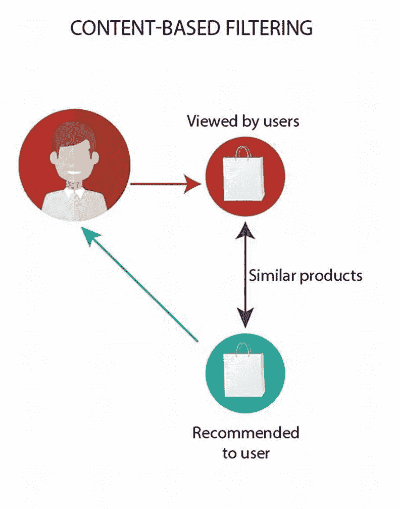

Content-Based Filtering

我们每个人肯定都想知道网飞、亚马逊、谷歌给我们的所有推荐都来自哪里。推荐系统的两种主要类型是协作式或基于内容的过滤器。我将使用酒店和电影作为例子，但是请记住，这种类型的过程可以应用于您观看、收听、购买的任何类型的产品，等等。

**推荐范例**

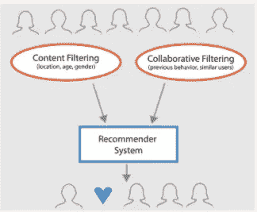

Recommendation System

一般来说，推荐系统是一种算法，用于向用户建议相关项目(例如要看的电影、要读的书、要买的产品或其他任何取决于行业的东西)。

推荐系统通常利用协同过滤和基于内容的过滤(也称为基于个性的方法)中的一种或两种，以及其他系统，例如基于知识的系统。

在本练习中，我们将使用基于内容的过滤。

**基于内容的过滤**

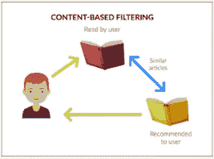

Content-Based Filtering

基于内容的过滤方法基于项目的描述和用户偏好的配置文件。这些方法最适合于已知项目数据(名称、位置、描述等)的情况。)，但不在用户身上。基于内容的推荐器将推荐视为特定于用户的分类问题，并根据项目的特征学习用户喜欢和不喜欢的分类器。

**基于内容的推荐系统是如何工作的？**

在该系统中，使用关键字来描述项目，并且建立用户简档来指示该用户喜欢的项目类型。这些算法试图推荐与用户过去喜欢的或者现在正在检查的项目相似的项目。具体地，将各种候选项目与用户先前评级的项目进行比较，并推荐最匹配的项目。这种方法源于信息检索和信息过滤研究。

为了创建用户简档，系统主要关注两种类型的信息:

1.用户偏好的模型。

2.用户与推荐系统的交互历史。

**数据集**

Hotel

我们用于基于内容的过滤的数据是我们自己从 booking.com 制作的数据集，因为提供的信息是完整的。

所获取的数据由 657 个酒店数据组成，包括名称、评论、价格等。

**导入库**

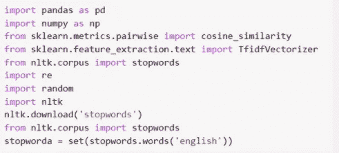

Import Library

**加载数据**

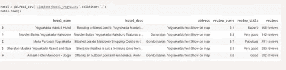

Load the Data

**TF-IDF 矢量器**

TF-IDF 或术语频率逆文档频率是一种非常常见的算法，用于将文本转换为有意义的数字表示，该数字表示用于拟合预测的机器算法。

**TF(t) =(术语 t 在文档中出现的次数)/(文档中的总术语数)。**

**IDF(t) = log_e(文档总数/其中包含术语 t 的文档数)。**

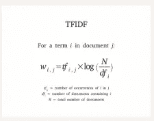

TF-IDF

Scikit-learn 为您提供了一个预构建的 TF-IDF 矢量器，它可以逐字计算每个文档描述的 TF-IDF 分数。

> TF = TfidfVectorizer(analyzer = ' word '，ngram_range=(1，3)，min_df=0，stop_words='english ')

**余弦相似度**

余弦相似性是一种度量，用于确定文档的相似程度，而不考虑它们的大小。

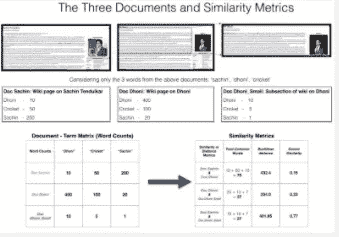

Similarity Metrics

余弦相似性是有利的，因为即使两个相似的文档由于大小而相距欧几里德距离很远(例如，单词‘Jakarta’在一个文档中出现 10 次，而在另一个文档中出现 5 次)，它们之间仍然可以有较小的角度。角度越小，相似度越高。

**文本预处理**

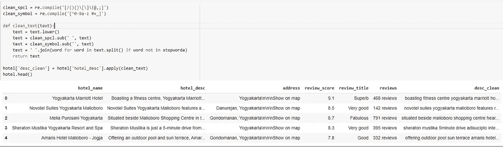

Text Preprocessing

我们需要做文本预处理，以便使用的数据可以在后面使用 TF-IDF 和余弦相似度处理成数字。将使用的数据仅为列“desc _ 清洁”。

**创建 TF-IDF 矢量器和余弦相似度**

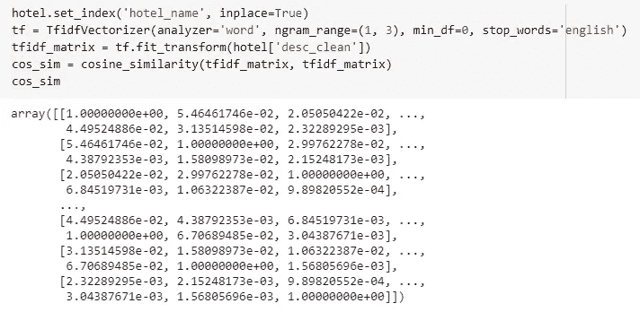

TF-IDF Vectorizer and Cosine Similarity metrics

**创建变量**

Create a variable

**造型**

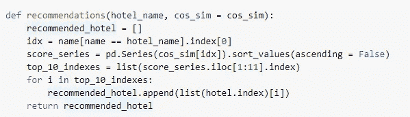

Model

在建模阶段，我们根据 TF-IDF 的结果和创建的余弦相似度为同一酒店推荐创建一个函数。以与我们定义的酒店名称最接近的 10 个序列的形式显示。

**运行脚本推荐**

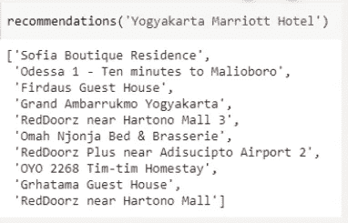

Hotel

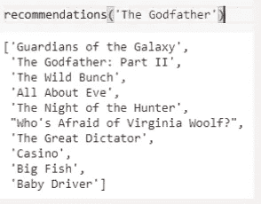

Movie

**结论**

具有基于内容的过滤方法的推荐系统可以生成在数据集中已经显示的描述方面具有共同点的酒店名称。

参考

[推荐系统 Dengan Python:基于内容的过滤(第二部分)|作者:Novindra Prasetio |印度尼西亚数据人员| Medium](/data-folks-indonesia/recommendation-system-dengan-python-content-based-filtering-part-2-222a8c365add)

[如何用自然语言处理构建基于内容的电影推荐系统|作者艾玛·马尔迪|走向数据科学](https://towardsdatascience.com/how-to-build-from-scratch-a-content-based-movie-recommender-with-natural-language-processing-25ad400eb243)

[推荐系统介绍| Baptiste Rocca |走向数据科学](https://towardsdatascience.com/introduction-to-recommender-systems-6c66cf15ada)

[推荐系统—维基百科](https://en.wikipedia.org/wiki/Content-based_filtering)

TF-IDF 矢量器 scikit-learn。深入理解 tfidf 矢量器作者:… |作者:Mukesh Chaudhary | Medium

[Soumyadip Nandi——个人博客(wordpress.com)](https://soumyadipnandi.wordpress.com/)