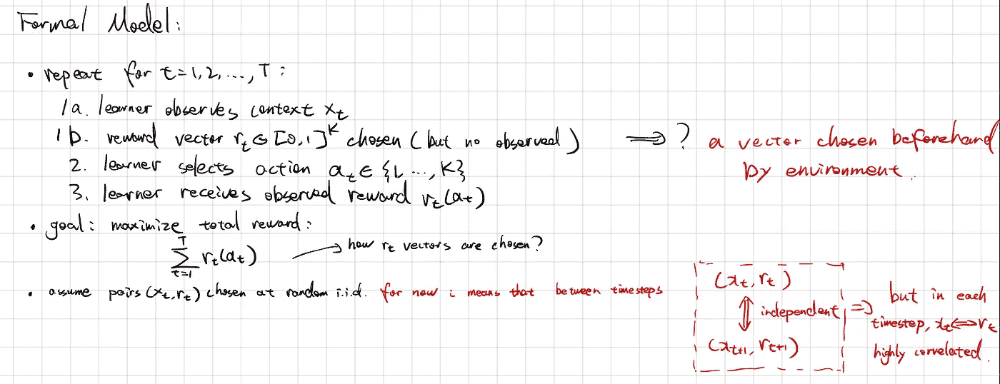
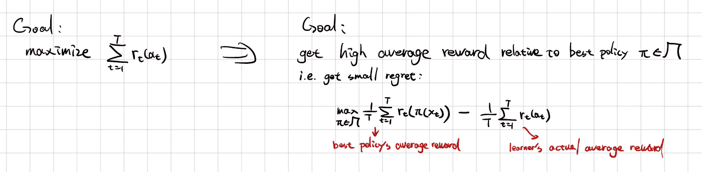
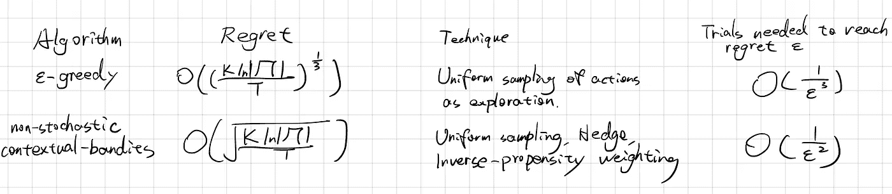
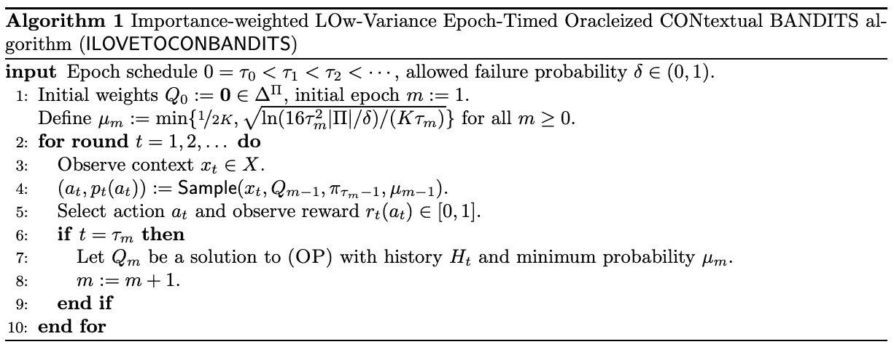
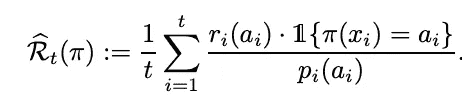
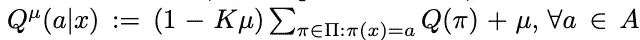
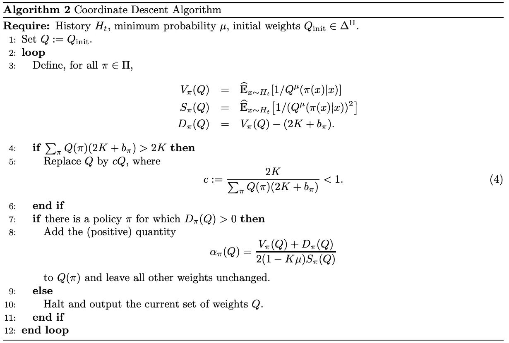

# 上下文强盗问题和“迷你怪物”算法

> 原文：<https://medium.com/mlearning-ai/contextual-bandits-problem-and-the-mini-monster-algorithm-3f1a996f066f?source=collection_archive---------5----------------------->

本文介绍了上下文强盗问题和一个有效的算法，该算法基于 youtube 的一个演讲和 T2 的论文“驯服怪兽:一个快速简单的上下文强盗算法”。如需更详细的解释，请直接查看。

Photo by [Carl Raw](https://unsplash.com/@carltraw?utm_source=unsplash&utm_medium=referral&utm_content=creditCopyText) on [Unsplash](https://unsplash.com/s/photos/gamble?utm_source=unsplash&utm_medium=referral&utm_content=creditCopyText)

## 问题摘要

情境强盗的一般思想是通过与环境的交互，作为一个代理来学习。

> 学习的一般过程是重复:
> 
> 1.向学习者展示上下文
> 
> 2.学习者选择一个动作
> 
> 3.学习者观察奖励(对选择的行动)
> 
> **目标**:学会选择行动以获得最大回报。
> 
> **普遍而基本的问题**:如何通过经验学会做出明智的决定？

这个问题的经典困境是**开采-勘探**权衡。通过与环境的连续互动，我们逐渐形成了对世界的理解。从某种意义上来说，我们采取的行动远远不是最佳的。但是，我们必须有效地使用上下文，使我们的代理通用化，并加快学习过程。

另外两个问题是选择偏差和效率。对于前一个问题，如果我们试图探索，同时利用已知的环境真相，我们往往会得到高度扭曲的数据。对于后者，要求我们的代理在许多用例中快速学习是可行的，比如向在线买家推荐商品:有时客户不经常浏览网站，很快就会失去兴趣。

算法的期望属性:

*   实施快速简单
*   可以根据上下文学习复杂的行为
*   具有可证明的强有力的统计保证

正式模型如下所示，

Annotations for context, reward, and actions.

为了更好地理解这个设置，让我们看一个例子，我们想向顾客的信息流推荐商品(例如在 Amazon 上)。在这里，行动来自一组固定的三类商品，上下文是顾客特征(年龄、性别等)。)，而回报就是客户点击或购买该商品的概率。

Toy example from [link](https://www.youtube.com/watch?v=N5x48g2sp8M).

这个例子的关键要点是:我们必须定义一个政策空间，以便更好地从环境中学习。这里有几个困难:

*   政策空间虽然被定义为有限的，但却非常大
*   需要学习所有政策，同时做到最好(假设存在高奖励政策)
*   每次代理人选择一个动作，我们只观察选择相同动作的策略的回报
*   大规模的开采-勘探权衡

然后，我们将原来的目标转换为新的目标:

Small regret V.S. Maximum reward

这样做的好处是，我们包括了最新的最佳策略，并且有一个下限。理想情况下，如果我们找到了最优策略，并且 T 趋于无穷大，那么后悔可以收敛到 0。

## 算法和技术

本节分为两部分:全信息设定和盗匪设定。

完全信息设置不是本文的重点，让我们简单回顾一下这个概念:我们可以观察一个时间步长内所有可能行为的所有奖励，而不是只观察我们选择的行为的奖励。在这种情况下，显然，学习过程更快，因为我们不需要选择一个行动来学习奖励。

让我们回到强盗设定，在那里我们只看到对所采取行动的奖励。

**大纪元贪婪算法用于上下文多武装盗匪|** [**链接**](https://hunch.net/~jl/projects/interactive/sidebandits/bandit.pdf)

该算法具有明显的开发性和探索性。在每一轮中，以概率\ε均匀随机选择行动，以概率(1-\ε)根据当前最优策略选择行动。它没有最佳遗憾，但却是一个强有力的基线模型。

**上下文盗匪算法(Exp4)为非随机设置|** [**链接**](https://cseweb.ucsd.edu/~yfreund/papers/bandits.pdf)

该算法可以达到最优遗憾，但在策略空间较大时效率较低。

Comparison w.r.t. regret and efficiency

我们能得到这两种算法的优点吗:在随机环境中，使算法快速(给定预言)并具有接近最优的遗憾？下面的算法让它发生。

**【迷你怪物】算法|** [**链接**](https://arxiv.org/pdf/1402.0555.pdf)

[https://arxiv.org/pdf/1402.0555.pdf](https://arxiv.org/pdf/1402.0555.pdf)

## “迷你怪兽”中使用的一些概念

**Arg max oracle (AMO)** :接受上下文奖励对，并给出最佳策略。这是对您选择的策略空间进行有效搜索的抽象。最重要的是，对于许多策略类，如线性模型/决策树/神经网络，我们确实有有效的实现来完成这项任务。

**逆概率加权**:帮助我们获得政策回报的无偏估计。我们选择的行动是不确定的。通常这是一个时间步长 t 的概率分布，我们将从这个分布中取样来得到这个动作。

这种技术构建了一个虚构的奖励向量，其中所选的动作具有一个缩放的奖励 r(a)/p(a)，所有其他动作具有零奖励。政策π的预期回报公式为:

Inverse probability weighting

**投影和平滑**:我们将构建策略的分布，而不是直接构建动作。然后，我们根据抽样策略和当前上下文选择动作。这叫做投射。至于平滑，我们操纵动作的概率分布，使得没有动作的概率太小。

Each action has at least probability µ of chosen

## 构建策略分布

如果我们通过求解一个最优化问题来获得策略分布，那么很有可能 T 轮后后悔是最优的。这里的优化问题是找到满足低估计遗憾(开发)和低估计方差(探索)的分布。在本文中，作者用下面的坐标下降算法解决了这个问题。

[https://arxiv.org/pdf/1402.0555.pdf](https://arxiv.org/pdf/1402.0555.pdf)

(占位符供进一步阅读)

## 参考资料:

*   [https://hunch . net/~ JL/projects/interactive/sideband its/bandit . pdf](https://hunch.net/~jl/projects/interactive/sidebandits/bandit.pdf)
*   【https://cseweb.ucsd.edu/~yfreund/papers/bandits.pdf 
*   [https://arxiv.org/pdf/1402.0555.pdf](https://arxiv.org/pdf/1402.0555.pdf)

 [## Mlearning.ai 提交建议

### 如何成为 Mlearning.ai 上的作家

medium.com](/mlearning-ai/mlearning-ai-submission-suggestions-b51e2b130bfb)