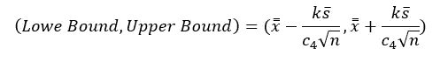
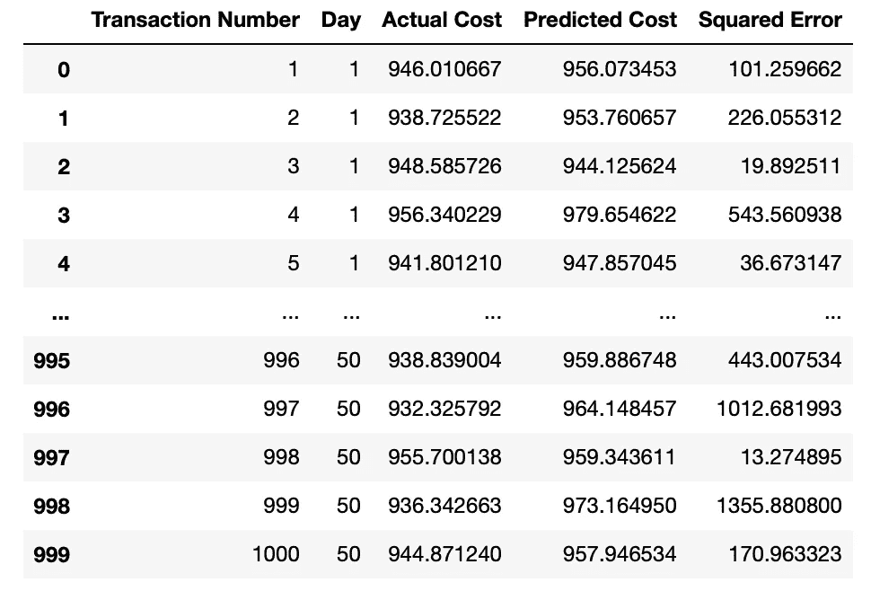

# 使用 Python 的机器学习控制图

> 原文：<https://medium.com/mlearning-ai/control-charts-for-machine-learning-using-python-b8a7866d54fb?source=collection_archive---------2----------------------->

# **简介**

控制图是一种可视化的机制，通过跟踪一段时间内质量特性的独立观察来监控过程。这种方法是由统计学家 Walter Shewhart 在 20 世纪初提出的，并在工业环境中得到了许多应用(尤其是在制造业)。控制图的主要思想是通过根据质量特性的概率分布设定下限和上限(即控制极限)来确定过程是否在统计控制之下。然后，您可以使用这些界限随时监控您的流程。虽然有点过时，但我相信控制图是监控部署的机器学习模型的一种有价值的方法**。*在本文中，我将展示一个案例，说明我们如何使用最基本的控制图来监控一个已部署的机器学习模型。***

# 控制图在今天有用吗？

有些人认为控制图是一种古老的技术，只适用于制造业。然而，我相信最近的计算进步已经使控制图比以往更加实用。在早期，大多数数据收集都必须手动进行(即物理数据收集)。今天，我们拥有可以自动收集任何过程数据的传感器。我们也有不一定有物理组件的虚拟进程，其数据完全在云上。我们可以将部署的机器学习模型视为虚拟过程。今天，机器学习模型正在各种行业中部署。因此，数据科学家和公司必须监控他们部署的机器学习模型。一种方法是使用控制图。

# 案例研究:使用控制图监控 ML 模型性能

假设您在一家医院担任数据科学家，试图实现一个系统，使患者和保险公司能够评估患者出院的成本。 ***因此，作为一名数据科学家，你的任务是开发一个机器学习模型，在病人甚至被送入医院之前，预测病人出院的成本。*** 作为一名数据科学家，你遵循机器学习管道进行模型部署。您收集并清理了数据，对问题进行了建模，并在看不见的数据中测试了这些模型。验证之后，模型就可以部署了。你知道部署模型不是机器学习管道的最后一步。您需要建立一种方法来监控其性能。


Photo by [Luke Chesser](https://unsplash.com/@lukechesser?utm_source=medium&utm_medium=referral) on [Unsplash](https://unsplash.com?utm_source=medium&utm_medium=referral)

有很多方法可以做到这一点。然而，监控您部署的模型总是一项复杂的任务。专注于实验跟踪和模型注册的初创公司 Nepute AI 写了一篇关于这个主题的有用文章[1]。监控模型的策略之一是使用统计技术来识别用于训练模型的要素的潜在分布变化。虽然这个策略是有帮助的，但可能还不够。如果模型性能受到模型中未包含的特征的影响，该怎么办？在这种情况下，仅监视特征分布可能会导致关于模型性能的错误结论。为此，您可能对监控预测误差感兴趣。

# 监控模型性能

## 关于控制图:我们的目标是什么？

假设在训练过程中，你估计的均方差是 228 平方美元。部署之后，您希望确保均方差在不同的时间点保持相对恒定(或者至少不会增加)。因此，您决定使用 XBar 控制图来监控模型性能。假设平均值为 228 平方美元，这将使您能够建立均方差可能所在的可接受区域。该区域可定义如下:



Equation 1: Control Bounds for the XBar Control Chart

其中 xbar 是每个时间点的均方误差的平均值，sbar 是每个时间点的标准偏差的平均值，c4 是偏差控制常数，n 是每个时间点的样本大小(即每个时间点有多少个可用的观察值)，k 决定了间隔的宽度。使用这些界限，我们可以监控不同时间点的均方误差。如果均方误差在这些界限之外，那么我们说该点失控。它可能表示均方误差分布的偏移。你的目标是开发这样的图表。

# 实现 Xbar 控制方案

作为一名为医院工作的数据科学家，你开始着手开发这张控制图。一旦模型投入生产，您就可以收集关于其性能的数据。您创建了一个数据集，每天有 20 个随机样本交易，持续 25 天。您使用前 25 天来训练和学习控制图的参数，并在第 25 天后开始监控。在表 1 中，您可以看到收集的数据的结构。



Table 1: Model Performance Dataset

## 数据处理

在收集和清理数据之后，您开始建模。首先，让我们从导入重要且有帮助的 python 库开始。我们将使用 pandas 读取数据，使用 NumPy 进行数值计算，使用 Matplotlib 进行数据可视化。ControlCharts 是我的 Python 模块，用于生成控制图。

```
import pandas as pd
import numpy as np
import matplotlib.pyplot as plt
from ControlCharts import ShewhartControlModel
```

导入重要的库之后，我们将继续读取和处理数据。我们将按天分组，然后计算每天采样的交易的平均值和标准差。每天总共对 20 笔交易进行了抽样。因此，我们说我们的样本量为 20。

```
# Read data from csv
data= pd.read_csv('Examples/transaction_data.csv')# Group data by day and take the average of the Squared Error
grouped_data= data[['Day', 'Squared Error']].groupby(by='Day').mean()
grouped_data_std= data[['Day', 'Squared Error']].groupby(by='Day').std()# Train-Test Split
x_train= grouped_data.iloc[:25, :].values.reshape((25,))
x_test= grouped_data.iloc[25:, :].values.reshape((25,))
```

## 训练控制图模型

一旦数据导入并准备就绪，我们将继续估计标准偏差并训练控制图模型。为此，我们将样本量定义为 n=20(因为每天有 20 个样本)，然后查找与该样本量相关的偏差控制常数。

```
# Estimate standard deviation
qcc= pd.read_csv('BiasControlConstants/quality_control_constants.csv')
n= 20
c4= qcc['c4'].loc[n-2]
sigma_train=np.average(grouped_data_std.values[:25])/(np.sqrt(n)*c4)
```

一旦我们知道了标准偏差，我们就可以继续训练控制模型并获得控制界限。为此，我们将使用 QualityTools。

```
# Build Shewhart Control Model
spc_model= ShewhartControlModel(k=3)
ucl, lcl= spc_model.fit(x_train, sigma= sigma_train)
ooc= spc_model.predict(x_test)
testing_plot=spc_model.plot(x=x_test, dpi= 100)# Plot all data
complete_plot= spc_model.plot(x=grouped_data.values, dpi= 100)
train_plot= spc_model.plot(x=x_train, dpi= 100)
```

## 结果

第一步是检查模型性能是否受控。为此，我们观察图 1，看到模型在训练期间处于控制状态。现在，我们可以开始用计算出的控制边界来监控我们的模型。

Figure 1: Training XBar Control Chart Model

在图 2 中，您在第 25 天之后开始跟踪模型。然后你意识到，似乎在第 40 天左右，模型的表现出现了一些变化。下一步是确定是什么导致了这种转变，并迅速确保它不会影响到您的客户。

Figure 2: Training and Testing XBar Control Chart Model

# 结论

这篇文章的目的是提出一个想法。我知道在机器学习中实现模型性能的控制图有很多挑战。然而，我认为如果充分研究，这种方法可以成为一个有价值的工具。例如，使用控制图来监控机器学习模型性能可以使工程师能够开发健壮的系统，该系统能够在模型性能发生变化时触发自动警报。然后，数据科学家可以迅速纠正问题，并将潜在影响降至最低。

值得注意的是，为了使这种方法有效，分析师应该了解如何设计和解释控制图。我没有详细阐述正确设计和解释控制图所必需的关于控制图的理论概念。如果有人计划在生产中使用控制图来监控模型，我建议在实施之前学习控制图的理论基础。

旁注:

我用 Python 创建了一些基本控制图的模块化实现。有许多可用的实现，但是，您可以在本文中找到我的实现以及代码和模拟数据:[https://github.com/fernando-acosta/QualityTools](https://github.com/fernando-acosta/QualityTools)

# **参考文献**

1.  奥拉德勒，S. (2022 年 8 月 11 日)。*关于如何在生产中监控您的模型的全面指南*。Neptune . ai .[https://Neptune . ai/blog/how-to-monitor-your-models-in-production-guide](https://neptune.ai/blog/how-to-monitor-your-models-in-production-guide)

[](/mlearning-ai/mlearning-ai-submission-suggestions-b51e2b130bfb) [## Mlearning.ai 提交建议

### 如何成为 Mlearning.ai 上的作家

medium.com](/mlearning-ai/mlearning-ai-submission-suggestions-b51e2b130bfb)