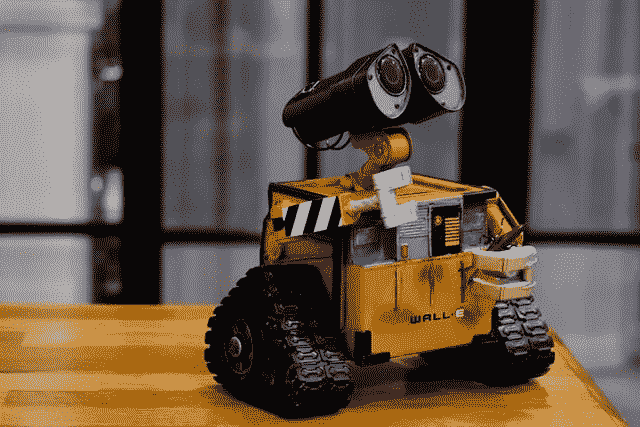
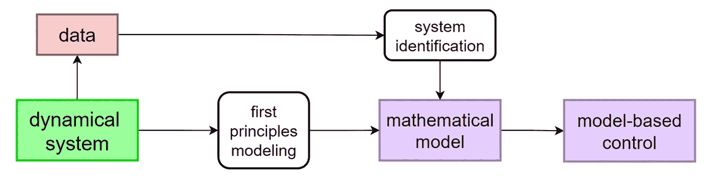
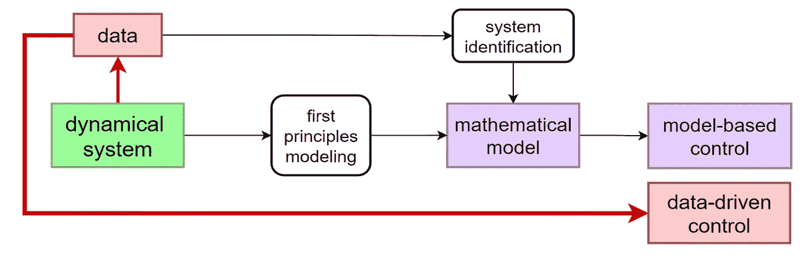

# 数据丰富世界中的控制理论

> 原文：<https://medium.com/mlearning-ai/control-theory-in-a-data-rich-world-9c9428221637?source=collection_archive---------2----------------------->

## 世界是如何变成数据驱动的，控制的未来是什么。

Photo by [ray rui](https://unsplash.com/@ray30?utm_source=unsplash&utm_medium=referral&utm_content=creditCopyText) on [Unsplash](https://unsplash.com/?utm_source=unsplash&utm_medium=referral&utm_content=creditCopyText)

> **“如果物理学是理解物理环境的科学，那么控制理论可以被视为改变环境的科学[…]”**—鲁道夫·卡尔曼，控制理论，大英百科全书

控制理论是应用数学的一个分支，研究如何使用控制**算法来影响**动力系统**的行为**，以达到预期目标。粗略地说，这通常涉及到一个**控制器**的设计，该控制器可以监控和操纵这样的系统。

## 从模型到控制

动力系统通常用数学模型来描述，这些模型来源于:

1.  第一原理和物理学信息模型；
2.  根据测量数据进行系统识别。

然后，基于该模型，我们设计最合适的控制器来实现我们的要求。

A simple block diagram to represent the basic idea behind the relation between modeling and control.

## 从数据到控制

事情是这样的:如今我们周围的世界变得如此先进和复杂，以至于试图从中推导出模型变得具有挑战性。事实上，在现代应用中，我们要描述的现象是如此复杂和相互关联，以至于第一原理模型可能是不可想象的；同时，从传感器测量值进行系统识别可能成本过高且耗时。

从另一个角度来看，传感和数据收集能力的最新进展提供了对呈指数增长的数据量的访问，这些数据携带控制算法可以提取和使用的相关信息。

> 我们能在系统模型的知识和数据之间进行权衡，并能够控制系统吗？

**数据驱动控制**可能会给这个问题一个肯定的答案。主要思想是**直接从系统生成的数据**中学习控制器**，这与在设计基于模型的控制器之前识别精确模型的传统方法形成对比。**

Data-driven control: understand/manipulate the environment using data.

## 机器学习是控制的未来吗？

机器学习和控制理论都在研究如何使用过去的数据来增强动力系统的未来操作。当然，控制领域可能会受益于机器学习的不断进步，这是一个专门关注训练和从数据中学习的领域。事实上，近年来，机器学习已经取得了令人印象深刻的成就，特别是在人工神经网络和强化学习领域，这些领域在控制界越来越受欢迎。

另一方面，在开发安全关键应用程序时，机器学习算法的概率性质有时会与保证**安全**证书的需求相冲突。

> 机器学习提供了关于训练和从数据中学习的见解。控制理论在性能、稳定性和鲁棒性方面提供了保证。

来自**和**两个社区的见解对于开发高效和自适应的算法来应对我们不断发展的世界是必要的。

*这有什么关系？*

这两个学科的结合将开启广泛的应用——从更安全、自我感知的环境和智能城市到自动驾驶汽车——这些应用有可能深刻影响社会。

## 参考资料:

关于控制理论的快速介绍，我推荐由[桑契特·古普塔](https://medium.com/u/9917b11a004a?source=post_page-----9c9428221637--------------------------------)撰写的指南:

[假人控制理论。什么是控制系统，为什么… |桑契特·古普塔|生活与技术|媒体](/lifeandtech/control-theory-for-dummies-e86155b14aff)

为了了解数据驱动控制，我欣赏了 Steve Brunton 的视频系列:

 [## Mlearning.ai 提交建议

### 如何成为 Mlearning.ai 上的作家

medium.com](/mlearning-ai/mlearning-ai-submission-suggestions-b51e2b130bfb)