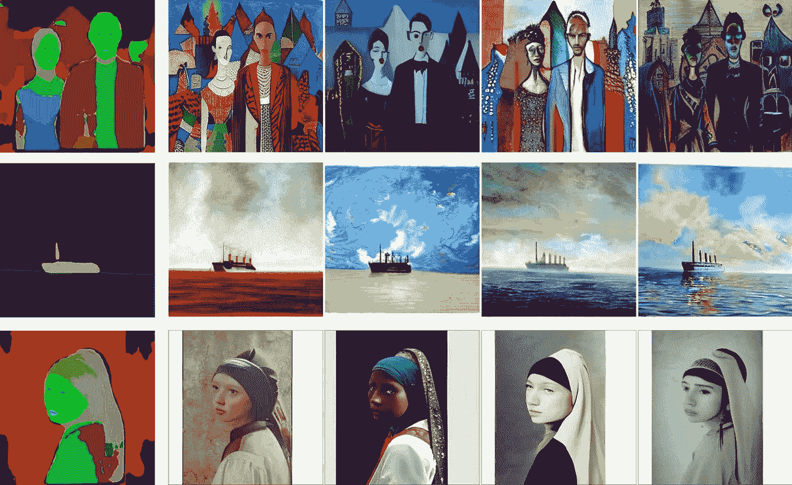

# 可控的文本到图像合成

> 原文：<https://medium.com/mlearning-ai/controllable-text-to-image-synthesis-cdbe8e06c2fc?source=collection_archive---------4----------------------->

## [机器学习艺术](https://mlearning.substack.com)

[https://mlearning.substack.com](https://mlearning.substack.com)

**文本到图像合成的生成模型**已经显示出显著的进步。然而，生成高保真图像仍然是一个挑战，特别是对于长文本描述。

在过去的几年里，使用 GANs 进行图像生成的现象激增，用于自然语言理解的变压器架构也取得了进步。在这个…