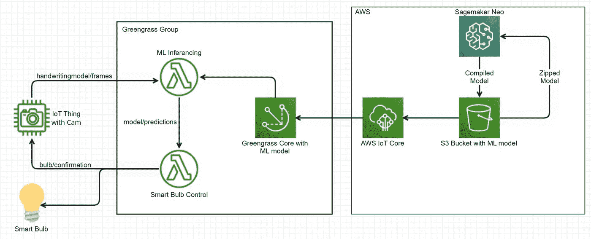
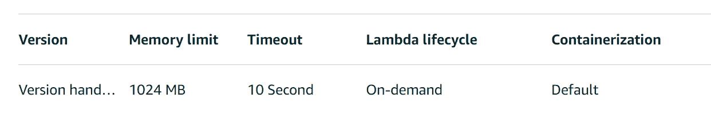
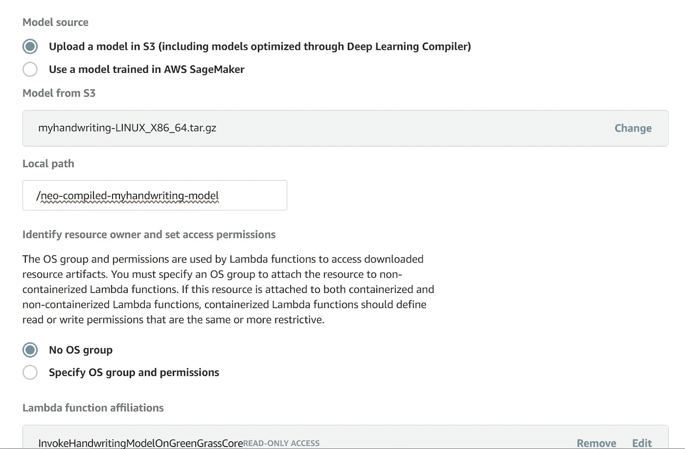

# 使用 GreenGrass 内核和 ML 控制智能灯泡

> 原文：<https://medium.com/mlearning-ai/controlling-smart-bulb-using-greengrass-core-and-ml-c284fc922ed5?source=collection_archive---------3----------------------->

使用 AWS Greengrass 核心进行机器学习的指南

**注意:**阅读这篇文章需要对 Python、机器学习以及类似 AWS IoT、AWS Greengrass、AWS Sagemaker 和 AWS Lambda 函数的 AWS 服务有基本的了解。

因此，我一直在学习 AWS，特别是 AWS IoT，并创建了一些小项目，但我不相信它们。我想利用 AWS 资源的力量创造一些令人兴奋和有用的东西。然后我有了一个项目想法:如果我可以用手写命令控制我的智能灯泡会怎么样？
我创建了这个项目的草图，这是它的样子:



Project workflow

## 项目工作流程

我会在纸上写一个命令。一个物联网的东西会拍下那张纸的照片，并在 MQTT 主题*手写模型/框架*上发布这个图像。部署在 Greengrass core 上并订阅了该主题的 lambda 函数将接收该图像并执行 ML 推理来预测命令。然后这个命令通过 MQTT 主题*模型/预测发送。另一个 lambda 函数也部署在 Greengrass core 上并订阅了这个主题，它将接收这个命令，然后控制智能灯泡。这里使用的 ML 模型由 AWS Sagemaker Neo 编译，并保存在 S3 桶中，该桶由 AWS 物联网核心拉至 Greengrass 核心进行部署。这整个项目发布在 [GitHub](https://github.com/anubhav1/ControlSmartBulbUsingGreenGrassCoreAndML) 上。*

所以，如你所见，这个项目涉及了很多东西。我使用自顶向下的方法，从创建 ML 模型开始。下面是这篇文章的提纲:

1.[创建 ML 模型](/p/c284fc922ed5#65bb)

2.[创建手写数据集以训练模型](/p/c284fc922ed5#a5eb)

3.[上传 S3 模型](/p/c284fc922ed5#99df)

4.[使用 Sagemaker Neo 编译模型](/p/c284fc922ed5#82f0)

5.[创建 Lambda 函数](/p/c284fc922ed5#cd66)

6.[创造物联网](/p/c284fc922ed5#681a)

7.[创建绿草集团](/p/c284fc922ed5#9faf)

8.[安装 Neo DLR](/p/c284fc922ed5#ac0a)

8.[将羔羊肉加入绿草群](/p/c284fc922ed5#3950)

9.[添加 ML 模型](/p/c284fc922ed5#ffc8)

10.[添加物联网东西](/p/c284fc922ed5#9e02)

11.[添加订阅](/p/c284fc922ed5#19a1)

## 1.创建 ML 模型

创建一个可以阅读手写字符的 ML 模型是一件非常困难的工作。我试图创建自己的模型，但是我的模型没有达到预期的精度。然后我决定用迁移学习的概念。我使用了由 pyimagesearch 的 [Adrian 创建的模型(多亏了他),这个模型有 95%的准确率。我砍掉了](https://www.pyimagesearch.com/2020/08/24/ocr-handwriting-recognition-with-opencv-keras-and-tensorflow/)[模型](https://github.com/anubhav1/ControlSmartBulbUsingGreenGrassCoreAndML/blob/master/extracting-my-handwriting-and-train-model/handwriting.h5)的最后一层，添加了我自己的层，并根据我自己的笔迹训练了那个模型，得到了 96%的准确率。这是我执行迁移学习的[代码](https://github.com/anubhav1/ControlSmartBulbUsingGreenGrassCoreAndML/blob/master/extracting-my-handwriting-and-train-model/train_ocr_model.py)。如果你想看的话，我还添加了他的模型的代码。我将我训练过的模型保存为[my handship . H5](https://github.com/anubhav1/ControlSmartBulbUsingGreenGrassCoreAndML/blob/master/extracting-my-handwriting-and-train-model/myhandwriting.h5)。如果你注意到了，我正在加载数据集[my written . CSV](https://github.com/anubhav1/ControlSmartBulbUsingGreenGrassCoreAndML/blob/master/extracting-my-handwriting-and-train-model/myhandwriting.csv)来训练我的模型。因此，下一步是创建这个数据集。

## 2.创建手写数据集以训练模型

首先，我在一张纸上多次书写一个字母表(例如，A)。我给那张纸拍了张照片，然后对这张照片进行处理，从照片中提取出字符，并将它们保存到[my handship . CSV](https://github.com/anubhav1/ControlSmartBulbUsingGreenGrassCoreAndML/blob/master/extracting-my-handwriting-and-train-model/myhandwriting.csv)文件中。下面是从图像中提取字符并保存到[my handshawd . CSV](https://github.com/anubhav1/ControlSmartBulbUsingGreenGrassCoreAndML/blob/master/extracting-my-handwriting-and-train-model/myhandwriting.csv)文件中的[代码](https://github.com/anubhav1/ControlSmartBulbUsingGreenGrassCoreAndML/blob/master/extracting-my-handwriting-and-train-model/extract_handwriting.py)。这段代码对图像使用了与 pyimagesearch 的 [Adrian 相同的预处理，尽管在将字符保存为 csv 的方式上有所不同。
我没有创建所有英文字母的数据集，因为在控制灯泡的命令中只使用了很少一部分。所以，我只在那些特定的字母上训练我的模型。在每一行的第一个数字代表分配给字母表的标签。比如我把 0 赋给了 a。](https://www.pyimagesearch.com/2020/08/24/ocr-handwriting-recognition-with-opencv-keras-and-tensorflow/)

到目前为止，我们已经完成了 AWS 之外的工作。现在是切换到 AWS 的时候了。目的是使用 Sagemaker Neo 编译训练好的模型[my handshage . H5](https://github.com/anubhav1/ControlSmartBulbUsingGreenGrassCoreAndML/blob/master/extracting-my-handwriting-and-train-model/myhandwriting.h5)并部署在 Greengrass Core 上。

## 3.在 S3 上传模型

我创建的模型是一个 Keras 模型，以 h5 格式保存。此模型无法上传到 Greengrass，因为 Greengrass 不支持 Keras 库。支持的库和框架可以在这里看到[。这个问题的解决方案是](https://docs.aws.amazon.com/greengrass/v1/developerguide/what-is-gg.html#ml-runtimes-libs) [Sagemaker Neo](https://docs.aws.amazon.com/sagemaker/latest/dg/neo.html) 。基本上，它是一个 AWS 服务，转换和优化 Gluon、Keras、MXNet、PyTorch、TensorFlow、TensorFlow-Lite 和 ONNX 模型，以便在特定硬件上运行。我使用 Sagemaker Neo 转换了我的 Keras 模型，并对其进行了优化，以便在我基于 x86 的 Greengrass 内核上运行。

为了使用 Sagemaker Neo，有三点需要注意:
1。经过训练的 Keras 模型将被上传到 S3 桶中。Sagemaker Neo 将从桶中取出模型，并将编译后的模型(经过转换和优化)保存回同一个 S3 桶中。这个编译好的模型以后会被 AWS Greengrass 使用。

2.训练好的模型应压缩为. tar.gz 格式，然后上传到 S3，以便 Neo 进行编译。这里有一个[表](https://docs.aws.amazon.com/sagemaker/latest/dg/neo-supported-devices-edge-frameworks.html)，根据不同的框架，到底应该压缩什么。在 Keras 的情况下，只有. h5 模型应该压缩为. tar.gz。

3.存储桶名称应该包含`greengrass`。这个要求来自[绿草](https://docs.aws.amazon.com/greengrass/v1/developerguide/ml-inference.html)。名称中包含`greengrass`的 S3 存储桶由于其 awsgrengrassresourceaccrolepolicy 而被 Greengrass 自动读取。

所以我将我的. h5 模型压缩为. tar.gz，并上传到一个名为`greengrass`的 S3 桶中。

## 4.使用 Sagemaker Neo 编译模型

创建编译任务的过程如[所示，此处为](https://docs.aws.amazon.com/sagemaker/latest/dg/neo-job-compilation-console.html)。我给出了以下与我的案例相关的输入:

1.  数据输入配置:{"input_1":[1，1，32，32]}

这个数据输入配置是特定于 Keras 的。针对不同框架的不同数据配置在这里是。这里，第一个 1 意味着一次要预测的图像数量是 1。第二个 1 表示图像中的通道数为 1。32 和 32 是图像的高度和宽度。该数据对应于模型第一层的输入。我可以通过检查 *model.summary()* 输出来查看这些数据。在我的模型中，它是[无，32，32，1]。这里需要注意的是，在数据输入配置中，输入格式是 NCHW，而在 *model.summary()* 输出中，输入格式是 NWHC。

2.目标平台 OS : Linux
我在 Greengrass core 上用的是 Linux(正好是 Ubuntu 18.04)。

3.目标平台 OS:x86 _ 64
Ubuntu 18.04 安装在 intel 芯片上。

4.机器学习框架:KERAS

不使用加密。我使用上述输入成功地编译了我的模型，并将编译后的模型保存到同一个 S3 桶中。编译大约需要 1 分钟。编译后的模型也被压缩为. tar.gz 格式。

到目前为止，我在 AWS 之外创建并训练了一个模型，然后我使用 Sagemaker Neo 编译了这个模型，使它可以在 Greengrass 上部署。现在是时候创建 lambda 函数了。

## 5.创建 Lambda 函数

我在这个项目中使用了 2 个 lambda 函数。
第一个 lambda 函数用于对部署在 Greengrass 上的模型进行推理。下面是这个 lambda 函数的代码。这个 lambda 函数对图像使用与创建数据集相同的处理。因为这个 lambda 函数的输入也是一个带有由字母组成的命令的图像。这里需要注意的是，到模型的路径，即*/neo-compiled-my written-model*。这是在 Greengrass core 上保存模型的路径。每当通过 MQTT 主题*手写模型/帧从物联网发布图像时，该 lambda 函数就会被触发。*然后它预测图像上的命令，并通过 MQTT 主题*模型/预测发布命令。*

第二个 lambda 函数用于使用 [Python 的 Yeelight 库](https://yeelight.readthedocs.io/en/latest/)控制我的 Yeelight 智能灯泡。每当在 MQTT topic *model/predictions 上发布命令时，就会触发这个函数。*根据命令改变灯泡的状态，并通过 MQTT 话题*灯泡/确认*向物联网返回确认。这是这个 lambda 函数的代码。

两个 lambda 函数都上传到 AWS lambda 和 greengrasssdk 文件夹中，这基本上使这些 lambda 函数能够在 Greengrass 上运行。

到目前为止已经做了很多工作，但是这个项目还远远没有结束。现在我到达了主要部分，即 AWS IoT。

## 6.创造物联网

我用我的 Windows 电脑有一个物联网的东西，因为它已经有一个摄像头，这是拍照所必需的。在 AWS 中创建物联网显示为[这里是](https://docs.aws.amazon.com/iot/latest/developerguide/iot-moisture-create-thing.html)。这是我的原则:

```
{
  "Version": "2012-10-17",
  "Statement": [
    {
      "Effect": "Allow",
      "Action": [
        "iot:Connect",
        "iot:Publish",
        "iot:Subscribe",
        "iot:Receive",
        "greengrass:*"
      ],
      "Resource": [
        "*"
      ]
    }
  ]
}
```

将 pc 连接到 AWS 物联网核心和 Greengrass 核心的最佳方式是使用用于 Python 的 AWS 物联网设备 SDK。我用了这个 SDK 的[版本 1](https://github.com/aws/aws-iot-device-sdk-python) ，因为我要用 Greengrass 版本 1.x。

安装这个 SDK 后，我可以使用 SDK 的 greengrass 连接功能将我的 Windows pc 连接到 Greengrass core，并将网络摄像头拍摄的图像发送给它。同样的代码在这里是。在这段代码中，从网络摄像头拍摄的图像在通过 MQTT 发布之前被压缩。背后的原因是 AWS MQTT 有效负载大小的 128KB 限制。

## 7.创建绿草小组

我用的是安装在 intel 芯片上的 Ubuntu 18.04 作为我的绿草核心设备。此处显示了 Greengrass 支持的所有平台和操作系统[。我用这个](https://docs.aws.amazon.com/greengrass/v1/developerguide/what-is-gg.html#gg-platforms) [AWS 教程](https://docs.aws.amazon.com/greengrass/v1/developerguide/gg-gs.html)创建了 AWS Greenrass 组，并部署在 Greengrass Core 上。最后，我有一个工作的 Greengrass 核心设备向 AWS 物联网核心发布“Hello World”。

## 8.安装 Neo DLR

需要 Sagemaker Neo 运行时才能在 Greengrass core 上运行模型。关于 Neo 深度学习运行时以及如何安装它的更多信息，在这里给出[。我使用这里](https://docs.aws.amazon.com/greengrass/v1/developerguide/ml-dlc-console.html)[的指令](https://neo-ai-dlr.readthedocs.io/en/latest/install.html#building-on-linux)在我的绿草核心设备上安装 Neo DLR。

到目前为止，我们已经创建了这个项目所需的所有组件。现在是将它们相互连接并完成项目的时候了。

## 9.将 lambdas 添加到 Greengrass 组

我用下面的配置添加了我的两个 lambda 函数，将其他选项保留为默认值:



Lambda Configuration

## 10.添加 ML 模型

我在绿草集团的*资源*下添加了 ML 模型，配置如下。这里，本地路径与[ml 推理](https://github.com/anubhav1/ControlSmartBulbUsingGreenGrassCoreAndML/blob/master/lambda%20functions/MLInferencing.py) lambda 函数中给出的路径相同:



## 11.添加物联网东西

我在 Greengrass Group 的*设备*下添加了我在第 6 部分创建的物联网。

## 12.添加订阅

我在 Greengrass group 的*下面添加了*的订阅:

1.  物联网事物-> mlinterception . py |主题:手写模型/框架
2.  ml interference . py--> control yee light . py |主题:模型/预测
3.  ControlYeelight.py ->物联网|主题:灯泡/确认

没有这些订阅，无法触发 lambda 函数。

现在我们结束了。我在 Greengrass Core 上部署了这个更新后的组，并在我的物联网上运行了[sendmaceraframes . py](https://github.com/anubhav1/ControlSmartBulbUsingGreenGrassCoreAndML/blob/master/sendCameraFrames.py)。

我已经跳过了这篇文章中的许多小细节，因为我在上面做了假设。欢迎大家在评论里留下问题，我会尽力解答。