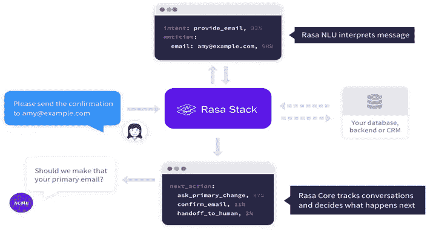

# 对话式人工智能— Rasa 框架基础

> 原文：<https://medium.com/mlearning-ai/conversational-ai-rasa-framework-basics-1658c5e16857?source=collection_archive---------4----------------------->


Image Creadit([https://en.everybodywiki.com/Rasa_NLU](https://en.everybodywiki.com/Rasa_NLU))

# 在这篇博客中:

*   什么是对话式 AI？
*   什么是拉莎·NLU？
*   官方 Rasa 开发者认证主题

# 什么是对话式 AI？

> 对话式人工智能是一套技术，使计算机能够以自然的方式理解、处理和响应语音或文本输入，通常与机器人或智能虚拟代理(IVAs)结合使用。如果做得好，它可以帮助人们以更快更简单的方式与复杂的系统进行交互，并帮助企业提供大规模的个性化参与和支持。— kore.ai

# 什么是拉莎·NLU？

人工智能助手必须完成两项任务，首先助手需要理解输入消息，即意图分类和实体提取，然后根据意图和实体给出正确的响应。

Rasa 堆栈通过自然语言理解组件 Rasa NLU 和对话管理组件 Rasa 核心来处理这些任务。是什么让 NLP 成为上下文相关的人工智能助手。Rasa NLU 通过在所谓的管道中处理用户消息来提供这种完全的可定制性。

管道定义了不同的组件，这些组件顺序地处理用户消息，并最终导致将用户消息分类成意图和提取实体。

# 官方 Rasa 开发认证

## 车间前设置

在你各自的操作系统上安装最新版本的 rasa 有时会变得很有挑战性，特别是你没有使用虚拟环境，并且你打破了所有项目的依赖关系，所以我建议你通过 pip 使用 anaconda 虚拟环境或 virtualenv。

获取最新的 rasa 版本和安装步骤都包含在[链接](https://docs.google.com/document/d/1sRuzqzpX7AcI3FzyTI3nAl6chMFhvT0GF25nz9_1b_c/edit)中。

这是在 Rasa 开发研讨会中作为资源提供的链接。

## Rasa 开源简介

Rasa 是开源机器学习框架，即基于文本和语音的自动化对话。理解消息，进行对话，并连接到消息传递通道和 API。

我提到的是官方的 rasa youtube 播放列表链接，这是你能在 youtube 上找到的最好的概念性解释之一。

现在让我们了解项目文件结构。

1.  更新配置:

对于常见的问题和一些随意的对话，你总是希望你的助手在每次被问到这类问题时都以同样的方式回答。

规则允许你这样做。要使用规则，您需要将规则策略添加到配置文件中的策略中。

因此，您必须在 config.yml 文件中配置两个部分，一个是为用户的最新输入制定下一个最佳操作的策略，另一个是管道，以便从句子(消息)中分类和提取意图和实体。

它将 NLU 管道中的 ResponseSelector 包含在您的配置文件中。ResponseSelector 需要一个特征器和意图分类器来工作，所以它应该在管道中的这些组件之后。

2.创建规则:

您只需要为每个检索意图编写一个规则。然后，在该检索意图下分组的所有意图将以相同的方式处理。动作名称以 utter_ 开始，以检索意图的名称结束。编写响应输入的规则。

3.NLU 培训数据:

ResponseSelector 的 NLU 训练示例看起来与常规训练示例一样，只是它们的名称必须引用它们所属的检索意图。

4.定义静态响应:

您必须为 ResponseSelector 定义一些静态响应，其命名约定与检索意图相同。

5.自定义操作:

您必须为自定义任务定义一些客户操作，通过自定义操作，您可以调用 API 或数据库查询或运行一些计算。



# 构建您的自定义助手

NLU(自然语言理解)是 Rasa 开源的一部分，它执行意图分类、实体提取和响应检索。

NLU 将接受诸如“我正在市中心寻找一些高质量的晚餐夜餐馆”的句子，并返回诸如以下的结构化数据:

Rasa 开源使用 YAML 作为统一和可扩展的方式来管理所有的训练数据，包括 NLU 数据、故事和规则。

您可以将训练数据分割成任意数量的 YAML 文件，每个文件可以包含 NLU 数据、故事和规则的任意组合。训练数据解析器使用顶级关键字来确定训练数据类型。

该域使用与训练数据相同的 YAML 格式，也可以跨多个文件拆分或合并到一个文件中。

NLU 训练数据由按意图分类的示例用户话语组成。培训示例还可以包括实体。实体是可以从用户消息中提取的结构化信息。您还可以将正则表达式和查找表等额外信息添加到定型数据中，以帮助模型正确识别意图和实体。

## 目的

*   按照用户意图分组的训练示例，例如，可选地带有注释的实体。

```
nlu:
- intent: check_balance
  examples: |
    - What's my [credit](account) balance?
    - What's the balance on my [credit card account {"entity":"account","value":"credit"}
```

*   同义词

```
nlu:
- synonym: credit
  examples: |
    - credit card account
    - credit account
```

*   正则表达式

```
nlu:
- regex: account_number
  examples: |
    - \d{10,12}
```

*   查找表

```
nlu:
- lookup: banks
  examples: |
    - JPMC
    - Comerica
    - Bank of America
```

## 实体

实体是可以从用户消息中提取的结构化信息。

实体在训练示例中用实体的名称进行注释。除了实体名称之外，还可以用同义词、角色或组来注释实体。

注释实体的完整语法是:

```
[<entity-text>]{"entity": "<entity name>", "role": "<role name>", "group": "<group name>", "value": "<entity synonym>"}
```

## 故事

故事由以下部分组成:

*   Story:故事的名称。名称随意，不用于培训；你可以把它作为故事的可读性参考。
*   元数据:任意的和可选的，不在训练中使用，你可以用它来存储关于故事的相关信息，比如作者。
*   步骤列表:组成故事的用户消息和动作。

```
stories:
- story: Greet the user
  metadata:
    author: Somebody
    key: value
  steps:
  # list of steps
  - intent: greet
  - action: utter_greet
```

每个步骤可以是下列步骤之一:

*   由意图和实体表示的用户消息。
*   一个 or 语句，其下包含两个或多个用户消息。
*   机器人行动。
*   一张表格。
*   插槽被设置事件。
*   一个检查点，它将故事连接到另一个故事。

## 规则

规则列在 Rules 键下，看起来类似于故事。一个规则也有一个步骤键，它包含一个与故事相同的步骤列表。规则还可以包含 conversation_started 和 conditions 键。

这些用于指定应用规则的条件。

```
rules:
- rule: Only say `hey` when the user provided a name
  condition:
  - slot_was_set:
    - user_provided_name: true
  steps:
  - intent: greet
  - action: utter_greet
```

# 领域

域定义了您的助手在其中工作的领域。它指定了你的机器人应该知道的意图、实体、插槽、响应、形式和动作。它还定义了对话会话的配置。

```
version: "2.0"intents:
  - affirm
  - deny
  - greet
  - thankyou
  - goodbye
  - search_concerts
  - search_venues
  - compare_reviews
  - bot_challenge
  - nlu_fallback
  - how_to_get_startedentities:
  - nameslots:
  concerts:
    type: list
    influence_conversation: false
  venues:
    type: list
    influence_conversation: false
  likes_music:
    type: bool
    influence_conversation: trueresponses:
  utter_greet:
    - text: "Hey there!"
  utter_goodbye:
    - text: "Goodbye :("
  utter_default:
    - text: "Sorry, I didn't get that, can you rephrase?"
  utter_youarewelcome:
    - text: "You're very welcome."
  utter_iamabot:
    - text: "I am a bot, powered by Rasa."
  utter_get_started:
    - text: "I can help you find concerts and venues. Do you like music?"
  utter_awesome:
    - text: "Awesome! You can ask me things like \"Find me some concerts\" or \"What's a good venue\""actions:
  - action_search_concerts
  - action_search_venues
  - action_show_concert_reviews
  - action_show_venue_reviews
  - action_set_music_preferencesession_config:
  session_expiration_time: 60  # value in minutes
  carry_over_slots_to_new_session: true
```

## 时间

我们还没有去过的地方是老虎机。

插槽是你的机器人的记忆。它们充当键值存储，可用于存储用户提供的信息以及从外部世界收集的信息。

大多数时候，你希望插槽影响如何对话的过程。不同的行为有不同的插槽类型。

例如，如果您的用户提供了他们的家所在的城市，您可能会有一个名为 home_city 的文本槽。如果用户问天气，而你不知道他们的家乡城市，你就要问他们了。文本槽只告诉 Rasa 核心该槽是否有值。文本的具体值没有任何区别。

如果值本身很重要，就使用分类槽或布尔槽。还有浮动和列表槽。如果您只想存储一些数据，但不希望它影响会话的流程，请使用非功能化插槽。

```
slots:
  name:
    type: text
    initial_value: "human"
```

*   文本
*   布尔代数学体系的
*   绝对的
*   浮动
*   目录
*   任何的
*   自定义插槽类型

# 模型配置

配置文件定义了您的模型将用于根据用户输入进行预测的组件和策略。

语言和管道键指定模型用来进行 NLU 预测的组件。policies 键定义了模型用来预测下一个操作的策略。

## 政策

您的助理使用策略来决定在对话的每一步采取何种行动。你的助手可以同时使用机器学习和基于规则的策略。

```
language:  # your language
pipeline:
  # - <pipeline components>policies:
  - name: MemoizationPolicy
  - name: TEDPolicy
    max_history: 5
    epochs: 200
  - name: RulePolicy
```

您可以通过在项目的配置中指定 policies 键来自定义您的助手使用的策略。yml 有不同的策略可供选择，并且您可以在一个配置中包含多个策略。

**政策优先**

在这种情况下，两个策略以相同的置信度预测。例如，记忆和规则策略可能都有把握地预测 1。考虑策略的优先级。

Rasa 开源策略具有默认的优先级，设置这些优先级是为了确保在出现平局时的预期结果。它们看起来像这样，数字越大，优先级越高:

*   6 — `RulePolicy`
*   3 — `MemoizationPolicy`或`AugmentedMemoizationPolicy`
*   1 — `TEDPolicy`

## 管道

你可以用 Rasa 构建任何语言的助手。

您的 Rasa 助手可以用于任何语言的训练数据。如果你的语言没有单词嵌入，你可以用你提供的数据训练你的特征。

```
language: "fr"  # your two-letter language codepipeline:
  - name: WhitespaceTokenizer
  - name: RegexFeaturizer
  - name: LexicalSyntacticFeaturizer
  - name: CountVectorsFeaturizer
  - name: CountVectorsFeaturizer
    analyzer: "char_wb"
    min_ngram: 1
    max_ngram: 4
  - name: DIETClassifier
    epochs: 100
  - name: EntitySynonymMapper
  - name: ResponseSelector
    epochs: 100
```

# 行动

在每个用户消息之后，该模型将预测助理接下来应该执行的动作。

**回应**

响应是助理将发回给用户的消息。当您希望助手向用户发送文本、图像、按钮或类似内容时，这是您最常使用的操作。

**自定义动作**

自定义操作是可以运行您想要的任何代码的操作。例如，这可以用于进行 API 调用，或者查询数据库。

**表格**

表单是一种特殊类型的自定义操作，旨在处理业务逻辑。如果你有任何对话设计，你希望助理询问一组特定的信息，你应该使用表格。

**默认动作**

默认动作是默认情况下内置在对话管理器中的动作。这些大多是基于特定的对话情境自动预测的。您可能想要定制这些来个性化您的助手。

## 自定义操作

自定义动作可以运行任何你想要的代码，包括 API 调用，数据库查询等。

您想要在故事中使用的任何自定义操作都应该添加到您的域的操作部分。

当对话引擎预测要执行的自定义动作时，它会调用动作服务器。

```
**from** **rasa_sdk** **import** Action
**from** **rasa_sdk.events** **import** SlotSet

**class** **ActionCheckWeather**(Action):
   **def** name(self) -> Text:
      **return** "action_check_weather"

   **def** run(self,
           dispatcher: CollectingDispatcher,
           tracker: Tracker,
           domain: Dict[Text, Any]) -> List[Dict[Text, Any]]:

      dispatcher.utter_message("Hello World! from custom action") **return** []
```

**重要链接:**

**注:**提到喜欢用来写这篇文章和写作的基本知识，我从官方 Rasa 开发认证学到的。

*   [https://rasa.com/showcase/](https://rasa.com/showcase/)
*   [https://rasa.com/docs/rasa/](https://rasa.com/docs/rasa/)
*   [https://blog.rasa.com/rasa-education-and-certification/](https://blog.rasa.com/rasa-education-and-certification/)

推特账号:

[](https://twitter.com/datarishi) [## JavaScript 不可用。

### 编辑描述

twitter.com](https://twitter.com/datarishi) 

Linkedin:

[Vishvdeep dasa diya——助理软件工程师——埃森哲| LinkedIn](https://www.linkedin.com/in/vishvdeep-dasadiya-65770312b/)

GitHub:

[https://github.com/vdnew/](https://github.com/vdnew/Real-Time-Insights-from-Social-media-Data---Data-Science-Case-Study)