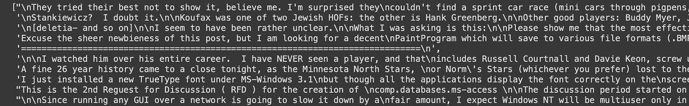
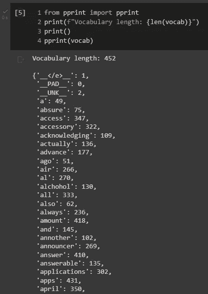
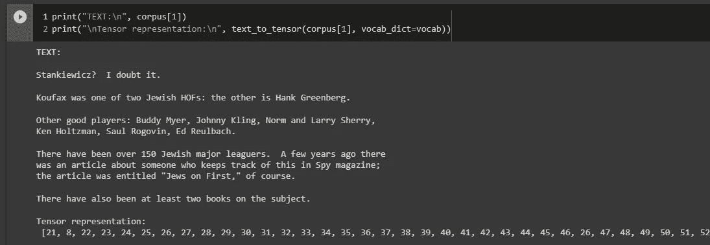

# 将文本转换为张量以进行深度学习

> 原文：<https://medium.com/mlearning-ai/convert-texts-into-tensors-for-deep-learning-74b0cf48d416?source=collection_archive---------1----------------------->

*将文本数据转换成张量格式的简单模板*

Photo by [Bermix Studio](https://unsplash.com/@bermixstudio?utm_source=unsplash&utm_medium=referral&utm_content=creditCopyText) on [Unsplash](https://unsplash.com/s/visual/4b667c39-7ffe-40de-83e7-e0d8f24487ff?utm_source=unsplash&utm_medium=referral&utm_content=creditCopyText)

本文将向您展示如何为基于神经网络的应用程序准备文本。给定一组文本数据，我们将应用以下过程

1.  文本(标记)到索引的单词映射
2.  为句尾、填充和词汇外符号创建特定标记
3.  将字典中的术语转换成张量

词汇表将我们的数据组织成*键:值*对，其中键是术语，值是与术语相关的整数索引。将会有具有这些特征的特殊令牌

*   **__PAD__** :表示填充符号
*   **< /e >** :表示行尾(句子结束)
*   **__UNK__** :表示不在词汇中的符号，不属于字典

这项工作将非常有用，因为它将为我们的**数据生成器**(这里我们不讨论)提供一个模板，以一种简单而有效的方式创建输入。

# 数据集

我们将使用 Sklearn 提供的数据集，*20 个新闻组*，快速访问大量文本数据。出于演示的目的，我将只使用 10 个文本的样本，但该示例可以扩展到任何数量的文本。

The sample dataset. Image by Author.

在这些文本上，我们将应用一个简单的预处理函数来清除句子中的停用词和特殊字符。

# 该过程

## 预处理功能

下面的函数将用于我们的预处理

该函数可用于任何自然语言处理问题，因此可以随意使用和编辑。

## 词汇的创造

使用词汇表可以让我们将术语映射到索引。索引是将被转换成张量的元素。

输出将如下所示

A preview of the vocabulary that maps term to index. Image by Author.

## 从文本到张量

我们将编写一个函数，使用词汇表创建术语的数字表示。这些数字将包含在一个列表中，并代表我们将在深度学习任务中使用的张量。

在这个例子中，我们不会使用 TensorFlow、PyTorch 或 Numpy 来解释这个过程是如何工作的。

我们将从*文本张量*函数开始

Conversion of text data in tensor. Image by Author.

现在我们可以继续使用我们的张量来创建一个 *batch_generator* 和一个深度学习模型，比如 LSTM。

 [## Mlearning.ai 提交建议

### 如何成为 Mlearning.ai 上的作家

medium.com](/mlearning-ai/mlearning-ai-submission-suggestions-b51e2b130bfb)