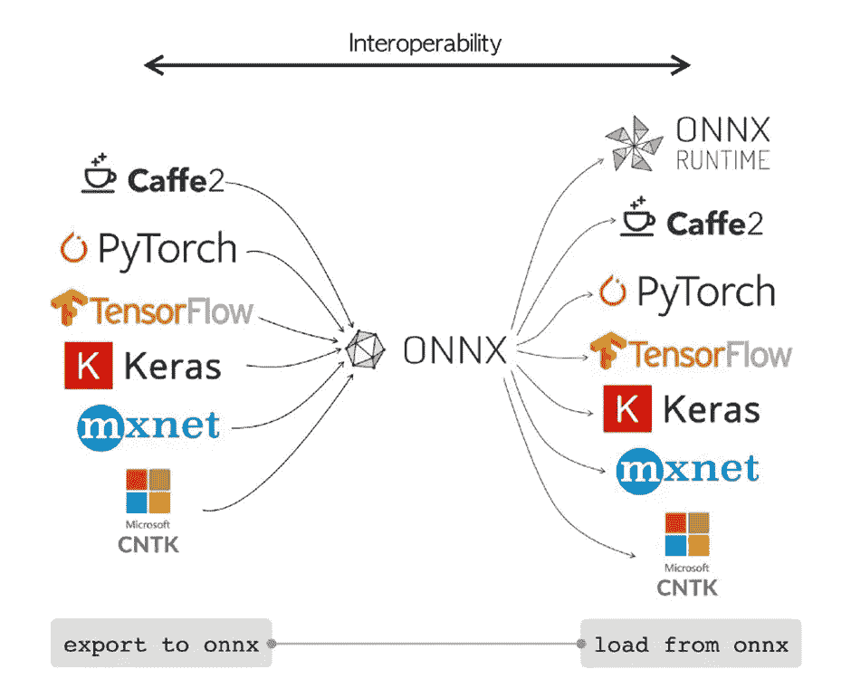
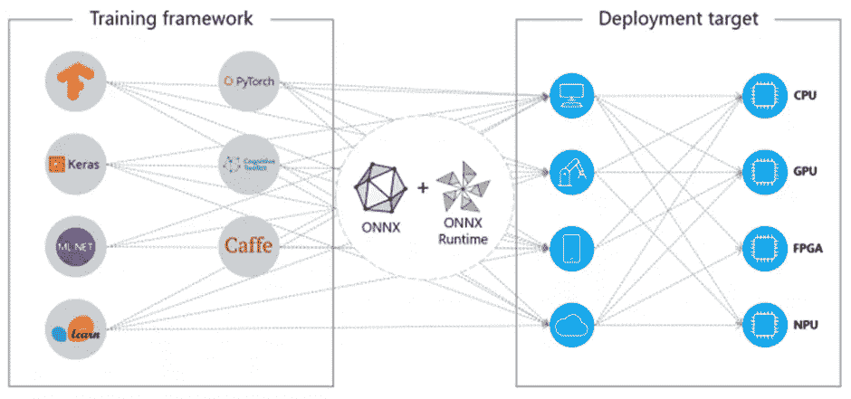
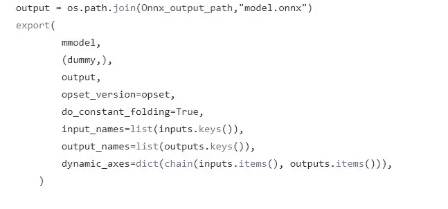
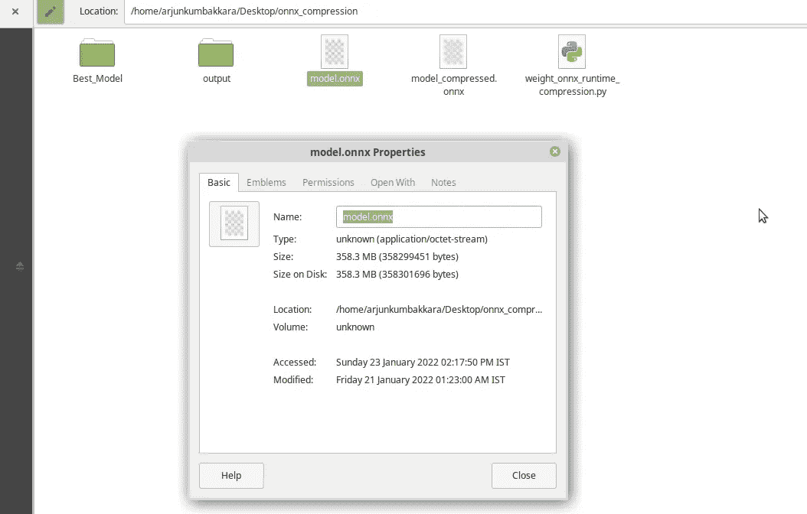
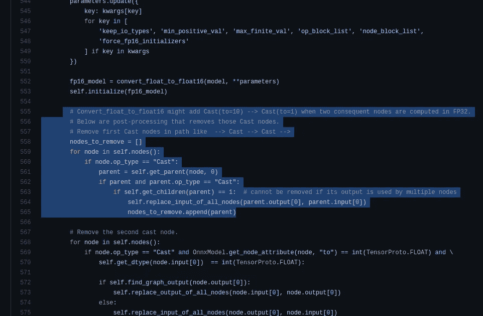
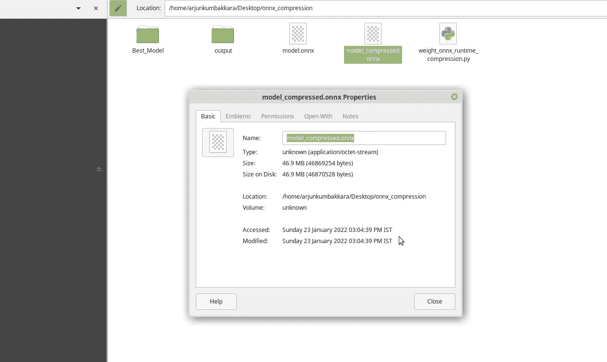
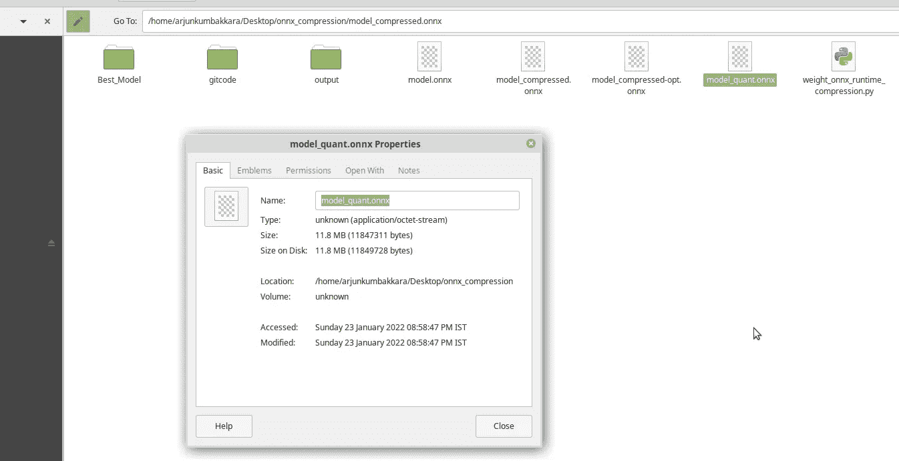

# 将您笨重的变压器模型转换为轻量级高性能 ONNX 模型！

> 原文：<https://medium.com/mlearning-ai/convert-your-bulky-transformer-models-into-lightweight-high-performance-onnx-models-5b18bc25ee06?source=collection_archive---------4----------------------->

# 作者

纳巴伦·巴鲁阿

[Git](https://github.com/nabarunbaruaAIML)/[LinkedIn](https://www.linkedin.com/in/nabarun-barua-aiml-engineer/)/[towards data science](/@nabarun.barua)

阿尔琼·库姆巴卡拉

[Git](https://github.com/arjunKumbakkara)/[LinkedIn](https://www.linkedin.com/in/arjunkumbakkara/)/[towards data science](/@arjunkumbakkara)

> **简介:**我们如何将我们为文本分类训练的 ALBERT 模型转换到 ONNX 运行时，以及它如何从 46.8 mb 的大小突然增加到 358.3 mb。箱重量文件)。

答在转换阶段之前，我们对 python 进行了广泛的优化试验，之后我们意识到我们关注的是错误的领域。因此，我们认为解决的办法是将。onnx 将权重转换为压缩的量化版本。其细节如下:

# 为什么是 ONNX？

*   ONNX 运行时:跨平台由于 ONNX 是所有流行的机器学习、人工智能模型的通用格式。将训练好的模型(权重)转换成符合 ONNX 的 ONNX 模型已经成为事实上的标准。例如，将 Tensorflow 或 Pytorch 中构建的任何模型转换成另一种格式是一项痛苦的任务。出现了许多前所未有的问题和异常，解决这些问题可能会耗尽您的开发/实验时间。因此，这是确保您的模型不会陷入框架锁的最佳方式。跨平台兼容性使部署变得容易，我们将在接下来的部分中讨论这一点



ONNX interoperability | Image by [Fernando López](https://towardsdatascience.com/onnx-preventing-framework-lock-in-9a798fb34c92#:~:text=ONNX%20is%20the%20acronym%20that,giants%20Microsoft%2C%20Facebook%20and%20Amazon.) | Logos taken from the original source

*   更快的推理:ONNX 运行时中的推理更快，因为运行时本身是用 C 语言构建的，而且它是我们能得到的最接近机器的。它的执行速度非常快。
*   与环境无关的部署:虽然你的训练阶段是在 python 中，但是 ONNX 现在可以灵活地将训练好的权重部署到多个其他栈或环境中，比如 C#/C++/Java 等。

本质上，ONNX 有助于实现架构和硬件之间的高度互操作性。



Credit: opendatascience.com

# 转换为 ONNX:

从下面可以看出，转换到 ONNX 运行时就是调用一个 API (Pytorch)



为了进一步了解，请随意航行到我们建立的这个培训管道，并从中检查 ONNX 阶段。点击 [ONNX](https://github.com/nabarunbaruaAIML/CML_with_DVC_on_Transformer_NLP/blob/main/src/stage_04_onnx.py) [注意:如果你想了解整个流程，那么就去看这篇文章](/mlearning-ai/continuous-machine-learning-on-huggingface-transformer-with-dvc-including-weights-biases-6a909983e48e)，它解释了代码和架构的整个培训管道[。](/mlearning-ai/continuous-machine-learning-on-huggingface-transformer-with-dvc-including-weights-biases-6a909983e48e)

## 问题是:

然而，这里的问题是，直接转换可能会增加模型的整体大小，如下面所附的图片所示(我们使用 ALBERT Transformer 作为示例)。模型训练后，获得的大小为 46.8 mb，但在直接转换为 ONNX 运行时后，大小增加了 40 倍，这对任何推理活动来说都太多了。因此，为了让您更容易地过渡到 ONNX 运行时并有效地使用它，我们不得不进行一些工作，如下所述。

# 优化转换而不损失任何勇气的方法！

## 第一次压缩:ONNX 模型大小压缩，通过删除可被视为重复的共享层。

这只是减少 onnx 转换模型的一种简单的 pythonic 方式。这个实现是基于 ONNX 团队的一个提示。

原始重量尺寸:


然而，转换后的大小达到 358.3 mb。

Onnx 重量尺寸:



## ONNX 团队关于解决方案正确性的摘录:

“作为 BERT 优化的一部分，ALBERT 模型在各层之间共享权重。随着模型尺寸变大，export torch.onnx.export 将权重输出到不同的张量。使用下面的 python 脚本，我们可以删除重复的权重，并减少模型大小，即，比较每对初始值设定项，当它们相同时，只需删除一个初始值设定项，并将它的所有引用更新为另一个初始值设定项。”

**" " ONNX Team @天雷屋" " "**



实施后:

压缩 Onnx 权重大小:



供您参考的依赖项:

```
pip install --upgrade transformers sentencepiece
pip install --upgrade onnxruntime
pip install --upgrade onnxruntime-tools
```

## 第二动态量化:通过对转换后的 ONNX 模型进行量化。

动态量化研究

```
.....
 quantize_dynamic(onnx_model_path,
                     quantized_model_path,
                     weight_type=QuantType.QInt8)......
```

这里，onnx runtime . quantization . quantize 对 HuggingFace BERT 模型应用量化。它支持使用 IntegerOps 的动态量化和使用 QLinearOps 的静态量化。对于激活 ONNXRuntime 目前只支持 uint8 格式，对于权重 ONNXRuntime 同时支持 int8 和 uint8 格式。这里我们对伯特模型使用动态量化，对权重使用 int8。



## 第三:ONNX 运行时的优化器。

然而，不建议这样做，因为 num_heads，hidden_size 如果选择不正确，会妨碍模型的训练。然而，它直接使用。

```
.....
# optimize transformer-based models with onnxruntime-tools
from onnxruntime_tools import optimizer
from onnxruntime_tools.transformers.onnx_model_bert import BertOptimizationOptions
# disable embedding layer norm optimization for better model size reduction
opt_options = BertOptimizationOptions('bert')
opt_options.enable_embed_layer_norm = False
opt_model = optimizer.optimize_model(
    'bert.onnx',
    'bert', 
    num_heads=12,
    hidden_size=768,
    optimization_options=opt_options)
opt_model.save_model_to_file('bert.opt.onnx')
```

这可能会给你很多警告，因为“onnxruntime_tools”现在已被弃用。因此，我们建议您使用第一种方法，这是最简单的方法，而且非常有效！附注:我们测试了这些是否有不必要的偏差。结果发现根本没有，而且效果很好。

每种方法都有其优点和缺点，请根据您的推断标准选择方法。

如果你喜欢这个博客，请表达你的爱，给我们一个大拇指，给我们加星，如果不喜欢，请在评论区给我们一个反馈。希望这能帮助你理解加速推理的重要性。

为了合作、帮助和共同学习——加入我们的 Discord 服务器:【https://discord.gg/Z7Kx96CYGJ 

github Repo:[https://github . com/nabarunbaraaiml/onnx _ model _ size _ compression](https://github.com/nabarunbaruaAIML/onnx_model_size_compression)

一路平安！

[](/mlearning-ai/mlearning-ai-submission-suggestions-b51e2b130bfb) [## Mlearning.ai 提交建议

### 如何成为 Mlearning.ai 上的作家

medium.com](/mlearning-ai/mlearning-ai-submission-suggestions-b51e2b130bfb)