# 计算机科学人士的卷积

> 原文：<https://medium.com/mlearning-ai/convolution-for-computer-science-people-2da7482272be?source=collection_archive---------9----------------------->

当卷积神经网络显著改善视觉任务时，了解卷积的概念对计算机科学人员来说变得至关重要，特别是数据科学家。

卷积运算符要求保持一个函数不变，然后将另一个函数移动到固定的函数上，并将它们相乘。这个动作产生了一个新的函数，并且计算它的积分，或者如果我们在离散域中的话，计算它们的和。

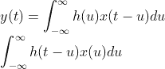

Continuous timed signals

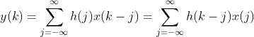

Discrete timed signals

下图显示了卷积运算如何翻转一个函数并将其移动到固定函数上。

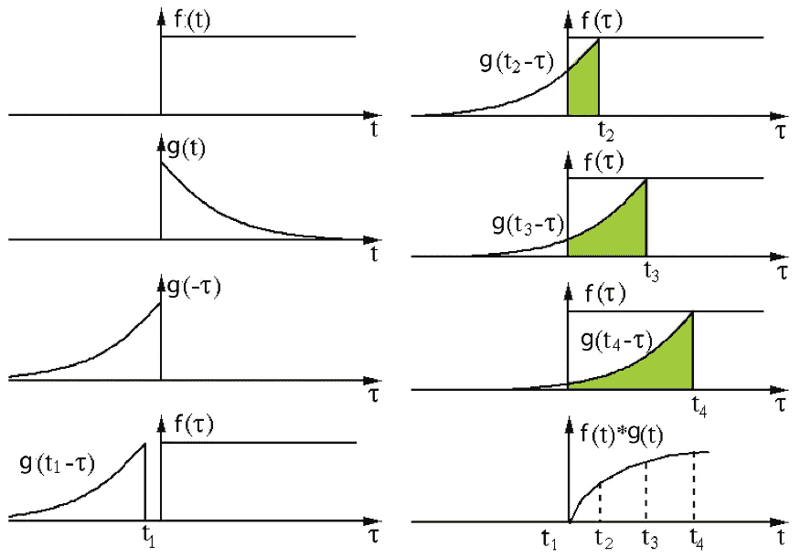

g(t) function is reversed concerning the y axis (because it has minus inside its parenthesis) [[reference](https://matbox.ir/%DA%A9%D8%A7%D9%86%D9%88%D9%84%D9%88%D8%B4%D9%86-%D9%88-%D9%82%D8%B6%DB%8C%D9%87-%DA%A9%D8%A7%D9%86%D9%88%D9%84%D9%88%D8%B4%D9%86/)]

当函数中独立变量的数量增加时，例如像图像这样的双变量函数:

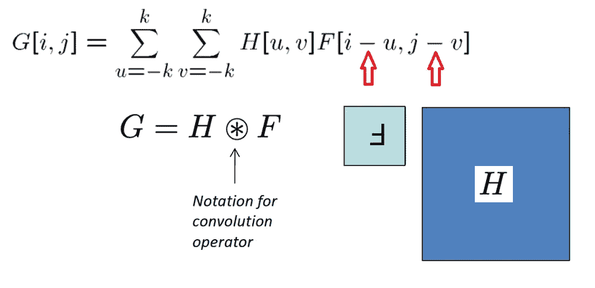

因此，在这些情况下，翻转发生在两个变量上。

下图显示卷积如何将翻转的函数移动到另一个之上。

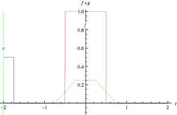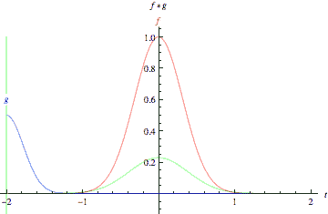

[[reference](https://mathworld.wolfram.com/Convolution.html)]

由于这些示例中的函数在结构上是对称的，翻转并不明显。

## 卷积的重要特征

**P1:共有财产**

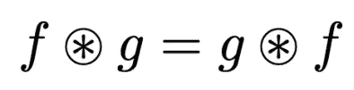

**P2:关联属性**

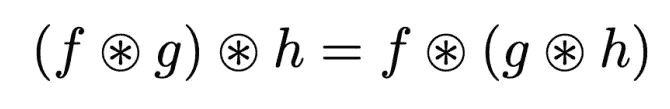

**P3:身份属性**:

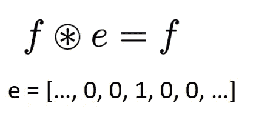

**P4:线性叠加和缩放特性**

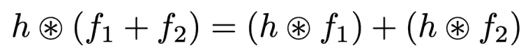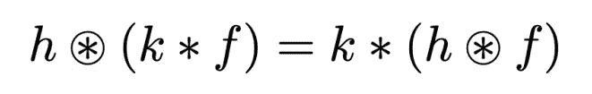

**P5:微分**

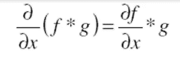

**注**:通常为了求解卷积，通过从时间到频率域的映射从拉普拉斯定理得到帮助。

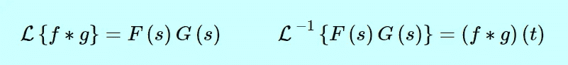

还有一个函数(**互相关**)非常类似于卷积。它的不同之处在于它没有使用翻转版的内核。相反，它在图像上移动内核，以找到内核(它可以是该图像的一部分)和固定图像(背景图像)之间的相似性。

但是，卷积是用来改变图像的，通常就像寻找边缘一样。如果核是对称的，那么卷积和相关没有区别。此外，定义了互相关，并且可以仅通过翻转核来用作卷积。

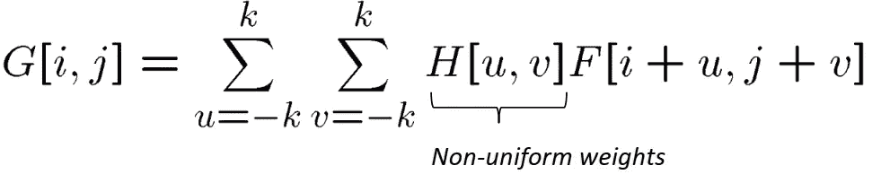

在下面的代码片段中，我使用 python OpenCV 包中的 filter2D 进行关联，然后翻转内核并进行卷积。

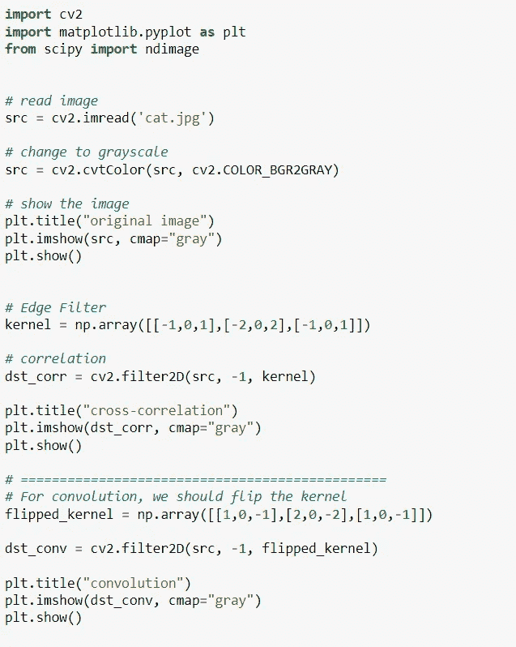

查看结果，了解不同之处:

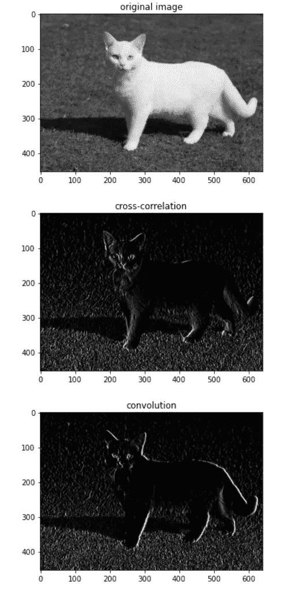

注意，为了翻转内核，我们可以很容易地使用名为 cv2.flip(src_img)的 OpenCV 方法。

 [## Mlearning.ai 提交建议

### 如何成为 Mlearning.ai 上的作家

medium.com](/mlearning-ai/mlearning-ai-submission-suggestions-b51e2b130bfb)