# 卷积网络、递归神经网络和变换器

> 原文：<https://medium.com/mlearning-ai/convolutional-networks-recurrent-neural-networks-and-transfomers-ee6a63ddb57f?source=collection_archive---------5----------------------->

这是我总结 Sergey Levine 教授举办的 CS182 讲座系列文章的第二篇，所有的荣誉都归于他。所有图片均取自他的讲座。这些是第一条、[、第三条](/mlearning-ai/detailed-basics-of-deep-learning-part-three-b930c40cf7f8)和[第四条。](https://samuelebolotta.medium.com/7a88e847f62e)

## [卷积网络](https://www.youtube.com/watch?v=jNW1Hi7Yi4c&list=PL_iWQOsE6TfVmKkQHucjPAoRtIJYt8a5A&index=17)

假设你有一张可爱小狗的照片。你想对一张小狗、猫、河马或长颈鹿的图片进行分类。

你可以训练一个完全连接的网络来解决这个问题:

然而，至少有两个问题:

**1 计算困难**

如果我们观察这样一个网络中的第一个线性层，我们会看到它读入一个图像并产生第一个激活向量。该线性层中的权重数量将等于第一隐藏层中的激活数量 z(1)乘以整个图像中的数值数量。对于图像中的每个像素和每个颜色通道，我们需要与输出数量相等的多个权重。

假设:

*   这个图像是 128x128x3 (49.152 个数字)
*   我们的第一个隐藏层有 64 个维度，这实际上是一个非常小的隐藏层

即使这样，这个第一权重向量中的参数总数将是 49.152 的 64 倍，超过 300 万:

这只是这个微小的 64 维隐藏层的第一层。

**2 对换档不稳定**

如果小狗的照片向左或向右移动哪怕一个像素，它在网络上看起来就会完全不同。

**一个想法**

在某种意义上，我们关心的许多视觉特征都是局部的。如果我们想识别这是一张小狗的照片，首先我们要提取边缘:

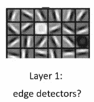

然后我们会提取一些局部区域，比如耳朵和鼻子:

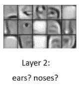

> 关于这些属性，有趣的是它们都是局部特征:要确定某个特定位置是否有边缘，你只需要查看附近的像素。

我们可以利用这一观察来设计一种神经网络，这种网络可以通过首先进行局部运算，然后仅在信息量已经减少到更易于管理的水平时才执行全局运算，而不需要更多的参数。

**卷积**

我们将构建一个小型边缘检测器，并将其应用于图像中的每个区域，因为您识别图像边缘的方式不会因您观察的位置而改变:

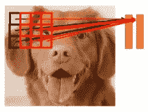

*   我们的小检测器将被称为过滤器(或内核)。
*   它将具有与输入图像相同的深度(在这种情况下是 3 个颜色通道)。
*   由于有 64 个特征，我们将为每个 3x3x3 区域堆叠 64 个过滤器。这里我只画了四个:

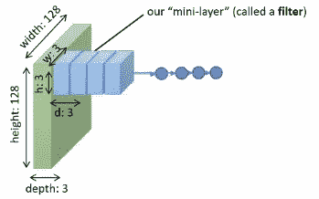

*   对于输入图像中的每个位置，我们有 64 个过滤器，这为每个 3x3x3 区域产生一个长度为 64 的小向量。
*   我们将把这个 3x3x3 (27 个数字)过滤器应用于图像中的每个小块，并计算 64 个特征。现在，64 乘以 27 只是 1728，而不是 300 万。随着卷积滤波器沿图层的输入矩阵滑动，卷积运算会生成一个特征图，该图反过来会影响下一图层的输入。
*   之后，我们对它们中的每一个应用非线性，就像我们在常规神经网络中所做的那样
*   我们现在得到另一个盒子，它的深度是 64，宽度和高度也是 128。

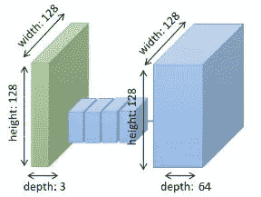

现在，我们已经将 128x128x3 的图像转换成了 128x128x64 的激活图。好像每个像素都变成了 64 个特征的向量。过滤器是什么样子的？

你可以想象将这些滤镜中的每一个通过图像，对于相应的滤镜，激活将是该特征存在的程度。

另外，卷积神经网络的一个优点是，网络通过自动学习来学习优化滤波器，因此它们独立于先验知识和人工干预。

卷积利用了三个可以帮助改进机器学习系统的重要思想:稀疏交互、参数共享和等变表示。

1.  传统的神经网络层使用参数矩阵的矩阵乘法，其中单独的参数描述每个输入单元和每个输出单元之间的相互作用。这意味着每个输出单元都与每个输入单元相互作用。然而，卷积网络通常具有稀疏交互(也称为稀疏连通性或稀疏权重)。这是通过使内核小于输入来实现的。例如，在处理图像时，输入图像可能有数千或数百万个像素，但我们可以检测到小的、有意义的特征，如核仅占用数十或数百个像素的边缘。
2.  参数共享是指在一个模型中对多个函数使用相同的参数。在传统的神经网络中，当计算一层的输出时，权重矩阵的每个元素只使用一次。它被乘以输入的一个元素，然后不再被重新访问。作为参数共享的同义词，可以说网络具有绑定的权重，因为应用于一个输入的权重值与应用于其他地方的权重值绑定在一起。在卷积神经网络中，在输入的每个位置使用核的每个成员(可能除了一些边界像素，取决于关于边界的设计决策)。卷积运算使用的参数共享意味着我们只学习一组参数，而不是为每个位置学习一组单独的参数。
3.  在卷积的情况下，参数共享的特定形式会使图层具有一种称为平移等方差的属性。说一个函数是等变的意味着如果输入改变，输出也以同样的方式改变。

但是这里有一个问题:我们没有把东西做得更小。我们减少了参数的数量，但我们的激活仍然是这些巨大的地图，它们具有与原始图像相同的分辨率和潜在的更多深度，因为我们可能想要比原始图像中的颜色通道更多的功能。

**联营**

为了降低图层的分辨率，我们将每个 2x2x64 的面片转换为 1x1x64，方法是对每个区域的每个通道进行最大激活。为什么是麦克斯？直观上，如果该图中的激活表示该特征存在的程度，那么我们通过取最大激活来评估该区域中该特征的存在是有意义的。这使得它对小的平移变化也是鲁棒的:如果图像移动很小的量，每个区域中的最大值可能会保持不变。

合并后，您可以执行另一个卷积，应用另一个非线性，然后执行另一个合并。一般来说，卷积网络的典型层包括三个阶段。

1.  在第一阶段，该层并行执行若干卷积，以产生一组线性激活。
2.  在第二阶段，每个线性激活通过非线性激活函数运行，例如修正的线性激活函数。这个阶段有时被称为探测器阶段。
3.  在第三阶段，我们使用一个池函数来进一步修改层的输出

**卷积和合并**

回想一下先验概率分布的概念。这是一个模型参数的概率分布，在我们看到任何数据之前，它编码了我们对什么模型是合理的信念。先验可以被认为是弱的或强的，这取决于先验中概率密度的集中程度。弱先验是具有高熵的先验分布，例如具有高方差的高斯分布。这种先验允许数据或多或少地自由移动参数。强先验具有非常低的熵，例如具有低方差的高斯分布。这种先验在确定参数的最终位置时起着更积极的作用。一个无限强的先验将一些参数的概率设置为零，并表示这些参数值是完全禁止的，无论数据对这些值的支持程度如何。我们可以把卷积网络想象成类似于全连通网络，但其权重具有无限强的先验。这个无限强的先验表明，一个隐藏单元的权重必须与其相邻单元的权重相同，但在空间上有所偏移。先验还指出，权重必须为零，除非在分配给该隐藏单元的小的、空间连续的感受场中。总的来说，我们可以认为卷积的使用在层的参数上引入了无限强的先验概率分布。这个先验知识表明该层应该学习的函数只包含局部交互，并且与翻译是等变的。同样，池的使用是一个无限强的先验，每个单元对于小的平移应该是不变的。

CNN 看起来像什么？

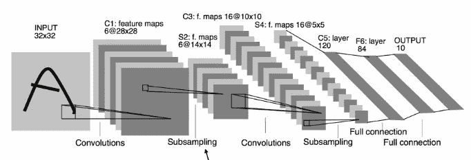

例如，这是 LeNet，一个用于手写数字识别的网络。

*   它接受 32x32 个手写字符作为输入
*   C1 卷积层:28x28x6 (28 而不是 32，因为边缘(我们将在下面讨论)和 6，因为它有 6 个特征)
*   非线性
*   S2 池(二次采样):2x2 池，将 28x28 的地图转换为 14x14 的地图。
*   C3 卷积层:10×10×16(10 而不是 14 是因为边缘，16 是因为它有 16 个特征)
*   非线性
*   S4 池(二次采样):2x2 池，将 10x10 的地图变成 5x5 的地图。
*   5x5x16 足够小，现在您可以将这些激活展平到一个大矢量中，并将其放入一个标准的全连接线性层中

**实现卷积层**

我们将需要 N 维数组，通常作为“张量”的同义词使用。张量是矩阵的高维推广。

例如，输入图像可以是 3D 阵列；过滤器可以是 4D；激活可以是 3D 的。这类似于我们在标准神经网络中看到的权重和激活，其中我们有 2D 权重矩阵和 1D 激活。

假设我有一个激活 a(1)，我要把它变成 z(2):

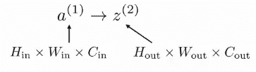

我们的滤波器由 W 张量指定:

卷积运算将使用此过滤器，将其放置在输入地图的每个位置，并生成相应的地图。让我们把它写成 z(2)中沿纵轴的位置 I 和沿横轴的位置 j 的等式:

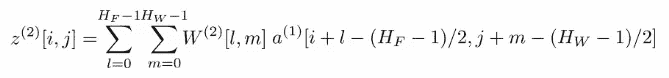

我们将 W(2)乘以输入激活图中的一个点；我们将通过以(I，j)为中心来获得该点，然后根据 l 和 m 向左或向右移动。这是一种说法，在卷积中，每个位置都有一个小的线性层，您可以滑动它。

这样做之后，不要忘记应用你的非线性:

**填充和边缘**

如果你的内核向左移动两步，离开了图像的末端，会怎么样呢？

你有两个选择:

**1 切掉边缘**

在某些指数变为负值或大于图像宽度时，不允许对过滤器进行评估

如果输入为 32x32x32，滤波器为 5x5x6，则输出为 28x28x6。

我们可以这么想。我们可以想象过滤器有一个半径，我们可以通过将它的高度减去一除以二来计算:

在我们的例子中，半径因此是 2。如果半径超出了图像的末端，那么它就是无效的——这就是为什么我们在每一侧(底部、顶部、左侧、右侧)切掉一些与半径相等的位置。32x32 就这样变成了 28x28。

然而，当你像这样切掉边缘时，我们的激活会随着每一层而收缩。有些人不喜欢这样，尤其是当这些激活图在你的网络末端变得非常小的时候。

**2 补零**

使用零填充，您可以在角和边上评估过滤器:任何超出图像或激活图末端的点都将被替换为零:

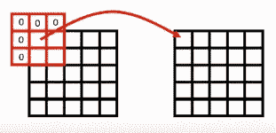

记住先减去图像平均值是很重要的，因为你放入的这些零将低于原始图像中的任何激活。通常，你取平均像素强度，然后从每个位置的像素强度中减去它，这样图像就在中间了。

零填充的一个优点是它在某种意义上更简单:激活映射的大小保持不变，您不必担心事情变得更小。

**交错卷积**

正如我们所说，每一层的标准结构包括三个步骤:

1 卷积
2 激活功能
3 汇集

然而，第一步在计算上可能非常昂贵，因为它不需要很多参数，但你要重复矩阵乘法很多很多次。

这里有一个让它便宜一点的想法:如果你跳过一些位置呢？您可以跳过一个称为步幅的量，而不是在输入图像的每个点评估过滤器。

重要的是，步长卷积不同于池化，因为在池化中，你确实要计算每个位置的激活，然后取最大值，而在步长卷积中，你要一起跳过一些位置。

**卷积神经网络的例子**

**AlexNet** 是一个经典的中等深度卷积神经网络:

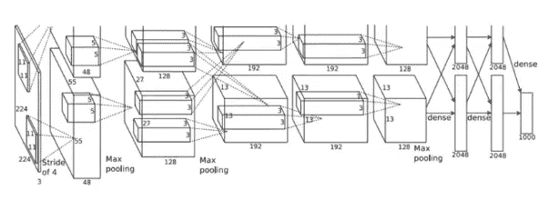

之所以以这种方式绘制，是因为网络是在两个 GPU 上运行的，并且被手动分成两部分。这对网络的功能没有任何影响。

*   输入是 224x224x3 的图像
*   第一个卷积层是 11x11x96
*   这些过滤器的应用步长为 4。你将把图像的大小减少大约四分之一，减去由于边上的填充而产生的边缘效果；这为我们提供了一个 55x55x96 的激活图
*   ReLU 激活

*   3x3 最大池层，步幅为 2。您将减少到 27x27x96
*   标准化层。这已经不再广泛使用了。

突击测验:第一个卷积层有多少个参数？参数的数量仅取决于滤波器，滤波器为 11x11x96。

请记住，每个卷积层中 W 矩阵的大小为:

所以你最后得到 11x11x3x96，总计 34.848 个参数。我们遗漏了偏置向量中的参数数量，它只取决于输出的数量(96)。

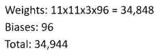

这些是相当多的参数，但它仍然比我们拥有一个完全连接的层所需的参数低得多。

最后，我们有完全连接的层:

您可以看到一些模式:

*   池层减少了激活的规模
*   随着你越深入，特征的数量往往会增加:我们试图用更深层次的低分辨率激活图来总结图像中的所有信息，这有助于我们表现更抽象的特征。
*   一旦事情变得足够小，我们就将它们展平，并通过几个完全连接的层来产生一个答案

这些图案很有价值。但是 AlexNet 已经不再被使用了，现在处理视觉输入的最好的网络也变得更加深入了。

**VGG** 的建造试图追求标准化和模块化，当我们必须建立非常深的网络时，这真的很有帮助。

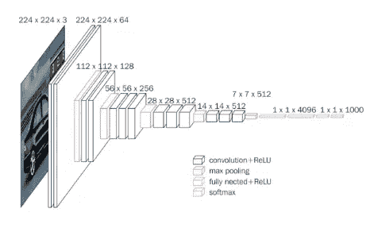

*   输入是一个 224x224x3 的图像，我们用步长 1 和零填充卷积来处理它:分辨率没有降低。这些是巨大的激活图，但是过滤器非常小(3x3x64)。
*   非线性
*   2x2 最大池层，以降低分辨率。
*   两层卷积
*   非线性
*   2x2 最大池层
*   三层卷积
*   2x2 最大池层
*   三层卷积

…

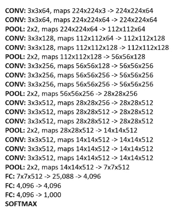

你可以在这里看到图案:我们有两到三层完全不会降低分辨率的回旋层，中间穿插着将分辨率降低一半的汇集层。每次我们将分辨率降低一半，我们通常会增加过滤器的数量，在某些时候，它足够小，我们可以构建我们的第一个完全连接的层。

一些观察结果:

*   更多的层意味着更多的处理，这就是为什么我们看到这些重复的块
*   大部分内存实际上是在开始时使用的，因为在开始时我们有这些巨大的激活图
*   参数的数量在完全连接的层中是最大的，其中我们将激活展平成一个巨大的向量

ResNet 最初有 152 层，但从那时起，人们就用类似的想法来扩展网络。

我将展示一个高度简化的 18 层原型的图表:完整的 152 层版本与此类似，只是所有内容都被拉伸了很多。

*   我们从一个 7x7 卷积开始，这样可以降低分辨率。然后，我们有这些重复的 3x3 卷积块，它们之间的分辨率降低；随着时间的推移，滤波器的数量会增加两倍，直到达到 512，然后保持不变。
*   我们有许多层的通用块，中间穿插一些池操作。
*   该模型的另一个显著特征是，我们不是在末端有一个巨大的全连接层，而是简单地取上一个卷积响应图，并对每个位置的特征向量进行平均
*   然后我们有一个线性层直接进入 softmax

我们来看看为什么 ResNet 可以用这么大的层数来训练。ResNet 论文的作者进行了一些实验，研究增加层数的影响。

在左边，你可以看到他们对一个标准卷积网络的实验，你可以把层数从 20 层增加到 32 层，从 44 层增加到 56 层。你可以看到，错误率随着层数的增加而增加。ResNet 的人发现，通过对神经网络架构的修改，你可以逆转这一趋势，并看到准确性随着层数的增加而增加。

**主旨是什么？**

在左边的规则网络中，你有你的权重层，它可以是卷积或完全连接的，你可以串联应用它们。另一方面，对于剩余网络，你取每组两个卷积，把第一个卷积的输入加到第二个卷积的输出上。

因此，如果在规则网络中，你考虑每组两个卷积计算某个函数 h(x)，在剩余网络中，该组两个卷积将计算 h(x)，其中 h(x)等于规则网络中发生的情况加上 X。X 绕过这些卷积，并在最后被相加。直觉告诉我们，你计算的是 x 的变化，而不是一个全新的 x。

为了理解这种直觉，我们必须重新考虑为什么训练非常深的网络如此困难。链式法则看起来就像一堆雅可比的乘法运算；对于任意深度的网络，损失对第一层权矩阵的导数将是大量雅可比矩阵的乘积。然后最后你乘以这个数 dL / dz(n):

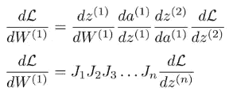

这些雅可比矩阵可以是各种不同的东西。非线性的导数，线性层的导数，卷积的导数。如果我们简化一下，考虑一下标量，将许多数字相乘的问题是有两种可能的结果:如果大多数数字小于 1，我们将得到 0，而如果大多数数字大于 1，我们将得到无穷大。有一小部分情况下答案更有趣，这一小部分情况是当所有的数字都接近 1 时:只有当它们都接近 1 时，你才能从许多标量相乘中得到合理的答案。

对了，这就是为什么我们更喜欢 ReLUs 而不是 sigmoids 整流线性单位的导数是输入是否为正的指标，这意味着这些导数的大部分仅为 1。

对于矩阵来说，接近 1 并不意味着每一项都是 1，而是意味着矩阵的特征值需要接近 1。

如果我们回头看看我们的图像，残差层 dH/dx 由 dF/dx 加上恒等式给出，因为您只是添加了 x，只要卷积层中的权重不太大，您可能希望这个 dF/dx 也不会太大。在这一点上，这个总和将非常接近于恒等式:

## [让神经网络训练](https://www.youtube.com/watch?v=0dNAhN4ypFc&list=PL_iWQOsE6TfVmKkQHucjPAoRtIJYt8a5A&index=20)

请记住，神经网络优化景观是有问题的，神经网络是混乱的。他们需要很多技巧来训练好，知道这些技巧对于好的结果非常重要，就像理解所有理论上的细微差别一样重要。我们将讨论:

*   标准化输入和输出
*   标准化激活(批量标准化)
*   初始化权重矩阵和偏差向量
*   渐变剪辑
*   超参数优化的最佳实践
*   辍学学生

**标准化输入和输出**

假设你有这样一个神经网络:

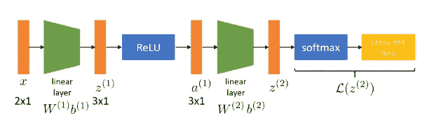

它接受 2D 输入，我们的一些数据点如下所示:

在这里，一切看起来都很正常。X1 和 x2 各不相同，这是一个标准设置，你会期望一切正常。但是如果我们看看这个场景:

第一个维度与第二个维度的尺度非常不同。它的数值更大，范围更大。这些数据点代表的实际信息可能完全相同，如果您重新调整右侧数据点的条形，您可能会得到与左侧分布完全相同的结果。由此产生的梯度条件较差，网络将倾向于在传递到较小的数字之前关注较大的数字，即使它们对于预测问题不一定更重要。

标准化是我们解决这个问题的方法:我们转换我们的输入，使它们趋向于均值为零，标准差为一。如果你想让平均值为零，你要做的就是从 x 的每个维度上减去平均值:

x 的期望值是平均值，通过对数据集中的所有 x 取平均值来估算。

如果你也想让标准差为 1，那么你做同样的事情，然后除以数据集中 x 的标准差:

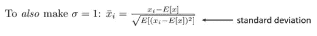

如果你正在解决一个回归问题，对于输出来说这样做也是一个好主意。

**标准化激活(批量标准化)**

为了使激活标准化，我们将使用小批量来估计平均值和标准差。不是通过对数据集中每个数据点的激活进行平均来估计平均值，这将是非常昂贵的，我们将通过对该批中所有数据点的激活进行平均来估计平均值。

我们对标准差做同样的事情。我们不是计算整个数据集的标准偏差，而是只计算批次的标准偏差。在实际实现中，我们还会有两个额外的激活参数(γ和β)。在我们减去平均值并除以标准差后，我们的激活将在一个特定的范围内，但我们可能不希望它进入下一层。相反，我们可能想对它们进行变换，将它们乘以一个标度，并加上一个偏差。

您可以将批处理规范化视为一个层，它根据当前批处理中进入批处理规范层的所有激活计算平均值和标准差，然后具有参数 gamma 和 beta。

一些实用的细节:

*   如果你使用批量范数，你通常可以使用更大的学习率，因为它会使你的导数更好地进行调节，并在某种程度上防止这些真正笨拙地缩放的客观景观，其中一些维度比其他维度具有更大的梯度。
*   具有批量范数的模型可以训练得更快，并且通常需要较少的正则化

**初始化权重矩阵和偏置向量**

我们不会尝试初始化我们的权重，以便它们接近一个好的解决方案，我们只是要初始化它们，以便在初始化时，神经网络的导数是高质量的，这意味着它们指向一个最优的方向。

对于小型网络，一个非常简单的选择是将权重初始化为一些小的随机数；例如，我们可以选择平均值为 0、标准差为 0.0001 的正态分布。但随着你的网络越来越深，这将很快给你不好的答案，因为如果激活为零，那么梯度也为零。如果梯度为零，那么你没有任何进展:

事实上，这相当于一个非常糟糕的平台期。

为了避免这个问题，我们使用 Xavier 初始化。Xavier 初始化的目标是初始化权重，使得激活的方差在每一层上都相同。这种恒定的变化有助于防止渐变爆炸或消失。我不会解释数学证明的所有细节，因为这不是本文的目的。下面是粗略的描述。

假设我们将在某个线性层初始化我们的权重，以便根据均值为 0 且方差为σw 平方的高斯分布对我们的权重进行采样

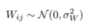

我们应该把方差设为多少？

*   偏差将被初始化为零，这是 z 中每个条目的公式

*   我们标准化 x，因此激活是高斯的。

这些 z 的大小是多少？如果平均值都是零，那么 z 的大小就是它们的标准差。如果我们写出 z 的方差，因为 z 是零均值，这就是 z 平方的期望值:

你得到平方和的期望值，并得到平方和中的每一项。这简化为:

的维数乘以σw 的平方乘以σa 的平方。

我们走上这条道路是因为我们担心我们对权重初始化的选择会增加或减少激活的幅度。如果前一层激活的差异为:

下一层有大量的激活:

然后我们知道:

如果我们希望激活的幅度在一层又一层之间保持不变，我们需要以某种方式确保 Da sigma w 的平方大约为 1。我们可以选择σw 的平方为 1/Da:

**基本原理是，我们需要标准偏差为 1 除以输入向量维数的平方根。**

我们忽略了一个细节:我们忘记了非线性。在我们应用这个线性层之后，我们将对 z 应用一些非线性函数，这个非线性函数将改变它们的大小。一种非常常用的非线性函数是整流线性单元。更深层次的网络几乎总是使用 ReLUs，因为它们比 sigmoids 表现得更好。然而，问题是 ReLU 会将我们的许多激活清零；事实上，如果我们的激活是正态分布的，并且平均值为零，那么 ReLU 会将其中的一半激活归零。

如果我们一半的激活将被删除，这确实会减少我们的差异。为了避免这种情况，我们将方差增大两倍，或者等效地将标准差平方根增大两倍:

一个更小的细节:偏见。之前，我们说过我们会把所有的偏置向量初始化为零。但是再一次，ReLU 会杀了他们中的一半。通常，尤其是当人们不使用半因子时，将偏差初始化为一些小的正常数是很常见的，比如 0.1，因为死单位。

**高级初始化**

到目前为止，我所描述的基本初始化对于大多数问题都很有效。然而，我们现在将讨论一种更高级的初始化形式，这既是因为有时它工作得很好，也是因为它有助于理解网络初始化发生了什么。

损失相对于某一层的权重的导数由许多许多矩阵的乘积给出，特别是该层和损失之间的所有雅可比矩阵。不用担心这些矩阵是什么，我们可以把它写成一个大产品。如果你把许多东西相乘，而所有的东西都小于 1，那么乘积大约为零；另一方面，如果它大于 1，它将是无穷大。只有当所有这些雅各比都接近一个时，你才能得到合理的答案:

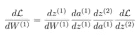

对于一个接近 1 的矩阵，它的特征值必须接近 1。

我们可以把任何一个雅可比矩阵写成三个矩阵的乘积(例如，用奇异值分解):

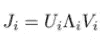

*   u 和 V 是比例保持变换；它们是正交基。这意味着当你把一个向量乘以矩阵 U 或 V 时，它不会改变向量的长度，它只会以不同的方式旋转向量。
*   λ是对角的，λ的对角元素是雅可比矩阵的特征值。粗略地说，lambda 捕捉到了这个矩阵的所有缩放，U 和 V 捕捉到了所有旋转

如果我们可以强迫 lambda 在每个维度上都有一个尺度，那就足以确保这个雅可比的大乘积不会产生巨大或微小的数字。请记住，线性层的雅可比矩阵只是其权重矩阵的转置矩阵，因此，如果我们希望这些雅可比矩阵的特征值约为 1，我们必须获取权重矩阵，并对其执行类似奇异值分解的操作，然后以某种方式强制λ成为单位矩阵:

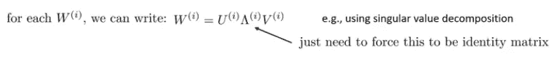

我们可以进行一些任意的初始化，对其进行奇异值分解，强制对角线一致，然后将它放回一起。强迫对角线相等，意味着放弃它，把最终的矩阵构造成 U 乘以 v。

**渐变裁剪**

有时，可能会发生这样的情况，你选择最陡下降的方向，一切都很好，你认为你正在取得良好的进展，然后你得到一些怪物梯度，完全打乱了你的网络:

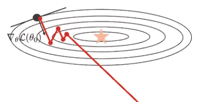

渐变剪辑通常是修补这个问题的一种合理的权宜之计。有两种方法可以裁剪渐变。

*   一种方法是你可以裁剪渐变中的每一个条目，使它不大于某个常数 c，也不小于负 c。

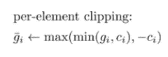

*   你可以做的另一件事是，你可以剪切梯度的范数:你保持方向，只剪切长度。

要手动选择 c，您可以运行几个时期的训练，看看健康的梯度幅度是什么样的。这是万不得已的措施。

**合群和辍学**

我们将从讨论如何让神经网络更好地优化，转向讨论如何让它们更好地推广。

当我们在进行机器学习时，我们担心我们的模型是否会犯错误，以及大概如何让它少犯错误。神经网络将会有很多参数，因此会有很高的方差。这里有一个有趣的想法:如果我们有多个高方差学习者，我们训练许多神经网络而不是一个，也许这些多个神经网络都会同意正确的答案，但他们会不同意错误的答案。

这是另一种说法，即错误的方式比正确的方式多得多。这些网络有望独立出错，这意味着当一个模型出错时，另一个也可能出错，但方式不同。这是合奏背后的基本直觉。

假设我们正在解决一个回归问题，假设这条绿色曲线代表真实函数，而蓝色点是我的训练集:

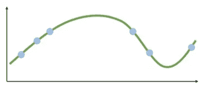

我训练了一个大型神经网络模型，它的解用这条橙线表示，这条橙线在我的训练数据附近很好，但在远离训练数据的地方就很差。

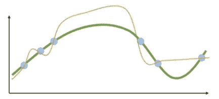

我可以用完全不同的初始化训练另一个模型，得到另一个解。这两个模型在训练集上都很好，在测试集中都很差。

我再训练一个。如果我看看这三个模型的平均值，可能会相当不错。他们都会不同意，但总的来说，他们的错误都集中在正确的答案上。

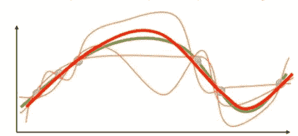

当然，这张图有点理想化，但这是基本的直觉。

我接下来要描述的是构建自举系综的理论方法。方差被量化为我们从对某个数据集 D 的训练中获得的模型与来自该训练分布的所有可能数据集的所有模型的平均值之间的差值的期望值。

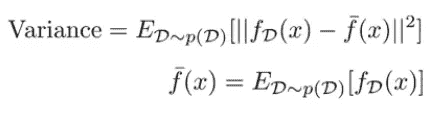

如果方差很大，你会认为你的误差很大。但是如果我们可以估计 f bar，那么我们应该可以消除很多方差。我们能不能以某种方式得到 m 个不同的训练，每组训练一个不同的模型，然后把这些模型平均起来？我们预计，如果所有这些不同的模型都不同意，并在测试点上犯不同的错误，那么他们的平均值将被迫同意接近正确的答案。

但是我们从哪里得到这些数据集呢？我们能不能从一个数据集中拼凑出多个独立的数据集，而不必处理更少的数据？

*   一个简单而天真的方法是将一个大数据集分割成 m 个不重叠的部分，但这是一种浪费，因为这样你就可以在更少量的数据上训练每个模型
*   也许我们不需要这 m 个数据集是不重叠的，我们可以用某种方式从一个大型数据集构建独立的数据集，这些独立的日期与原始日期的大小相同

这是可能的，这被称为替换重采样。我们将对原始数据集中的数据点进行重新采样。假设我们的原始数据集有三个点(当然，实际上我们会有更多)。

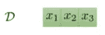

我们正在构建第一个重采样数据集；我们掷出一个三面骰子，得到这个:

话说回来:

如果我们从原始训练集中对新数据点 i.i.d .进行采样，它们也将是原始训练分布中的 i.i.d .样本。因为它们是独立采样的，所以它们最终是来自同一个原始分布的独立样本。这些数据集最终会变得独立。

这些模型之间的区别在于它们有不同的参数向量，因为它们是在不同但密切相关的数据集上独立训练的。一旦我们有了这些不同的模型，那么在对新的测试点进行分类时，我们必须以某种方式将它们的预测结合起来。

*   原则上的方法是将它们的概率平均在一起，所以你向前运行这些模型，从它们的软最大值中得到概率，然后你将这些概率平均在一起得到集合的预测
*   一个稍微简单但仍然有效的方法是简单地进行多数表决。我们也可以让他们预测他们认为正确的答案是什么，然后输出对应于网络多数票的答案，而不是看这些网络的实际概率

在实践中，当我们深入学习时，我们很少使用这种带替换的重采样方法，因为有一种更简单的方法非常常用，而且似乎也同样有效。使用替换进行重采样的目的是为了在不同的模型之间获得足够的可变性，所以直观地说，我们不希望所有的模型最终都得到相同的错误解。使用替换对数据进行重采样是一种区分数据的方法，但是我们通常用于训练深层网络的方法已经具有很大的随机性(不同的随机初始化、随机小批量洗牌、随机梯度下降)。由于所有这些随机性的来源，没有两次训练运行，即使是对于相同的精确模型和相同的精确数据，看起来也会是相同的。在实践中，我们甚至不用生成这些单独的数据集，也能从集成中获得同样的好处。如果我们只采用 m 种不同的模型，并在完全相同的训练集上对它们进行训练，我们就会得到足够不同的模型。

从深层网络中构建集成的实际方法是，在同一训练集上简单地训练 m 个不同的模型，然后对它们的概率取平均值，或者进行多数表决:

**更快的合奏**

这些网络可能非常大，培训成本也很高。但是请记住，深度学习是关于表示的，最后一层通常是特定于任务的，并且试图理解表示。这意味着我们可以尝试只集成最后几层。我们可以训练多个不同的网络，但让它们共享执行特征提取的主干，然后为每个头部设置一组不同的完全连接的层。

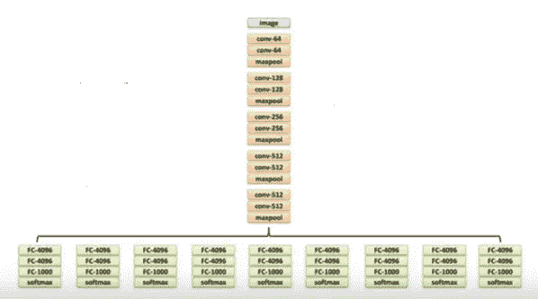

这并不像真正的组装那样好，但是训练起来要快得多，设置起来也更容易

通常，合奏团越大效果越好，但是制作大型合奏团确实很昂贵，尤其是如果你在训练独立的模特。这种计算很容易并行化，但它仍然会让您付出代价。那么，我们能不能只用一个网络组成一个庞大的团队？

这就是所谓的辍学技术试图做的。脱落背后的想法是，你要利用你的神经网络，你要随机杀死一些激活——你会进入每一个隐藏层，并以一定的概率，你会删除一些单位设置他们为零。

这和合奏有什么关系？你可以把这个杀死一些激活的过程想象成在旧网络之外构建一个不同的网络；每组激活对应于一个不同的网络，因此通过选择不同的随机激活组来删除，您正在构建新的网络。但是这些网络没有单独的权重，它们实际上共享所有的权重，它们只是具有不同的架构。

我们实现的方式是:在每次向前传递期间，每次我们到达某一层时，我们将通过删除一半来计算该层的激活:

向后传球的工作方式完全相同。梯度是与 a 的外积，因此如果激活被设置为零，则其导数也将被设置为零。实际上，当您这样做时，就从网络中删除了该激活。

dropout 工作原理背后的直觉是，它迫使神经网络建立冗余的表示，并处理每个特征都有可能被删除的事实——因此它不能仅基于单个特征进行预测。它迫使网络变得健壮和更加可靠。当你以这种方式训练时，你会得到一些看起来非常非常庞大的集合，因为每一个特征删除的组合都可以被认为是一个不同的模型。

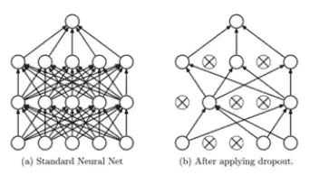

测试时会发生什么？

在训练时，一半的维度被强制为 0。在测试时，我们不使用任何丢弃，所以权重和激活之间的乘积是两倍大。因此，我们将砝码除以 2，以进行补偿，并使其回到原始刻度。

**超参数**

有了我们讨论过的所有这些技巧，我们最终会得到很多超参数。其中一些会影响优化:

*   学习率
*   动力
*   初始化
*   批量标准化

其中一些影响概括:

*   组装
*   拒绝传统社会的人
*   体系结构

我们如何选择所有这些参数？要做的一件重要的事情是识别哪种类型的参数应该影响什么。

例如，坏的优化超参数会在训练过程的早期出现。因此，我们可以调整它们，开始训练网络，观察训练误差，看看它在最初几个时期是如何演变的。其他超参数会影响验证误差。当调整超参数时，从非常广泛的混合参数开始，只训练一小会儿，然后看看基础训练进展如何，这通常是一个好主意。然后你再次调整你的超参数，缩小它们的范围，然后重复。

在网格搜索中，参数被详尽地定义和搜索。在随机搜索中，不会尝试所有指定的参数。与穷举搜索相比，这种方法更有优势，因为您可以选择该搜索所需的最大尝试次数。

## [递归神经网络](https://www.youtube.com/watch?v=PyZvbaC5oQY&list=PL_iWQOsE6TfVmKkQHucjPAoRtIJYt8a5A&index=30)

**如果我们有一个可变大小的输入会怎么样？**

序列输入可以是可变长度的。例如，它们可能是英语句子(第一个序列有四个元素，第二个序列有三个元素，第三个序列有五个元素):

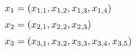

这可能包括:

*   语序→情感分类问题:你网上有一篇评论，你想猜猜这是正面评论还是负面评论。
*   声音序列→从声音中识别音素的问题
*   图像序列→视频中的活动分类问题

您需要一个能够:

*   适应多个输入和多个不同数量的输入
*   共享功能

**一个想法**

层数变得与输入数相同。换句话说，每一层都有单独的输入:

如果你有一个长度为 4 的序列，那么你就有四层。如果你有一个长度为 3 的序列，那么你会有三层。如果你有一个长度为 5 的序列，那么你将有五层。

在每一层，我们现在有两个输入:

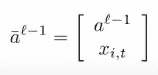

*   前一层的激活
*   新的输入 x

然后，我们对此应用常规线性运算:

像往常一样，我们应用非线性:

这非常像标准的线性层；唯一的区别是，现在您将新输入连接到先前的层激活，然后通过线性和非线性操作传递它们，而不是将线性层应用到先前的层激活。

缺失的层会发生什么？如果你有一个长度为 5 的序列，那么你会有五层，而如果你有一个长度为 3 的序列，那么你会有三层。

这里有一个有趣的技巧:如果我们有一个较短的序列，我们就假设在第一次输入之前的层(该层不存在)的激活都是零:

事实上，不管序列有多长，我们都会这样做；即使对于最长的序列，我们仍然有一个虚拟的前一层，其中激活都是零。执行我们的常规操作时:

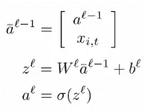

在第一层，我们将把输入连接成一个大的零向量

这种设计的一个大问题是我们在每一层仍然有不同的权重矩阵。真正长的序列将最终需要许多这样的权重矩阵。然而，最后几层将被训练用于所有序列，而仅用于最长序列的第一层可能很少被训练。

为了将这种设计变成成熟的递归神经网络，我们需要做的一个额外的修改是共享权重矩阵。

这意味着所有这些层的 W(l)都是相同的

*   你如何评价这个网络的一切都不会改变
*   在测试时，一切都是完全一样的。我们只需将虚拟的第一层初始化为零，然后继续这些操作:

*   这只影响训练。在训练期间，我们必须强制矩阵 W(l)对于所有层都是相同的:

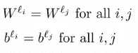

非常长的序列可能需要非常早期层的权重(我们只在非常长的序列中看到)，但现在这些权重与后面层中使用的权重相同，并且它们已经被训练得相当好。

如果我们强迫权重矩阵在每一层都完全相同，我们就可以有任意多的层

RNN 的基本设计:

*   深度等于序列长度的非常深的网络
*   每一层都获得不同的输入:它将前一层的激活与该时间步的输入连接起来，通过线性层，然后通过非线性层
*   第一层从虚拟的前一层获得零作为输入
*   权重矩阵在所有层共享，这意味着我们不需要数量等于最长序列长度的权重矩阵

**我们如何培养 rnn？**

简而言之，我们要稍微修改一下反向传播。

当我们运行反向传播时，基本设计是相同的。首先，我们向前运行一遍来计算每一步的所有 a 和 z。然后，对于向后传球，我们以同样的方式进行。我们将 delta 初始化为最终损耗相对于最后一层输出的导数，然后对于每个线性层和每个 ReLU，我们计算相对于其参数的导数和相对于其输入(即前一层)的导数。

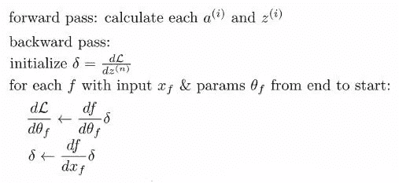

问题是现在所有这些层的参数都是相同的。这意味着第 4 层的θf 与第 3 层的θf 是相同的变量。如果我们要在下一层运行这个算法:

从右边开始，我们将计算δ，即损耗相对于第四层输出的导数，然后在第四层，我们将计算损耗相对于权重和偏差的导数。然后，我们将计算新的增量，我们将回到第 3 层，在第 3 层，我们将用第 3 层 w 和 b 的梯度覆盖梯度。因此，从字面上看，层 l-1 的梯度将覆盖层 l 的梯度-我们不希望这样。**我们希望损失对 w 的导数和损失对 b 的导数能够解释 w 和 b 对每一层的影响，而不仅仅是第一层。**

解决这个问题非常非常简单。不用把导数“df / dθf”设为“df/dθf”x“δ”，只需要把它加到导数的值上:

你要这样做:

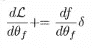

而不是这个:

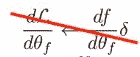

在反向传播的开始，你初始化你所有的梯度，所有的导数为零，然后在反向传播的每一步，对于每一层，你把“df/dθf”x“δ”加到导数的当前值上。

如果我们有可变大小的输出会怎样？

例如，我们可能想要为图像生成文本标题，预测未来视频帧的序列或生成音频序列。以前，我们在每一层都有一个输入；现在，我们将在每一层都有一个输出。

一个迫在眉睫的问题是，这些输出中的每一个都有自己的损失。在每一步，就像前面一样，我们将执行这些操作:

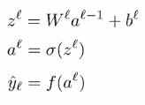

现在，该层将有一些函数应用于 a (l ),这是某种读出函数，有时也称为解码器。f 的参数将在所有时间步中共享，就像线性层的参数一样。我们在每个 y hat(l)上都有损失，我们的总损失就是每一步损失的总和。这是一个非常简单的合并损失的方法。

我们的问题是，在这一点上，如何使用反向传播还不完全清楚，因为常规的神经网络是一个链，从下一层获得 delta，然后反向传播到上一层。现在，我们处在一个神经网络有分支的情况下。在每一个时间步，我们会从该步的损失中得到一个增量，并从下一步得到另一个信号。然后，我们需要生成一个返回到上一步的增量。

我们要画出这个过程的计算图。

输入 x 进入线性层，然后进入非线性层，然后是我们的第一个读出函数 f1，它可以是一个线性层，后跟一个 softmax，进入第一个时间步长的损耗:

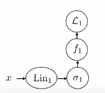

适马 1 也进入第二线性层。所以，它产生一个值，比如说 a1，这个 a1 被两个下游函数使用:f1 和 lin2。

然后，lin2 进入 sigma 2，同样的机制。所有时间步长的损失相加，这就是最终产生最终损失值的原因。

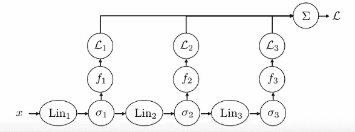

我们可以把每一层想象成一个函数 f，它以 xf 为输入，以 yf 为输出。我们总是从最后一个函数开始反向传播，其中初始增量只有一个。这是表示常规神经网络反向传播的图形方式:

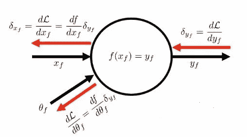

常规网络的算法只是一个循环，从最后一层开始向后进行，在每一层都要计算这些δ“YF ”,并用它们来计算δ“xf”和“dL/dθ”。

现在，我们将对此进行一点概括。我们必须处理的问题是，我们有一些节点，其输出进入多个节点。如果你看一下我上面画的计算图，你会注意到 sigma1 的输出进入 f1，也进入 lin2。在反向传播过程中，会有一个增量来自其中一个输出，另一个增量来自另一个输出。我们所做的就是把它们加在一起，然后把它们代入同一个算法。

这有时也被称为“反向模式自动微分”

**如果每一步都有多个输入和多个输出会怎么样？**

我们只是把之前看到的两个概念结合起来。在每一步，我们都:

*   将前一层的激活与新输入连接起来
*   应用线性层
*   应用非线性层
*   有一些读出功能(可以只是一个线性层和一个 softmax)来产生输出 y hat 在这一步

**是什么让注册护士难以训练？**

最基本的 rnn 是非常深的网络

我们必须重新考虑为什么训练非常深的网络如此困难。[链式法则](/mlearning-ai/backpropagation-6a2575f09537)看起来就像一堆雅可比的乘法运算；对于任意深度的网络，损失对第一层权矩阵的导数将是大量雅可比矩阵的乘积。然后最后你乘以这个数 dL / dz(n):

这些雅可比矩阵可以是各种不同的东西。非线性的导数，线性层的导数，卷积的导数。如果我们简化一下，考虑一下标量，将许多数字相乘的问题是有两种可能的结果:如果大多数数字小于 1，我们将得到 0(消失梯度)，而如果大多数数字大于 1，我们将得到无穷大(爆炸梯度)。有一小部分情况下答案更有趣，这一小部分情况是当所有的数字都接近 1 时:只有当它们都接近 1 时，你才能从许多标量相乘中得到合理的答案。顺便说一下，这是我们我们更喜欢 ReLUs 而不是 sigmoids 整流线性单位的导数是输入是否为正的指标，这意味着这些导数的大部分仅为 1。

对于矩阵来说，接近 1 并不意味着每一项都是 1，而是意味着矩阵的特征值需要接近 1。爆炸渐变并不太难处理，因为我们总是可以剪辑我们的渐变，以防止它们爆炸；RNNs 的最大挑战来自消失梯度。一个直观的解释是，如果你的梯度消失，来自后面步骤的梯度信号永远不会到达前面的步骤:当这种情况发生时，你的神经网络变得无法保持记忆

**通过 RNN 促进更好的梯度流动**

在每一层，我们都要将新的输入连接到先前的层激活，然后通过线性和非线性操作传递它们。我们称之为“RNN 动力学”。

当我们谈论消失梯度时，我们关心的特定导数是 RNN 动力学的雅可比:

这是 q 相对于先前激活的导数。当然，我们不只是想强迫导数总是有接近 1 的特征值(或者接近恒等式)，因为有时候我们确实想忘记一些事情，有时候我们想用各种有趣的方式来变换它们。我们只希望在真正想回忆的时候，它能接近身份。

换句话说，不要只是强迫他们是身份，而是想出一些设计，让网络可以决定它想要记住一些东西；当它决定要记忆时，那么这个导数就应该接近恒等式。

直觉告诉我们，对于每个单元，我们都有一个小小的神经回路来决定是记住还是忘记。如果你正在回忆，你只是照原样复制先前的激活，不要改变它；如果你忘记了，那你就用别的东西覆盖它

我们有一个细胞状态，然后乘以一个介于 0 和 1 之间的数 f(t)。这被称为遗忘门，因为如果它被设置为 0，你会忘记你所拥有的，否则你会记住:

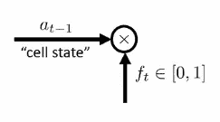

然后，我们给它加上一个数字 g(t)。

*   如果 f(t)接近零，则单元状态由 g(t)代替
*   如果 f(t)接近 1，g(t)接近 0，则单元状态保持不变
*   如果 f(t)接近 1，g(t)不为零，那么单元状态以相加的方式被修改，这成为我们新的单元状态 a(t)

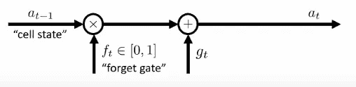

我们从哪里得到这些 f(t)和 g(t)？

**LSTM 细胞**

我们决定是记住还是忘记的方法是基于另一个时间信号 h (t-1)。H (t-1)与 a (t-1)一起作为前一时间步的输出。

然后我们在这个时间步，x(t)有我们的输入。我们将做和以前一样的事情:我们将 x(t)和 h (t-1)连接起来，并对它们应用线性和非线性层。这个线性层将产生比我们之前的输出大四倍的输出:

这四排中的每一排都有不同的功能。其中一个是我们之前看到的遗忘门 f(t ),另一个是我们之前添加到产品中的 g(t)。

1.我们取 f(t)并让它通过一个 sigmoid，它把它放在 0 的范围内，这就成了遗忘门。

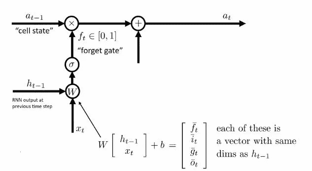

2.我们取 i (t ),并让它通过一个乙状结肠。这被称为输入门，它控制对单元状态的修改

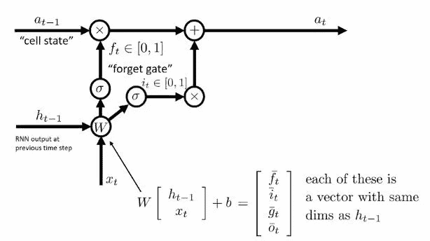

3.我们取 g (t ),让它通过一些非线性。可能是 tanh 或者 ReLU

g (t)逐点乘以 i (t ),然后将乘积加到遗忘门后的单元状态。直觉上，i (t)决定了你是否想要修改单元状态，而 g (t)决定了修改是什么。这非常好，因为它允许网络独立地选择是否修改，并且单独地选择如何修改

4.o (t)被称为输出门，它也通过一个 sigmoid，并控制下一个 h (t)。在遗忘门和 g (t)相加之后，我们获取单元状态 a (t ),并使其通过非线性。然后，我们逐点乘以 o (t ),这就变成了新的 h (t)

如果我们想要在那个时间步长上的读出功能/解码器，这个新的 h (t)也是我们使用的。

这里发生的是:我们试图保留 a (t)作为线性信号的角色。所有的非线性都被应用到 h 上，因此 a (t)上的梯度将会非常简单

*   没有影响 a (t)的非线性函数使得它的导数表现得非常好
*   同时，通过 g (t)的非线性修正和 h (t)的非线性读出，我们仍然保留了非线性的好处

为什么这些 LSTM 细胞工作得更好？最简单的原因是 a (t)在每一步都以非常简单的方式被修改

你可以认为 a(t)是长期记忆，而 h(t)是短期记忆——它一直在变化，并执行复杂的非线性处理。

**实用笔记**

*   rnn 几乎总是在每一步都有输入和输出
*   像第一部分中的那些天真的 rnn 几乎从不工作；在实践中，如果你想要一个 RNN，你可能会使用类似 LSTM 细胞，即使它需要更多的超参数调整比标准的全连接或卷积网络
*   对于处理序列，也有一些 rnn 的替代方法，在实践中可以更好地工作(时间卷积和变换)
*   有一些 LSTM 的变体稍微简单一点并且工作得一样好(门控循环单元)

**自回归模型和结构化预测**

我们在实践中实际使用的大多数 rnn 都有多个输入和多个输出，因为大多数需要多个输出的问题在这些输出之间有很强的依赖性。

这类问题有时被称为结构化预测，因为你预测的东西是有结构的，而不是像标签那样的东西。一个经典的例子是文本生成。不管文本的输出是否是正确的答案，单词和文本之间的关系决定了它是否是有效的文本。

假设您有一个由三个句子组成的训练集:

*   “我思故我在”
*   “我喜欢机器学习”
*   “我不只是一个神经网络”

暂且说你不关心泛化:你只是想让你的模型记住这三句话。我们将单词视为分类变量；每个时间步都是不同的单词，它只是 n 个可能单词中的一个。

你的神经网络会把单词“我”作为输入。然后我们让它完成句子，它可以用三种不同的方式来完成:“想”，“喜欢”，“我”。然后我们有一个 softmax 分布，将这些词转化为概率:

我们将从这个 softmax 分布中随机抽样，选择第二个单词。现在网络正在完成句子，说“我想”。然后我们继续下一个时间步骤；我们有一个线性层，使用以前的激活来计算新的激活，然后我们有第二个时间步的输出，它再次通过 softmax 分布。

问题是网络不知道哪个词是从那个 softmax 中随机抽样的:

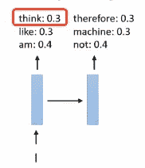

网络认为它产生了 30%“认为”，30%“喜欢”和 40%“am”的输出。问题是你试图独立地对这些词进行取样。在第二个时间步，你可能会随机得到“机器”，然后在第三个时间步，你可能会随机得到“只是”。这一代人毫无意义，尽管网络在学习这种分布方面做得很好。我们因此得到一个无意义的输出，这是因为在这个任务中，单词之间的协方差和得到正确单词的概率一样重要。

这就是为什么接收可变长度输入和可变长度输出的网络如此重要。当我们运行这个网络来完成一个句子时，我们将从第一个时间步骤的 softmax 中采样，然后我们将在第二个时间步骤中输入我们的样本。这基本上会告诉网络我们采样了什么。现在网络知道它不只是预测任何一个句子中的第三个词:它是预测前两个词是“我认为”的句子中的第三个词。因此，它会正确地预测，如果前两个词是“我认为”，第三个词可能会是“因此”。

关键思想是过去的产出应该影响未来的产出，而让过去的产出影响未来的产出的方法是把昨天的产出当作今天的投入。

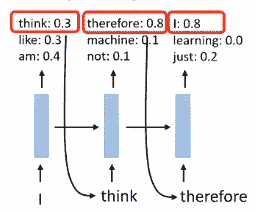

这种基本设计用于所有必须输出结构化序列的 rnn，如图像字幕模型或视频预测模型。

**自回归模型**

训练它的最简单的方法是将输入设置为整个训练序列，将地面真实输出设置为相同的序列，但是偏移一个步长。在训练过程中，你不是要求神经网络只是虚构一个句子，而是要求完成一个句子。你是说:在时间步长 t，取时间步长 1 到 t 的所有单词，在时间步长 t+1 输出单词。

你的 x 将会是句子中的所有记号，你的基本事实输出将会是所有向后移动一位的记号。最后一个将被替换为停止令牌。

基本上这个网络被教导，如果它看到“我”，它应该输出“思考”；如果它看到“想”，就应该输出“所以”等等。

**分配转移**

这是有问题的。我展示的基本设计将会很好地工作，但是如果你用它来训练非常长序列的非常复杂的网络，你可能会开始看到一些问题，这是由于分布的变化。

假设你有一个和以前一样的例子，但是网络犯了一些小错误:

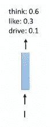

为什么会这样？可能是训练的不太好吧。假设你运气不好，抽取了 10%的单词。问题是，现在你要用它作为下一个时间步的输入。由于只是一些随机的令牌，网络从来没有见过，要彻底搞混了。在下一个时间步，它会输出一些完全疯狂的东西，然后它不会产生任何合理的东西:

这是训练和测试之间的差异:网络总是将真实序列视为输入，但在测试时，它将一个(可能不正确的)预测作为输入。这称为分布转移，因为输入分布从训练期间的真实字符串转移到测试时的合成字符串。

**预定抽样**

基本的想法是，在训练过程中，我们会在每一步做出随机的决定。在一定的概率下，我们将给出网络在该时间步的真实输入，用 1 减去该概率，我们将给出它以前的输出作为输入。至关重要的是，我们没有通过这条边进行区分，所以网络不知道它正在将自己的输出作为输入。

你可以认为这是以某种概率用网络自己的前一时间步的输出来随机替换真实输入。这真的很有帮助，因为现在在训练期间，网络将自己的输出视为输入，因此，当它看到测试时间时，它不会完全混淆。

对于用模型自己以前的输出替换真实输入，我们要如何选择这个概率？直觉上，我们希望在开始时主要输入真实的输入，然后一旦网络变得相当好，我们希望主要输入模型自己的预测，以减轻这种分布变化。因此，我们为这种概率制定了一个时间表:使用真实输入的概率一开始非常高，然后逐渐下降。由于使用模型输出的概率是 1 减 1，所以随着时间的推移，你大部分时间都是在用自己以前的输出来训练网络

rnn 的一大优势是它们提供了极大的灵活性:

常规前馈网络具有一对一的映射，而 RNNs 可以有一个输入到多个输出，多个输入到一个输出，多个输入到多个输出，等等。

**实施细节**

我们经常用 RNNs 做的一件事是，我们在模型中间的某个地方有一个 RNN 主干，然后我们使用一个非递归编码器(一个常规的卷积网络，然后馈入 RNN)。您也可以使用某种复杂的解码器，将 RNN 或 LSTM 电池的输出送入多个层，然后产生输出:

您也可以有多个 RNN 层，在特定的时间步长将 RNN 的输出输入到另一个 RNN 层，然后最终输入到 softmax。

RNNs 可以使用的另一个技巧是双向模型。例如，在语音识别中，您的输入是声音序列，您希望产生相应的单词。大多数情况下，特定时间步的单词取决于该时间步的声音，但有时声音的其余部分会影响您对单词的理解。因此，如果不看整个话语，在特定时间步的单词可能很难猜测。双向模型是一个 RNN，其中首先有一个向前运行的递归连接层，然后在其上有另一个向后运行的层。这意味着你拥有过去和未来的信息。

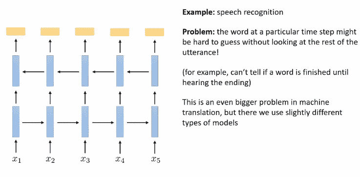

# 序列到序列

我们将讨论如何使用递归神经网络来解决一些有趣的问题；我们将关注如何训练和利用序列对序列模型。

递归神经网络非常灵活，可用于解决各种不同类型的序列处理问题:

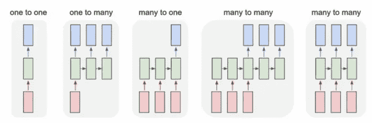

在本文中，我们将关注多对多问题。在此之前，让我们讨论如何建立一个基本的神经语言模型，该模型为表示文本的序列分配概率。语言模型对于我们将要讨论的很多内容来说是一个非常重要的概念，因为它们不仅可以分配概率，还可以经常生成文本。

这是一个生成短语的神经网络模型的例子。为此的训练数据将是自然语言句子的大集合。这里我只展示了三个:

他们是如何表现的？这里有几个选择，我们稍后会更深入地讨论，但一个非常简单的选择是将每个句子标记化，这意味着每个单词都成为一个单独的时间步长，然后以某种方式对该单词进行编码。

对单词进行编码的一个非常简单的方法是一个热矢量。one hot vector 只是一个长度等于字典中可能单词数量的向量，并且该向量中的每个元素都是零，除了对应于单词索引的元素，该元素被设置为 1。

还有更复杂的方式来表示单词。一个例子是单词嵌入，这是单词的连续向量值表示，旨在反映它们的语义相似性，以便表示相似事物的单词在欧几里德距离方面更接近。

现在，让我们假设单词是一个热门向量，这意味着我们的自然语言训练数据只是由这些热门向量的序列组成

**几个细节**

*   我们需要理解模型何时完成输出一个句子。举个例子，如果你给模型“我”，你想让它用“我思故我在”来完成这个句子，你怎么知道应该停在“m”呢？“我认为因此我是河马”也是一个有效的句子。因此，我们将在所有句子的末尾，在训练数据中包含一个特殊的标记。这是序列标记的结尾，有时也称为句尾标记。它不代表任何实际的词，它只是代表模型已经完成的事实。
*   我们需要以某种方式启动这个模型。对于第二个时间步长，它将使用第一个时间步长的输出作为输入。但是我们在第一个时间步用什么呢？我们可以简单地计算每个句子开始一个单词的频率，从中随机抽取样本，然后作为第一步输入到模型中。一个稍微好一点的解决方案，不需要我们有一个特殊的组件，就是引入一个句子开始标记。因此，该模型将学习它应该输出一个随机单词，其概率与实际开始一个句子的概率成比例。

有了这些开始标记和句子结束标记，我们知道如何让 rnn 生成完全随机的句子。但是，如果我们想让 RNN 完成一个句子，例如“我认为”，这样做根本不需要改变训练程序。我们仍然一次放一个代币进去。你输入“开始”，你让它做一个预测，但是你不从那个预测中取样；取而代之的是，你直接输入下一个你正在调节的词，也就是“我”。然后，你让它做一些预测，你忽略它，然后你输入“思考”，做一些预测，然后你实际上从中取样，输入到第四步。为了使你的一代适应一个特定的起始片段，你所要做的就是强迫最初的几个输入与那个片段一致，而不管网络输出的是什么。

条件语言模型

到目前为止，我们讨论了无条件语言模型；现在，我要谈谈我们如何建立条件语言模型。对于这些条件语言模型，文本是模型的输出，而不是输入。你要让这个模型以一些输入为条件，这些输入会告诉它你想要它生成什么样的文本。例如，您可以想象一个图像字幕的条件语言模型:

我们可以有某种编码器模型，通过卷积网络读入条件信息(小狗的图片)，这将产生一个代表 RNN 初始状态的向量。这个矢量 a0 是 RNN 的初始状态。这整个事情将被端到端地训练 CNN 和 RNN 将被一起训练以产生正确的文本。

总而言之，这是一个大型神经网络，由几个卷积层组成，可能是一些完全连接的层，其中一层进入 RNN。我们把这个网络的 RNN 部分称为 RNN 解码器，因为它的工作是把 a0 中包含的信息解码成英文文本；我们称卷积部分为 CNN 编码器，因为它的工作是将输入编码成 a0:

我们的训练数据将包含图片和标签。

例如，如果您想将法语翻译成英语，您可以让一个 RNN 读入法语文本，并为另一个生成英语文本的 RNN 生成初始隐藏状态激活。现在，你有了 RNN 编码器，而不是 CNN 编码器，无论法语句子的最后一步发生了什么，都会直接进入英语句子的第一步。

有一些细节可以让它真正发挥作用。第一，有时人们以相反的输入顺序阅读，从句尾开始，然后倒着读。这样更好的原因是，英语句子的开头可能与法语句子的开头关系更大，而不是与法语句子的结尾关系更大。通过颠倒输入句子，第一部分排在最后，这使它最接近输出句子的第一部分。

**序列对序列模型**

我们有两个不同的 rnn 用于输入和输出；编码器和解码器具有不同的权重，并且编码器为解码器产生初始隐藏状态激活。这是一个更现实的例子:

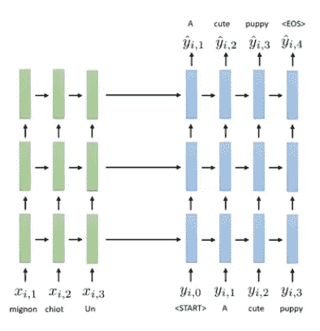

1 我们反向读入输入句子和
2 我们添加了多层；多个 LSTMs(两个到五个之间)堆叠在彼此之上
3 在成对的序列上首尾相连地训练网
4 序列可以具有不同的长度

**执行解码**

到目前为止，从这些 rnn 中得到一个句子的明显方法是一次做一步，然后在第一步我们必须输出一些东西，我们得到一个 softmax 分布。这意味着我们得到一个长度等于可能单词数的向量，你对它应用一个 softmax，然后把它变成一个概率向量。这是解码句子中第一个单词的概率分布。在这一点上，显而易见的事情可能是选择概率最大的单词，然后在下一个时间步骤中输入所选择的单词。这边走:

但是请注意，网络犯了一个小错误。在第一个时间步骤中，它有几个可能的单词可供选择(当然，在简化的场景中)，正确的单词应该是“a”，但单词“one”也有类似的概率，只是稍微大一点，因为法语单词“un”可能表示两个单词。这似乎是一个合理的选择，但它最终会打乱其余的解码。它为第二个选择了“小狗”这个词，但是“一只小狗很可爱”不是一个正确的英语句子。所以，网络选择“是”，这产生了一个有效的英语句子…但不是正确的翻译。

那么，哪里出了问题？问题是我们承诺在看到其余的解码之前选择“一”。第一个错误并不是那么不合理，却导致了一个完全不合理的结果。如果我们没有在第一个时间步选择“一”，而是选择了“一”，那么我们将在以后得到一个相当合理的世代。通过选择“a ”,在第三个时间点上“小狗”的概率会更高。

这里，概率取决于整个输入序列和我们为输出序列生成的所有前面的单词:

想法是**我们想要最大化所有概率**的乘积，这允许我们从我们的解码器得到最可能的输出序列。

由于处理大量概率的乘积很烦人，我们更喜欢在对数空间中表达它们，在对数空间中乘积变成总和:

为了最大化所有概率的乘积，我们不应该只是贪婪地选择第一步中最高的概率。这意味着，我们可能会在早期选择一个概率稍低的单词，以便在后来获得一个概率高得多的单词:贪婪地选择最有可能的单词并不总是最佳的。

有多少种可能的解码？对于 m 个单词，有 m 个长度为 t 的^ T 序列。如果我们在每一步只有四个记号，原则上我们可以在第一时间步选择这四个记号中的任何一个，在第二步选择这四个记号中的任何一个，在第三步选择这四个记号中的任何一个，依此类推。当然，这些序列中的大多数概率很低，但原则上它们中的任何一个都可能是最优的。从根本上说，解码是一种树形搜索，其中转换的成本是其对数概率的负值(因为在树形搜索中，您在进行的过程中对成本进行求和),并且搜索路径的数量呈指数增长。我们可以使用任何树搜索算法来解决这个问题，但在这种情况下精确搜索是非常昂贵的，因为这个问题没有一个很好的结构，使广度优先搜索和深度优先搜索这样的事情能够很好地工作。幸运的是，这个问题的结构使得一些简单的近似搜索方法非常有效。

基于我们对序列解码的了解，基本的直觉是，虽然在第一步选择概率最高的单词可能不是最佳的，但选择概率非常低的单词也不太可能导致好的结果——这在一般的搜索中并不总是正确的。所以，我们不能贪婪，但我们可以**有点**贪婪。这种算法被称为波束搜索，它不是在每一步贪婪地解码最佳字，而是存储迄今为止的 k 个最佳序列，然后更新它们中的每一个。将 k 设置为 1 的特殊情况只是正常解码，因为您总是选择最有可能的单词。

这是一个 k = 2 的波束搜索示例。我们要把法语中的一个句子翻译成英语，我们特意选择了一个有点不平凡的翻译，意思是没有完全对等的英语单词“entarté”。

每一步，我们追踪两个最有可能的假设。我们从“开始”令牌开始，并产生 softmax 分布——我们向前运行我们的 RNN 一步，在第一个单词上产生 softmax 分布，并跟踪两个最可能的假设。我们得到“他”和“我”。现在，我们将根据单词“他”向前移动 RNN，然后我们将根据单词“我”分别向前移动 RNN。对于这两个向前的步骤，我们将在第二个字上总共有四个不同的 softmax 分布。

然后，我们将计算当我们用“他”时，前两个单词的对数概率和，以及当我们用“我”时，前两个单词的对数概率和。我们现在有四个分数，我们取最好的两个:“我是”和“他打中了”。我们将继续进一步拓展这两个领域:

再一次，和以前一样。我们什么时候停止解码？很简单，如果我们的一个评分假设以 END token 结尾，我们停止扩展它并保存在那里。我们将继续下去，直到某个截止长度，或者直到你有一些预定义的完整序列数。最后，我们选择哪个序列？

请记住，这些分数中的每一个都是每一步的对数概率的总和，但每句话中的步骤数是不同的。句子越长，我们加起来的负数越多，这意味着一般来说，较长的句子倾向于具有较低的对数概率:为了避免短而差的翻译比长而好的翻译更经常被选择，我们实际上将分数定义为总对数概率除以步骤数。

总之，这就是光束搜索，它在大多数情况下都能很好地解码最有可能的句子。事实上，很小的 k 值通常也能很好地工作，所以 5 到 10 是非常典型的，但是甚至低至 2 的数字有时也能很好地工作。

**注意**

在这里，我想简单介绍一下序列对序列模型的注意概念。这源于这样一个事实，即在序列到序列模型中，我们有一个瓶颈问题:所有关于源序列的信息都必须包含在解码开始时的激活中。解码器不知道任何关于源序列的信息，除了编码器将什么放入第一个隐藏状态。当输入序列很长时，这可能是一个大问题。

如果我们允许解码器在解码时更多地查看输入序列，也许我们可以稍微放松一下。如果您的输入是一个完整的段落，并且编码器对其主旨进行了编码，我们希望解码器到达该点并引用回输入序列，以便提取出它感兴趣的特定标记。这将大大降低瓶颈的重要性，并且处理非常长的序列会容易得多。

基本想法是:

1.  编码时，我们将让编码器 RNN 的每一步产生一小段信息，描述在那个时间步出现的内容。这条信息对我们来说没有语义上的意义，它只是一个小小的激活向量，在孤立的情况下没有任何意义。它将被称为“关键”，并将作为学习过程的一部分来学习。
2.  解码时，我们将让解码器 RNN 的每一步输出一个长度相同的小向量，我们称之为“查询”。直观地说，它代表了我们在这个时间步需要的信息类型。
3.  我们将查询向量与每个关键字进行比较，以找到最相似的关键字，这将告诉我们输入中的哪个时间步长与解码过程中的这个时间步长最相关。然后，我们将把这些信息发送给解码器。

对这可能做什么的一些粗略的直觉是，一个键可能编码句子中正在发生的一些概念，像“这个词是句子的主语”；如果查询编码了一些概念，如“我需要知道句子的主题”，那么前面提到的键将被选中，因为它与查询最相似。然后，我们采取相应的时间步骤，获取其隐藏状态，并将其输入解码器。

重要的是，我们不需要手动指定这些东西。整个网络仍将进行端到端的训练，键和查询的实际内容将由神经网络确定——就像卷积网络中的过滤器具有某种直观的意义，但不是手动指定的。

实际上，我将使用字母 h 来表示编码器的隐藏状态。我将用字母 s 来表示解码器的隐藏状态。对于密钥，我将使用字母 k；每个时间步都有一个独立的关键点，关键点是我们应用于 RNN 隐藏状态的函数。例如，它可以只是一个线性层，后面跟着一个非线性层，并且在实践中，函数 k 通常只是一个线性变换。对于这个查询，我将使用字母 q 来表示它，用下标 l 代替 t。

关注点积“e”是一个分数，表示一个关键字与一个查询的相似程度。它将由 kt 和 ql 之间的点积给出，我们想要在点积最大的时间步长 t 中取出隐藏状态 ht。

为此，我们将创建一个向量 alpha(l)，通过关注点乘积的 softmax 获得:

注意力点积越大，这个 softmax 就越接近 arg max。然后，如果我们想要发送大致对应于最大点积的密钥，我们将在加权和中使用 alpha:

直观上，除了具有最大点积的时间步长之外，这些α对于所有时间步长 t 都是小数值；因此，这个加权和将由对应于点积的 arg max 的激活来支配。

直觉上，我们正在尝试提取时间步长 t 的编码器 RNN 状态，对应于键和查询之间最大的点积。我们称之为关注的原因是网络试图关注输入中最相关的部分。总而言之，对于特定的查询 qt:

1.  从编码器的隐藏状态“h”中学习密钥，例如利用线性层
2.  注意力分数“e”是通过给该查询的关键字打点来产生的
3.  我们对所有的点积“e”应用软最大值，我们称结果为“alphas”
4.  最大的 alpha 被发送到解码器

将 alpha 发送给解码器是什么意思？解码器可以以不同的方式使用阿尔法。

*   把它交给产生输出的函数，这样输出就变成了对应于最高注意分数的解码器状态和编码器状态的函数
*   如果您使用的是多层或堆叠 RNN，请将其提供给下一个 RNN 图层
*   将其交给下一个解码器步骤，以便注意力向量与例如新单词一起作为附加输入

**注意变量**

*   一个简单的选择是使用 k 和 q 作为恒等函数。在这种情况下，时间步长 t 处的关键字只是 ht，而时间步长 t 处的查询只是 sl。当你解码时，你的注意力分数是输入隐藏状态和解码器隐藏状态的点积。这很容易实现，但是表达能力有限
*   另一个非常简单的选择是使用线性乘法注意力，其中键和查询只是隐藏状态的线性函数。这是非常合理的，因为 RNN 隐藏态已经通过应用一个非线性函数形成了。因此，这并没有大大削弱我们的表达能力
*   最后一个变体稍微复杂一些。它仍然有键和查询，但最后，当你构造你的注意力向量时，你不是构造编码器隐藏状态的加权组合，而是构造由一些学习函数 V 转换的那些隐藏状态的加权组合。V 在这里代表“值”,解释是在编码期间你产生键-值对，而在解码期间你找到 k 和 q 之间最大乘积的时间步长，并取其值。这可以增加一点灵活性。

**总结**

*   每个编码器步长 t 产生一个密钥 kt
*   每个解码器步骤 l 产生一个查询 ql
*   解码器被发送对应于乘积 kt 和 ql 的最大值的编码器激活 ht
*   注意力是非常强大的，因为所有解码器步骤最终都与所有编码器步骤相关联
*   梯度表现得更好，因为沿着注意力路线相乘的雅可比数是 O(1)。这对于非常长的序列变得非常重要

## [变形金刚](https://www.youtube.com/watch?v=VDnEnlYzHOU&list=PL_iWQOsE6TfVmKkQHucjPAoRtIJYt8a5A&index=36)

之前，我已经谈过我们如何建立序列对序列模型，并通过使用注意机制来提高它们处理长范围依赖性的能力。

在这里，我们将讨论另一类处理序列的模型，它不使用循环连接，而是完全依赖于注意力。我们将建立一类叫做变形金刚的模型。

基本的问题是:我们能在没有任何明显复发的情况下摆脱注意力连接吗？原则上，注意力可以从输入字符串中获取你想要的任何信息，我们的 RNN 可以转化为一个纯粹基于注意力的模型。但是有一些警告:

**如果我们天真地使用基本的注意力机制来做这件事，我们可以访问编码器的隐藏状态，但不能访问解码器的先前状态。**

为了解决这个问题，我们使用自我关注。我们将获取序列中的所有时间步长，并对每个时间步长进行编码。这就像一个前馈模型。H1 是 x1 的某个函数；h2 是 x2 的某个函数；h3 是 x3 的某个函数。权重在所有时间步长上是共享的，因为函数在每种情况下都是相同的。

然后，我们将为每个时间步长产生一个值，其中 vt 是 ht 的线性函数:

我们还将输出一个密钥，其中密钥是 ht 的某个线性函数:

然后，每个时间步长也会输出一个查询；就好像我们把编码器和解码器放在了一起。到目前为止，我们已经得到了一个键、一个值和一个查询，它们都是 ht 的线性函数。

然后，我们将完全按照我们之前对注意力所做的那样去做，除了现在编码器和解码器之间没有区别。本质上，每一步都可以索引到其他每一步，包括它自己。

1.  我们将计算每个 qt 和每个 kt 之间的点积，这将给出我们的注意力分数
2.  我们将通过一个 softmax 来传递它们，我们将得到 alpha 值
3.  然后，我们取每一步的值，我们用阿尔法加权，这就给了我们注意力

这种自我关注机制在每一个时间点都产生了一个关注向量。您可以将此视为一个跨时间步长集成信息的层。我们可以越来越多地重复这个过程:

将它转化为可行模型的实际过程需要一些额外的步骤。自我关注的基本概念可以用来开发一种强大的序列模型，称为转换器，但要使它真正工作，我们需要开发一些额外的组件，并解决自我关注的一些基本限制。

以下是我们需要注意的事项:

*   **位置编码**解决了自我关注的一个问题，即自我关注没有任何接近和时间的概念。所有这些 x 都是完全并行处理的，不考虑它们的顺序。如果我们交换他们的顺序，自我注意层会产生完全相同的答案。当处理像自然语言这样的数据时，这可能是一个大问题，因为单词的顺序确实很重要
*   **多头关注**允许查询每层多个位置；在每一层，我们不只是在查询和键中有一个值，而是可以有多个值——这样我们就可以进行更复杂的操作。粗略地说，您可以将(键、值、查询)元组视为 CNN 中的过滤器；实际上，你永远不会构建一个每层只有一个过滤器的 CNN，同样，你也不想构建一个每层只有一个注意力头的纯自我关注模型
*   **增加非线性**，因为我们到目前为止讨论的模型完全是线性的。
*   **屏蔽解码**防止对未来的注意力查找。现在，注意力机制不区分过去和未来。当你试图用自我关注来解码一个语言模型时，这可能是一件非常糟糕的事情

# 从自我关注到变形金刚

**位置编码**

当我们看到一个句子时，我们所看到的既包括这个句子中的单词，也包括这些单词出现的顺序。例如，如果我们有这样一句话“他用馅饼砸了我”，那么天真的自我关注看到的只是一袋单词。如果你要排列单词，你会得到完全相同的注意力向量——而循环模型一次看一个单词，它会记住之前看到的单词。一般来说，单词在句子中的位置携带着重要的信息，当我们使用自我注意模型时，我们非常希望保留这些信息。

为了解决这个问题，我们将在开始时向表示中添加一些信息，表明它在序列中的位置。位置编码意味着第一个 ht 将是 xt 和 t 的函数:

这将保持记号在序列中的顺序，并允许自我注意利用它。简单地将 t 附加到输入 x 上并不理想，因为绝对位置没有相对位置重要。如果我给你两个句子(“我每天都遛狗”和“我每天都遛狗”)，重要的信息是单词 dog 相对于单词 walk 的索引，而不是单词 dog 本身的索引。

我们可以提出一种位置编码，它更关注相对位置而不是绝对位置。我们希望以这样一种方式来表示位置，即具有相似相对位置的标记具有相似的位置编码。例如，我们可以附加时间步长的频率，而不是附加实际的时间步长。位置编码可以是与 xt 的嵌入长度相同的向量；向量中的每一项都是应用于时间步长 t 除以某个频率的正弦或余弦:

早期的条目有很高的频率，因为它是 t 除以某个小数字；在向量的末端，它们有很低的频率，因为它被 t 除以一个很大的数，比如 10.000。如果你要画一张这些位置编码的图片，它们应该是这样的:

这里的每一行都是这个位置编码向量的不同维度，水平方向上的每一点都是序列中的索引。这种频域编码对于获得相对位置非常好。

然而，我们可以有更复杂的位置编码。例如，我们可以学习它。我们可以学习我上面展示的整个矩阵，使矩阵中的条目成为我们模型的可学习参数

在每个位置我们都有一个 x，对于每个输入序列都是不同的；在每个位置，我们也有一个 p，对于每个序列都是一样的，但它是学习来的，所以在每个时间步都是不同的 p，但一个序列的 p1 与另一个序列的 p1 完全相同，所以它只是一个学习常数。这比正弦-余弦编码更灵活，在某种意义上可能更优，因为我们最终学习了最适合我们序列模型的位置编码。缺点是有点复杂，你需要手动选择最大序列长度

我们如何将这些位置编码整合到我们的自我关注模型中？

在每个时间步，我们都有输入 xt 和位置编码 pt。转换器通常首先嵌入输入，然后将位置编码添加到嵌入中。所以编码就是 xt 的嵌入加上位置编码 pt。这是一个任意的选择，你可以用任何其他方式组合它们。

**多头关注**

因为我们现在完全依赖注意力，所以允许自我注意力机制整合来自多个时间点的信息可能是可取的。例如，如果在第二个位置，你需要句子的动词和主语来组合它们，那么让一个注意机制来提供主语，另一个注意机制来提供动词会很酷。

实现这一点的方法是，在每个步骤中可以有多个键、查询和值:

不同的颜色轮廓代表不同的头部。这些头部中的每一个都产生一个注意力分数，并且为每个头部独立计算权重。最后把三个头叠加起来就形成了一个完整的注意力向量。也许其中一个头拉出一个主语，一个拉出一个形容词，一个拉出一个动词等等。

用每个自我关注层的多个头部来建立自我关注是一个非常好的主意——通常，八个头部左右的东西对大模特来说似乎很好

**增加非线性**

到目前为止，自我关注在值上完全是线性的，因为我们的键、我们的查询和我们的值是 ht 的线性函数。每个自我关注层都有一套不同的权重。然后，我们的 alphas 通过应用一个 softmax 来计算，这是一个非线性操作，但是实际的注意力是通过那些 softmax 分数加权的值的线性组合来获得的。所以，注意力在 v 字母中是线性的，而 v 字母在 h 字母中是线性的。这意味着每个自我关注层都是前一层的线性变换，具有非线性权重，这不是很有表现力。

增加非线性的一个非常简单的方法是简单地用某种非线性层交替自我关注:

这种位置式的非线性功能处理信息，而自我注意层是记忆提取层。

**蒙面解码**

自我关注的问题在于它不区分过去和未来；相反，您希望第一个时间步骤仅使用第一个步骤的信息来生成输出，然后您希望将该输出用作第二个步骤的输入，第二个步骤可以处理该信息(包括第一个步骤的信息)，然后生成第二个步骤的输出，依此类推。

问题是我们有一个循环依赖。

编码时，步骤 1 的自我注意可以查看步骤 2 和 3 的值，该值基于步骤 2 和 3 的输入。在测试时，步骤 2 和 3 的输入将基于步骤 1 的输出，这需要知道步骤 2 和 3 的输入。

我们可以用一个非常简单的方法来解决这个问题，这个方法叫做掩蔽注意力。你必须允许自我关注过去，但不能关注未来:

从数学上来说，要计算关注度分数，只有当关键字出现在查询之前时，才需要像以前一样做，否则就将关注度分数设置为负无穷大。这样，当你把它放入 softmax 时，e 的负无穷大是零，未来时间步长的权重将永远是零，永远不会被使用。在代码中，处理无穷大很烦人，所以你直接把指数设置为 0。

**总结**

我们可以实现一个实际的序列模型，完全基于自我关注，如果你结合我们描述的四个修改，序列模型将会工作。

*   你必须用非线性位置前馈网络来交替自我关注层，以获得非线性变换
*   您必须对输入或输入嵌入使用位置编码，以使模型知道序列中标记之间的相对位置
*   你必须使用多头注意力，这样你就可以在每个自我注意力层整合来自多个不同时间点的信息
*   如果你想用模型来解码，你必须使用掩蔽注意力来防止峰值进入未来。

**变形金刚**

现在，我们将结合目前为止所学的内容，浏览经典变形金刚模型。

使用连续自注意和位置非线性来处理序列的模型设计通常被称为变换器，因为它们使用这些自电位机制在每层变换一个序列和另一个序列。

序列到序列 RNN 模型具有 RNN 编码器和 RNN 解码器。这些通常可以具有多层。为了把它变成一个变换器，我们将把编码器和解码器替换成连续的自关注层，交替进行位置非线性变换。

**编码器**将获得 x 的序列，具有相应的位置编码 p1、p2 和 p3。在每一个位置，我们将对这些进行编码，然后我们将它们传递到自我关注层。然后，我们将获得多头电位的输出，并将其传递到位置式非线性网络中。这样重复 n 次。

**在解码器**中，我们还将对输出步骤及其相应的位置编码进行位置嵌入。我们将使用掩蔽注意力，这意味着较早的时间步骤不会看到后面的时间步骤。然后，我们将有一个位置式非线性网络。

然后，我们会有交叉注意，它使用所有这些编码器产生的隐藏向量。这非常类似于我们在上一讲中描述的经典注意力，因此，交叉注意力将查看编码器中的时间步长，而不是查看相同序列中的其他时间步长的自我注意力:

经过交叉注意，我们有了另一个位置式非线性网络。这意味着每个解码器层有两个注意步骤:它有一个掩蔽的自我注意、一个非线性函数、交叉注意、另一个非线性函数，然后进入下一个块。这些块也重复 n 次，因此解码器块的内容是编码器块的两倍

最后，在 n 个这样的块之后，我们在每个位置应用一个 softmax 并读出输出:

让我们更仔细地看看交叉注意机制，它有点微妙。

我们将使用带有上标 l 的 ht 来表示编码器中 l 层的隐藏状态，使用 sl 上标 l 来表示解码器中的隐藏状态。这些状态是由位置非线性网络产生的。在交叉注意中，我们有:

*   在步骤 t，通过在解码器层 l 将矩阵 Wql 应用于位置式非线性网络的输出而获得的查询
*   在步骤 t，通过将矩阵 wk1 应用于编码器层 l 的位置式非线性网络的输出而获得的密钥
*   在步骤 t，通过将矩阵 wv1 应用于编码器层 l 的位置式非线性网络的输出而获得的值

然后，我们计算每个 t 和 l 之间的注意力得分，应用 softmax，然后计算我们的交叉注意力。

现实中，交叉注意力也是多头的。在展示真正的变形金刚模型之前，还有一个小细节:图层规范化。

层规范化与注意力模型没有任何关系，但事实证明它对转换器很重要，因为很难对它使用常规的批量规范化。主要思想是批处理规范化非常有用，但是由于几个原因很难将其用于序列模型:

*   序列的长度是不同的，这使得在批处理之间进行标准化有点困难
*   序列可能很长，所以我们有时只有很小的一批

我们可以使用的一个简单的解决方案是用所谓的层规范化来代替批规范化，它类似于批规范化，但跨层中的不同激活，而不是跨批中的不同样本。在标准批处理规范中，在每一层，你都有一堆激活向量，每个输入一个；批次标准计算该批次中所有点的平均值和标准差。然后，当您使用批量归一化对它们进行变换时，一切都是针对每个元素的，对于每个元素，您减去平均值的对应元素，除以标准差的对应元素，乘以 gamma 的对应元素(这是学习到的比例)，然后加上 beta 的对应元素:

Layer norm 将是一个更传统的层，它只使用单个数据点中的信息，而不是计算批中不同向量的平均值，它通过平均每个维度的激活来计算单个数字:

**将所有这些放在一起**

这张图片摘自介绍变形金刚的论文，名为“注意力是你所需要的”。本文提出的是使用连续的自我注意和位置非线性函数来实现序列到序列模型——它们应用于机器翻译。

**编码器**

*   我们从输入序列开始，分别在输入序列中嵌入每个标记，并在嵌入中添加相应的位置编码
*   然后我们有了第一个多头自我关注层
*   你把所有人的注意力连接起来，以获得每个位置的阿尔法值
*   然后你就有了这个叫“Add & Norm”的东西，它是一个残差连接后面跟着一个层范数。原因是，他们希望每一层都是一个修改，从剩余连接中获得良好的渐变效果
*   然后你有一个位置非线性函数。特别是，它由一个线性层、一个 ReLU 和另一个线性层组成。
*   然后是另一个“添加&规范”

他们有 n 个这样的区块。每个块是多头自关注、加法和范数、位置非线性、加法和范数、将其传递到下一个块、多头自关注、加法和范数、位置非线性、加法和范数、将其传递到下一个块等等。

那是编码器。一旦你一直向前运行编码器，你将会计算出其中的六个块。编码器的产品是这些键和值

**解码器**

*   解码器具有相同的位置编码业务，每个编码器模块都有相应的解码器模块，但解码器模块稍微复杂一些。现在，多头注意力被屏蔽，只查看过去的时间步骤，因为它将用于生成序列。
*   添加定额
*   有一种交叉注意力会根据自我注意力的输出产生疑问。这些查询用于从编码器中查找键和值。
*   再次，有一个添加和规范。这个加法& norm 将把交叉注意和自我注意的结果加在一起。
*   然后，您有一个位置式非线性函数，它使用与编码器相同的架构，但权重不同
*   然后你有另一个 add & norm
*   然后你把它们传给下一个街区
*   在最后一个块的末尾，每个位置都有一个线性层，后跟一个 softmax，它输出该位置令牌的概率分布

解码器以掩蔽的注意力一次解码一个位置

**为什么是变形金刚？**

变形金刚的一些利与弊:

*   注意力计算在技术上是 O 的 n 的平方，尽管这并不像看起来那样是个大问题，因为大部分计算时间不是花在执行这些点积上，而是花在网络的所有其他部分上。实际上，就计算成本而言，变压器往往比 rnn 便宜得多
*   它们实现起来有些复杂，涉及到各种看似怪异的决策，比如位置编码，这使得它们的使用有些棘手。可能需要相当多的超参数调整才能让变形金刚训练良好
*   它们具有更好的长距离连接:输出中的每个位置都通过长度为 1 的跳跃连接到每个其他输出位置和每个其他输入位置。从计算上来说，在 GPU 等并行硬件上实现转换器可以让它们运行得更快
*   实际上，你可以把变形金刚做得比堆叠的 rnn 深得多。

总的来说，transformer 的好处似乎大大超过了它的缺点，在许多实际的序列到序列处理案例中，transformer 比 RNNs 和 LSTMs 工作得更好。

*随时给我留言或:*

1.  通过[LinkedIn](https://www.linkedin.com/in/samuele-bolotta-841b16160/) 和 [Twitter](https://twitter.com/SamBolotta) 联系我
2.  跟着我上[媒](/@samuelebolotta)

# 参考

[CS 182:第五讲](https://www.youtube.com/watch?v=lKRatcD9hEg&list=PL_iWQOsE6TfVmKkQHucjPAoRtIJYt8a5A&index=14)

所有图片均取自 2021 年 CS182 的莱文。

 [## Mlearning.ai 提交建议

### 如何成为 Mlearning.ai 上的作家

medium.com](/mlearning-ai/mlearning-ai-submission-suggestions-b51e2b130bfb)