# 卷积神经网络

> 原文：<https://medium.com/mlearning-ai/convolutional-neural-networks-3f00c165c9d9?source=collection_archive---------4----------------------->

卷积神经网络(CNN)是一种深度神经网络，通常用于处理结构化数据阵列，如图像。CNN 广泛应用于计算机视觉。它们在图像和视频识别、图像分类、自然语言处理等方面有着广泛的应用。

卷积神经网络包括输入层、隐藏层和输出层。

*   ***输入*** 为形状张量*(图像数)×(图像高)×(图像宽)×(通道数)*
*   ***隐藏层*** 位于输入层和输出层之间。它们包括*卷积层*，其后是其他层，如*汇集层、归一化层、*和*全连接层。*
*   ***输出层*** 是产生程序最终结果的网络的最后一层。

在这篇文章中，我们将发现一个 CNN 模型的基本结构，以及它在识别 MNIST 手写数字图像问题上的应用。

# 一.卷积层

在这一层中，输入通过互相关运算与核相乘，然后结果与定标器偏置相加以产生输出。这一层的参数包括*内核*和*标量偏移*。

## **1。互相关运算。**

让我们在一个简单的例子中看看这个操作是如何工作的，其中我们有一个输入，它是一个大小为 4× 4 的二维矩阵(即大小为 4 × 4× 1 的张量)。内核窗口是大小为 3× 3 的正方形矩阵:

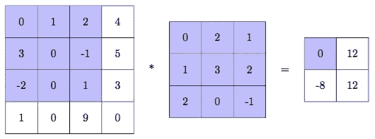

卷积窗口从输入张量的顶部开始，它从左到右和从输入的顶部到底部滑动。在每个位置，该窗口内的输入的子张量与核逐元素相乘，然后对结果求和以获得该位置的输出元素。

0×0 + 1×2 + 2×1 + 3×1 + 0×3 + (-1)×2 + (-2)×2 + 0×0 + 1×(-1) = 0

1×0 + 2×2 + 4×1 + 0×1 + (-1)×3 + 5×2 + 0×2 + 1×0 + 3×(-1) = 12

3×0 + 0×2 + (-1)×1 + (-2)×1 + 0×3 + 1×2 + 1×2 + 0×0 + 9×(-1) = -8

0×0 + 1×2 + (-5)×1 + 0×1 + 1×3 + 3×2 + 0×2 + 9×0 + 0×(-1) = 12.


[Source](https://github.com/vdumoulin/conv_arithmetic)

假设输入是大小为 n₁ × n₂的矩阵，内核大小为 k₁ × k₂，则输出大小确定为:


## 2.填料

由于内核大小通常大于 1，因此输出小于输入。这意味着当内核大时，我们的输入图像会丢失很多像素。为了克服这个缺点，我们可以在输入图像的边界周围添加更多的像素。通常，我们将额外像素的值设置为 0。如果我们添加额外像素的 p₁行和 p₂列，则输出的新大小由下式给出:

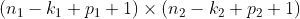

因此，当 p₁= k₁–1.时，输入和输出具有相同的大小

让我们回到上面的例子，如果我们将 0 像素的 2 行(p₁ = 2)和 2 列(p₂ = 2)添加到输入中，那么在这种情况下，输出大小为 4 × 4，等于原始输入大小。

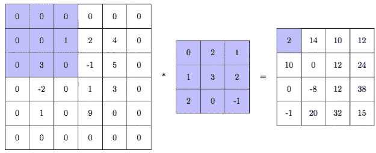

## 3.进展

在上面的例子中，我们在输入张量上将卷积窗口扩大了 1 个像素。有时，有必要将输出压缩成较小的尺寸。因此，我们需要增加步幅。在我们的示例中，如果我们将填充图像的所有垂直和水平方向移动 3 个像素，则输出大小会减少到 2 × 2:

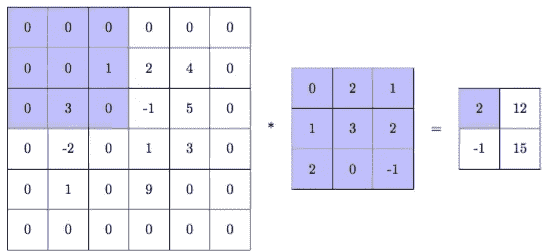

让我们根据输入中的垂直和水平来表示 s₁和 s₂的步幅，然后输出大小由下式确定:

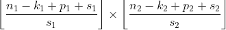

综上所述，padding 和 stride 是两种功能不同的操作。填充操作在输入中添加额外的 0 像素，以避免在输出中丢失信息，而步长操作旨在压缩输出。这两种操作可以结合起来，以获得包括关键像素的所需大小的输出。下图说明了不同填充和步长组合的卷积层的输出。这张图片收集自 [Github 账户](https://github.com/vdumoulin/conv_arithmetic):

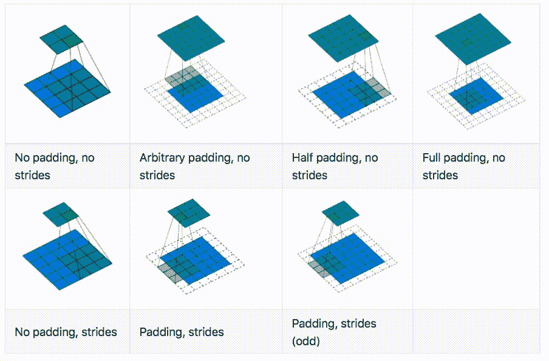

[Source](https://github.com/vdumoulin/conv_arithmetic)

# 二。池层

池层是卷积神经网络的构造块。它的功能是在保留最重要信息的同时降低卷积层的输出维数。

像卷积层一样，汇集层由一个固定形状的窗口组成(也称为 ***汇集窗口*** )。该窗口从左到右、从上到下跨越输入的所有区域。在每个位置，它计算汇集窗口内所有输入元素的最大值或平均值。这些操作符称为*最大池(max pooling)* 和*平均池。*但与卷积层不同的是，池层不包含任何参数(既没有内核，也没有偏向)。

让我们通过以下示例来了解*最大池*和*平均池*的工作原理:

*   如果我们对输入图像应用大小为 3 × 3 的最大池窗口，则输出大小将为 2 × 2，值如下图所示:

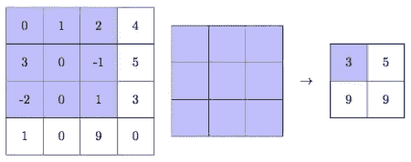

*   当大小为 2 × 2 的平均池窗口应用于具有 2 个步长的输入时，输出大小也是 2 × 2:

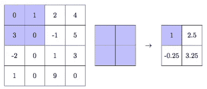

# 三。全连接层

全连接层是卷积神经网络的最后一级。网络中可能有一层或多层这样的层。当前层的所有神经元都与下一层的每个神经元相连。这就是它们被称为全连接层的原因。

第一个全连接层获取前一层(池层的卷积层)的输出，并将它们展平为单个向量。在输出层中，节点的数量对应于类(或标签)的数量。这一层给出了每一类的概率。例如，在对 MNIST 数据进行分类的问题中，我们有 10 个标签，它们是从 0 到 9 的数字。因此，输出节点的数量是 10。如果输入是数字 2 的图像，那么类 2 给出的概率应该是最大的。

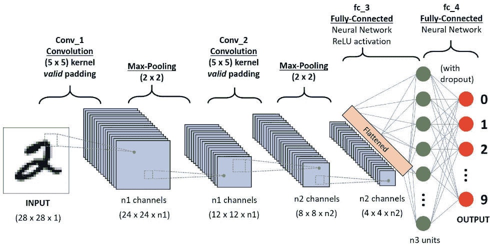

[Source: Toward Data Science]

# 四。例子

在本节中，我们将在 Keras 中构建一个简单的卷积神经网络来对 MNIST 数据进行分类。

## 1.手写数字的 MNIST 数据集

该数据集由训练集中的 60，000 个样本和测试集中的 10，000 个样本组成。这些数字已经过大小标准化，并以 28 × 28 的固定大小居中。

该数据库可在[页面](http://yann.lecun.com/exdb/mnist/)上获得。也可以从 Keras 的库**数据集**中加载:

```
 X_train shape (60000, 28, 28) X_test shape (10000, 28, 28)
```

随机可视化训练集中的一些图像:

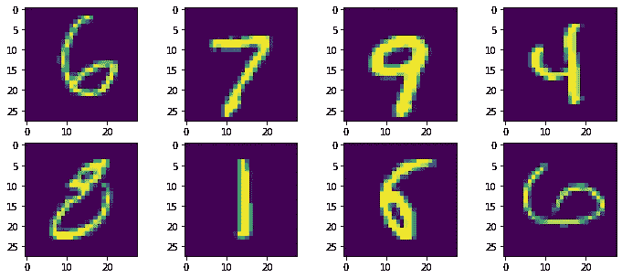

## 2.预处理数据

该任务包括以下步骤:

*   将图像重塑为所需的 Keras 大小
*   将整数值转换为浮点值
*   标准化数据
*   一键编码标签

## 3.建立一个 CNN 模型；

## 4.培训模式

定义培训功能

总结培训历史:

描述模型的架构以及每层中的参数数量:

```
Model: "sequential_1"
_________________________________________________________________
Layer (type)                 Output Shape              Param #   
=================================================================
conv2d_4 (Conv2D)            (None, 28, 28, 32)        832       
_________________________________________________________________
conv2d_5 (Conv2D)            (None, 28, 28, 32)        25632     
_________________________________________________________________
max_pooling2d_2 (MaxPooling2 (None, 14, 14, 32)        0         
_________________________________________________________________
conv2d_6 (Conv2D)            (None, 14, 14, 64)        18496     
_________________________________________________________________
conv2d_7 (Conv2D)            (None, 14, 14, 64)        36928     
_________________________________________________________________
max_pooling2d_3 (MaxPooling2 (None, 7, 7, 64)          0         
_________________________________________________________________
flatten_1 (Flatten)          (None, 3136)              0         
_________________________________________________________________
dense_2 (Dense)              (None, 128)               401536    
_________________________________________________________________
dense_3 (Dense)              (None, 10)                1290      
=================================================================
Total params: 484,714
Trainable params: 484,714
Non-trainable params: 0
_________________________________________________________________
```

训练模型(在训练集上拟合模型，并使用 X_test 作为验证集

```
**train_model(model,X_train, y_train, X_test, y_test)**Epoch 1/50
468/468 [==============================] - 5s 10ms/step - loss: 1.6875 - accuracy: 0.4765 - val_loss: 34.9615 - val_accuracy: 0.9225
Epoch 2/50
468/468 [==============================] - 4s 9ms/step - loss: 0.2491 - accuracy: 0.9239 - val_loss: 18.6345 - val_accuracy: 0.9582
............
............
............
Epoch 49/50
468/468 [==============================] - 4s 9ms/step - loss: 0.0030 - accuracy: 0.9992 - val_loss: 7.9952 - val_accuracy: 0.9897
Epoch 50/50
468/468 [==============================] - 4s 9ms/step - loss: 0.0030 - accuracy: 0.9992 - val_loss: 8.4591 - val_accuracy: 0.9888
313/313 [==============================] - 1s 2ms/step - loss: 8.4456 - accuracy: 0.9888
```

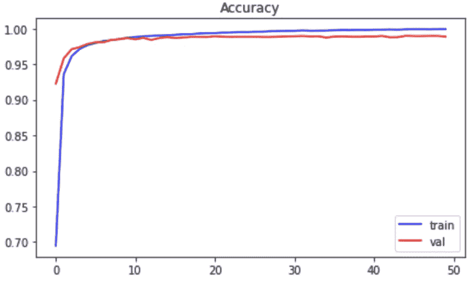

## 5.做预测

## 6.确定混淆矩阵

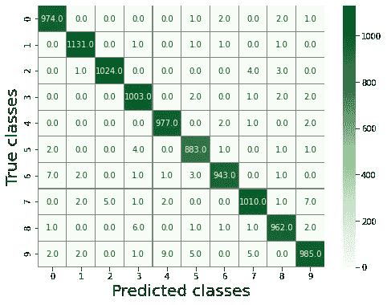

## 7.随机可视化一些图像及其预测标签

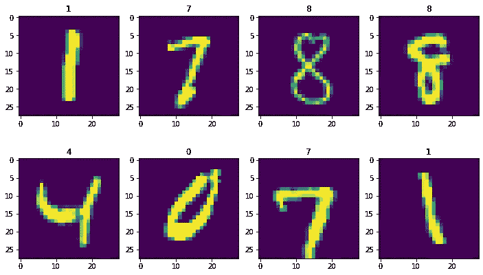

# **五、结论**

我们已经发现了卷积神经网络的基本架构，包括卷积层、池层和全连接层。CNN 在计算机视觉方面有很多应用。在这篇文章中，我们建立了一个简单的 CNN 模型来识别手写数字图像。结果，我们在训练集和验证集上都获得了 98.88%的性能。虽然这个结果已经足够好了，但是你也可以试着改变一些模型的超参数，比如内核大小，过滤器的数量，填充，或者激活函数等等，看看能不能找到一个更好的结果。:-)

希望这篇文章对你有帮助。不要犹豫，在 medium 上找到我[，在接下来的博客中发现类似的内容。](https://lekhuyen.medium.com/)

感谢您的阅读！