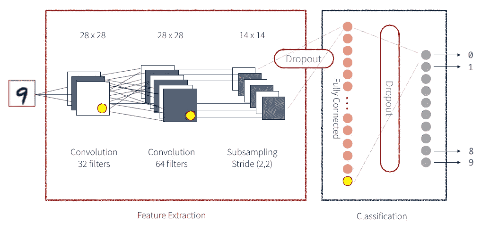

# 卷积神经网络

> 原文：<https://medium.com/mlearning-ai/convolutional-neural-networks-8ac43671642d?source=collection_archive---------3----------------------->

CNN for Digits Classification

## 什么是图像分类？

**图像分类**是试图从整体上理解整个图像的基本任务。目标是通过将图像分配到特定的标签来对其进行分类。通常，图像分类指的是其中仅出现一个对象并被分析的图像。相比之下，对象检测涉及分类和定位任务，并用于分析图像中可能存在多个对象的更现实的情况。

随着发现一个[卷积神经网络](https://wikipedia.org/wiki/Convolutional_neural_network) (CNN)可以用来逐步提取图像内容的越来越高层次的表示，在建立图像分类模型方面出现了突破。CNN 不是对数据进行预处理以获得纹理和形状等特征，而是只将图像的原始像素数据作为输入，“学习”如何提取这些特征，并最终推断它们构成了什么对象。

## 卷积神经网络(CNN):

卷积神经网络是一种用于图像识别和处理的方法，专门用于处理像素数据。

首先，CNN 接收一个输入特征图:一个三维矩阵，其中前两个维度的大小对应于图像的像素长度和宽度。第三维的大小是 3(对应于彩色图像的 3 个通道:红色、绿色和蓝色)。CNN 由一堆模块组成，每个模块执行三种操作。

*卷积*提取输入特征图的图块，并对其应用过滤器以计算新特征，产生输出特征图，或*卷积特征*(其可能具有与输入特征图不同的大小和深度)。卷积由两个参数定义:

*   **提取的图块尺寸**(通常为 3x3 或 5x5 像素)。
*   **输出特征图的深度**，对应于应用的过滤器数量。

在卷积过程中，过滤器(与分块大小相同的矩阵)有效地在输入要素地图的格网上水平和垂直滑动，一次一个像素，提取每个对应的分块。

对于每个滤波器-瓦片对，CNN 执行滤波器矩阵和瓦片矩阵的逐元素乘法，然后对结果矩阵的所有元素求和以获得单个值。然后在*卷积特征*矩阵中输出每个滤波器-图块对的每个结果值。

在训练期间，CNN“学习”过滤器矩阵的最佳值，使其能够从输入特征图中提取有意义的特征(纹理、边缘、形状)。随着应用于输入的过滤器数量(输出特征映射深度)的增加，CNN 可以提取的特征数量也增加。然而，代价是滤波器构成了 CNN 花费的大部分资源，因此随着更多滤波器的加入，训练时间也增加了。此外，添加到网络中的每个过滤器提供的增量值都比前一个少，因此工程师们的目标是构建使用最少数量的过滤器来提取精确图像分类所需的特征的网络。

## 一些重要的 CNN 网络:

*   LeNet-5: LeNet-5 架构可能是最广为人知的 CNN 架构。它是由 **Yann LeCun** 在 1998 年发明的，广泛用于手写数字识别(MNIST)。
*   **Alex net**:Alex net CNN 架构以较大优势赢得了 2012 年 ImageNet ILSVRC 挑战赛。它实现了 17%的前五名错误率，而第二名仅实现了 26%！它是由 Alex Krizhevsky，Ilya Sutskever 和 Geoffrey E. Hinton 开发的。它与 LeNet-5 非常相似，只是更大更深，并且它是第一个将卷积层直接堆叠在彼此之上，而不是在每个卷积层之上堆叠一个池层。
*   VGG-16 :正如在 AlexNet 架构中看到的，CNN 开始越陷越深。提高深度神经网络性能的最直接方法是增加它们的大小。VGG(视觉几何组)发明了 VGG-16，它有 13 个卷积层和 3 个全连接层，带有来自 AlexNet 的 Relu 激活功能。
*   **ResNet** :最后但并非最不重要的是，ILSVC 2015 挑战赛的获胜者是何等人开发的残差网络(ResNet)，它使用由 152 层组成的极深 CNN，提供了令人震惊的 3.6%以下的前 5 名错误率。能够训练这样一个深度网络的关键是跳跃连接:馈入一个层的信号也被添加到位于栈中稍高一点的层的输出中。让我们先来看看 ResNet 架构，并讨论它为什么有用。

## CNN 的几个应用是:

*   图像处理和识别
*   模式识别
*   语音识别
*   自然语言处理
*   视频分析