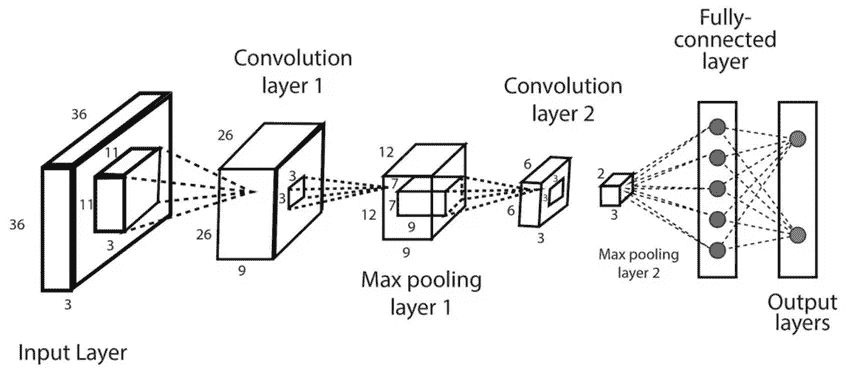
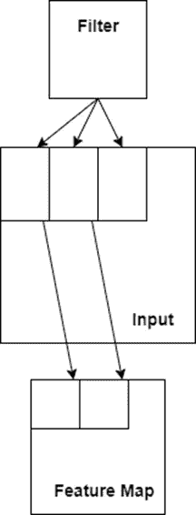
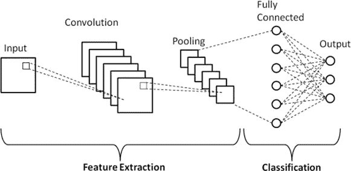

# 卷积神经网络(CNN)的深入回顾

> 原文：<https://medium.com/mlearning-ai/convolutional-neural-networks-cnns-1ed0f1f8e176?source=collection_archive---------4----------------------->

在接下来的章节中，我将解释 CNN 的起源、结构和应用。

在 CNN 的深度学习之前，计算机在玩 AlphaGO 等游戏方面比人类更好，但是，计算机无法处理图像和文本等非结构化数据。直到最近，我们才把计算机变成了超人机器，能够完成所有这些复杂的任务，比如图像和文本分类。

对我们人类来说，当我们看一张照片时，画面中的内容似乎很明显。假设有一个狗舔主人的图像。我们不能忽视画面中有一只狗的事实，观察这些事情已经成为我们的第二天性。直到最近，计算机才能够感知这些东西。

现在卷积神经网络(CNN)出现了。对人类大脑视觉皮层的研究让我们发现了 CNN。从那以后，细胞神经网络被广泛用于图像识别。如今，CNN 正被用于各种各样的事情，如自动驾驶、图像和视频分类系统。这些不仅用于图形数据，而且在通过自然语言处理(NLP)计算文本数据方面也取得了巨大进步。

# CNN 的历史

由于 CNN 的发展与我们对大脑视觉皮层的了解有关。我们首先需要了解我们的大脑是如何感知图像的。大卫·胡贝尔和托尔斯滕·威塞尔在 1959 年发现了我们体内简单和复杂细胞的工作方式。基于他们的研究，我们使用两种 different 类型的细胞来识别视觉模式。简单的单元只能识别图像特定部分的特定方向的边缘和条。相比之下，复杂细胞不仅能做简单细胞做的事情，还能识别图像中任何位置的边缘和条纹。

假设我们面前有一幅图像。简单单元格只能识别右上角的水平条，而复杂单元格可以识别图像中所有位置的水平条。复杂细胞可以简单地看作是几个简单细胞的组合。我们的身体使用简单和复杂细胞之间的连贯理解来形成视觉系统。

接下来是*祖母*或*诺斯替细胞的概念。*它只是指我们体内的一个假想细胞，只有在看到一个复杂的图像时才会被激活，比如一个人的祖母。因此，这些复杂的神经元中有几个是相互连接的，当它们看到祖母的复杂图像时就会被激活。

# 新克隆体

受 David Hubel 和 Torsten Wiesel 工作的启发，Kunihiko Fukushima 博士在 20 世纪 80 年代开发了一个人工神经网络。该网络模拟了我们体内简单和复杂细胞的工作方式。该网络并不对应于生物神经元，而是代表简单和复杂细胞的算法结构。福岛想到的主要想法是，新认知基因应该能够识别复杂的图像或模式。基于简单细胞对每个单独部分的识别，复杂细胞会识别整个图像或图案。

假设我们想识别一只猫的形象。复合体应该能够检测到猫整体的存在，而简单细胞应该能够检测到单个部分，如爪子、尾巴、胡须等。

# 网络

福岛所做的工作为许多研究人员探索这一领域铺平了道路。第一个重大突破发生在 20 世纪 90 年代，Yann LeCun 实现了一个基于卷积神经网络的现代应用。他的论文“*基于梯度的学习应用于文档识别*”成为当时最受欢迎的研究论文。它被用作任何开始学习 CNN 的人的指南。

在论文中，他描述了如何使用 CNN 训练手写数字数据集(MNIST)。他在福岛新克隆的基础上，利用人造细胞组装了许多复杂的功能。

这都是关于 CNN 的简史以及它们是如何形成的。在接下来的部分，我将解释一些与 CNN 相关的重要术语。

# 盘旋

本质上，CNN 的主要组件是卷积层。在数学术语中，卷积可以定义为一种涉及权重和输入相乘的运算。CNN 的第一层是卷积层。与每个输入都完全连接的人工神经网络不同，CNN 的第一层仅连接到其特定场的像素。同样，第二个卷积层与第一个卷积层的相应像素相连。因此，我们在第一层组装低级特征，然后将它们组合在一起，创建高级特征。真实世界的图像也具有类似的层次结构。这是 CNN 与真实世界的图像数据配合得如此之好的主要原因之一。

卷积层主要处理二维数据，因此权重和输入之间的乘法通常在 2D 权重阵列和输入阵列之间进行。这个 2D 权重阵列被称为*滤波器*或*内核。*必须保持滤波器的尺寸小于输入。因此，输入的大小会减小，以匹配滤波器的大小，两者之间的乘积称为点积。基本上，点积涉及元素级乘法，结果相加后以标量的形式给出最终输出。

我们倾向于保持滤波器的大小小于输入，因为它会导致相同的权重与输入数组相乘多次。当这种技术系统地应用于输入的每一个重叠部分时，它会变得更加强大。因为这里权重和输入数组之间的乘法发生了几次，所以输出是包含输入的滤波值的 2D 数组。这个输出 2D 阵列也被称为*特征图。*特征图中出现的每个过滤值随后通过一些非线性激活函数线 ReLU 传递。这部分过程与全连接层的情况类似。两个连续接收场之间的距离称为*步幅*。

*Fig: Convolution process*

# 汇集层

现在，我们已经了解了卷积层的工作原理，接下来我们将讨论 CNN 架构中的第二层，即池层。使用池层的主要目的是降低过度拟合的风险。这是通过减小卷积特征图的尺寸来实现的。这有助于减少计算量，节省内存，并且总体上减少了参数的数量。因此，池图层会对通过卷积图层获得的要素地图进行下采样。

下采样指的是生成较低分辨率的输入图像的过程，该图像仍包含所有重要特征，但不处理原始输入的更精细细节。它们通过将要素组合成面片来总结要素地图中的要素。

该层涉及汇集操作，并且汇集操作的大小总是小于特征地图的大小。通常我们使用跨度为 2 个像素的池操作。这意味着我们实际上是将特征地图的大小减少了 2 倍。假设我们有一个大小为 8×8(64 像素)的特征地图，在应用池操作后，它将缩小到 4×4(16 像素)的大小。我们最常用的两种主要池化方法是*平均池化*和*最大池化。*

**1。** **平均池:**在这个方法中，我们计算特征图中出现的每个补丁的平均值。

**2。** **最大池:**在这种方法中，我们计算特征图中每个面片的最大值。

# CNN 的体系结构

现在我们已经看到了 different 层及其功能，让我们更广泛地看看卷积神经网络的整体架构。CNN 本质上由两部分组成:

1.输入层、卷积层和池层构成了 CNN 的特征提取部分。

2.一个完全连接的图层，用于处理卷积过程生成的输出，以预测 different 影像的类别。

*Fig: Architecture of CNN*

我们已经解释了卷积层和池层的工作原理。现在让我们看看 CNN 架构的分类部分。

# 全连接层

全连接层应该始终是卷积神经网络的最后一层。它接收卷积过程产生的输出作为输入。然后，它通过应用几个线性变换来变换输入，最后通过激活函数来预测图像的类别。

全连接层的输出是大小为 N 的向量的形式，其中 N 指定我们的问题中存在的类的数量。该输出向量的每个元素都与特定图像属于特定类别的概率相关联。

通过简单地获得具有相应权重的每个输入的乘积，取这些乘积的总和，然后在其上应用激活函数，来计算概率。在这一层中，每个输入都与所有可能的输出相连接，因此我们使用术语“完全连接”。CNN 在训练阶段通过使用反向传播来学习与输入相乘的权重。该层利用 different 类型的激活函数，如 ReLU、tanh、softmax 函数等。

# 拒绝传统社会的人

通过将数据集的所有要素连接到完全连接的图层，我们增加了过度拟合的机会。这可能导致我们的模型在测试数据上的性能下降。

为了防止过度拟合，我们使用一种称为漏失层的东西。通过使用这种方法，大约 30%的神经元被随机地从网络中删除。这通常发生在网络的训练阶段，导致网络规模缩小。

— — — — — — — — — — — — — — — — — — — — — — — — — — — -

至此，你应该明白什么是 CNN 以及它们是如何工作的了。我希望你喜欢它！

这篇文章摘自我的书 [**《机器学习——综合方法》。**](https://amzn.to/3KVCD6g)

要了解更多关于 CNN 和机器学习的一般知识，请查看我在亚马逊上的书:[https://amzn.to/3KVCD6g](https://amzn.to/3KVCD6g)

请随时通过 Linkedin 联系我。

感谢你的阅读，我们下一集再见。

 [## Mlearning.ai 提交建议

### 如何成为 Mlearning.ai 上的作家

medium.com](/mlearning-ai/mlearning-ai-submission-suggestions-b51e2b130bfb)