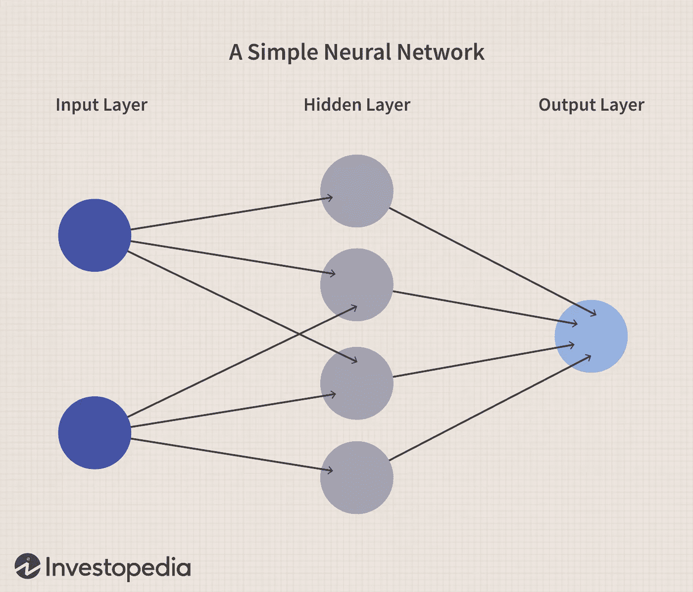
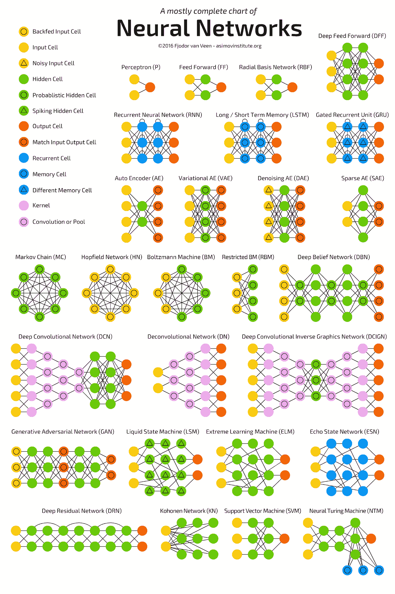
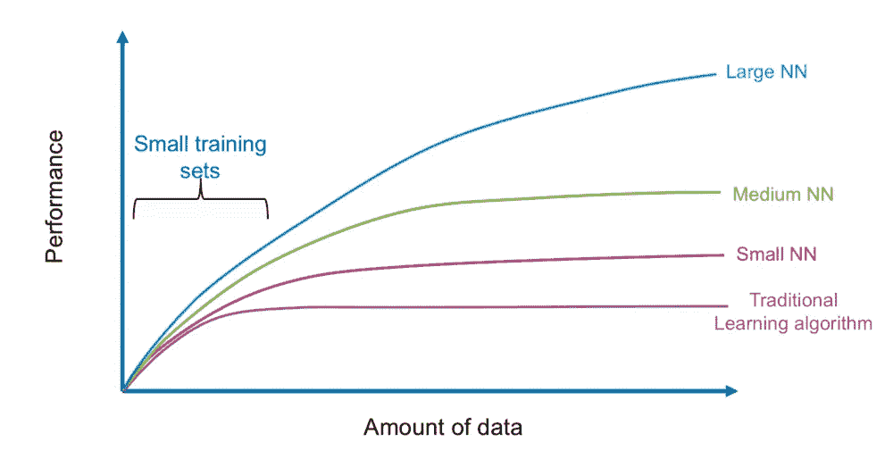
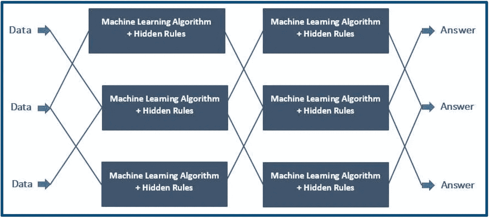
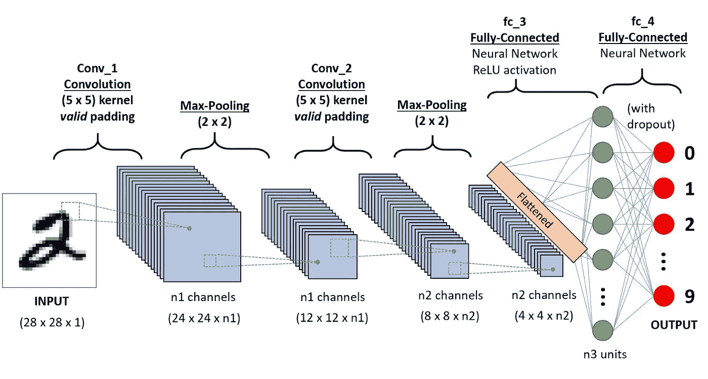
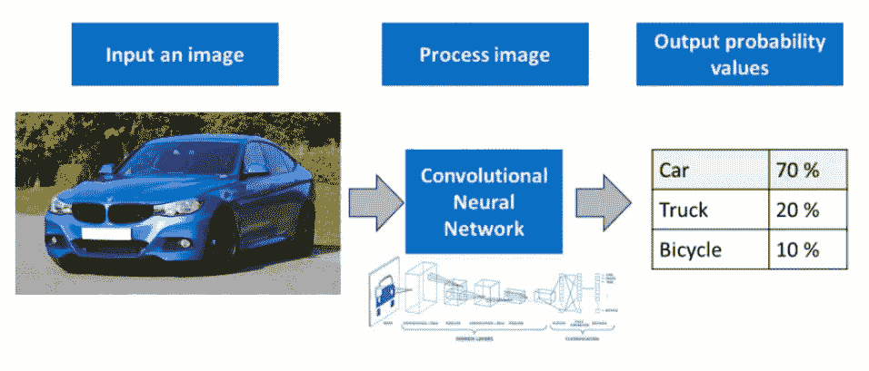
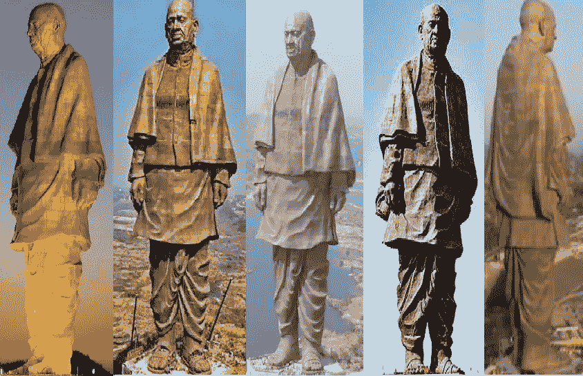
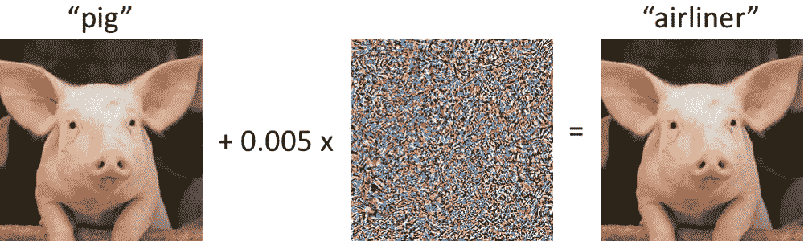
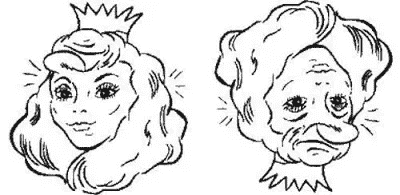

# 卷积神经网络(CNN)——诸如此类。

> 原文：<https://medium.com/mlearning-ai/convolutional-neural-networks-cnns-and-all-that-66572031980d?source=collection_archive---------5----------------------->

我的文章中使用的图像是各自组织的财产，在此仅用于参考、说明和教育目的。(图片来源:Google【除了部分图片，在图片下方特别提到了其来源】)

让我们从基础开始。

# 什么是神经网络？

Neural Network (Source: IBM)

这是另一张类似的图片，有着新鲜的插图风格。

Neural Network

这是另一个

Source: V7 Labs

这是另一个更简单的神经网络。

Source: Investopedia

神经网络是根据大脑中神经元的行为松散建模的。神经网络的主要优点是它们可以自动提取数据特征，而不需要程序员的输入。神经网络是组织 ML 算法来执行特定任务的系统。这是解决数据集非常大的问题(例如图像)的快速有效的方法。

在神经网络中，有一个输入层、多个“隐藏”层和一个输出层。

# 神经网络的类型。

这幅图像正确地描绘了几乎所有的神经网络。你可以在这里找到一篇*媒体*解释这个形象[的文章。](https://towardsdatascience.com/the-mostly-complete-chart-of-neural-networks-explained-3fb6f2367464)

A Mostly Complete Chart of Neural Networks

## 不同神经网络对大量数据的性能。

Performance of different Neural Networks against Amount of Data.

正如您在上面给出的图中所看到的，大型 NN 往往在处理大量数据时表现更好，而传统的 ML 算法在某个“饱和点”之后停止改善，这意味着改善在某个点之后是静态的，没有变化。

# 神经网络是如何工作的？

*   神经网络分为多层，每层又分为若干个称为节点的块。
*   每个节点都有自己的任务要完成，然后传递给下一层。神经网络的第一层被称为输入层。
*   输入层的工作是获取数据并将其输入神经网络。这里没有过程发生。旁边是隐藏层。
*   它们被称为“隐藏”层，因为这些层是隐藏的，对用户是不可见的。这些隐藏层的每个节点都有自己的 ML 算法，该算法执行从输入层接收的数据。隐藏层是唯一进行任何处理的地方。
*   根据神经网络功能的复杂程度，可以有多个隐藏层。节点的数量也取决于这个标准。
*   最后一个隐藏层将最终处理后的数据传递给输出层，然后输出层将数据作为最终输出提供给用户。这里不进行任何处理。

# 卷积神经网络

现在我们对神经网络有了更好的了解，让我们来谈谈 CNN。

A CNN Sequence to Classify & Segregate Handwritten Characters

## 介绍

CNN(卷积神经网络)是深度神经网络的一种亚型，可以识别和分类图像中的关键特征，并用于图像处理和分析。照片和视频识别、图像分类、医学图像分析、计算机视觉和 NLP 是其中的一些应用。

这是一种深度学习算法，可以接受图像作为输入，为图像中的各个方面/对象分配重要性(可学习的权重和偏差)，并区分它们。

卷积的数学函数是一种特殊的线性运算，其中两个函数相乘产生第三个函数，第三个函数表示一个函数的形状如何被另一个函数修改，卷积的数学函数在卷积神经网络中由单词“卷积”表示。简单地说，两个矩阵相乘得到一个输出，用于从图像中提取特征。

部署 CNN 的过程如下-

下图显示了将 CNN 部署到现实生活用例中的过程，在这种情况下——识别图像。CNN 获取输入图像，处理并理解它&给出输出值，显示图像是一个特定对象的确信程度。

例如:在这种情况下，CNN 70%确定这是一辆汽车的图像，20%确定这是一辆卡车的图像，10%确定这是一辆自行车的图像。

Process of Deploying a CNN

你可以在这里看到 CNN 的放大版。

## CNN 的层次/划分

Basic Layers of a CNN

*CNN 的各层是卷积层，汇集层&全连接层。*

当这些层堆叠/放在一起时，就形成了 CNN 架构。让我们稍微详细地了解一下它们中的每一个。

## 卷积层

这是从输入图像中提取不同特征和特性的第一层。卷积数学运算在输入图像和该层中特定大小 MxM 的滤波器之间完成。

通过在输入图像(MxM)上滑动滤光器，获得滤光器和输入图像部分之间关于滤光器尺寸的点积。

特征图是结果，并且它包括图像的信息，例如它的角和边缘。该特征图然后被输入到其他层，这些层从输入图像中学习一系列其他特征。

CNN 的特征图捕获将滤波器应用于输入图像的结果，即在每一层，特征图是该层的输出。将特定输入图像的特征映射可视化的原因是为了试图了解我们的 CNN 检测到了什么特征。

## 汇集层

通常在卷积层之后应用汇集层。这一层的主要目标是降低卷积后的特征图的大小，以减少计算开销。

这是通过减少图层之间的连接并在每个要素地图上独立操作来实现的。根据所使用的机制，有各种各样的池化过程。

## 全连接层

权重和偏差以及神经元构成了全连接(FC)层，用于连接两层之间的神经元。CNN 架构的最后几层位于输出层之前。

在此步骤中，将前面层的输入图像展平并提供给 FC 层。之后，展平的向量通过几个额外的 FC 级发送，在这里通常执行数学函数运算。分类过程从这一点开始。

# CNN 的缺点

CNN 模型的缺点是:

*   不同位置和角度拍摄的图像分类
*   对立的例子
*   坐标框架
*   以及其他一些小缺点

让我们稍微详细地看一下每一个。

## 不同位置和角度拍摄的图像分类

计算机视觉领域的众多挑战之一是处理现实世界中存在的数据差异。

人类视觉系统可以识别图像，不管-

*   角度差异
*   背景差异
*   光线、饱和度、颜色等方面的差异。

但是当我们带着同样的问题获取数据时，情况就不一样了。模特的视角是不一样的。在它的视角中，两个相同的图像，一个是黑白的，另一个是彩色的，是不同的，它能区分它们。

让我们更好地理解。

The Statue of Unity, Gujarat, India

上面的图片是同一张图片的 5 个版本的拼贴，不同的是照明，颜色，角度，阴影，透视等。

在对类似数据集的图像进行分类时，细胞神经网络具有优异的性能。然而，如果图像包含某种程度的倾斜或旋转，或者如果图像具有不同的照明或阴影，那么 CNN 通常难以对图像进行分类。

这可以通过在训练过程中向图像添加不同的变化来解决，否则称为数据扩充。

## 什么是数据增强？

Data Augmentation, Source: Analytics India Magazine

数据扩充是一套通过从现有数据生成新的数据点和视角来人为增加数据量的技术。这包括对数据进行细微的改变，或者使用深度学习模型来生成新的数据点或新的视角，以更好地训练模型。

有关解释数据增强的完整文章，请查看提供的链接[此处](https://research.aimultiple.com/data-augmentation/)和[此处](https://www.mygreatlearning.com/blog/understanding-data-augmentation/)。

## 对立的例子

从上述缺点来看，可以肯定的是，CNN 以不同于人类的方式识别图像，并且对更多训练增强数据的需求不会解决学习对象的问题。

如果 CNN 拍摄了带有一些噪声的图像，它会将该图像识别为完全不同的图像，而人类视觉系统会将其识别为带有噪声的相同图像。这也证明了 CNN 正在使用与常规视觉系统完全不同的信息来识别图像。

稍加修改的图像被称为“对立的例子”。

Two different Percepts of the same image.

## 坐标框架

卷积网络根据以不同模式排列的像素簇来识别图像，并且不将它们理解为图像中存在的组件。美国有线电视新闻网(CNN)显示的图像没有任何组件及其部分-整体关系的内部表示。

CNN 没有作为人类视觉基本组成部分的坐标框架。坐标框架是一种心理模型，它记录了对象的方向和独特特征。例如，如果我们看下图，我们可以确定右边的图像，如果颠倒过来，我们会看到左边的图像。只要在精神上调整我们大脑中的坐标框架，我们就能看到两张脸，不管照片的方向如何。这是人类坐标框架使人类能够看到两张脸的地方。

## CNN 的小缺点

*   由于 maxpool 之类的操作，CNN 的速度明显变慢。
*   如果 CNN 有几层，那么如果计算机不是由一个好的 GPU 组成，训练过程将花费很多时间。
*   ConvNet 需要大型数据集来处理和训练神经网络。

你可以在这里进一步了解 CNN 的缺点。

# 进一步研究的方向

[布法罗大学 Sargur Srihari 先生的卷积网络概述](https://cedar.buffalo.edu/~srihari/CSE574/Chap5/Chap5.5.6-ConvolutionalNetworks.pdf)。

感谢阅读，快乐学习！

 [## Mlearning.ai 提交建议

### 如何成为 Mlearning.ai 上的作家

medium.com](/mlearning-ai/mlearning-ai-submission-suggestions-b51e2b130bfb)