# 用于图像识别的卷积神经网络

> 原文：<https://medium.com/mlearning-ai/convolutional-neural-networks-for-image-recognition-7148a19f981f?source=collection_archive---------3----------------------->

第三课 2020 年 DeepMind 系列讲座笔记

这里展示的大部分图片来自 DeepMind 讲座 3 的 [***幻灯片*** *。*](https://storage.googleapis.com/deepmind-media/UCLxDeepMind_2020/L3%20-%20UUCLxDeepMind%20DL2020.pdf)

## 背景:

根据我在 [***第二课***](/@nghihuynh_37300/neural-networks-ba6fa76eb719) 的笔记，我们已经知道了什么是神经网络(*图 1)* 。现在，我们希望使用这些网络来检测、分析和分类图像，以实现特定任务的自动化。

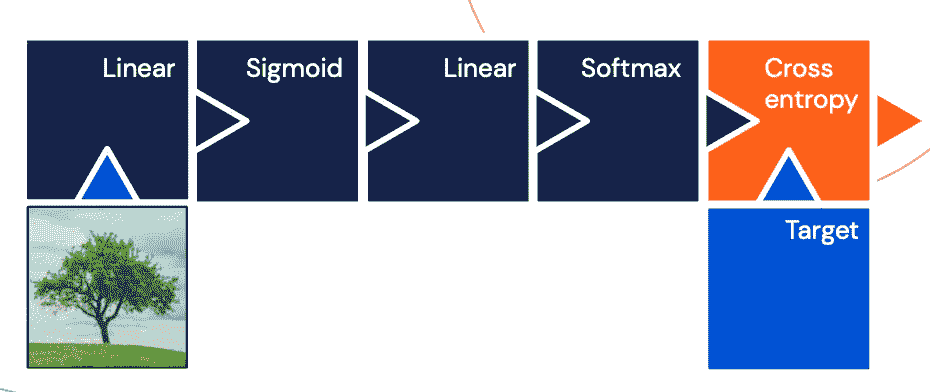

**Figure 1**: A recap of a neural network with 2 hidden layers

**例如**:给定下面的一棵树图像(*图 2* ，我们的目标是训练我们的神经网络来识别并分类它为一棵树。

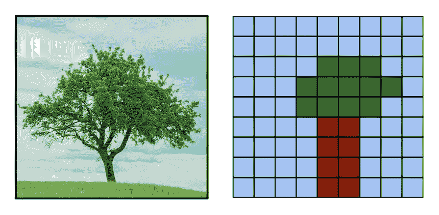

**Figure 2**: A tree image. On the left is the original digital image, on the right is the simplified pixelated tree image

我们知道神经网络接收一个数字向量作为输入。那么，我们如何给它输入图像呢？

简单这么说吧。数字图像是像素的 2D 网格。每个像素记录了产生图像的光的强度*(图 2)。*将这些像素表示为数字向量的一种方法是逐行展平它们(*图 3* )。

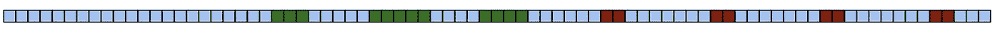

**Figure 3**: A representation of a vector of numbers from the image

现在，我们知道如何将图像表示为神经网络的数字向量。我们来探讨一个 ***卷积神经网络***(***CNN***或 ***ConvNet*** )的一些积木。

> **注意:**conv net 的输入和输出是张量，即宽度 x 高度 x 通道的 3D 对象(图 4)。

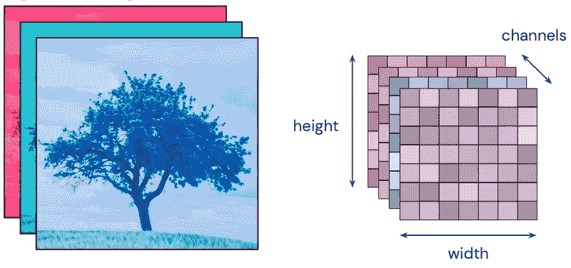

**Figure 4**: Inputs and outputs are tensors

## **积木:**

构建 ConvNet 架构有三种主要的层类型:

***1。全连接层*** :传统层，将输入向量的每个元素连接到该层中的每个隐藏单元(神经元)*(图 5)。*

**Figure 5**: Fully connected layer

**2*。卷积层:***conv net 的核心构建块，完成大部分繁重的计算工作。该层应用权重共享来保持图像的拓扑结构。内核(过滤器或小窗口)滑过图像，并在每个位置产生一个输出值。然后我们对多个内核进行卷积，得到多个*特征图*或*通道* *(图 6)* 。

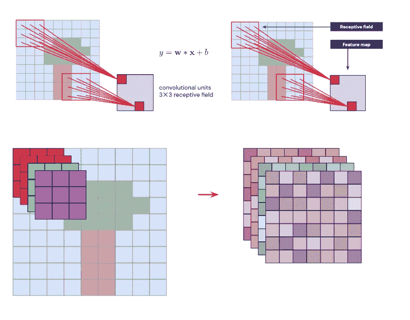

**Figure 6**: Convolutional layer

***卷积运算的变体(表 1):***

**Table 1:** Convolution operations

***3。*共用层:通常插入连续 Conv 层之间的层。该层计算小窗口上的*平均值*或*最大值*以降低分辨率。因此，它减少了网络中的参数和计算的数量(*图 7)* 。**

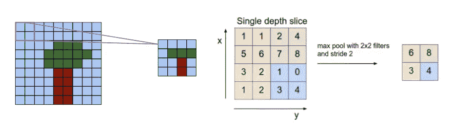

**Figure 7:** Pooling layer

## **什么是卷积神经网络？**

一个 ***卷积神经网络***(***CNN***或 ***ConvNet*** )是一个层序列，ConvNet 的每一层都通过一个可微函数将一个激活量转化为另一个激活量。ConvNets 通常用于图像分类和其他计算机视觉任务。

现在，让我们堆叠这些构建模块来创建一个简单的卷积神经网络。

首先，我们从前面的 [***笔记中回忆一下如何将一个神经网络表示为一个计算图。***](/@nghihuynh_37300/neural-networks-ba6fa76eb719)**(图 8)。**

*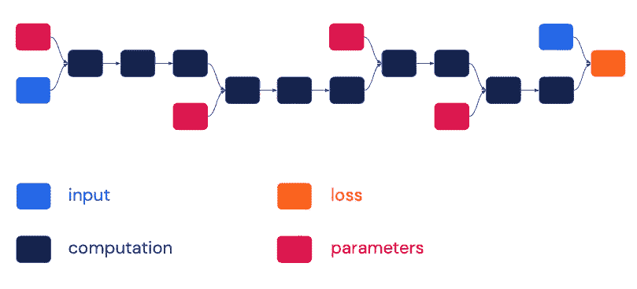*

***Figure 8**: A neural network as a computational graph*

*然后，我们简化上图，使参数和损耗包含在内*(图 9)* 。*

*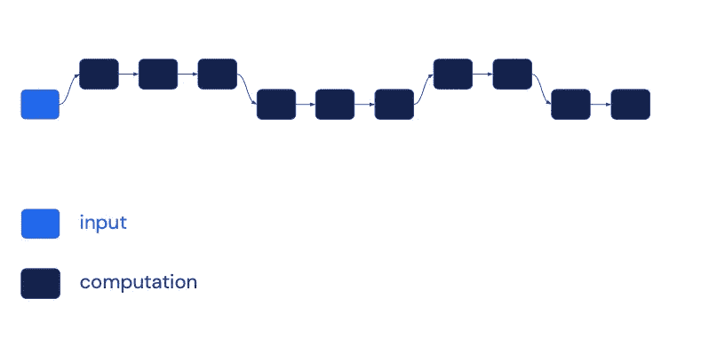*

***Figure 9**: A simplified diagram: implicit parameters and loss*

*最后，我们交替使用卷积层和池层来创建 ConvNet，特别是 LeNet-5-a convnet，用于手写数字识别*(图 10)* 。*

*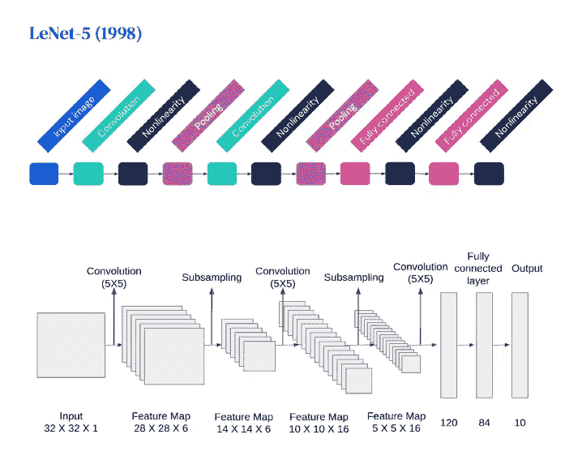*

***Figure 10**: The architecture of LeNet-5*

> ***注**:二次抽样=合并*

*所以，网络总共有五层，其中三层是卷积的，最后两层是全连接的。卷积层在汇集层之间交替。输出层使用 Softmax 激活函数将图像分类到各自的类别中。*

*让我们更详细地理解这个架构(*图 11* )。*

*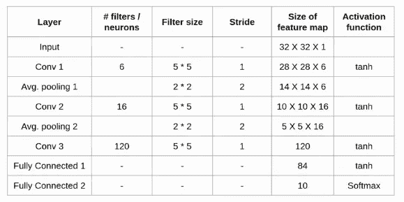*

***Figure 11**: LeNet-5 in detail*

*第一层是输入层，要素地图大小为 32 x 32 x 1 (32 x 32 灰度图像)。*

*然后，我们有第一个卷积层，由 6 个大小为 5 x 5、步距为 1 的滤波器组成。这一层使用的激活函数是 tanh。生成的特征地图为 28 x 28 x 6。*

*接下来，我们有第一个平均池层，过滤器大小为 2 x 2，步幅为 2。这一层降低了图像的分辨率，而不影响通道的数量。生成的特征地图为 14 x 14 x 6。*

*接下来是 16 个滤波器的第二卷积层，滤波器大小为 5 x 5，步长为 1。生成的特征地图为 10 x 10 x 16。该层中使用的活化也是 tanh。*

*然后，我们有第二个平均池层，过滤器大小为 2 x 2，步幅为 2。生成的特征图缩小到 5×5×16。*

*最终卷积层有 120 个滤波器，滤波器大小为 5 x 5，步长为 1。再次，tanh 激活函数用在这一层。输出要素地图的大小为 1 x 1 x 120。*

*接下来，我们有了第一个有 84 个神经元的全连接层。我们也使用 tanh 作为这一层的激活函数。输出尺寸为 84。*

*最后，我们有最后一个完全连接的层，有 10 个神经元。该层使用 Softmax 激活函数来给出 10 个类别中的每一个类别中的数据点的概率。然后选择具有最高值的类。*

*这就是 LeNet-5 模型的整体架构。现在，让我们更深入地研究其他模型。*

## *案例研究:*

*让我们探索一下赢得了 ImageNet 大规模视觉识别挑战赛 *(图 12)* 的一些最先进的 CNN。*

*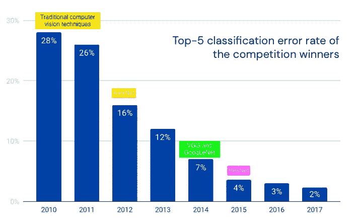*

***Figure 12:** Top-5 classification error rate of the competition winners in the ImageNet challenge*

*   *[***Alex net***](https://proceedings.neurips.cc/paper/2012/hash/c399862d3b9d6b76c8436e924a68c45b-Abstract.html)(2012):与 LeNet-5 的架构类似，但更深更大，五个 Conv 层堆叠在一起，后面是三个完全连接的层*(图 13)* 。*

*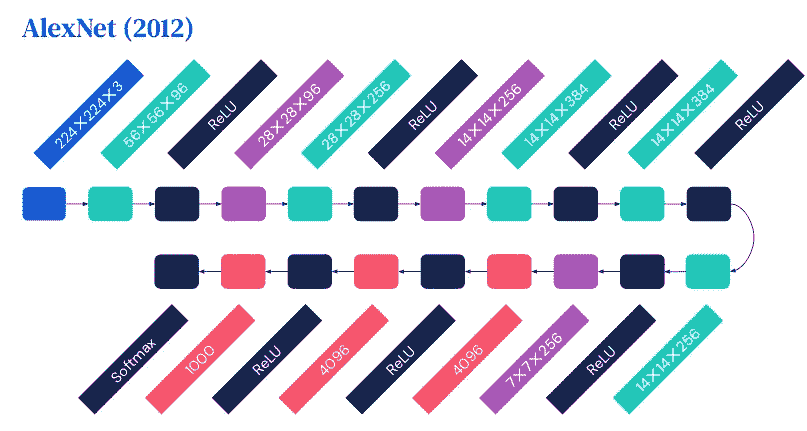*

***Figure 13**: The architecture of AlexNet*

*   *[***VGGNet***](https://www.robots.ox.ac.uk/~vgg/research/very_deep/)*(2014):是一个很深的 convnet。它在汇集之前堆叠许多卷积层。此外，它使用“相同的”卷积来避免分辨率降低。VGGNet 的架构有多达 19 层，3 x 3 个内核和 2 x 2 个池*(图 14)* 。**

**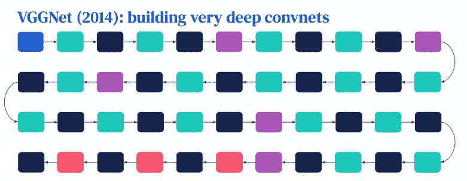**

****Figure 14:** The architecture of VGGNet**

*   **[***ResNet***](https://arxiv.org/abs/1512.03385)(2015):是残差网络，其特点是特殊的*跳过*【残差】*连接*并大量使用 [***批量归一化***](https://arxiv.org/abs/1502.03167) 层。剩余连接有助于训练深层网络。ResNets 是当前最先进的卷积神经网络模型，并且在实践中在大多数主干中实现。**

**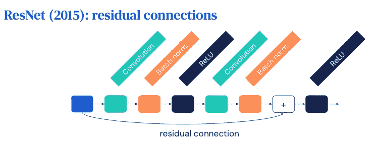**

****Figure 15**: A residual block of ResNet**

## ****超越图像识别:****

**除了图像识别，我们还可以使用 convnets 执行其他计算机视觉任务，例如:*(图 16)***

**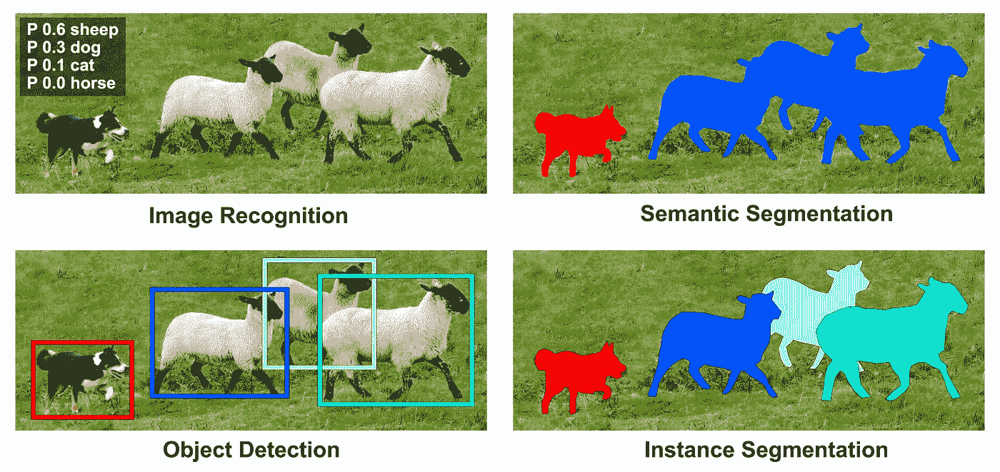**

****Figure 16**: Other computer vision tasks beyond image recognition**

*   *****图像识别:*** 对图像中的一个或多个物体进行识别或分类。**
*   *****对象检测:*** 对图像中的一个或多个对象进行定位和分类，为每个检测到的对象生成包围盒。**
*   *****语义分割:*** 标注图像中一个或多个特定的感兴趣区域。它将单个类别中的多个对象视为一个实体。**
*   *****实例分割:*** 检测并描绘出图像中每个感兴趣的物体。它识别这些类别中的单个对象。**

## **下一步是什么？**

> **[接下来是 DeepMind 深度学习系列第 4 讲的笔记:超越分类的视觉:任务一:物体检测。](/@nghihuynh_37300/vision-beyond-classification-task-i-object-detection-d2f32a5ea4ca)**

** [## Mlearning.ai 提交建议

### 如何成为 Mlearning.ai 上的作家

medium.com](/mlearning-ai/mlearning-ai-submission-suggestions-b51e2b130bfb)**