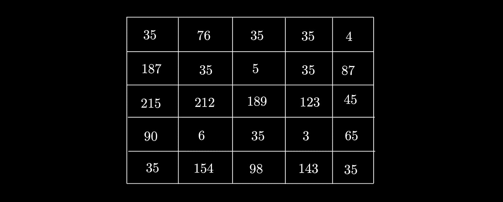
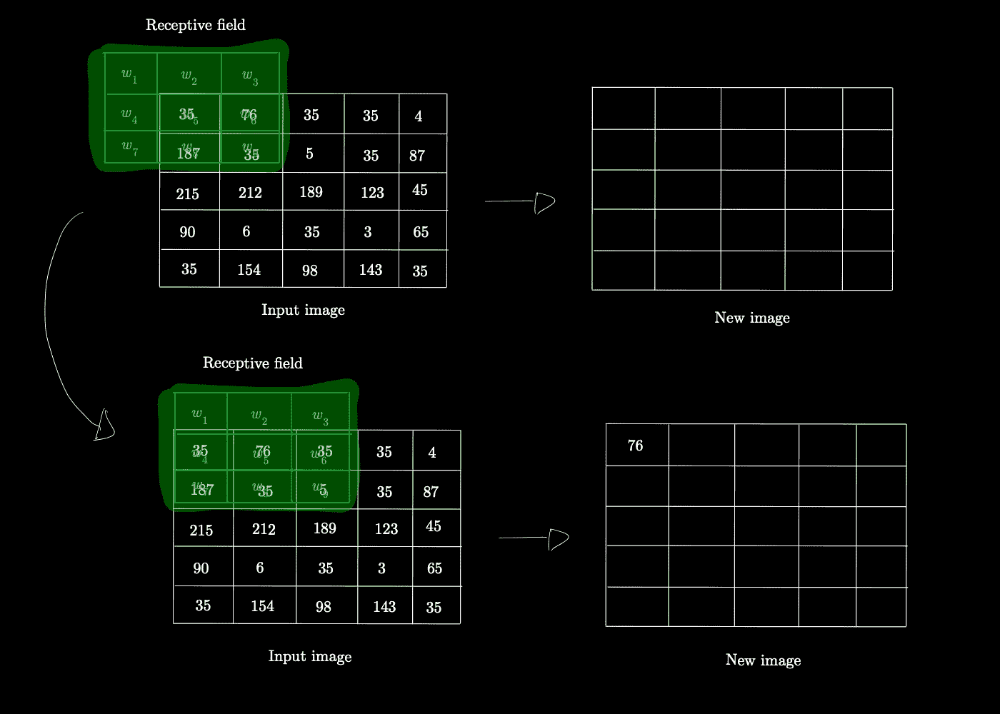
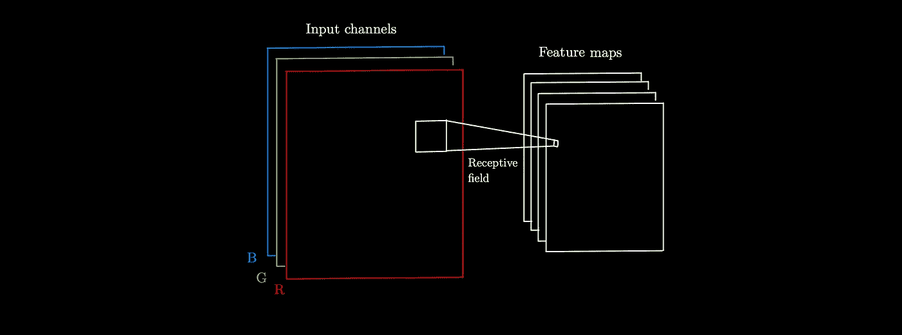
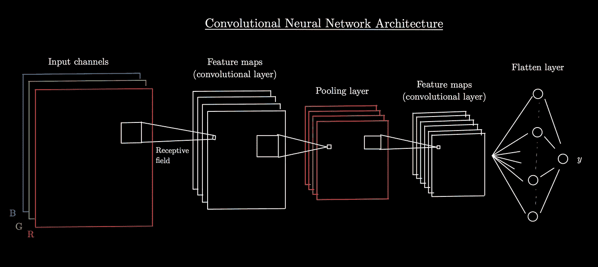

# 卷积神经网络——从重要事物中学习

> 原文：<https://medium.com/mlearning-ai/convolutional-neural-networks-learning-from-what-matters-b05e6121cb7a?source=collection_archive---------8----------------------->

在本文中，我将介绍什么是卷积神经网络，并展示一个使用 Tensorflow 的 Python 示例。

Photo by [Paul Skorupskas](https://unsplash.com/@pawelskor?utm_source=medium&utm_medium=referral) on [Unsplash](https://unsplash.com?utm_source=medium&utm_medium=referral)

人工神经网络用于在机器能力的帮助下解决任何类型的复杂问题。如果你需要回顾一下，我在这里写了一篇关于这个主题的文章。

卷积神经网络出现的主要原因是一些深度学习任务非常复杂，以至于**全连接神经网络** ( *神经网络，它的每个神经元都与后续层中的每个其他神经元相连；也称为密集层—* AlgoExpert.io)不能有效地解决它们。事实上，在**自然语言处理**中，尤其是在**计算机** **视觉**问题中，特征(参数)的数量通常非常多，这导致优化需要大量的能力和时间。例如，从 100×100 像素(10 000 像素)的图片学习的神经网络将需要数百万个连接和权重，因为它使用整个图像来学习。

我们可以用我们所说的 **Neocognitron** 来引入 CNN，这是一个多层的神经网络，主要从输入(第一层中的 S 细胞)中发现简单的模式，并通过第二层(C 细胞)发现更复杂的模式。这是卷积神经网络背后的想法，我们现在就来看看。

# 卷积神经网络是如何工作的？

卷积神经网络是深度学习神经网络，主要用于计算机视觉任务。它们以两种类型的层为特征:**卷积** **层**和**汇聚** **层**。

## 卷积层

这些是 CNN 的主要组成部分，因为网络正是从它们那里学习图像模式的。

一个重要的因素是，与完全连接的神经网络不同，卷积层中的每个神经元并不连接到输入图像(或后续层)中的每个像素，而是仅连接到**感受域**中的一些像素。

在继续之前，我们必须记住，图像是由像素的**红、绿、蓝**、T2 强度或者经过**灰度**(将像素颜色空间转换为 0 到 255 之间的唯一数字)来表示的。在第一种情况下，我们有 3 个通道，而在第二种情况下，我们只有 1 个通道。我们可以认为**通道**是由 RGB 表示中的每种颜色或灰度化后的每个像素的数字表示的图像。在这两种情况下，图层将完成几乎相同的工作。

A gray scaled channel

**什么是感受野？**

卷积层中的感受域是:

> 与相邻神经元层相连的前一层神经元的数量。最大的感受野是一个全连接的神经网络。

其背后的想法是专注于每个像素周围的一部分，而不是整个图像。因此，它允许识别由感受野内的权重所代表的模式。这些字段变得像小图像一样，它被称为，**过滤** **内核**内部由权重表示，并关联到特定的模式，如直线、角点…

这个小图像在整个输入图像上滑动，并应用它过滤内核，以便有一个新的图像，如下图所示。

因此，根据内核，新图像将突出显示出现内核图案的部分。如果是水平白线，新图像将主要由水平白线组成。

在这个例子中，我们为输入图像和新图像保持了相同的大小，这可以通过使用我们称之为**的零填充**来实现，它在前面图层图像的边缘添加 0。我们可以通过不使用填充来减少下一层的尺寸，这样感受野计算的神经元就少了。

**这一层的目的是什么？**

…通过**优化基于损失函数的过滤内核中的权重**，找到构成输入图像的模式。

CNN 的大目标是为自己找到描述图像的过滤内核。因此，网络不是固定权重，而是从一些基本权重开始，并优化权重(感受野的像素)。网络中的层越高级，模式就越精确和复杂。

你需要知道的是，图像的每个像素都有一个感受野，这意味着新图像代表一种模式。但是卷积层通常有许多“新图像”,每个图像代表一种不同的模式。它们被称为**特征图**，一般范围从 1 到 500+。每个特征映射由特定的过滤内核支持，因此，具有其自己的权重的唯一模式被优化。

特征图的一个很大的优点是，如果一个图案在图像中改变了位置，知道特征图表示图案在图像中的任何位置，它将能够识别它。

通常，包含过滤核的感受野具有 3×3、5×5 或 7×7 的尺寸，这大大减少了每个神经元必须计算的权重数量(对于 3×3 感受野，神经元计算 9 个权重)。

最后，卷积层的最后一个要素是步幅的使用，即感受野从一个像素到另一个像素的步长。如果将其初始化为 2，图层上的要素地图的维度将会减少。

> 卷积层的目的是将输入图像中包含的最重要的模式汇总到特征图中。

## 池层

网络使用汇集层来**减少维度**以便改进模式的汇总，并且使神经网络**移位不变**。

它们是两种类型的池:

*   **Max pooling** :具有无内核过滤的感受野，对每个像素进行过滤，并选择感受野内的最大像素值(无填充)。
*   **平均池**:与最大池相同，但不是选择最大像素值，而是对所有像素值进行平均。

这个想法是为了捕捉图像中最重要的元素，即使它们改变了位置(在图像之间)。

## CNN 的最终表现

通常，卷积神经网络由各种卷积层和各种汇集层表示。在网络的末端，我们有一个**展平** **层**，最后特征图的每个像素都有一个神经元。最后，一个**输出** **神经元**，其目的是对输入进行分类。

## 最著名的 CNN 架构

以下是一些自诞生以来最著名的 CNN 架构:

*   Yann LeCun 的 LeNet-5
*   亚历克斯·克里兹维、伊利亚·苏茨基弗和杰弗里·辛顿。
*   奇斯蒂安·塞格迪
*   何

# CNN 的一个基本实现

在创建网络架构之前，从一些图像预处理开始很重要:

*   将图像转换成数组
*   调整大小以提高效率

然后是 CNN 的构建(Tensorflow 和 Keras API 的例子) :

基于要解决的问题，一切都是可定制的。

# 结论

卷积神经网络是深度学习领域发展的最重要的架构之一。它主要用于**计算机视觉任务**，由**卷积** **层**以及**汇聚** **层**组成。

感谢你阅读这篇文章，我希望你喜欢它，现在对 CNN 有了更好的了解！如果你对数据科学和机器学习感兴趣，可以在这里查看我的其他文章。

## 资源

 [## 卷积神经网络(CNN) |张量流核心

### 为了完成这个模型，你将把卷积基(形状为(4，4，64))的最后一个输出张量输入到一个…

www.tensorflow.org](https://www.tensorflow.org/tutorials/images/cnn)  [## 内部深度学习

### 通过现代深度学习的理论和实践之旅，并应用创新技术解决日常数据…

www.manning.com](https://www.manning.com/books/inside-deep-learning)  [## 使用 scikit-learn、keras 和 TensorFlow 进行机器实践学习...-图书馆

### 通过最近的一系列突破，深度学习推动了整个机器学习领域。现在，甚至…

www.eyrolles.com](https://www.eyrolles.com/Informatique/Livre/hands-on-machine-learning-with-scikit-learn-keras-and-tensorflow-9781492032649/)  [## 算法专家|赢得编码面试

### 准备编码面试的领先平台。掌握基本的算法和数据结构，并土地你的…

www.algoexpert.io](https://www.algoexpert.io/machine-learning/product)  [## Mlearning.ai 提交建议

### 如何成为 Mlearning.ai 上的作家

medium.com](/mlearning-ai/mlearning-ai-submission-suggestions-b51e2b130bfb)