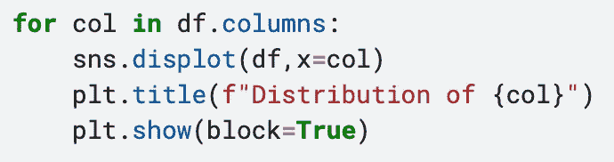
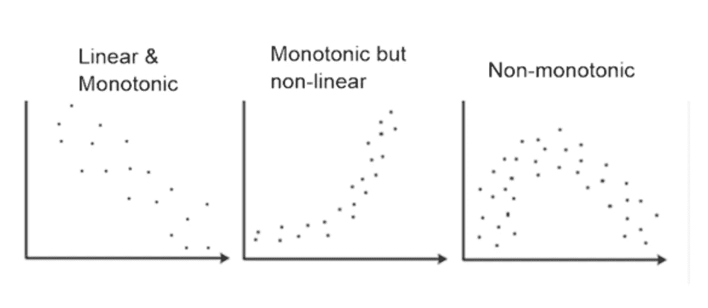
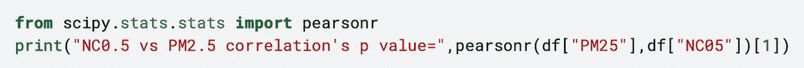

# 相关分析

> 原文：<https://medium.com/mlearning-ai/correlation-analysis-52219c2b1b24?source=collection_archive---------6----------------------->

大家好，今天我将谈论一个数据帧的列之间的相关性。在深入这个主题之前，这是我关于数据科学主题的第一篇文章，因此，如果你看到一条错误的信息，请随意写评论。本文的示例是用 python 编写的。

# **相关性**

简单来说，相关性考察变量的线性关系。假设你有两个变量:汽车的马力和汽车的消耗量。通常，当马力增加时，消耗与马力的作用相同。或者消耗可以从马力中导出。这些事件显示了两个变量之间的关系。相关性的强度由范围在-1 和+1 之间的相关系数表示。图像 1 示出了评论的相关系数的示例。显然，这不是你必须遵守的规则。你可以对相关系数做出自己的解释。

Image 1

让我们做运动吧。首先，我们从相关矩阵开始，然后创建一个更时尚的矩阵。相关矩阵由“corr()”函数生成，该函数是数据帧的扩展。矩阵的第一列和第一行包括 dataframe 的列。列和行的交点值代表 r(相关系数)的值。

Image 2

Seaborn 有 heatmap 函数来绘制热图，我们将使用该函数来可视化相关矩阵。掩码减少了 r 值的重复。热图函数将这些遮罩和相关矩阵作为参数，然后颜色方案由参数 cmap 给出，而 fmt 参数定义了浮点表示。最后，annot 参数决定是否显示 r 值。

Image 3

# **相关系数**

有两种类型的相关系数，皮尔逊和斯皮尔曼。皮尔逊相关系数被作为默认值，因此我将首先提到它。

皮尔逊检查变量之间的线性关系，它有一个要求。列的分布必须是正态的。那么，应该如何控制分配呢？直方图有助于我们做到这一点，seaborn 具有出色的功能。下面的代码显示了所有列的分布。

Image 4

当分布完成后，你就可以使用皮尔逊系数了。

第二个相关系数是斯皮尔曼。Spearman 检查排序变量之间的单调关系，它没有像 Pierson 那样的要求，因此，您可以放心。系数需要连续变量或顺序变量。所以，什么是单调关系有两条规则。当系数接近 1 时，规则是一个变量增加，另一个变量不减少。如果系数接近零，规则是一个变量增加，另一个变量不增加。这可能很难理解，因此我放弃了下面的图片，作为单调和线性关系的比较。

Image 5

# **相关性的 P 检验**

我用一个例子来解释 p 值。想象一下，你有自己的公司，你的分析观察到你的女员工和男员工挣得一样多。然后从男员工和女员工中随机抽取两组。现在我们想测试这两个组的工资是否仍然相同。我们的 H0 假设是他们挣得一样多，而 H1 假设是两组之间有 50 美元的差别。最后，计算 p 值，图像的 p 值为 0.01。这意味着在可能性为%1 的组之间存在 50$的差异。一般来说，据说当 p 值低于 0.05 时，H0 被拒绝。

因此，当我们获得相关值时，该函数也返回 p 值。因此，您也可以测试与 p 值的相关性。下面的代码示例显示了 p 值在相关中的用法示例。

Image 6

这是我在数据科学领域的第一篇文章，希望你喜欢。

 [## Mlearning.ai 提交建议

### 如何成为 Mlearning.ai 上的作家

medium.com](/mlearning-ai/mlearning-ai-submission-suggestions-b51e2b130bfb)