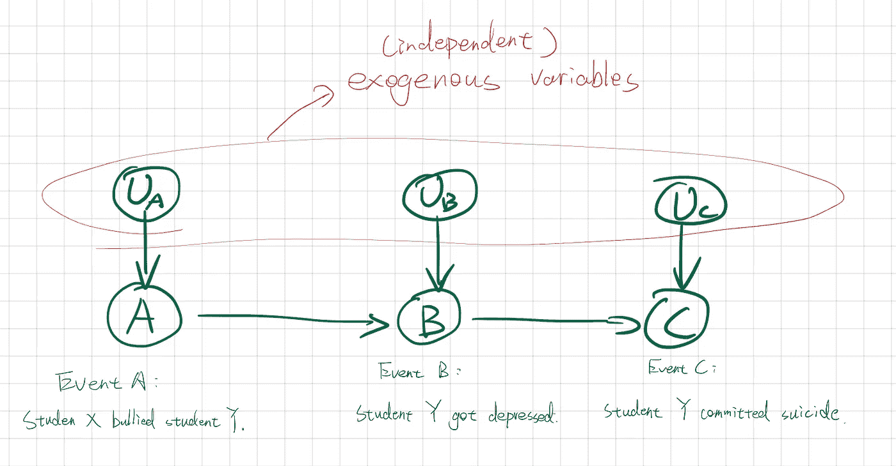
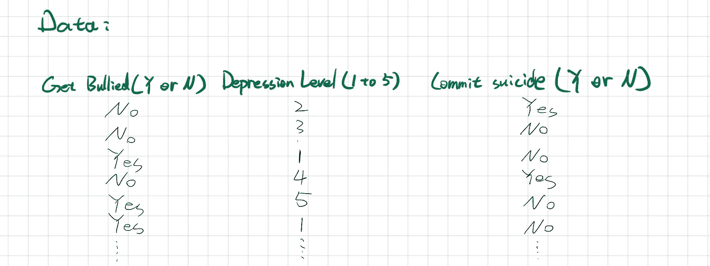
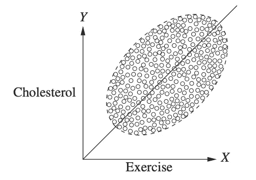
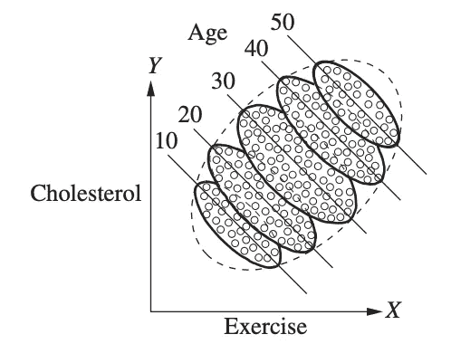
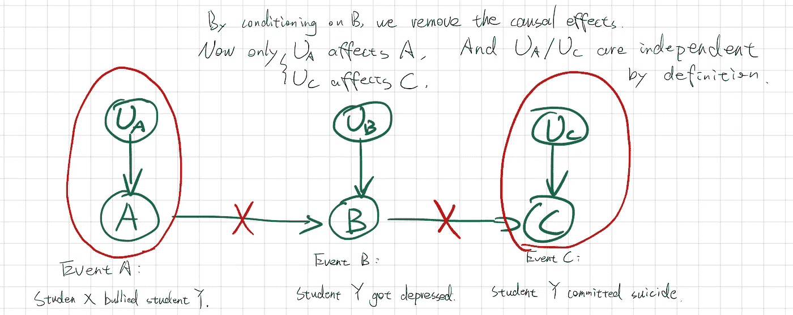
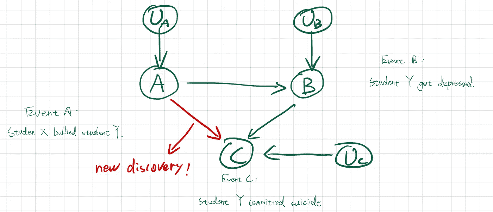
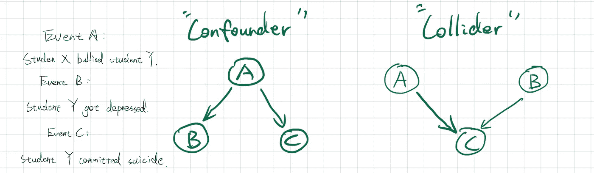

# 相关性不是因果关系:但是为什么呢？

> 原文：<https://medium.com/mlearning-ai/correlation-is-not-causation-but-why-88d807bfe736?source=collection_archive---------4----------------------->

这种关联我们听得太多了！=因果关系，但听完之后似乎没人费心去问为什么。在人性中，我们倾向于这样假设:只有当 A 引起 B 时，那么当 A 改变时，B 也改变。让我们借助下面的例子来看看为什么这个假设是错误的:校园欺凌。

Photo by [Martin Olsson](https://unsplash.com/@martinnolsson?utm_source=unsplash&utm_medium=referral&utm_content=creditCopyText) on [Unsplash](https://unsplash.com/?utm_source=unsplash&utm_medium=referral&utm_content=creditCopyText)

## 校园欺凌的例子

> 学生 X 欺负学生 y。
> 
> 学生 Y 得了抑郁症。
> 
> 学生 Y 自杀了。

我们将上面显示的三个事件描述为节点 A、B 和 c。我们希望开发一个图表来说明定性的因果关系。在这种情况下，定性关系意味着我们知道:

> 学生 X 欺负学生 Y 的行为会让学生 Y 抑郁。但是我们不知道 X 欺负 Y 多少次会导致抑郁。(一周一次？一天一次？每次他们相遇？)

通过省略数量关系(通常，需要更多的数据来确定数量关系)，我们可以形成一些关于数据的假设(故事)，并通过对其中一些数据进行**条件化**来测试它们，并挖掘因果关系。

我们这样做(调整数据而不是进行受控实验)的原因主要是成本。有时候，在你无法控制一些因素的情况下，也不可能进行大规模的调查:年龄/身体状况等。我们不得不接受手头现有的数据。

## 图形模型和数据

Qualitative graph: a story we assume is true based on the domain knowledge.

从上图可以看出，如果有一个从节点 A 到节点 B 的箭头，我们说 A 导致 B(但由于只是定性的，所以不知道因果关系的层次)。如果 A 点 B and B 点 C，我们也知道 A 在某种程度上导致 C。

假设我们有这样一个数据集，来自一个研究自杀企图的研究机构。有三列对应前三个事件。

Fake data

我们想回答这个问题:

> 根据我们得到的数据，定性图有效吗？

## 以变量为条件是至关重要的

数据是骗人的。看看下面朱迪亚·珀尔教授的书中关于胆固醇的例子: [***【统计学中的因果推断:初级读本***](http://bayes.cs.ucla.edu/jp_home.html) ***。***

On the left: cholesterol study, unsegregated; On the right: cholesterol study, segregated by age.

当我们以不同的年龄为条件时，数据支持完全不同的故事。我们知道一个事实，运动导致低胆固醇。在其他情况下，因果关系并不那么明显。

回到我们的欺凌例子，如果我们以事件 B(学生的抑郁水平)为条件，欺凌是否直接导致自杀企图？与直觉相反，如果我们的定性图是正确的，它就不是真的。

通过以 B 为条件，我们消除了从 A 到 B and B 再到 C 的因果关系。这样，只有根据定义相互独立的外生变量才会影响 A 和 C。因此，A 不会直接导致 C。

然后我们进入数据集，根据抑郁程度对数据点进行分组。如果变量 A(是否被欺负)独立于变量 C(是否自杀)是真的，那么我们得出结论，我们的故事(定性图)是准确的。如果分组数据与我们的图表相矛盾，我们就知道我们的结构因果图有问题。下图可能是我们的新故事，

## 两个可供选择的故事:由混杂器和碰撞器结构代表

A confounder refers to a variable **that causes** the other two independent variables; A collider refers to a variable **was caused by** the two independent variables.

为了清楚起见，省略了外生变量。告诉我，我们在这里分别要测试的故事是什么？

我们将使用对撞机来展示为什么相关性不会导致因果关系。在右图中，我们假设事件 A 和事件 B 相互独立，因为它们之间没有箭头。而我们认为 A 直接导致 C，B 直接导致 C。

假设我们以事件 C 为条件，这意味着我们只查看学生没有自杀的数据。在那种情况下，我们会突然发现，A 和 B 是强相关的，以使事件 C 产生相同的结果。

例如，有几个学生没有自杀的例子。基于天真的判断，我们知道，如果他们同时受到压抑和欺凌，他们很可能会打破边缘。最有可能的是，在这个“没有自杀企图的小组”中，学生要么被欺负，要么感到沮丧，以便他们能够处理这种情况。(负相关！)

因此，如果我们只收集这种情况下事件 A 和事件 B 的数据，我们会看到 A 和 B 是负相关的，但它不具有因果关系。

## 参考:

[http://bayes.cs.ucla.edu/jp_home.html](http://bayes.cs.ucla.edu/jp_home.html)

 [## Mlearning.ai 提交建议

### 如何成为 Mlearning.ai 上的作家

medium.com](/mlearning-ai/mlearning-ai-submission-suggestions-b51e2b130bfb)