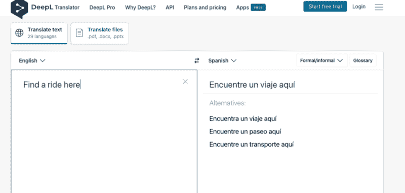

# DeepL Translator 会让谷歌翻译过时吗？

> 原文：<https://medium.com/mlearning-ai/could-deepl-translator-make-google-translate-obsolete-47f279069008?source=collection_archive---------3----------------------->

在在线翻译领域，谷歌翻译多年来一直是黄金标准。但是一个新的玩家已经进入了这个领域，它正在和谷歌竞争。DeepL Translator 是一个基于人工智能的翻译程序，号称比谷歌翻译更准确。但它真的能不负众望吗？

# 【DeepL 如何工作

DeepL 使用人工智能来翻译文本。这意味着它不仅仅依靠字典来给你逐字的翻译。相反，它会考虑句子的上下文，并相应地进行翻译。这使得翻译更加准确，尤其是对于复杂的句子。

要使用 DeepL，你所要做的就是将你的文本粘贴到网站上的框中，并选择你想要的语言对。然后 DeepL 会翻译你的文本，并把结果和原文并排给你看。您也可以下载翻译成 DOCX 或 PDF 文件的文本。

这里有一段视频:

## 害怕 AI 会让你的工作过时？

[**> >大师艾现在就为你写作所以你不能被外包。**](http://jasper-writer.com/)

# [DeepL 的好处](https://amzn.to/3Bgqo03)

照片由[巴迪·阿巴斯](https://unsplash.com/@bady?utm_source=medium&utm_medium=referral)在 [Unsplash](https://unsplash.com?utm_source=medium&utm_medium=referral) 上拍摄

DeepL 的一个主要好处是它比谷歌翻译更准确。那是因为 DeepL 考虑到了每个句子的上下文，而 Google Translate 只是给你一个逐字的翻译。这使得 DeepL 非常适合翻译复杂的文本，比如法律文档或技术手册。

DeepL 的另一个好处是它比 Google Translate 支持更多的语言。目前，DeepL 支持 12 种语言，而 Google Translate 仅支持 103 种。这意味着，如果你需要将一些东西翻译成一种不太流行的语言，DeepL 比 Google Translate 更有可能支持它。

## AI 会抢你的饭碗吗？除非你在竞争中保持领先

## 现在就试试这个人工智能工具，让你的写作自动化！

# [结论:](https://amzn.to/3Bgqo03)

DeepL Translator 是一个新的基于人工智能的翻译程序，据称比谷歌翻译更准确。它会考虑每个句子的上下文，并相应地进行翻译，从而获得更准确的翻译。此外，DeepL 比 Google Translate 支持更多的语言，这使得它非常适合将文本翻译成不太常用的语言。

# 想了解更多？

## [> >阅读这些关于人工智能如何改变世界的书籍](https://amzn.to/3Bgqo03)

 [## Mlearning.ai 提交建议

### 如何成为 Mlearning.ai 上的作家

medium.com](/mlearning-ai/mlearning-ai-submission-suggestions-b51e2b130bfb)