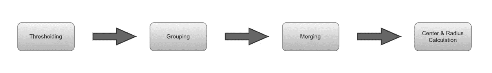
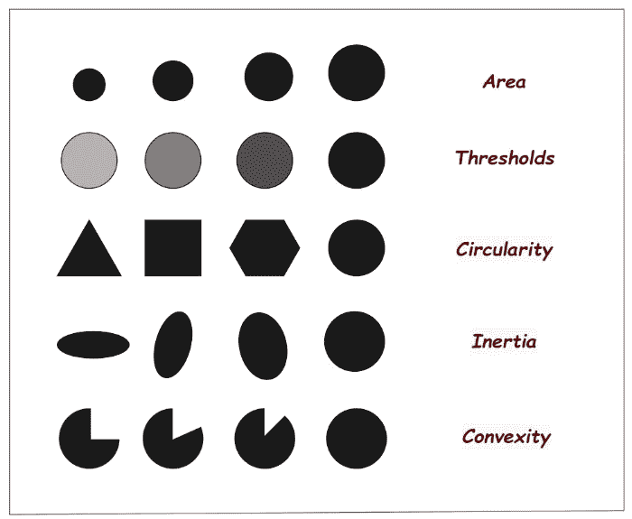
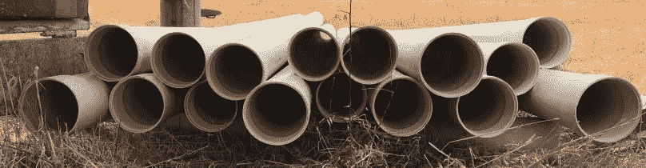
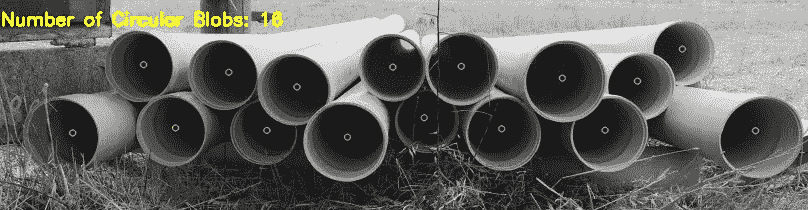
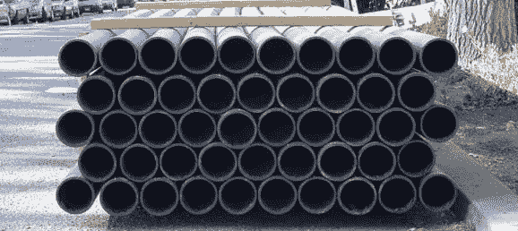
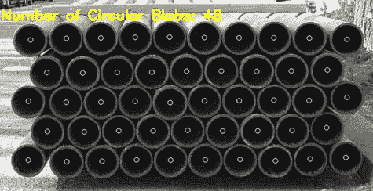
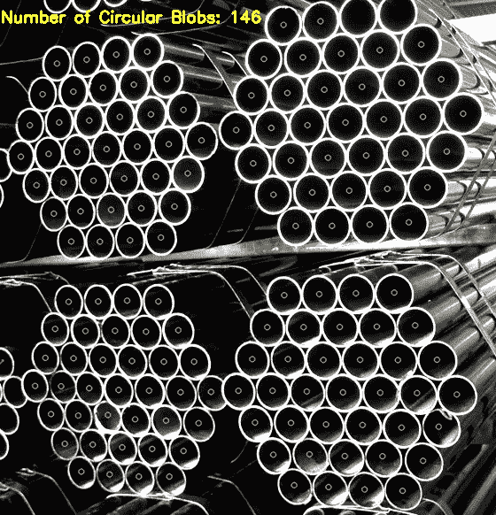
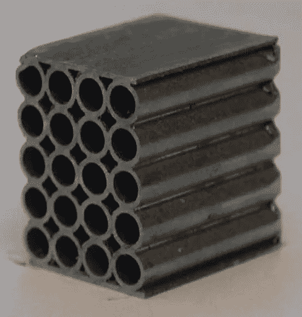
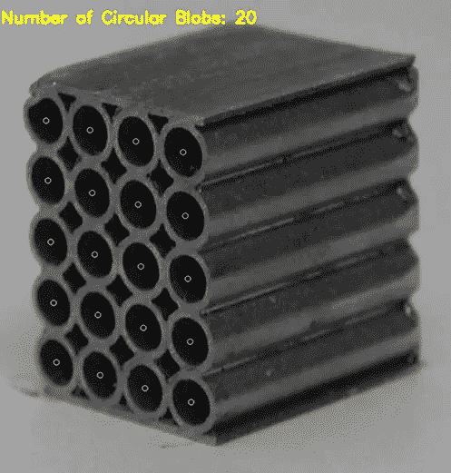

# Counting Objects

> 原文：<https://medium.com/mlearning-ai/counting-objects-a9d0516db9b9?source=collection_archive---------3----------------------->

## How to count tubular objects?

An illustration of the manufacturing industry

Technology is the whole of research that facilitates the life of human beings, takes an active role in production to meet the basic needs of human beings, and is constantly in the process of development. With this progress, which knows no boundaries, especially with the industrial revolution, today most of the products are produced in factories and delivered to the buyer through delivery processes. Counting is done in many processes from the manufacture of the product to its delivery, and in these processes, it causes erroneous counting processes and loss of time due to human and other factors. According to these requirements and problems, the methods used in factories have inevitably become more functional. There is a need for a mechanism that facilitates the determination of the products produced in the factories following the required standards, the determination of their quantities, and the making of retail deliveries. In this study, tubular objects in the image uploaded to the system will be determined in the Python environment, and the main purpose of the study is to count the objects.

> **Objective of the Study**

Object detection is also used in industrial processes to identify products. Since the industrial revolution, humanity has made tremendous progress in manufacturing. Over time, we have seen more and more manual work being replaced by automation through advanced engineering, computers, robotics, and now the IoT using object detection. We believe that recent advances in AI will help fascinatingly accelerate this trend towards automation. In the quality management process, sequencing, assembly line Object detection is part of the process. Although this project can be used in many places in the industry, its main goal is to count the products in the form of pipes or tubular in the manufacturing industry. It supports the automation transition process in the industry by preventing time loss in the packaging and delivery stages of the products and by avoiding human-related erroneous counts.

The topic we will cover in this project is counting objects. In short, the process to be done is to determine how many of the objects to be detected are from the input that is not real-time and transferred to the system as a photo. Many factors such as the cylindrical or tubular shape of the object to be detected in the image, the plain background of the image, the angle at which the captured image was taken, the contrast brightness in the image will increase the probability of the results to be obtained from the output successfully.

> Which materials were used in the study and which method was followed?

任何科学研究或项目的执行和进展方法的选择都需要一套材料。作为一个素材，这个项目是使用一台在 Python 环境中安装了 OpenCV 库的计算机，以及从在线平台和参考来源下载的各种图像制作的。

目标检测方法通常属于基于神经网络或非神经方法。我想说的是，方法确定阶段并不容易，我们只能通过专注于项目并花费大量时间来确定最适合我们的方法。我们使用的方法之后是使用斑点检测算法，这在非神经方法的范围内。

# **斑点检测**

斑点检测用于识别数字图像中与周围区域具有不同质量的部分，例如亮度或颜色。

> **简单斑点检测器的工作原理**

**Figure 1** Block diagram of Simple Blob Detector

顾名思义，SimpleBlobDetector 基于一个简单的算法，下面将详细介绍。输入参数值后，算法如下进行:

**阈值处理:**通过对源图像进行阈值处理，阈值从最小阈值开始，可以将其转换成多幅二值图像。

**分组:**对每幅二值图像中相连的白色像素进行分组。

**合并:**在二值图像中，计算二值斑点的中心，并且合并比斑点之间的最小距离更近的斑点。

**计算中心和半径:**计算并返回新合并的斑点的中心和半径。

> **算法中使用的参数**

**Figure 2** Parameters

通过大小和形状过滤斑点可以设置 SimpleBlobDetector 的参数来过滤我们想要的斑点类型。

*   **面积:**表示图像中要求检测的每个物体所覆盖的面积，以及最小面积和最大面积的适当值。
*   **圆形度:**这只是测量斑点有多接近圆形。例如，正六边形比正方形具有更高的圆度。这意味着圆的圆度为 1，正方形的圆度为 0.785，依此类推。
*   惯性比:我们所要知道的是，它衡量的是一个形状被拉长的程度。例如，对于圆，该值为 1，对于椭圆，该值在 0 和 1 之间，对于直线，该值为 0。
*   **凸性:**凸性被定义为(斑点的面积/其凸包的面积)。现在，一个形状的凸包是完全包围该形状的最紧密的凸形。
*   **阈值:**参数中，阈值是指希望转换成的二值图像(黑白)中的颜色强度。

# **实验分析**

我们所分析的视觉效果中的物体通常是在制造业和建筑业中会遇到的物体。

首先我们来评价一下**图 3** ！在 2048x1536 图像中检测到不正确的计数过程后，调整大小过程减少到 808x210 结构，并执行无错误计数过程。

使用的参数有:

*   minThreshold = 10maxThreshold = 200，
*   米纳尔= 1500，
*   最小圆度= 0.1，
*   最小凸度= 0.87，
*   最小比率= 0.01

**Figure 3** Input Image (Construction Pipe)

**Figure 4** Output Image (Construction Pipe)

第二，如果我们评估**图 5** ，调整后参数被直接放入模型。

使用的参数有:

*   minThreshold = 10maxThreshold = 200，
*   米纳尔= 1500，
*   最小圆度= 0.1，
*   最小凸度= 0.87，
*   最小比率= 0.01

**Figure 5** Input Image (Water Pipe)

**Figure 6** Output Image (Water Pipe)

作为第三个主题，我使用了**图 7** ，其中参数调整相对来说比其他更具挑战性。之所以困难，是因为它是从一个糟糕的角度拍摄的，而且每个斑点的足迹都很小。

使用的参数有:

*   minThreshold = 10maxThreshold = 200，
*   米纳尔= 650，
*   最小圆度= 0.5，
*   最小凸度= 0.60，
*   最小比率= 0.01

**Figure 7** Input Image (Power Stainless Steel Pipe)

**Figure 8** Output Image (Power Stainless Steel Pipe)

作为第四个主题，**图 9** ，我们有一个从角度不好的地方拍摄的图像，但尽管如此，在参数的默认状态下，也就是在第一次尝试中，观察到了成功的结果。

使用的参数有:

*   minThreshold = 10maxThreshold = 200，
*   米纳尔= 1500，
*   最小圆形度= 0.1，
*   最小凸度= 0.87，
*   最小比率= 0.01

**Figure 9** Input Image (Square Stacking Core)

**Figure 10** Output Image (Square Stacking Core)

正如您在我们的主题中所看到的，我们可以说，如果我们输入正确的参数和我们在算法中检测到的图像中的斑点的中心点，计数过程的成功率相当高。

## 结论

在本研究中，在解释了我们用于计数管状物体的方法、所选方法中的检测器如何工作、算法中使用的参数以及它们如何影响物体之后，我们试图通过检查我们在实施项目时采用的方法来解释我们算法的逻辑。然后，作为分析的结果，我们对主题进行了评估，我们的项目是成功的。

参考资料:

 [## 视觉物体检测改变制造业——大胆设想

### 人工智能和深度学习的日常进步正在加速自动化趋势。在…

business.blogthinkbig.com](https://business.blogthinkbig.com/visual-object-detection-transforms/)  [## OpenCV: OpenCV 教程

### 以下链接描述了一组基本的 OpenCV 教程。这里提到的所有源代码都是作为…

docs.opencv.org](https://docs.opencv.org/3.4/d9/df8/tutorial_root.html)  [## 使用 OpenCV ( Python，C++)进行斑点检测

### 本教程解释了使用 OpenCV 的简单斑点检测。什么是斑点？斑点是一组相连的像素在一个…

learnopencv.com](https://learnopencv.com/blob-detection-using-opencv-python-c/)  [## 德瑞博-s2-05.jpg。喀拉马蒂

### 编辑描述

dribbble.com](https://dribbble.com/shots/4031049/attachments/923654?mode=media)  [## Mlearning.ai 提交建议

### 如何成为 Mlearning.ai 上的作家

medium.com](/mlearning-ai/mlearning-ai-submission-suggestions-b51e2b130bfb)