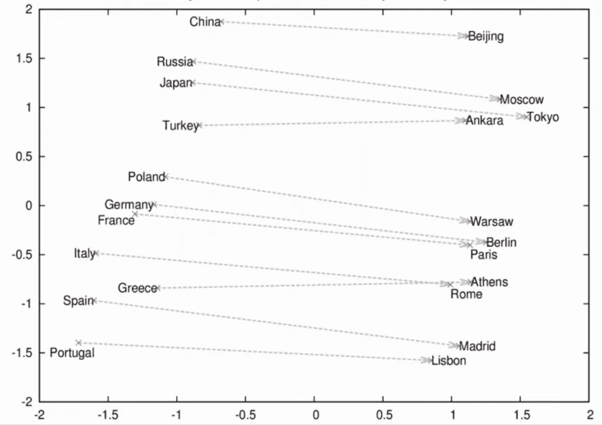
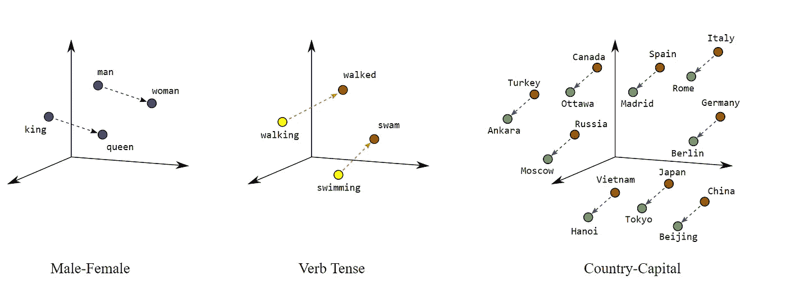
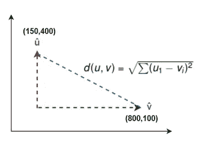
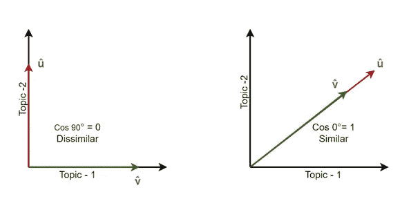

# 使用单词嵌入的国家预测

> 原文：<https://medium.com/mlearning-ai/country-prediction-using-word-embedding-f5c0f930c87b?source=collection_archive---------1----------------------->



Source : [https://wiki.pathmind.com/word2vec](https://wiki.pathmind.com/images/wiki/countries_capitals.png)

自然语言处理(NLP)是人工智能的一个分支，它帮助理解和解释人类语言，弥合了人类和机器语言之间的差距。

给定一个首都城市的名称，我们使用单词之间的类比概念来预测一个国家。

**单词嵌入:**

机器学习和深度学习算法一般处理数值型数据。因此，为了将文本转换成数字，BagofWords 技术被开发来从文本中提取数字特征。它使用单词频率分布的概念来查找每个单词在文本中出现的次数，这也称为向量化。它通过在语料库内的文档中创建单词出现矩阵来将文本转换成特征。因此，每个文档被表示为语料库中词汇长度大小的字数统计向量。然而，这种模型导致矩阵稀疏，并且无法捕捉文本中有意义的关系。

单词嵌入是一种解决上述两个问题的技术。使用这种方法，语言中的每个单词被表示为低维空间中的实值向量，使得语义相似的向量彼此靠近放置。



Source: [https://developers.google.com/machine-learning/crash-course/images/linear-relationships.svg](https://developers.google.com/machine-learning/crash-course/images/linear-relationships.svg)

创建这种有意义的向量空间给算法一个机会来识别模式并检测给定任务中的相似性。

有许多降维技术可以用来从高维空间捕捉重要信息，并将其投影到一个更小的维度空间。PCA 是可用于创建单词嵌入的最常见的降维技术之一。PCA 的工作方式是将单词向量包作为输入，尝试找出最相关的特征，并尝试以某种方式组合这些特征，以便提取最大信息并将其投影到更小的维度空间。使用最近邻算法将语义相似的项目放置在向量空间中彼此靠近的位置。

Word2vec 是 Google 基于分布假设的概念训练单词嵌入的算法，使得语义相似的单词被映射到几何上接近的嵌入向量。gensim.models 提供了 KeyedVectors 类来直接加载使用 Word2vec 模型预训练的单词向量。你可以从[这里](https://code.google.com/archive/p/word2vec/)下载数据集

```
import nltk
from gensim.models import KeyedVectors
embeddings = KeyedVectors.load_word2vec_format(‘./GoogleNews-vectors-negative300.bin’, binary = True)
f = open(‘capitals.txt’, ‘r’).read()
set_words = set(nltk.word_tokenize(f))
word_embeddings = get_word_embeddings(embeddings)
print(len(word_embeddings))
pickle.dump( word_embeddings, open( “word_embeddings_subset.p”, “wb” ) )
```

寻找模型中向量之间的相似性:

**欧几里德距离:**



欧几里德距离通过计算两点之间线段的长度来计算两个向量之间的相似性。单词越相似，欧几里德距离就越有可能接近 0。

**余弦相似度:**

当比较不同大小的文档时，欧几里德距离有时会误导理解两个文档之间的相似性。因此，在我们处理文本数据的场景中，向量的大小并不重要，因为比较长度不均匀的文档的可能性很大。欧几里德距离的另一个缺点是它在高维空间中不能很好地工作。因此，我们使用余弦相似性度量来纠正这一点。两个向量之间的夹角余弦量化了两个文档之间的相似性。如果我们把向量的方向看作它的意义，它就能更好地捕捉语义的相似性。此外，向量之间的角度更不受字数等外部因素的影响。



```
def cos_similarity(u,v):
   dot = np.dot(u,v)
   det = np.linalg.norm(u)*np.linalg.norm(v)
   cos = dot/det
```

使用基本的三角函数，

Cos (0) = 1(如果角度为 0，向量在同一直线上，方向相同，因此非常相似)

Cos (90) = 0(如果角度为 90，则矢量是正交的，因此它们不相似)

cos(180)=-1(如果角度为 180，则矢量完全不同)

所以当文档之间的角度θ在 0 到 90°之间时(0 <= Cos(θ) <= 1), the documents are similar, else dissimilar

**求每个首都的国家:**

给定单词嵌入词典、一个关系(国家/地区-首都)和一个首都城市，该函数返回最有可能具有相似关系的国家/地区及其相似性得分。

我们用的是方程 King — man + woman = queen，这是最著名的 word2vec 算法之一，表示单词的隐藏代数结构。因此，为了获得首都城市的国家，我们使用一个类似的等式，country 2 = capital 1-country 1+capital 2，并使用单词嵌入和相似性函数在数学上实现它

```
def get_country(city1, country1, city2, embeddings):
    vec = country1_embedding — capital1_embedding + capital2_ embedding
    similarity = -1
    for word in embeddings.keys():
        word_emb = embeddings[word]
        cur_similarity = cosine_similarity(vec,word_emb)
        if cur_similarity > similarity:
            similarity = cur_similarity
            country = (word, similarity)
return countryget_country('Athens', 'Greece', 'Cairo', word_embeddings)
```

上面的函数调用返回:

```
('Egypt', 0.7626821)
```

使用该模型预测国家的准确率达到了 0.92！

注意:这个博客是基于 https://www.deeplearning.ai/[的新专业 NLP](https://www.deeplearning.ai/)