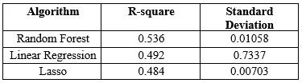
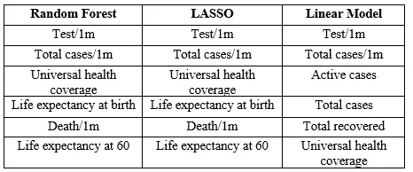
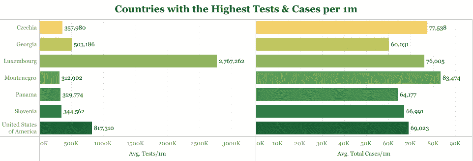
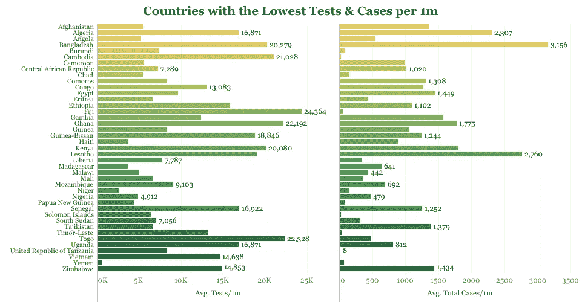
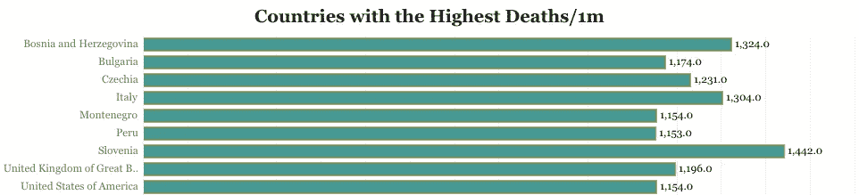
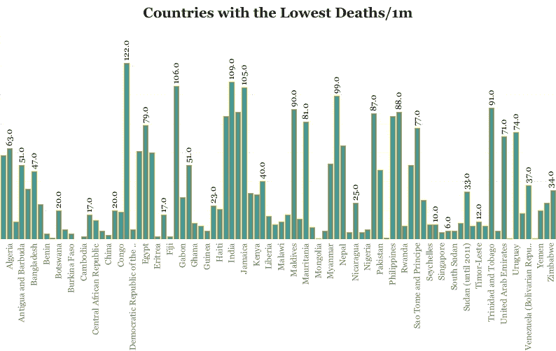
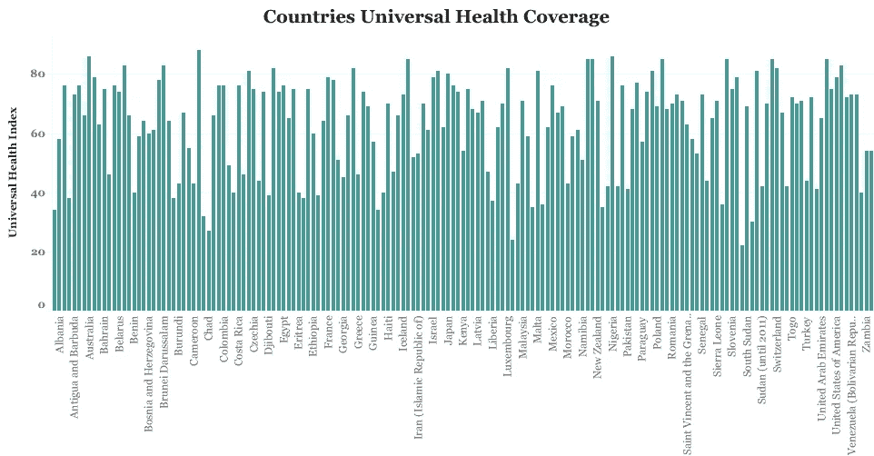
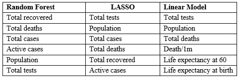
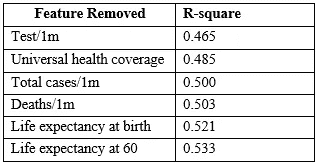

# 新冠肺炎和国内生产总值

> 原文：<https://medium.com/mlearning-ai/covid-19-and-gross-domestic-product-17e39eba18a0?source=collection_archive---------1----------------------->

## **在 R &表中使用机器学习研究疫情及其与全球绩效的关系**

Photo by United Nations COVID-19 Response via Unsplash

**简介**

全球新冠肺炎病例的发展和一系列封锁措施已经影响到世界范围内的贸易、经济增长和生产力。2020 年 10 月,[世界贸易组织(世贸组织)预测 2020 年全球 GDP 将下降 4.8%，2021 年将上升 4.9%。该组织还表示，下行风险仍然占主导地位，主要是如果新冠肺炎病例在未来几个月重新出现。目前，边境已经谨慎地重新开放，新的新冠肺炎疫苗有望阻止新一波病毒。](https://www.wto.org/english/news_e/pres20_e/pr862_e.htm)

监测 GDP 很重要，因为它提供了关于经济规模和表现的信息。很想知道国内生产总值是否与新冠肺炎的多个变量相关，例如新冠肺炎病例总数、康复病例总数、死亡总数等。本研究中考虑了一组统计和机器学习模型。想法是在一些测试集上的高预测能力将指示一种关系。因此，本文旨在确定全球 GDP 是否与围绕新冠肺炎的多个变量相关联。

**方法**

该项目的新冠肺炎变量来自 [Worldometers.info](https://www.worldometers.info/coronavirus/) 。《世界经济展望》的数据来自国际货币基金组织(IMF)，而《世界卫生报告》的数据来自世界卫生组织(世卫组织)的全球卫生资料库。

新冠肺炎的数据是截至 2021 年 1 月 10 日的最新数据。世卫组织和国际货币基金组织的数据集最初包括几个经济和健康指标，并被筛选出少数几个用于本研究的范围。使用 Microsoft Excel 修改合并的数据集，主要是 VLOOKUP 函数来排序和合并数据中一致的单元格。

最终数据集包括受新冠肺炎病毒影响的 219 个国家和地区中的 165 个国家。30 个国家和几个地区的数据由于不可用以及缺失的数据插补可能对预测性能产生严重影响而从最终数据集中删除。其余数据约有 20%缺失，使用数据插补方法进行了填补。

R 编程语言用于分析数据，软件包包括 mice、caret 和 random Forest。考虑了普通最小二乘法、最小绝对收缩和选择算子法(LASSO)以及随机森林。选择 R-square 的决定系数作为性能指标，因为它可以提供多个新冠肺炎变量可以解释的 GDP 中的方差比例。10 重交叉验证被设置为重采样方法，以产生偏差较小或不太乐观的性能估计。随机搜索也用于调整模型，以产生偏差较小的估计。

**结果**

**基本分析**

结果表明，随机森林法优于所有其他方法，线性回归法次之，LASSO 法第三(见表 1)。请记住，虽然线性模型比 LASSO 显示出更高的预测能力，但 LASSO 是处理多重共线性的一种更宽容的方法。

鉴于随机森林优于基本线性回归和 LASSO，这种性能表明输入变量和响应之间存在非线性关系。

Table 1: Basic prediction results

随机森林结果发现了新冠肺炎变量和一国国内生产总值之间的一些复杂关系，尽管相对较弱，这表明自变量单位的变化可能并不总是反映因变量国内生产总值的类似变化。

**功能选择**

随机森林，线性回归和套索也被用来检测变量的重要性。套索和随机森林产生密切相关的结果。下表按重要性降序列出了**中列出的 6 大重要特性。**

Table 2: Best Features

这一结果很有趣，因为它与国家和国际卫生当局为抗击病毒所做的努力相一致。主要目的是减少病例总数，使全球经济活动和贸易充分运作。在分析中观察到的大多数国家中，投入大量测试的努力是一致的，例如，tests/1m，尽管一些国家的测试率比其他国家高得多。证明在追踪、隔离和支持新的新冠肺炎病例方面具有重要意义。然而，Carl Heneghan 和 Tom Jefferson 教授的一篇文章表明，如果不理解测试阈值的细微差别，大规模测试可能弊大于利。点击[此处](https://www.spectator.co.uk/article/could-mass-testing-for-covid-19-do-more-harm-than-good-)进一步阅读。

Image by author using Tableau

Image by author using Tableau

不幸的是，有些感染会导致死亡。各国因该病毒导致的死亡率高达数百万。

Image by author using Tableau

Image by author using Tableau

在六大变量中，全民健康保险和国内生产总值以及其他新冠肺炎变量之间的联系值得注意。世卫组织指出，全民健康保险是基于追踪干预措施的基本服务的平均覆盖范围，包括生殖健康、孕产妇、新生儿和儿童健康、传染病、非传染性疾病以及普通民众和最弱势人群的服务能力和获取途径。这在很大程度上要归功于基本卫生工作者，他们从一开始就直接影响了疫情的控制。强调全民医疗保健在疫情的重要性,《欧洲健康 2020》发表的论文；26(2)，将走出封锁的方法重新构想为一个蛇和梯子的棋盘游戏。在这场游戏中，各国必须确保新冠肺炎患者尽快通过棋盘，采取措施增强他们的公共卫生能力(例如，登上梯子)并防止因能力不足而导致的挫折(例如，避免蛇)。点击[此处](https://apps.who.int/iris/bitstream/handle/10665/336292/Eurohealth-26-2-34-39-eng.pdf)了解更多。

Image by author using Tableau

世卫组织对出生时预期寿命的定义是，在某一特定年份，如果新生儿的一生受到其出生时特定性别和年龄死亡率的影响，他或她预计可以活的平均年数。而 60 岁时的预期寿命是一个 60 岁的人在特定年份、特定国家、领土或地理区域中，如果他或她在一生中暴露于他或她 60 岁时流行的按性别和年龄划分的死亡率，他或她预期可以活的平均年数。

在这项分析中，出生时和 60 岁时的预期寿命似乎不是重要的观察变量；然而，新冠肺炎变量与 GDP 之间存在非线性关系。这些变量的预测效应将在下一节消融研究中予以说明。虽然超出了本项目的范围，但进一步研究疫情对出生时和 60 岁时预期寿命的影响可能是有意义的。

下面按照重要性从高到低的顺序**列出了观察到的对每个模型的 GDP 几乎没有预测影响的特征**。

Table 3:Least important features

**消融研究**

在机器学习的背景下，消融研究是通过移除机器学习系统的组件来对其进行科学检查，以了解其对整体性能的影响。点击[此处](http://www.diva-portal.org/smash/record.jsf?aq2=%5B%5B%5D%5D&c=1&af=%5B%5D&searchType=SIMPLE&sortOrder2=title_sort_asc&query=sina%2Bsheikholeslami&language=en&pid=diva2%3A1349978&aq=%5B%5B%5D%5D&sf=all&aqe=%5B%5D&sortOrder=author_sort_asc&onlyFullText=false&noOfRows=50&dswid=-7677)了解更多。

最佳模型的前 6 个特征是一系列消融研究的一部分。下表显示了分析后的结果。

Table 4: Ablation results

**这些结果意味着什么？**

*   Tests/1m:决定系数的强度下降到 0.465。这一结果表明，每 100 万人口的测试在确定目标 GDP 和新冠肺炎变量之间的非线性关系的强度方面具有最高的预测能力。
*   全民健康保险:最佳模型下降到 0.485。这个特性排在第二位，是对 R 平方系数影响最大的特性。这一结果很有见地，因为新冠肺炎的高传播率需要高检测率来发现、检测、追踪、隔离和支持新的新冠肺炎病例。这一趋势可以对经济增长产生积极影响，并提高 GDP 表现，因为它提供了一条放松封锁限制和防止新一波感染的途径。欧洲健康(2020 年)的一个令人兴奋的概念——[蛇和梯子棋盘游戏](https://apps.who.int/iris/bitstream/handle/10665/336292/Eurohealth-26-2-34-39-eng.pdf)提供了一个很好的例子。
*   每 1m 的总案例数:观察到 0.036 的下降—对性能的影响可以忽略不计。
*   死亡数/1m:观察到 0.033 的下降，对初始性能没有显著影响。
*   出生时预期寿命:观察到下降了 0.012。这一结果对 GDP 和新冠肺炎变量之间的初始非线性关系没有显著影响。
*   60 岁时的预期寿命:观察到 0.003 的下降——对性能的影响可以忽略不计。

**总结**

这项研究试图确定国内生产总值和围绕新冠肺炎的多个变量之间是否有联系。这些分析产生了一些联系，尽管 GDP 和新冠肺炎变量之间的联系相对较弱。最重要的特征是**测试/1m、全民医疗保健、总病例/1m 和死亡/1m** ，它们对建立关系的影响最大。

** *参考文献在文章中有超链接***

**作者链接**

[GitHub 库](https://github.com/Tamunodeinma/gdp.cov/tree/main)

[画面仪表盘](https://public.tableau.com/profile/tamunodeinma#!/)

策划数据集和[定义](https://github.com/Tamunodeinma/gdp.cov/blob/main/Reference.docx)

[领英](https://ng.linkedin.com/in/tamunodeinma-itamunoala-27041352)

[推特](https://twitter.com/deinma_itams)