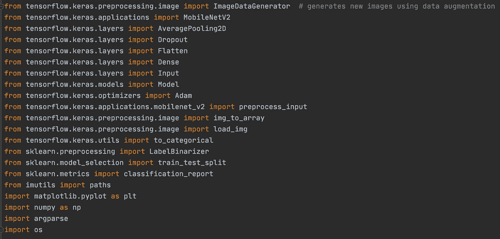
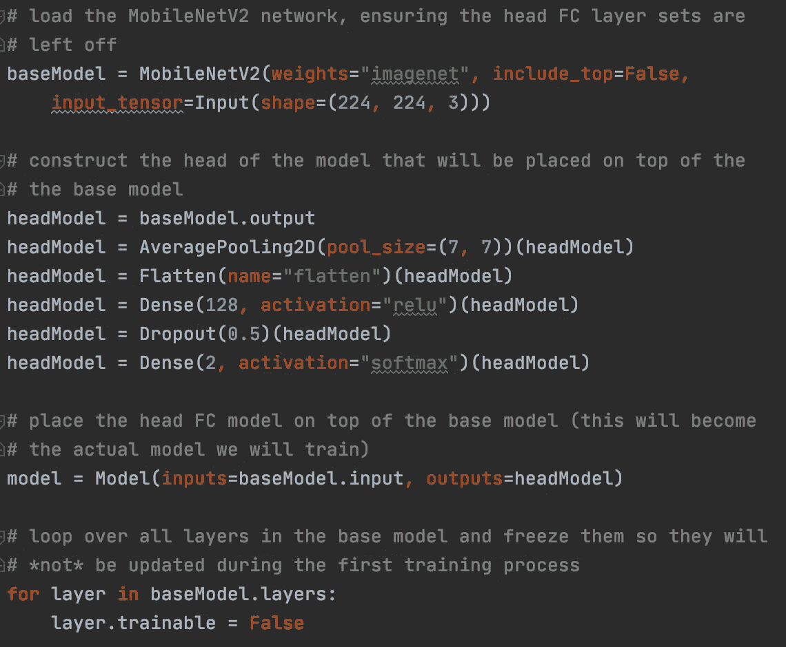
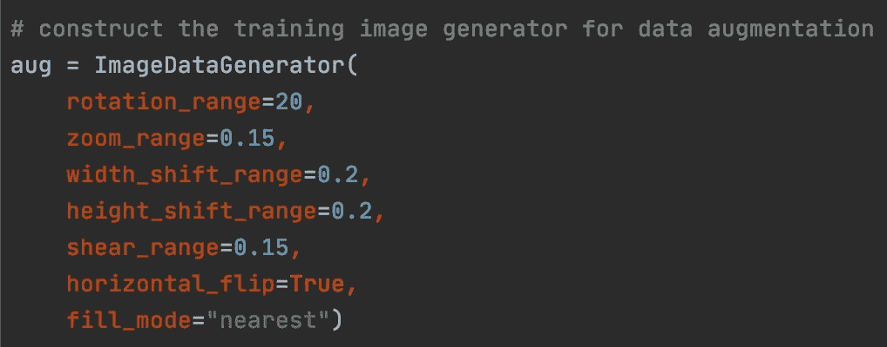
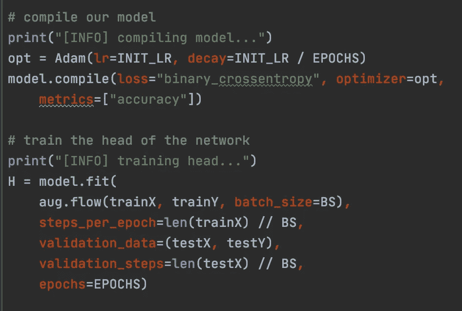
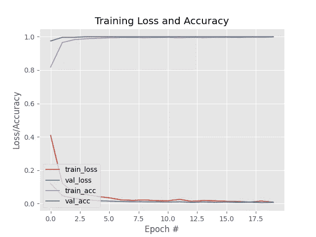
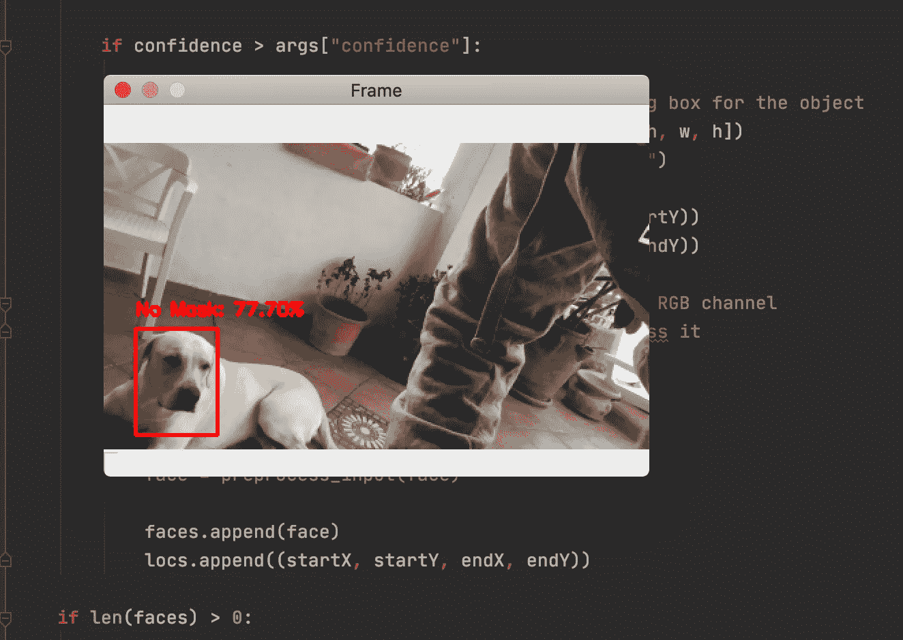

# 新冠肺炎:面罩检测器

> 原文：<https://medium.com/mlearning-ai/covid-19-face-mask-detector-7c150829ae50?source=collection_archive---------4----------------------->

通过使用 **OpenCV，Keras/Tensorflow，检测戴着面具的人脸的机器学习应用程序。**

> 新冠肺炎病毒正在全球迅速传播。戴口罩可以减少病毒的传播，避免病毒的感染。

# **框架:**

计算机视觉可以用来开发一个模型，用于实时检测一张脸是否戴着面具。为了建立一个能够完成这种特定任务的模型，需要很多技术。特别是，除了深度学习和机器学习模型的基础理论之外，还使用了几种重要的技术:

1.  **面部标志**:找到一个包含戴着面具的人脸的数据集😷不是微不足道的。有一个实用、快速、有效的解决方法，那就是*面部标志*。面部标志允许检测面部的特定区域，即所谓的*感兴趣区域(ROI* ，如眼睛、鼻子、嘴等。特别地，在这个项目中，从包含人脸的数据集开始，获得包含戴面具的人脸的新数据集🎭。首先，面部标志用于个性化👃和👄然后在该位置添加一个遮罩图像。以这种方式，生成了一个人造的、但实际上可应用的数据集。
2.  **微调/迁移学习:**为了解决特定的任务*基础模型架构*，与 *MobileNet V2(迁移学习)*架构进行个性化微调。*微调*包括向基础模型架构添加一些特定层，并使用预训练模型的权重作为初始权重，仅训练这些添加的层。
3.  **数据处理:**在训练阶段，将在图像中添加噪声，以提高泛化能力。这种技术被称为*数据增强*，在训练阶段，图像被旋转、移动或平移。

# **我们开始:**

创建了戴着面具的人脸数据集后，第一步是训练我们的模型。

Facial landmarks: fake mask added to an human face.

如前所述，使用了迁移学习和微调技术。基本模型架构是 MobileNet V2，权重在 ImageNet 数据集上训练。MobileNet V2 架构允许在嵌入式系统上使用该模型，如微处理器和/或智能手机。这可以降低用于服务的基础设施的成本。

Libraries used for the train phase.

微调阶段包括三个步骤:

1.  用预先训练好的 [ImageNet](http://www.image-net.org) 砝码装载 MobileNet V2。这将是我们的基本模型。
2.  构建一个新的全连接神经网络，并将其附加到基本模型(输出层)的头部。
3.  冻结基础网络的图层。在新的训练阶段，基本网络的层的权重不更新。

微调技术可以节省大量时间，同时它可以训练一个新的功能强大的模型，比基本模型具有更多的功能。在这个特定的例子中，新的能力是关于检测人脸中的面具。由于微调技术，我们的新模型将只花时间学习新任务:“检测面具”，而不需要重新学习如何检测图像中的人，因为该任务由所选的基础模型很好地完成。

通过使用 Adam 优化器来训练该模型，以便利用其学习率衰减时间表特征，同时使用二进制交叉熵函数作为损失函数，因为该任务是关于分类两个可能的类别:*屏蔽，非屏蔽。*最后，通过 [ImageDataGenerator](https://keras.io/api/preprocessing/image/#imagedatagenerator-class) Keras 类，使用数据扩充向初始数据集添加噪声，从而实现模型的更强鲁棒性。特别地，在训练阶段，使用成批的突变图像。这是通过将 ImageDataGenerator 对象添加到 fit 方法并使用其 flow 方法来实现的。

ImageDataGenerator object.

Compile the model: the flow method of the aug object is added to the fit method, in order to use batches of mutated images.

好了，现在让我们看看我们的模型是如何学习的，通过查看一些指标，如损失和准确性。结果非常好，显示了模型如何达到接近 100%的精度值，没有显示任何关于过度拟合或欠拟合的信号。

## 探测😷使用我们的掩膜检测器和 OpenCV 进行实时检测:

Nora put the mask please!

 [## Mlearning.ai 提交建议

### 如何成为 Mlearning.ai 上的作家

medium.com](/mlearning-ai/mlearning-ai-submission-suggestions-b51e2b130bfb)