# 新冠肺炎感染和使用 CT 扫描的肺分割

> 原文：<https://medium.com/mlearning-ai/covid-19-infection-and-lung-segmentation-using-ct-scans-a5ab5b379272?source=collection_archive---------2----------------------->

最近，我在为期末计算机科学项目作业寻找项目想法时，偶然发现了一个有趣的数据集。它有 20 个详细的、全分辨率的被诊断患有 SARS-COV-2 的患者的肺部扫描，以及医学专家对肺部和感染的分割。

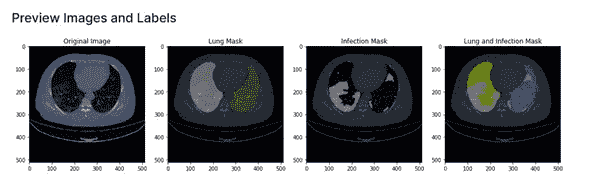

2-dimensional render of a CT scan showing the segmentation of healthy and infected pulmonary tissue

阅读人们利用数据集制作的 python 脚本和笔记本让我思考，在成功完成我的学术要求的同时，我可以利用这些数据在现实生活中应用什么？最后，在与我的队友进行了多次不和谐的会议讨论后，我们得出了一个结论，即我们将尝试创建一个应用程序，在赶往医院要求世界各地已经超负荷工作的医务人员进行侵入性手术之前，告诉你在正在进行的疫情中感染冠状病毒的可能性。

在我们开始研究用户如何与我们的应用程序交互之前，我们必须在我找到的数据集上选择和训练深度学习模型，然后测试和验证建立在新扫描上的模型，以便我们的程序可以预测、分类和分割扫描中看到的肺部感染部位。

经过一些研究，我们发现，与通用的 CNN 模型或直接处理数字数据的机器学习模型(如线性支持向量机和逻辑回归模型)相比，专门设计用于处理医学扫描图像的模型(如[、UNET](https://arxiv.org/abs/1505.04597) 和新的改进的 UNET++能够产生更高的平均精度。因此，我们对任务进行了分工，最终我负责 CT 扫描，而我团队中的其他人则负责 X 射线和最终应用的前端功能。

在这篇文章中，我将尝试解释为这类项目准备原始数据的基本方法和步骤，以及如何使用 Python 和流行的深度学习技术解决图像分割问题(我们的第一个任务)。此外，我尽可能地包含了代码片段和输出，以帮助理解所遵循的过程。

我们首先导入所需的库，并将整个数据集下载到我们选择的环境中。(我使用谷歌的 [Colab](https://colab.research.google.com/) 平台，以获得额外的 ram 和 GPU 优势)

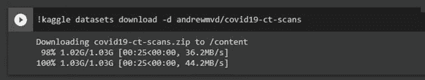

Downloading the dataset as a .zip

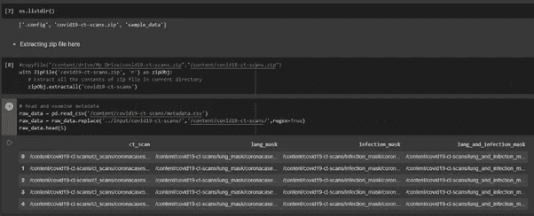

Extracting and accessing the metadata file

我们的数据集的元数据有 4 个主要类别的图像，分别标记为原始扫描、肺部屏蔽、感染屏蔽和数据集中所有图像的组合屏蔽。运行我们得到的 shape 命令，

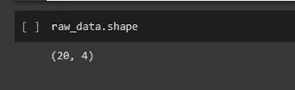

20 张完整的图像，在 4 个标签下都有相应的副本，突出显示原始扫描的不同方面。

在浏览数据后，我们在每个 ML/DL 问题中需要的第一个主要步骤是分析和充分的预处理，这将有助于我们减少常见问题，如偏差、代码复杂性、训练时间等。我在预处理阶段遵循的主要步骤是:

**1。移除不完整和有缺陷的图像**

当使用来自多个来源的大量未经验证的数据时，这是一个重要步骤，因为您下载使用的许多图像最终可能会被裁剪、分辨率较低且颜色不均匀，这可能会导致模型训练过程中出现问题。我们可以进行插值来解释丢失的数字数据，但通常有缺陷的图像数据会被截断，以避免后续步骤中出现问题。

**2。用于空掩模预测的单独模型**

为了确保我们的模型不会过度补偿不包含任何感染部分的切片，我们将创建一个独立的模型来计算输入 CT 中的空遮罩，并且仅在渲染中具有可见感染的切片上训练我们的第一个模型。在计算出 497 个切片是完整的黑色遮罩时，我们将从预处理中排除这些，因为我们不想用这些来打扰分割模型。

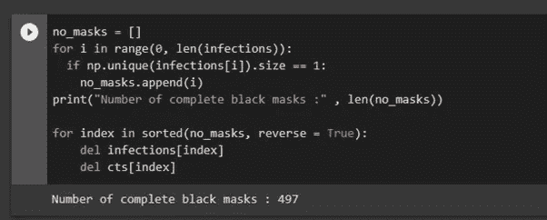

**3。使用增强算法提高整体性能**

在单次扫描中使用流行的图像增强技术，我们可以通过帮助模型更容易地区分健康组织和感染组织来大幅提高模型的性能。在这种方法中，我使用了对比度受限的自适应直方图均衡化(CLAHE)来增强肺部细胞之间交织的感染细胞片段之间的差异。

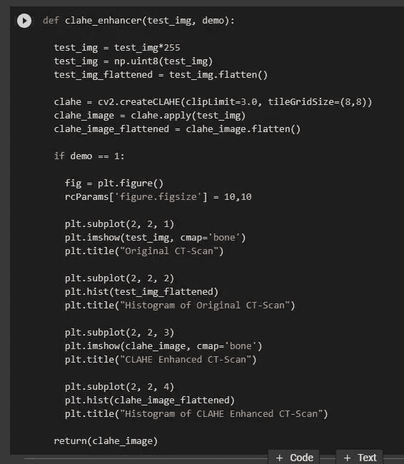

CLAHE function

控件使用自定义读取函数。nii 格式的扫描(read_nii)并绘制原始和增强扫描以及它们各自的直方图，我们可以很容易地看到单个函数在分离我们的模型所需的图像部分上的效果。

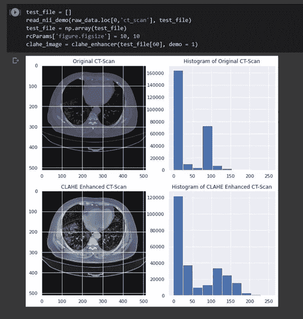

**4。使用 Otsu 二值化和其他方法裁剪感兴趣区域(ROI)**

图像中有很多黑色空间，不包含任何感染部分和我们不感兴趣的部分，如肺部下方的隔膜。这些将占用宝贵的 RAM 空间和不必要的计算能力。一个可能的解决方案是根据问题陈述和用例裁剪切片，使其仅包含 ROI。在裁剪之后，我们使用 Otsu 的阈值方法来避免必须选择由算法动态分配的离散值，以返回感染和/或肺部遮罩。

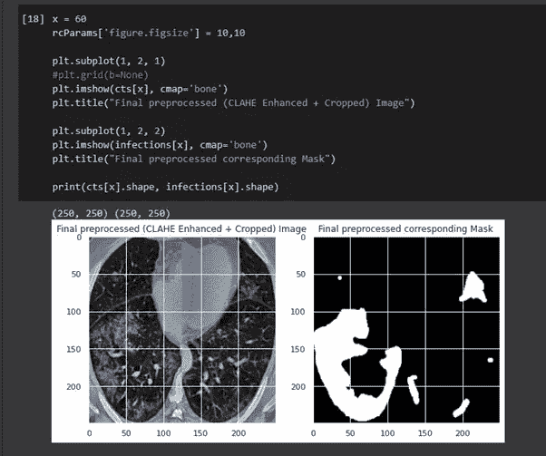

**5。数据扩充**

神经网络的好坏取决于你提供给它的数据的质量和数量。特别是在图像分割和分类问题中，如果不同标签下的图像数量的比率是倾斜的，或者不同训练标签下的图像过于相似，则可能导致偏差误差，这将导致非常不正确的分类。数据扩充方法旨在通过使用现有数据创建与其来源略有不同的新迭代来消除这一问题，以使您的模型对新变量敏感，这反过来有助于提高模型从未遇到过的新数据的性能。这也有助于增加训练示例的数量，因为模型将每个新的迭代视为不同的示例。为了在我们的数据集中实现有效的扩充，我们将定义一个管道，该管道接收我们已经存在的图像，并在我们的用户定义的变换已经应用于它之后返回一系列扫描切片。

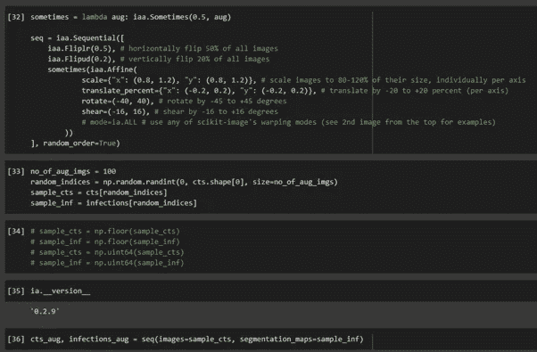

The Augmentation Pipeline

执行后，我们可以绘制一些随机切片，以查看在通过管道传递原始数据集后创建的新图像集的一部分。

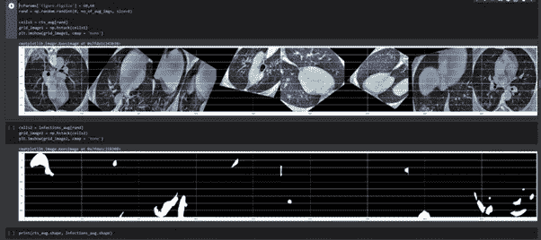

Newly Generated Slices

我们的预处理阶段现在已经完成，现在我们将把我们的感染遮罩覆盖在它们相应的 CT 扫描上，然后在扩充的数据集上创建和运行我们的模型。

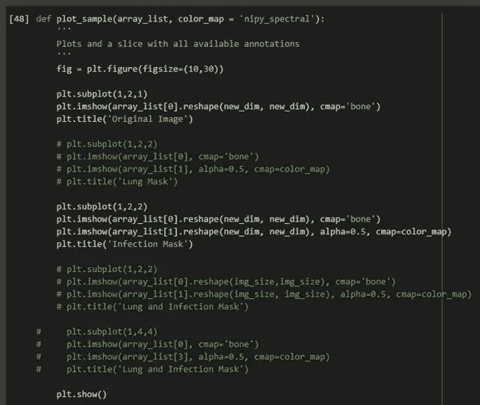

Overlay Function

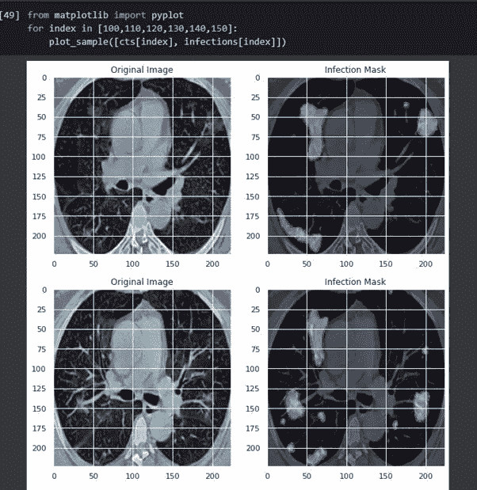

Scans with infection masks added on top

现在，我们分离测试和训练数据，并定义用于我们模型的损失函数和度量。

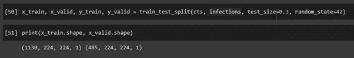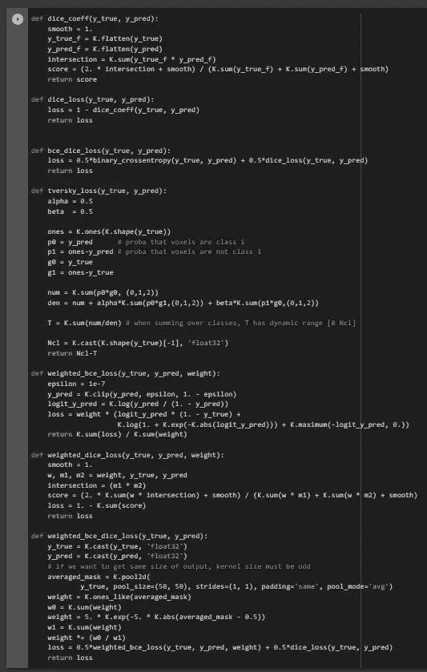

我们现在必须做的就是定义、编译和拟合我们的数据模型，然后使用我们选择的指标来评估我们模型的性能。调整我们的模型超参数在这里是必不可少的，因为这可能意味着一个高度准确和高效的程序与一个不准确、较慢的模型之间的差异。最佳学习率将取决于损失景观的拓扑结构，而这又取决于模型架构和数据集。虽然使用默认学习速率(由深度学习库设置的默认值)可能会提供不错的结果，但您通常可以通过搜索最佳学习速率来提高性能或加快训练。使用指数衰减学习率和余弦退火调度器是产生良好结果的流行方法。

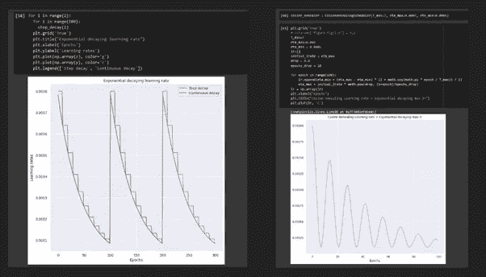

Setting optimal learning rates

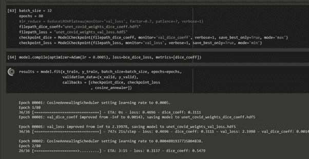

Running UNet on our data

拟合后，我们现在可以在测试数据扫描上查看我们模型的预测感染掩码。

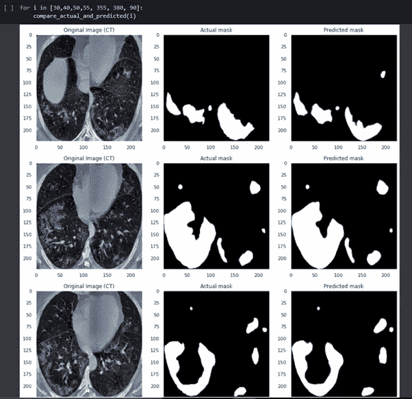

通过使用我们之前定义的指标分析 DICE 和 IOU 分数，可以在后处理中获得更多信息。

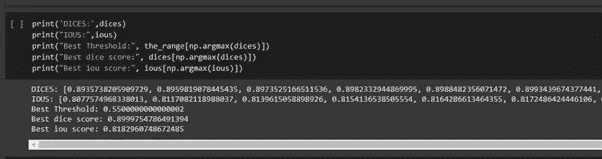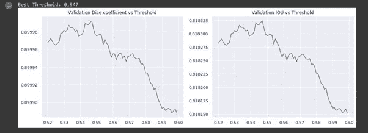

使用其他度量，如精确度和召回率，也可以用来测试模型的性能。

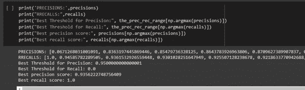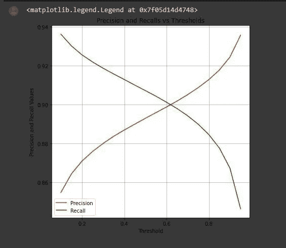

正如您所看到的，我们的模型在相对较少的扫描次数上表现得令人惊讶地好，这是因为我们在预处理和扩充现有数据的过程中关注扫描的质量，以允许模型针对来自较小数据集的更多种类的图像进行训练。通过使用更新的图像增强技术和通过增加为每个切片创建的副本的数量和/或向增强管道添加更多的变换函数来创建更大的增强图像数据集，可以对这种 CT 分割方法进行进一步的改进。此外，需要创建一个用于 CT 扫描分类的 UNet++模型，使用我们在此定义的代码预测的感染掩码显示患者是否患有新冠肺炎或其他肺部缺陷(整个项目的任务 2 和 3)。最后，一切都必须链接到 Python web 框架，如 [Streamlit](https://www.streamlit.io/) 或 [Flask](https://palletsprojects.com/p/flask/) ，以创建一个每个人都可以作为实用程序轻松使用的用户界面。你也可以尝试使用多个模型的迁移学习方法来完成这个问题的分类任务，这将允许你通过转发上一代所犯的错误来改进每个后续模型。

自北半球冬季开始以来，随着第三波病例开始在世界各地出现，开源社区为我们的社会和医疗行业提供额外支持的研究和产品正在慢慢成为维持全球生活质量的关键。

本文中使用的数据集可以在以下位置找到:

 [## 新冠肺炎 CT 扫描

### 新冠肺炎患者的 20 次 CT 扫描和专家分段

www.kaggle.com](https://www.kaggle.com/andrewmvd/covid19-ct-scans)  [## Mlearning.ai 提交建议

### 如何成为 Mlearning.ai 上的作家

medium.com](/mlearning-ai/mlearning-ai-submission-suggestions-b51e2b130bfb)