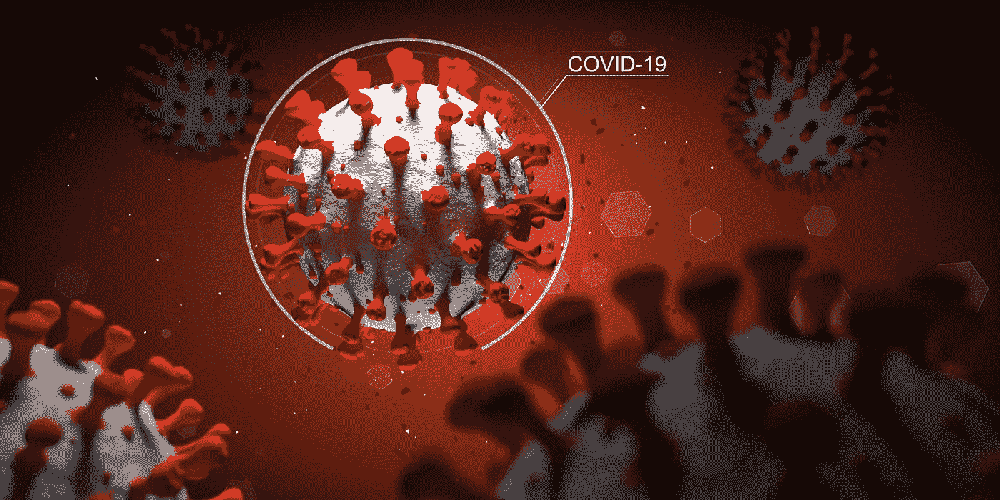

# 利用深度学习预测新冠肺炎 mRNA 疫苗降解(双向 GRU)

> 原文：<https://medium.com/mlearning-ai/covid-19-mrna-vaccine-degradation-prediction-with-deep-learning-bidirectional-gru-5c3549823057?source=collection_archive---------3----------------------->

Canva

# 介绍

新冠肺炎是 21 世纪最重要的疫情。截至 2021 年 9 月，全球共出现 2.22 亿病例，导致 459 万人死亡( [Wordometer，2021](https://www.worldometers.info/coronavirus/) )。

疫苗接种是阻止疫情的有效方法，有效率为 95%,适用于…