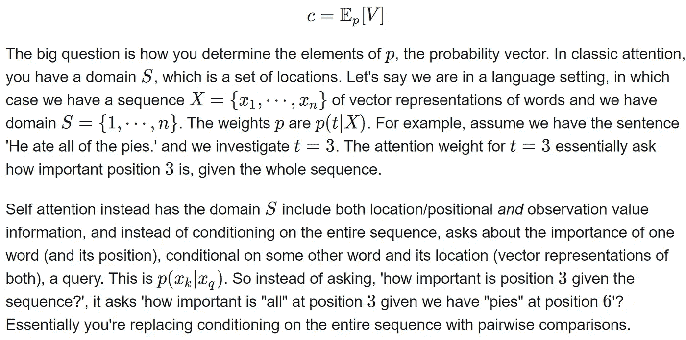
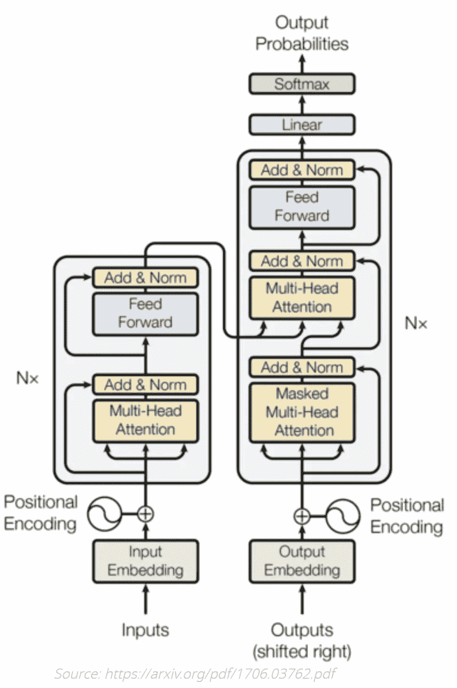
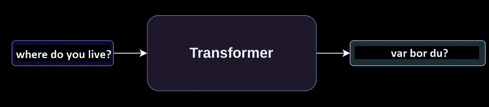
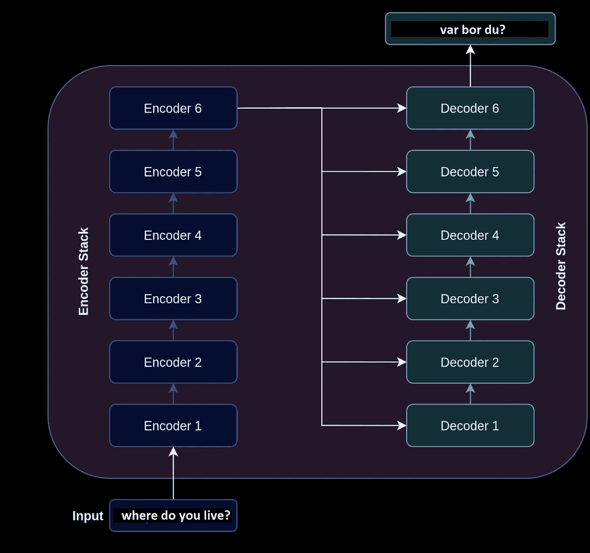
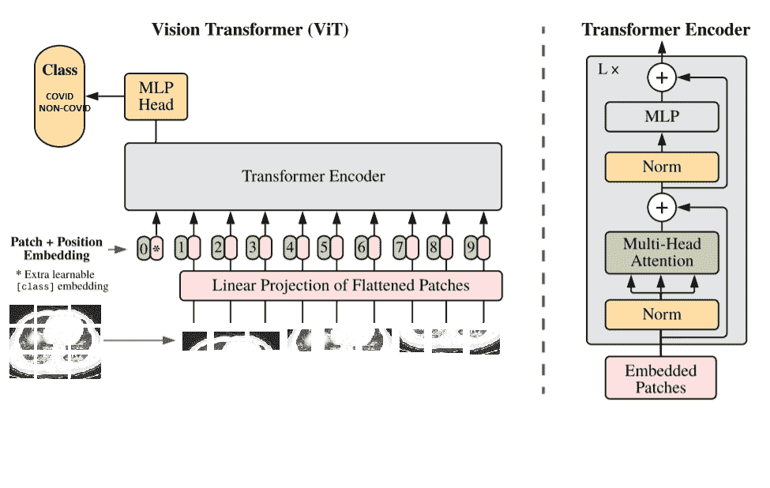
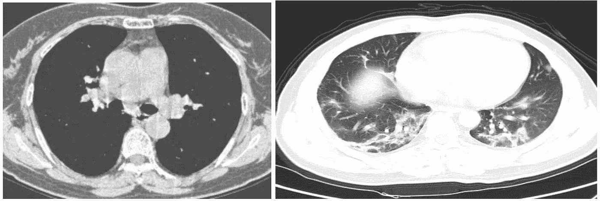
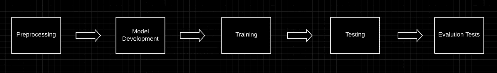
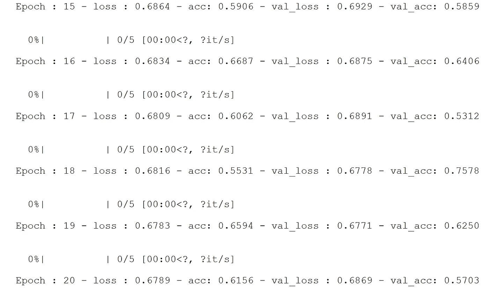
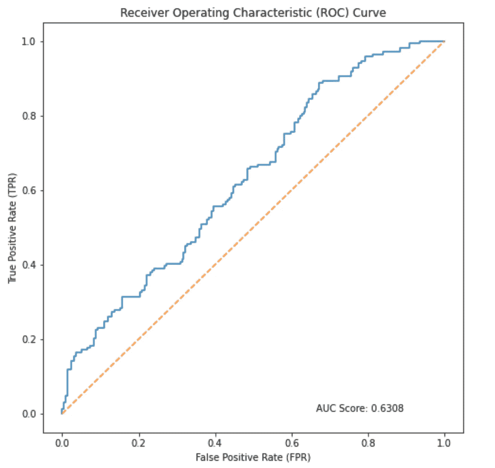
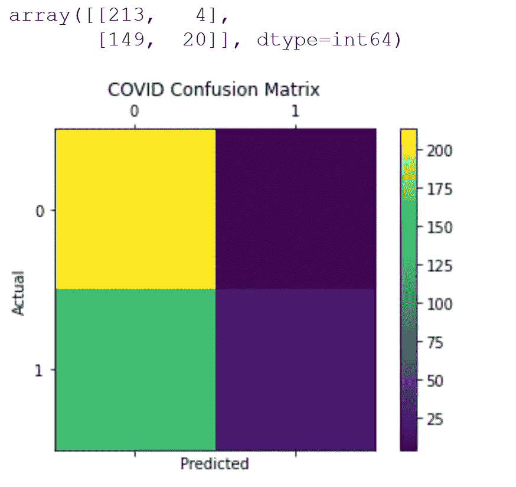

# 具有 SOTA 视觉转换器模型的 COVID/非 COVID 分类器

> 原文：<https://medium.com/mlearning-ai/covid-non-covid-classifier-with-sota-vision-transformer-model-97375c774ff7?source=collection_archive---------1----------------------->

## 《变形金刚》重访——为什么是当下的需要？

**作者:****Ajay Arunachalam——高级数据科学家&研究员(AI)**

[Github](https://github.com/ajayarunachalam)

[领英](https://www.linkedin.com/in/ajay-arunachalam-4744581a/)

你好，朋友们。我希望这对你来说是一次愉快的阅读经历。我会尽量把这篇文章限制在一定范围内&更侧重于实践和应用演示，而不仅仅是理论解释。通过这篇博文，我们将了解最先进的(SOTA)模型——“T8”变压器。首先，我们将快速浏览 transformer 模型的基础知识，给你一个简要的概述。最后，我们将通过实施视觉转换器网络架构来展示一个实际的计算机视觉问题。

计算机视觉问题和应用已经取得了巨大的成功，无论是将图像表示为像素阵列，还是对高度局部化的特征进行卷积等等。CNN 作为最先进的架构已经使用了很长时间，在机器视觉领域具有广泛的可用性。但是，卷积网络的一个主要缺点是**卷积对所有图像像素一视同仁，不管它们的重要性如何**；**不考虑上下文，无法将空间上距离较远的概念联系起来**。在本文中，我们将看到变压器如何成为取代 CNN 的理想候选？但是，在此之前，让我们简单了解一下什么是变压器模型？为什么这些架构现在变得越来越流行&越来越多的使用？与变形金刚相关的最新发展有哪些？等等等等。

*   **通俗地说有哪些变压器型号？**

变形金刚是一个非常有趣的**深度学习架构家族，**于 2017 年推出(谷歌大脑)。它主要用于自然语言处理(NLP)领域，但最近的研究也将其应用于计算机视觉的其他复杂任务。任何变压器架构的基本操作都是**自关注操作**。那么自我关注到底是什么呢？注意机制是变压器网络最关键的方面。注意力机制使得这个 SOTA 模型超越了典型的 RNN 或 LSTM 模型的注意力限制。传统的序列到序列模型丢弃所有中间状态，并且在初始化解码器网络以生成关于输入序列的预测时，仅使用最终状态/上下文向量。丢弃一切，但是当输入序列相当小时，最终的上下文向量工作正常。当输入序列的长度增加时，使用这种方法时模型的性能会下降。这是因为很难将一个长的输入序列概括为一个向量。解决方案是增加模型的**注意力****，利用中间编码器状态为解码器构建上下文向量。**因此，简而言之，当为任何给定的标记创建编码时，注意机制定义了其他输入标记对模型的重要性。

在注意机制中，你期望数据' **V'** 的表示与某个**概率质量函数**相关，从而计算上下文向量，它本质上是你的数据的汇总统计(加权平均值)

转换器是许多神经网络设计中使用的组件，用于**处理顺序数据**，如**文本数据**、**基因组序列**、**声音信号或时间序列数据**。变压器神经网络的大多数应用是在自然语言处理(NLP)领域。 **Transformer 模型已经成为 NLP 任务的领跑者。作为一个例子，我相信你已经看过了令人惊叹的 GPT2/GPT3 变压器演示和相关资料。但即使在 NLP 之外，你也能在计算机视觉和音乐生成领域找到变形金刚。**在过去，语言建模问题(简单地说，预测下一个单词)和翻译系统的最新方法是 LSTM 和 GRU 架构以及注意力机制。然而，这些架构的主要问题是它们本质上是循环的，并且它们的运行时间随着序列长度的增加而增加。换句话说，这些体系结构接受一个句子，并按顺序处理每个单词，因此随着句子长度的增加，整个运行时也会增加。

transformer 体系结构首先在论文“**注意力是你所需要的全部**”中进行了解释，它放弃了这种循环，而是完全依靠注意力机制来绘制输入和输出之间的全局依赖关系。

## 下面是完整变压器的图片，取自本文中引用的论文[。](https://arxiv.org/pdf/1706.03762.pdf)

**那么，transformer 模型具体做什么呢？**transformer 模型可以执行几乎所有的 NLP 任务。我们可以用它来进行**语言建模**、**翻译**，或者**分类**，它通过去除问题的顺序性来快速完成这些任务。在机器翻译应用程序中，转换器将一种语言转换成另一种语言。对于分类问题，它使用适当的输出层提供分类概率。一切都取决于网络的最终输出层，但转换器的基本结构对于任何任务都非常相似。作为一个例子，让我们仔细看看机器翻译过程。

从远处看，下图显示了变压器模型的平移效果。它接受一个英语句子作为输入，并返回一个瑞典语句子。

变压器本质上是编码器和**解码器**层的**堆栈。因此，对于语言建模问题(英语到瑞典语的翻译)，编码器层的作用是使用注意机制将我们的英语句子编码成数字形式。另一方面，解码器的目标是使用来自编码器层的编码信息来为我们提供瑞典语翻译。在下图中，变压器被给予一个英语句子作为输入，该句子使用 6 个编码器层进行编码。最终编码器层的输出然后进入每个解码器层，将英语翻译成瑞典语。**

*   **变压器神经网络的应用？**

变压器神经网络可用于许多序列相关的深度学习任务，例如机器翻译(如上所述)、信息检索、文本分类、文档摘要、图像字幕、基因组分析、音乐生成、声音信号或时间序列数据、机器视觉任务等。

*   **为什么这些架构如今变得越来越流行&越来越常用？**

从 2019 年开始，谷歌搜索开始使用谷歌的 transformer 神经网络 **BERT** 进行超过 70 种语言的搜索查询。在这一变化之前，许多信息检索是基于关键词的，这意味着谷歌在没有强有力的上下文线索的情况下检查其抓取的网站。以单词“bank”为例，它可以根据上下文有多种含义。谷歌搜索引入了 transformer 神经网络，这意味着谷歌可以更好地理解诸如“ **from** 或“ **to** ”等词影响含义的查询。用户可以用更自然的英语进行搜索，而不是根据他们认为谷歌能理解的内容来调整他们的搜索查询。来自谷歌博客的一个例子是查询“ **2019 巴西旅行者去美国需要签证。**“单词“**到**的位置对于正确解释查询非常重要。以前的 Google Search 实现不能捕捉到这种细微差别，并返回关于美国公民去巴西旅游的结果，而 transformer 模型返回更多相关页面。transformer 架构的另一个优点是，一种语言的学习可以通过迁移学习转移到其他语言。谷歌能够采用经过训练的英语模型，并将其轻松应用于其他语言的谷歌搜索。

此外，这里的另一个重要问题是，为什么我们试图取代卷积神经网络(CNN)用于计算机视觉应用？这是因为变压器可以有效地使用更多的内存，并且在处理非常复杂的任务时更加强大。这当然是根据你有数据训练它的事实。注意力允许 transformer 架构以并行方式进行计算。与 CNN 相比，它可以同时从输入及其相互关系中提取我们需要的所有信息。

*   与变形金刚相关的最新发展有哪些？(仅 2021 件作品* —有很多，但只是随机选取了一件作品)

一)[来自微软研究院的畅游变形金刚](https://arxiv.org/abs/2103.14030)

提出了一种使用移位窗口的分层视觉变换器。

第一阶段流程:-

首先，像大多数计算机视觉任务一样，一幅 RGB 图像被发送到网络。该图像被分割成小块，每个小块被视为一个令牌。这些表征特征是像素本身的 RGB 值。与 NLP 相比，您可以将此视为整体图像是句子，每个补丁是该句子的单词。自我关注被应用在每个补丁上，这里被称为窗口。然后，窗口被移动，导致新的窗口配置来再次应用自我注意。这允许在窗口之间创建连接，同时保持这种窗口结构的计算效率。与卷积神经网络相比，这是非常有趣的，因为它允许出现长距离像素关系。

第二阶段及后续阶段:-

第二阶段与第一阶段非常相似，但在这里，它将每组两个相邻面片的特征连接起来，将分辨率下采样为原来的两倍。这个过程在阶段 3 和 4 中重复两次，产生与典型卷积网络(如雷斯网和 VGG)相同的特征映射分辨率。

既然我们已经对这个 SOTA 架构有了清晰的了解，那么让我们来看看它在现实世界中的应用。

# 用例

**我们将通过实现一个视觉转换器模型来看到一个实际动手的演示示例。**

今天，全人类都在与疫情病毒作斗争，这场危机是由去年 1 月初影响数百万人生命的高传染性新冠肺炎病毒引起的。我们正在尝试所有不同的方法来诊断新冠肺炎:逆转录聚合酶链反应(RT-PCR)测试，抗体测试，CT 扫描等。虽然 RT-PCR 是最推荐的新冠肺炎诊断方法，但测试可能需要几个小时/几天才能完成。此外，抗体测试只有在患者对病毒产生免疫力后才有用。使用 CT 扫描进行诊断是有前途的，并且可以用于补充 RT-PCR/抗原检测过程。然而，许多最近的研究已经使用人工智能来诊断新冠肺炎感染的肺部图像，以增强放射科医生的分析。

我们的**视觉转换器 covid 型号**如下图所示。该模型是将输入分类为 COVID 样本/非 COVID 样本的二元分类器。

Vision Transformer Neural Network — COVID Classifier

# 资料组

我们将使用来自新冠肺炎 CT 大挑战的开源数据集，这是一组超过 750 个 PNG 的肺部 CT 图像，其中大约一半是新冠肺炎阳性。或者，您可以直接从[这里](https://drive.google.com/file/d/1qyg2_WtnMpusXfgnFV16vFpyraUV48vx/view?usp=sharing)下载重命名的数据文件。为了简单起见，这些文件被重命名为目录结构“*训练*”&“*测试*”下的 covid & non_covid 样本，并带有编号。

让我们来看看数据集中的一些示例图像。

Non-Covid vs. Covid Sample (L-R)

你也许能猜到右边的图像可能是新冠肺炎阳性。为什么？因为左叶浑浊的白色区域是磨玻璃样阴影(GGO)的一个例子，这是在肺部 CT 扫描中识别新冠肺炎的关键特征之一。正如你在左边的图片上看到的，没有这种毛玻璃外观的痕迹。但是，注意包含毛玻璃特征的肺部 CT 扫描**并不总是新冠肺炎阳性**；还有其他疾病，如传染病、间质性肺病和急性肺泡疾病，也在肺部 CT 扫描中显示 GGO。让我们看看另一个随机的例子。

COVID infected lung CT scan

你怎么想呢?这被证明是新冠肺炎阳性，因为两个肺叶都有 GGO。这不是一个更难的例子吗，因为 GGO 地区看不清楚？免责声明:-并不是所有的图像都很容易根据多云的白色区域特征进行分类。

让我们看看，如果一个变压器网络可以更好地分类这些图像。

那么，我们开始吧。请注意，这篇博客中的所有代码都可以在我的 [GitHub Transformer 模型库](https://github.com/ajayarunachalam/vision-transformer-demo)中找到。

# 模型管道

下图说明了一般的工作流程-预处理数据、构建模型、训练网络和测试模型性能。

## 导入必要的库

## 配置模型设置

在这里，我们定义和配置训练参数。我们设置了训练模型的时期数、学习率、批量大小、默认图像大小、gamma，并为可重复性固定了一个种子。

接下来，完成硬件选择，然后设置目录结构，将“png”和“jpg”图像附加到训练和测试列表，使用分割和适当的标识符基于文件名读取标签，显示来自训练集的少量随机图像，并创建训练验证测试集。

第一步是决定是否要在 GPU 上训练。我有一个 **Nvidia GeForce GTX GPU** ，但对于这个演示，我将坚持 CPU，如果假设，我们没有 GPU。注意:-如果您的本地设备上没有 CUDA，设置 GPU 可能是一个非常复杂的过程。

## 数据预处理

1.  读取图像并将它们标记为 COVID/NON-COVID
2.  调整图像大小
3.  将数据分成训练集、验证集和测试集
4.  将图像转换为 PyTorch 张量
5.  添加图像增强

对于 train & test 目录中的每个图像，我们读入具有 RGB 通道的图像，将图像的大小调整为(224，224)并将图像及其相关标签附加到列表中。然后我们给图像加标签， **1** 代表 **COVID 阳性**，而 **0** 代表 **COVID 阴性**。注意:tqdm 库用于创建进度条。现在，我们必须将数据分为训练集、验证集和测试集，并将它们转换为 PyTorch 张量。

在 PyTorch 中，数据加载器用于创建成批的训练图像，并对图像应用变换。因此，我们必须将我们的代码包装到一个数据集类中，我们可以将该数据集类与任何相关的转换一起提供给 DataLoader 对象。 **__init__** 方法被格式化以适合数据集类。必须覆盖 **__len__** 和 **__getitem__** 函数，以指定如何访问我们的图像。你可以在 [PyTorch 文档](https://pytorch.org/tutorials/beginner/data_loading_tutorial.html#dataset-class)中读到更多关于 Dataset 类的内容。最后，我们必须创建数据加载器对象以及可以应用于图像的转换**(图像增强)**。

总的来说，这些图像增强技术将使模型更健壮，并可推广到低质量的图像。

## 模型开发和培训

接下来，我们使用 Pytorch 实现了一个**视觉转换器**模型，仅用一个转换器编码器就实现了视觉分类中的 SOTA。我们创建一个视觉转换器对象，并使用**线性转换器** : *线性复杂度的自我关注。*线性变压器是一种**线性变压器**，它利用线性自关注机制来解决与变压器模型相关的自关注瓶颈。视觉转换器(VIT)接受以下参数。

***参数:-***

**image_size: int。**
图像大小。如果您有矩形图像，请确保您的图像大小是宽度和高度的最大值

**补丁大小:整数。**
补丁数量。image_size 必须能被 patch_size 整除。
面片数为:n = (image_size // patch_size) ** 2 且 n 必须大于 16。

数量类:整数。
数类来分类。

dim: int。
线性变换 nn 后输出张量的最后维数。线性(…，dim)。

深度:智力。
变压器块数。

头:智力。
多头关注层中的人头数。

mlp_dim: int。MLP(前馈)层的尺寸。

**通道:int，默认 3。**
图像的通道数。

**dropout:在[0，1]之间浮动，默认为 0..**
辍学率。

**emb_dropout:在[0，1]之间浮动，默认为 0。**
嵌入辍学率。

**池:字符串，cls 令牌池或均值池**

我们在这里使用的损失函数是 **CrossEntropyLoss** ，带有 **ADAM** 优化器和学习率调度器( **StepLR** )—它在每个 **step_size** 时期通过伽马衰减每个参数组的学习率。在 **Pytorch** 中，你可以使用交叉熵损失来完成二进制分类任务。你只需要确保在模型的最后一层有两个神经元。此外，还要确保没有添加 softmax 函数。我鼓励读者也尝试使用**二元交叉熵损失** &来验证模型的结果。可以直接用`nn.BCELoss()`

我们遍历训练数据加载器中的图像和目标类，找到模型的预测，将模型的预测与实际情况进行比较(计算损失函数)，并相应地更新权重。接下来，我们计算验证损失和准确性。我们计算正确预测的数量和总预测，这样我们就可以计算准确度。该过程类似于训练步骤，除了模型不应该在该步骤中学习。这意味着我们不会更新该数据的权重。我们在每个时期之后打印出损失和准确性度量。

## 保存模型

在最终确定和微调您的模型之后，一个好的做法是保存构建好的模型，以便用于将来的推理。

## 评估测试数据的性能

最后，对测试数据进行模型测试。我们使用的是经过培训和验证的相同模型。名为 **test()** 的方法接受模型、测试加载器和损失函数的参数。它将返回对测试数据的推断，该推断返回测试损失、测试准确性、预测的类概率值和实际值。

## 结果

在评估了模型的准确性以及针对训练和验证数据的时期数的损失度量之后，我们继续基于**接收器操作特性(ROC)** 曲线来评估我们的模型，该曲线是假阳性率对真阳性率的曲线图。ROC 曲线表明该模型能够很好地区分这两个类别。曲线下面积(AUC)值接近 1 表明很少有假阳性和假阴性。直线的 AUC 为 0.5，表示随机猜测的二元分类器。另一个可分性评估是**混淆矩阵**。二元分类器的混淆矩阵以易于阅读的矩阵格式显示真阳性、真阴性、假阳性和假阴性的数量。为了增强我们对假阳性和假阴性的分析，我们还可以可视化一些我们分类错误或正确的图像。我写了一个自定义函数来显示假阳性(FP) &假阴性(FN)样本。本质上，该函数遍历测试集，并将错误标记的数据组织到适当的类别中。这将允许我们看到分类器正在犯什么样的错误。最后，根据该函数是用于显示假阴性还是假阳性，我们使用 Matplotlib 中的 figure 和 subplot 函数在一个网格中显示错误标记的数据。此外，还编写了一个自定义函数来绘制混淆矩阵和 ROC 曲线。

# 结论

在这篇文章中，我们看到了如何使用 Dataset 类和 Dataloader 对象为分类预处理 CT 扫描。然后，我们在 CT 图像上实现了一个**变换器模型**，将它们分类为**COVID/非 COVID** 样本。然后，我们用**测井损失**、**准确度**、 **ROC 曲线**和**混淆矩阵**进一步评估建立的模型。

因此，朋友们，我们成功地为一项计算机视觉任务建立了最先进的(SOTA)模型——“**transformer**”,并评估了模型性能。干杯:)

# 重要链接

点击此处查看该博客的完整代码

[https://github . com/ajayarunachalam/vision-Transformer-demo/blob/main/Visual-Transformer-Covid _ non vid _ TESTED-publish . ipynb](https://github.com/ajayarunachalam/vision-transformer-demo/blob/main/Visual-Transformer-Covid_NonCovid_TESTED-PUBLISH.ipynb)

# 联系我

你可以打***ajay.arunachalam08@gmail.com***联系我，或者通过 [Linkedin](https://www.linkedin.com/in/ajay-arunachalam-4744581a/) 联系我

感谢阅读。希望这篇文章对读者有用。

自豪地坚持学习。

# 参考资料:-

[https://arxiv.org/abs/1802.05751](https://arxiv.org/abs/1802.05751)

[https://arxiv.org/abs/1804.00247](https://arxiv.org/abs/1804.00247)

[https://arxiv.org/pdf/1706.03762.pdf](https://arxiv.org/pdf/1706.03762.pdf)

[https://arxiv.org/pdf/2006.03677.pdf](https://arxiv.org/pdf/2006.03677.pdf)

[http://peterbloem.nl/blog/transformers](http://peterbloem.nl/blog/transformers)

[https://arxiv.org/pdf/2103.14030v1.pdf](https://arxiv.org/pdf/2103.14030v1.pdf)

[https://en . Wikipedia . org/wiki/Transformer _(machine _ learning _ model)](https://en.wikipedia.org/wiki/Transformer_(machine_learning_model))

[https://pub . toward sai . net/will-transformers-replace-CNN-in-computer-vision-55657 a 196833](https://pub.towardsai.net/will-transformers-replace-cnns-in-computer-vision-55657a196833)

[https://towards data science . com/a-demo-of-using-vision-transformers-in-py torch-mnist-handled-digital-recognition-407 eafbc 15 b 0](https://towardsdatascience.com/a-demonstration-of-using-vision-transformers-in-pytorch-mnist-handwritten-digit-recognition-407eafbc15b0)

https://arxiv.org/pdf/2006.03677.pdf

【https://nlp.seas.harvard.edu/2018/04/03/attention.html 

[http://jalammar.github.io/illustrated-transformer/](http://jalammar.github.io/illustrated-transformer/)

[https://ai . Google blog . com/2017/08/transformer-novel-neural-network . html](https://ai.googleblog.com/2017/08/transformer-novel-neural-network.html)

[https://deepai . org/machine-learning-glossary-and-terms/transformer-neural-network](https://deepai.org/machine-learning-glossary-and-terms/transformer-neural-network)

[https://www.unite.ai/what-are-transformer-neural-networks/](https://www.unite.ai/what-are-transformer-neural-networks/)

[https://lionbridge . ai/articles/what-is-transformer-models-in-machine-learning/](https://lionbridge.ai/articles/what-are-transformer-models-in-machine-learning/)

[https://medium . com/analytics-vid hya/vision-transformers-bye-bye-convolutions-e 929d 022 E4 ab](/analytics-vidhya/vision-transformers-bye-bye-convolutions-e929d022e4ab)