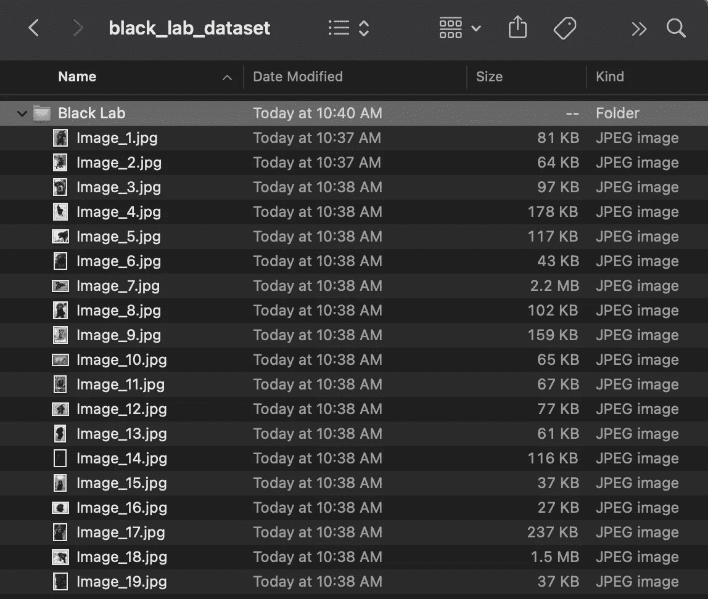
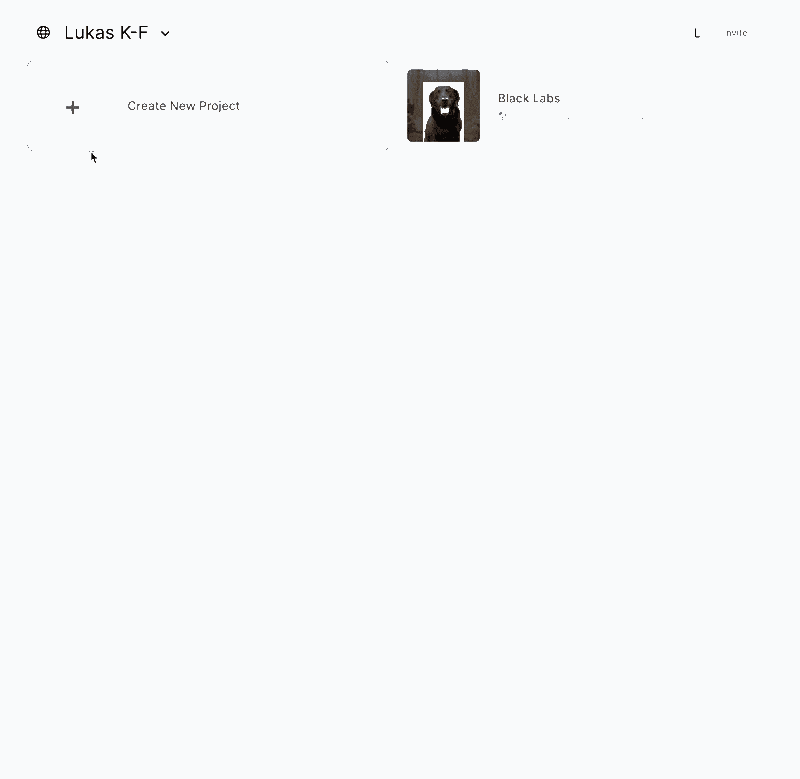
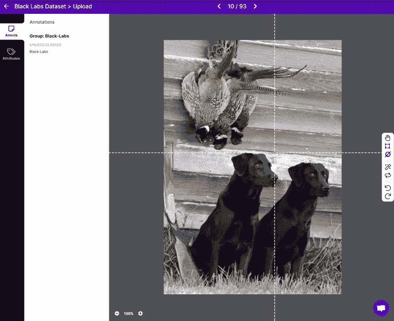
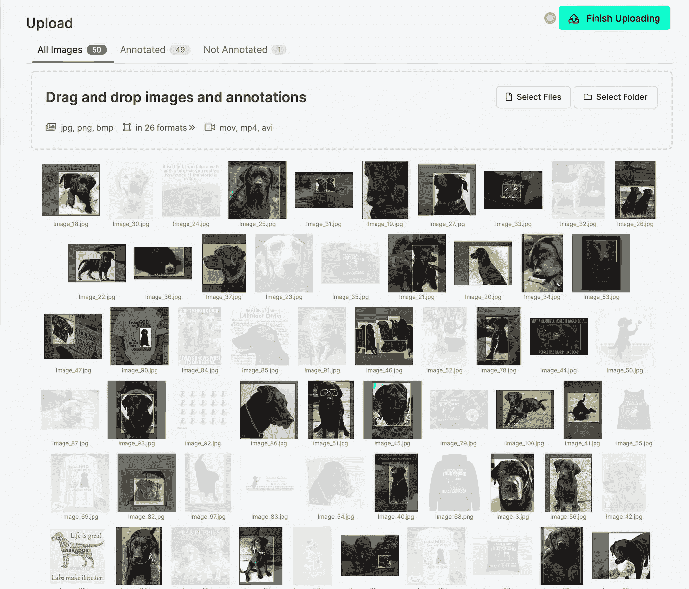
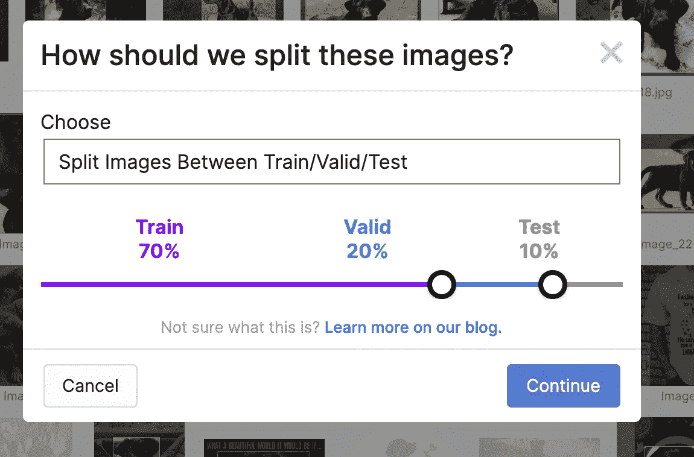
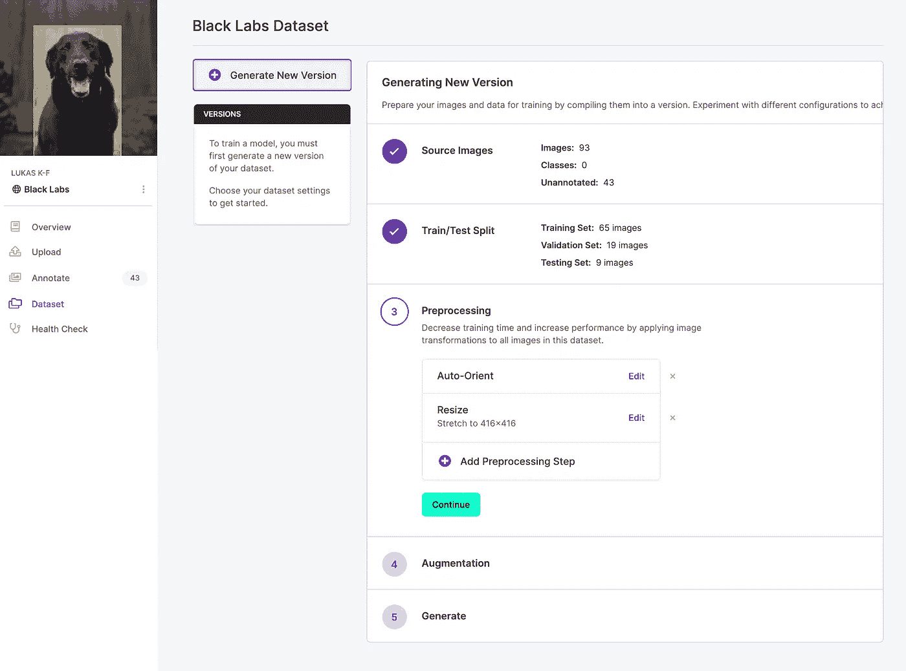
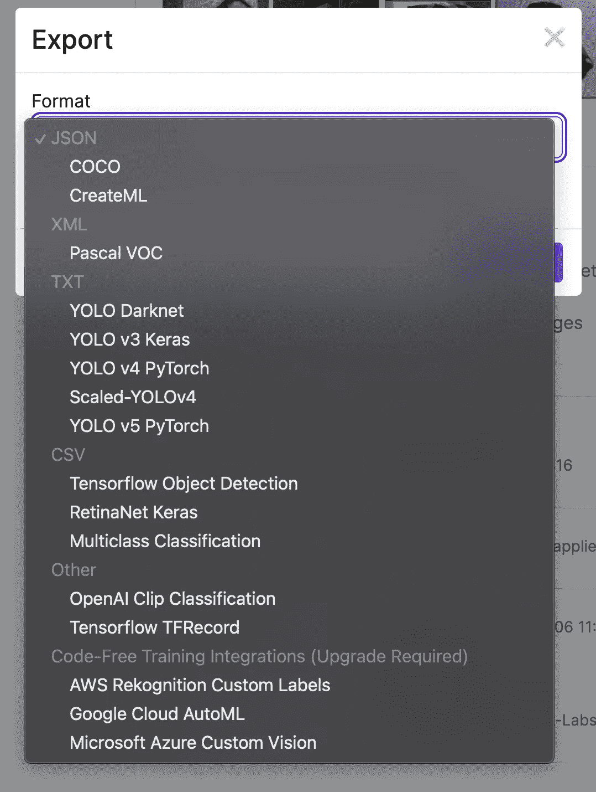
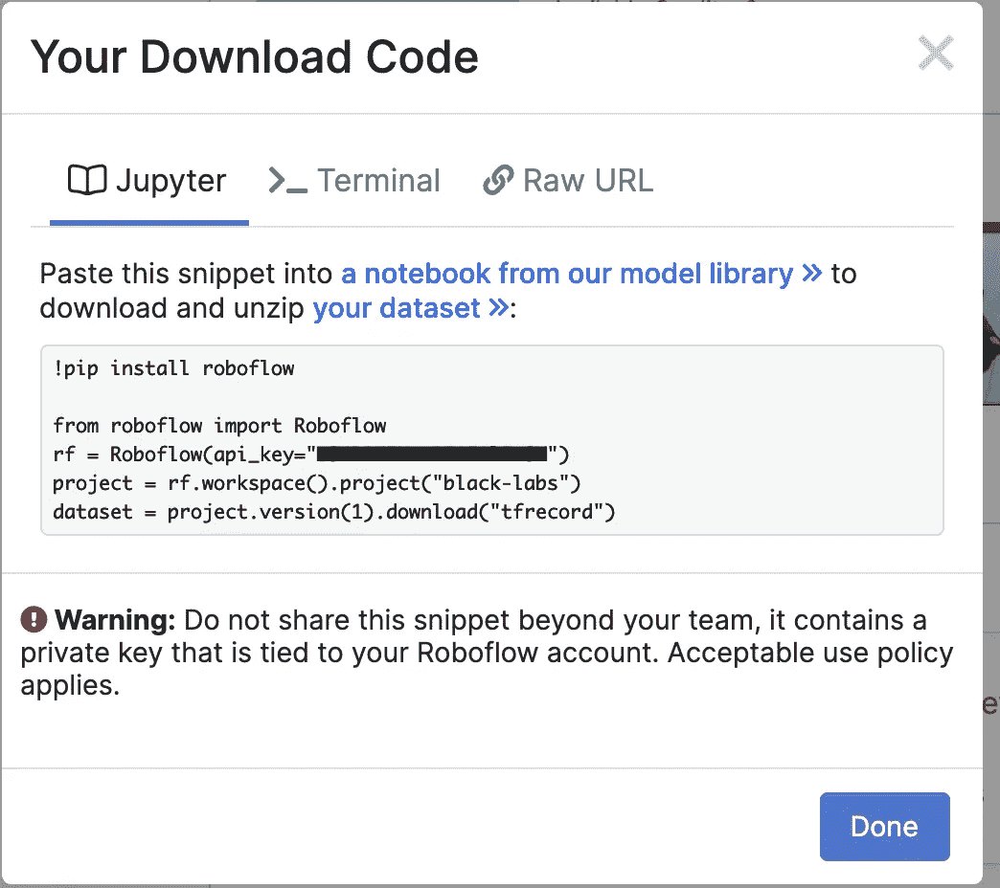

# 在 30 分钟内创建一个计算机视觉数据集

> 原文：<https://medium.com/mlearning-ai/create-a-computer-vision-dataset-in-30-minutes-e0f8bcdbdaf3?source=collection_archive---------2----------------------->

在构建任何机器学习模型时，最乏味、通常也是最有影响力的步骤是创建数据集来训练、验证和测试您的模型。

在本指南中，您将学习通过两个步骤收集和注释计算机视觉数据集的最简单的方法:

1.  使用简单的 [python 库](https://pypi.org/project/bing-image-downloader/)从 Bing 中批量抓取图像
2.  使用 [Roboflow](http://roboflow.com) 的浏览器内工具注释和导出你的数据集

# 1)批量下载图像

使用以下命令安装 [bing-image-downloader](https://github.com/gurugaurav/bing_image_downloader) 库:

```
pip install bing-image-downloader
```

接下来，创建一个名为*black _ lab _ image _ downloader . py*的文件，并在其中粘贴以下内容:

```
from bing_image_downloader import downloaderdownloader.download( 
  "Black Lab", #Query String
  limit=100,
  output_dir='black_lab_dataset',
  adult_filter_off=False,
  force_replace=False,
  timeout=60,
  verbose=True
)
```

所有这些只是将库导入到您的 python 程序文件中，然后使用您的搜索参数调用方法 *download* 。只有几个参数需要定制，你可以在库的 [github repo](https://github.com/gurugaurav/bing_image_downloader) 中读到。该命令将使用查询字符串“黑色实验室乐队”搜索 [Bing](https://www.bing.com/images/) ，并将 100 张图像下载到名为 *black_lab_dataset* 的目录中。

使用以下方式运行文件:

```
python3 black_lab_image_downloader.py
```

就是这样！



# 2)使用 Roboflow 标注和导出数据集

如果您没有帐户，则需要创建一个，否则请登录并创建一个新项目:



> 注意:在本指南中，我将创建一个对象检测数据集，但使用 Roboflow，您还可以创建分类、关键点检测、语义分割、实例分割数据集和其他数据集。

接下来，上传你下载的图片到你的文件夹，你就可以开始注释了。这个工具非常容易使用，我花了 5 分钟注释了大约 100 张图片。



您可以随时根据需要拖放或上传更多文件，如果图像是垃圾，可以轻松地从数据集中标记出要忽略的图像(注意下面的不透明条目)。



完成后，单击*完成上传*，它将提示您如何分割数据以用于训练、验证和测试:



生成数据集的新版本时，您还可以添加预处理和扩充:



最后，您可以将数据集导出为各种格式，并下载为. zip 文件或通过代码/命令行下载:



你完了！