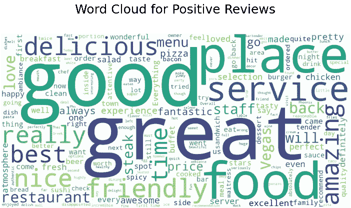
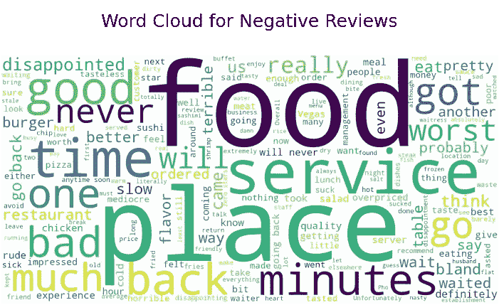

# 一分钟内创建一个单词云

> 原文：<https://medium.com/mlearning-ai/create-a-word-cloud-in-3-mins-b64e04969dc8?source=collection_archive---------10----------------------->

在本文中，我将介绍如何用 python 创建单词云。基本上，当你分析包括评论和观点在内的文本时，单词是非常有用的。单词云为您提供了常用单词的图形可视化。这在您从事自然语言处理项目时非常有用。

[](/codex/python-vs-r-72d025abe089) [## Python vs R

### 了解 Python 和 R 之间基本区别的终极指南

medium.com](/codex/python-vs-r-72d025abe089) 

单词云的创建是如此有趣和简单。那么，我们开始吧。


Photo by [**Ron Lach**](https://www.pexels.com/photo/white-and-blue-sticky-notes-9594079/) on [**Pexels**](https://www.pexels.com/)

## 什么是词云？

单词云(也拼写为 wordle、单词拼贴或标签云)是单词的图形表示，强调频繁出现的术语。

这种形式的可视化可以帮助演示者快速收集观众的数据，突出显示最受欢迎的回答，并以每个人都能理解的方式呈现数据。

[](/codex/understanding-natural-language-processing-nlp-fe52f4f66824) [## 理解自然语言处理(NLP)

### 了解自然语言处理基础知识的终极指南

medium.com](/codex/understanding-natural-language-processing-nlp-fe52f4f66824) 

我们先来了解一下如何用 python 创建单词云。

## **步骤— 1:安装**

首先，你需要安装一个名为“wordcloud”的库。使用以下命令安装该库:

```
!pip install wordcloud
```

您还需要像 numpy、pandas、matplotlib 和 pillow 这样的库。如果您还没有安装这些库，请安装它们。

## 步骤 2:数据集

现在，导入数据集。我们将使用来自 Kaggle 的 [*餐馆评论数据集。*](https://www.kaggle.com/datasets/d4rklucif3r/restaurant-reviews)

## 步骤 3:词云生成

我们去编码做个词云吧。本节将深入介绍创建定制单词云图片的各种标准。

*   **wordcloud():** 生成词云
*   **imshow():** 显示图像
*   **generate():** 从文本生成云

在这里，我将创建一个正面评论的词云。

我已经解释了这里使用的参数。

*   **宽度:**画布的宽度。
*   **高度:**画布的高度。
*   **背景颜色:**文字云图像的背景颜色。
*   **轴:**删除轴。

```
# import the wordcloud library
from wordcloud import WordCloud# create a liked variable that contains only positive reviews
liked = df[df['Liked'] == 1]
liked.head()# covert review column to list
positive_sentences = liked['Review'].tolist()# join all the positive reviews
combined_positive_sentences = ' '.join(positive_sentences)# create word cloud
plt.figure(figsize=(6,6), dpi = 150)
plt.imshow(WordCloud(width=1600, height=800, background_color="white").generate(combined_positive_sentences))
plt.axis("off")
plt.title('Word Cloud for Positive Reviews\n')
plt.savefig("positive cloud.png", format="png")
plt.show()
```



仅此而已。你毫不费力地通过三个简单的步骤做到了。

你也可以为负面评论创建一个词云。

```
# create a disliked variable that contains only negative reviews
disliked = df[df['Liked'] == 0]
disliked.head()# covert review column to list
negative_sentences = disliked['Review'].tolist()# join all the negative reviews
combined_negative_sentences = ' '.join(negative_sentences)# create word cloud
plt.figure(figsize=(6,6), dpi = 150)
plt.imshow(WordCloud(width=1600, height=800, background_color="white").generate(combined_negative_sentences))
plt.axis("off")
plt.title('Word Cloud for Negative Reviews\n')
plt.savefig("negative cloud.png", format="png")
plt.show()
```



有了它的帮助，你可以很容易地识别主要问题。这里的几个主要问题包括食物、地点、服务、时间等。

感谢您的阅读！如果你关注我或与他人分享这篇文章，并关注更多有趣的故事，我将不胜感激。最美好的祝愿。

## 你会支持 awesome❤️

[](/mlearning-ai/mlearning-ai-submission-suggestions-b51e2b130bfb) [## Mlearning.ai 提交建议

### 如何成为 Mlearning.ai 上的作家

medium.com](/mlearning-ai/mlearning-ai-submission-suggestions-b51e2b130bfb)