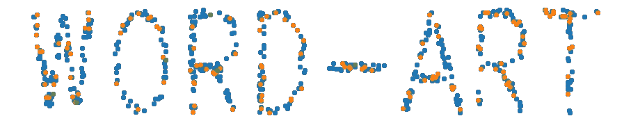
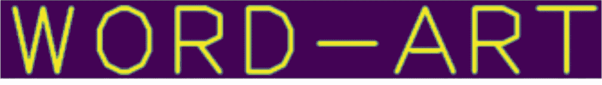
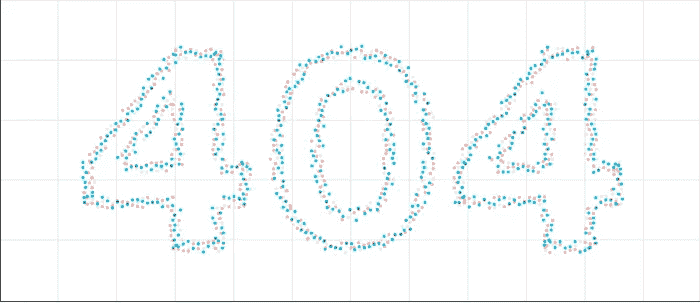

# 用 Python 中的数据创建艺术字

> 原文：<https://medium.com/mlearning-ai/create-art-words-with-data-in-python-e747896bc2b8?source=collection_archive---------3----------------------->

> **💡打破常规-这是一个快速而有创意的项目，使用 python 最流行的数据可视化工具来创建有创意的艺术词汇。**



Fig. 1: Final effect of the generated text for the baseline app.

# 目录

[⭐️](#5e31) [环境](#2aa6)
[⭐️先把字印在一张图像上](#5e31)
[然后是⭐️，显示时间](#97ce)

# 🔥环境

这个项目你只需要三个工具:`matplotlib` `cv2` `numpy`如果没有，就做`pip install matplotlib opencv-python numpy`。

我们用 Jupyter 笔记本来运行代码。但是，你可以使用任何你想要的工具，只要它们能展示你的艺术杰作。要导入库，请执行以下操作:

```
import cv2
import numpy as np
import matplotlib.pyplot as plt
```

# ⭐️首先把这些字印在一幅图像上

为了打印文字，我们使用了`cv2.putText`功能。该功能基本上将使用用户给定的配置在输入图像上书写单词。

因此，我们首先将输入一个全零的空数组。但是，数组的大小很重要，因为太大会留下太多的空白空间，太小会导致单词显示不完整。

经过实验，我们找到了选择特定字体和字体大小的“最佳点”。这在创建数组时显示在数组的形状中。我们还注意到，如果单词中有特殊字符，它们会占据不同的空间。所以我们扫描每一个字符，利用 python string 的内置函数`isalpha()`测试其中有多少是特殊字符。

输出:



Fig. 2: Output from the snippet above. This is an array of zeros and ones highlighted in yellow color and zeros represented as a purple background.

# ⭐️，表演时间到了

此时，您将拥有一个表示每个像素的 0 和 1 的数组。要生成图 1 所示的效果，实际上是一个[散点图](https://chartio.com/learn/charts/what-is-a-scatter-plot/#:~:text=What%20is%20a%20scatter%20plot,to%20observe%20relationships%20between%20variables.)，我们需要使用`plt.scatter`函数，其参数代表 x 和 y 坐标。

为了生成坐标，我们简单地用一个嵌套的 for 循环遍历图像的每个像素，该循环将记录坐标。

然而，并不是每个像素都会被记录，因为否则输出就没有意思了。取而代之的是，我们会随机选取像素并绘制成图。这里，我们将绘制像素的阈值`dot_density` 设置为 0.05，这意味着只有大约 5%的像素会被绘制。

为了创造更多的艺术效果，应该添加多种颜色。因此，我们可以创建多个散点图，并为每个图设置权重阈值，以规定我们希望在最终图中看到多少颜色。这是通过为`color_weight`变量设置三个不同的权重来实现的。

## 最终代码如下所示。

**希望你喜欢！**



Fig. 3: Kaggle platform’s 404 image, which inspired this project.

[](/mlearning-ai/mlearning-ai-submission-suggestions-b51e2b130bfb) [## Mlearning.ai 提交建议

### 如何成为 Mlearning.ai 上的作家

medium.com](/mlearning-ai/mlearning-ai-submission-suggestions-b51e2b130bfb)