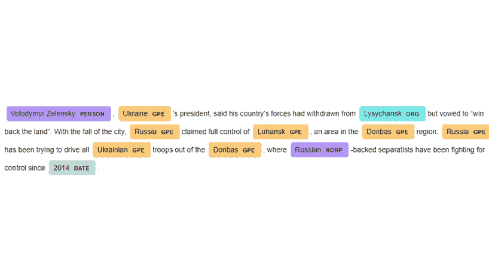
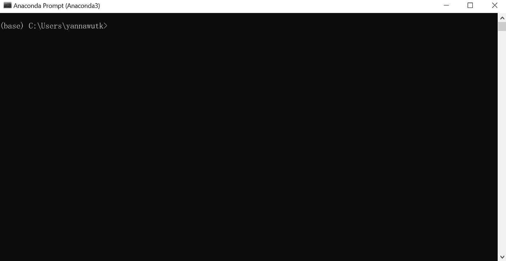
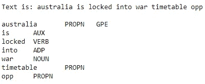
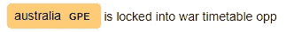
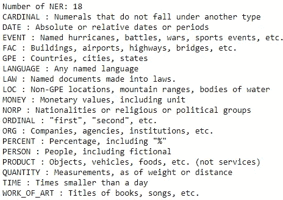
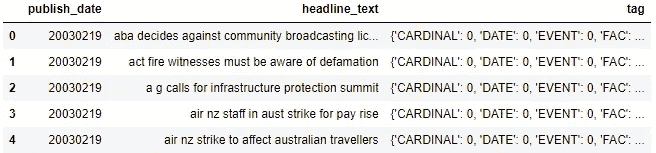
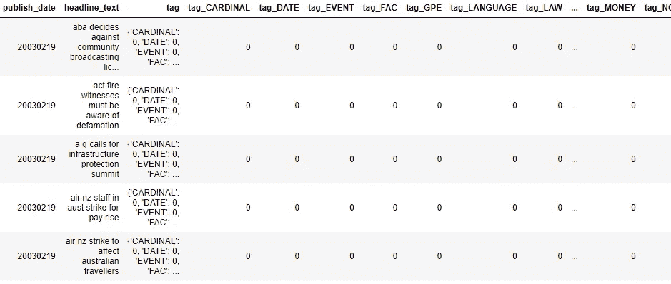

# 通过命名实体识别为 NLP 创建新功能

> 原文：<https://medium.com/mlearning-ai/create-new-features-for-nlp-with-named-entity-recognition-62d1804d9f21?source=collection_archive---------2----------------------->



# 什么是 NLP？

自然语言处理(NLP)的目标是让计算机像人类一样理解文本和口语。

NLP 将统计、机器学习和深度学习模型应用于大型文本数据，以理解演讲者或作者的意图和情感。

通常，NLP 模型的输入数据是关于文本中的单词。无论如何，我们可以添加更多的特征，使模型更加准确。

# 什么是命名实体识别(NER)？

命名实体识别(NER)(也称为(命名)实体识别、实体分块和实体提取)是信息提取的一个子任务，它试图定位非结构化文本中提到的命名实体并将其分类到预定义的类别中，例如人名、组织、位置、医疗代码、时间表达式、数量、货币值、百分比等。
(来自[https://en.wikipedia.org/wiki/Named-entity_recognition](https://en.wikipedia.org/wiki/Named-entity_recognition))

我们可以使用 NEM 为 NLP 模型创建新的列，有时 NEM 的可视化甚至可以对文本类型进行分类。

# 了解空间

spaCy 是一个免费的开源 Python 库，用于 Python 中的自然语言处理。它具有 NER、词性标注、依存解析、词向量等功能。

在这篇文章中，我将一步一步地向你展示如何使用 spaCy 库执行 NEM。

您可以在这里看到所有支持的语言和该语言的型号。

# 步骤摘要

1.  安装和导入库
2.  加载 NER 模型
3.  创建标签列表栏
4.  创建新功能

# 1.安装和导入库

*   打开 Anaconda 提示符

搜索 Anaconda 提示符，点击打开。


你会看到一个黑屏弹出。



*   通过在 Anaconda 提示符下键入以下命令来安装 spaCy 库

```
pip install spacy
```

*   下载预先训练好的 NER 模型

```
python -m spacy download en_core_web_sm
```

*   在 Python 中导入所需的库

```
import spacy
import pandas as pd
```

*   加载数据集

您可以下载新闻标题数据集作为示例。

 [## 你的数据科学之家

### Kaggle 是世界上最大的数据科学社区，拥有强大的工具和资源来帮助您实现您的数据…

www.kaggle.com](https://www.kaggle.com/datasets/therohk/million-headlines/download) 

```
df =pd.read_csv("abcnews-date-text.csv")
df = df[:10] # Use only 10 samples to reduce computation time
```

# 2.加载 NER 模型

*   使用 spacy.load 加载预训练的 NER 模型。(确保您已经在步骤 1 中下载了该模型)

```
ner = spacy.load("en_core_web_sm")
```

> 这就是如何实现加载的模型。

*   用文本拟合模型

```
doc = ner(df['headline_text'][9])
```

doc 是一个空间标记。你可以调用它的属性。

*   显示

在文档中循环单词。

**。正文**将返回 word

**。pos_** 将返回单词的词性

**。ent_type_** 将返回单词的命名实体

从“澳大利亚被锁定在战争时间表 opp”的例子，你会看到该模型可以检测澳大利亚作为 GPE(地缘政治实体)。

```
print("Text is: "+doc.text+"\n")
for token in doc:
    print(token.text+"\t"+token.pos_+"\t"+token.ent_type_)
```



spaCy 有一个很有用的显示工具， **displacy** ，可以很漂亮的可视化命名实体。

```
spacy.displacy.render(doc, style="ent")
```



所有 NER 的名单可以通过**得到。管道标签**和每个 NER 的解释被**知晓。解释一下**。

```
ner_list = ner.pipe_labels['ner']print("Number of NER: "+str(len(ner_list)))
for i in range(len(ner_list)):
    print(ner_list[i]+" : "+spacy.explain(ner_list[i]))
```



如上所示有 18 个 ner。

# 3.创建标签列表栏

首先，创建一个函数 add_tag_column，当输入文本时，它将返回一个标签出现次数的字典。

```
def add_tag_column(text):
    doc = ner(text)
    tag_dict = dict.fromkeys(ner_list,0) # empty column
    for token in doc:
        if token.ent_type_ != "":    
            tag_dict[token.ent_type_] +=1
    return tag_dict
```

将 add_tag_column 函数应用于数据帧中的所有行。标签列表结果将临时存储在标签列中。

```
df["tag"] = df["headline_text"].apply(add_tag_column)
```



# **4。创建新功能**

创建新列 tag_NER，它是文本中每个 NER 出现的次数。

```
for tag in ner_list:
    df["tag_"+tag] = df['tag'].apply(lambda count: count[tag])
```



您可以使用这些列来定型 NLP 模型。

如果您觉得这篇文章有帮助，请关注我以获得更多关于数据科学的文章。

[](/mlearning-ai/mlearning-ai-submission-suggestions-b51e2b130bfb) [## Mlearning.ai 提交建议

### 如何成为 Mlearning.ai 上的作家

medium.com](/mlearning-ai/mlearning-ai-submission-suggestions-b51e2b130bfb)